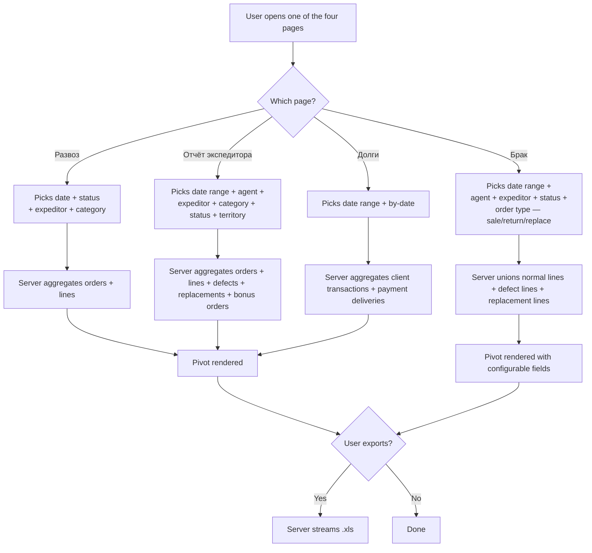

# Expeditor reports — delivery, debt and defect

## What this feature is for

There are four related screens under Отчёты that all answer questions about the **expeditor** — the person on the truck who delivers orders and collects cash:

- **Развоз по экспедиторам** (`/report/expeditor`) — "what do I have to load on each truck today?" — units / volume / sum per expeditor for the chosen day, grouped by product category × product.
- **Отчёт экспедитора** (`/report/expeditorReport`) — the full per-expeditor pivot for a range of days — what was loaded, what was delivered, what came back, who collected how much cash.
- **Долги по экспедиторам** (`/report/expeditorDebt`) — debt the expeditor is on the hook for: per client × currency, plus undistributed cash and unconfirmed payments.
- **Брак по экспедиторам** (`/report/expeditorDefect`) — defect and partial-return detail per expeditor, with a pivot view the user can configure.

Together they let an operations manager close the day: every order that left the warehouse must be reconciled with either a delivered receipt, a defect, a return, or a cash payment.

## Who uses it and where they find it

| Role | What they do here | How they get to the screen |
|---|---|---|
| Operator (3) / Operations (5) | Daily reconcile and load planning | Web → Отчёты → **Развоз / Отчёт экспедитора** |
| Manager (2) | Approves debt write-offs | Web → Отчёты → **Долги по экспедиторам** |
| Supervisor (8) | Defect attribution | Web → Отчёты → **Брак по экспедиторам** |
| Warehouseman (20) | Loads the truck | Web → Отчёты → **Развоз / Отчёт экспедитора** (filtered by warehouse) |
| Admin (1) | Everything | Web → Отчёты → ... |

Field agents (4) and expeditors (10) themselves do not see these reports — they have a mobile view.

## The workflow

## Filters and columns

### Filters (combined across the four pages — not every page has every filter)

| Filter | Type | Server-side or client-side? |
|---|---|---|
| Date range (from / to) | Date pickers | **Server-side** |
| **By what date?** — order / load / delivery | Radio | **Server-side** |
| Status | Multi-select | **Server-side** |
| Expeditor | Multi-select; **"1" means "no expeditor"** | **Server-side** |
| Agent | Multi-select | **Server-side** (capped by supervisor) |
| Supervisor | Drop-down | **Server-side** |
| City / territory | Multi-select | **Server-side** |
| Client | Multi-select | **Server-side** (defect page) |
| Client category | Multi-select | **Server-side** |
| Currency | Multi-select | **Server-side** |
| Price type | Multi-select | **Server-side** |
| Warehouse | Multi-select | **Server-side** |
| Product category | Multi-select | **Server-side** |
| Product | Multi-select | **Server-side** |
| Product group | Multi-select | **Server-side** |
| Order type (defect page) | One of: all / returns / partial returns / shelf return / replacement | **Server-side** |
| Client type (Отчёт экспедитора) | Multi-select | **Server-side** |
| Contragent (if enabled) | Drop-down (defect page) | **Server-side** |
| Excluded products | Hidden | **Server-side**, always on |

### Columns by page

**Развоз по экспедиторам**

| Column | What it shows |
|---|---|
| Category total | Per expeditor: units, volume, sum, pack count, distinct orders |
| Product row | Same metrics per SKU |

**Отчёт экспедитора**

| Column | What it shows |
|---|---|
| Loaded | Units that left the warehouse with that expeditor |
| Delivered | Units accepted by the client |
| Defect | Units brought back as broken |
| To return to store | Units coming back (delivered − loaded) |
| Order = delivered + defect − loaded | Reconciliation column |
| Defect sum | Money value of defect |
| Status badge | The order's current status |
| Expeditor name | |

**Долги по экспедиторам**

| Column | What it shows |
|---|---|
| Expeditor | |
| Client | |
| Currency | |
| Debt amount | Negative client transactions attributed to this expeditor |
| Undistributed cash | Cash on the client that has not been matched to an order |
| Unconfirmed cash | Cash the expeditor delivered to cashier but cashier has not yet accepted |

**Брак по экспедиторам**

| Column | What it shows (configurable) |
|---|---|
| Order ID, client, agent, expeditor, summa, product, price, count, bonus, defect, discount, dates (order / load / delivery), status, type, price type, currency, trade, warehouse, comment | All configurable via the field-picker |
| Contragent | Only when the dealer has contragent-mode enabled |

## Step by step

The four pages have the same shape:

1. The user opens one of the four pages.
2. *Default date range* is one of:
   - **Today only** (Развоз) — to plan today's truck.
   - **Current month** (Отчёт экспедитора).
   - **Empty until picked** (Долги).
   - **Current month** (Брак).
3. The user picks the date range and any combination of filters.
4. *On the Долги page*, an additional radio chooses **by load date** or **by order date**.
5. *On the Брак page*, an extra radio chooses an order type: all, returns, partial returns, shelf return, replacement.
6. The user presses **Apply**.
7. The server aggregates the data and renders the pivot.
8. The user can configure visible columns (Брак page only) and export to Excel (most pages).

## What can go wrong

| Trigger | What the user sees | Plain-language meaning |
|---|---|---|
| **Expeditor = "1"** in the filter | Orders that have no expeditor assigned are listed | The pseudo-expeditor "1" maps to "no expeditor". This is a UI footgun — never assume "1" means "first expeditor". |
| Wide date range on Отчёт экспедитора | Slow — joins five tables (orders, lines, defects, replacements, bonus orders) | This is the heaviest single page in the module. |
| Долги page: client has a cash deposit that has not been matched yet | Shows as **undistributed cash** | Operations team has not yet decided which order the cash pays for. |
| Долги page: expeditor changed mid-period | Debt attributed to whoever was on the order at the time | Historical attribution. |
| Долги page: payment status is "pending cashier" | Shows as **unconfirmed cash** | Cashier has not yet accepted the cash. |
| Брак page: type = "partial returns" but status filter excludes Delivered | Empty result | Partial returns live on Delivered orders only. |
| Брак page: contragent feature off | The Contragent column is missing | Feature-gated. |
| Currency mixing | Per-currency rows; sums never converted | Standard. |
| Excluded products | Removed from totals | Hard-coded. |
| Supervisor scoping | Only the supervisor's agents' orders appear | Silent. |
| A delivered order with no cash record | Counts in debt | Standard — the order is unpaid. |
| Inactive expeditor with orders in the period | Still appears with their numbers | Standard. |

## Rules and limits

- **"Expeditor = 1" means "no expeditor".** The drop-down shows this as "Без экспедитора".
- **Default statuses differ per page.** Развоз defaults to whatever the user picks; Отчёт экспедитора defaults to Shipped + Delivered + Returned; Долги hard-codes Delivered.
- **Долги only counts debt the expeditor is on.** Debt without an expeditor is not on this page.
- **Cash columns come from the deliveries table.** If the expeditor has not run their day-close, the cash is "unconfirmed".
- **Брак page supports configurable columns.** The user can save their preferred field set.
- **Order type radio on Брак** is a hard filter and changes the SQL — the four options are not subsets of one another.
- **Supervisor and partner scoping are silent.**
- **No currency conversion.**
- **Excel export is supported on Отчёт экспедитора and Брак.**

## What to test

### Happy paths

- Развоз today only → totals match the loading sheet the dealer hands to drivers.
- Отчёт экспедитора current month → per-expeditor totals match the sum of order detail.
- Долги current month, by load date → match the debt page in Finans.
- Брак current month, type = all → returns + defects + replacements appear together.

### Filter combinations

- Expeditor = "1" only → orders without an expeditor.
- Expeditor = specific person + city = different city → empty if the expeditor doesn't deliver there.
- Брак: type = returns → only fully-returned orders.
- Брак: type = partial returns → only Delivered orders with defect > 0.
- Брак: type = replacement → only replacement orders.
- Долги: by load date vs by order date → numbers usually different.

### Permissions / scoping

- Supervisor A → only their agents' deliveries on every page.
- Partner X → only their categories on Развоз / Отчёт экспедитора / Брак (no effect on Долги).
- Warehouseman 20 → only warehouses they own.
- Admin → everything.

### Performance

- Развоз one day → snappy.
- Отчёт экспедитора 30 days, 10 expeditors → under 30 seconds.
- Отчёт экспедитора 90 days → expect slow but still complete.
- Долги 90 days → snappy (single query).
- Брак 90 days, type = all → slowest combo because of the UNION across three tables.

### Edge cases

- Order delivered today but cash not yet handed in → appears under unconfirmed cash.
- Order delivered yesterday, cash handed in today → appears under confirmed cash today, not under debt.
- Order with replacement created in the period → on Брак with type = replacement.
- Expeditor reassigned mid-day → both expeditors appear with their own portion of the orders.
- A debt that was paid in full → does not appear on Долги.
- A defect on a Shipped (not yet delivered) order → defect column shows zero (only delivered orders have defect).
- Empty result on each page → page renders gracefully, no JavaScript errors.

## Where this leads next

- [Заказы по агентам](./report-agent.md) — the agent-side view of the same orders.
- [Mobile payment](../orders/mobile-payment.md) — the upstream feature that creates the cash records seen here.
- [Partial defect](../orders/partial-defect.md) and [Whole return](../orders/whole-return.md) — the upstream features that produce defect rows.

## For developers

Developer reference: `report` module → `ExpeditorController::actionIndex`, `ExpeditorReportController::actionIndex` + `actionAjax`, `ExpeditorDebtController::actionList`, `ExpeditorDefectController::actionPivotData`.
