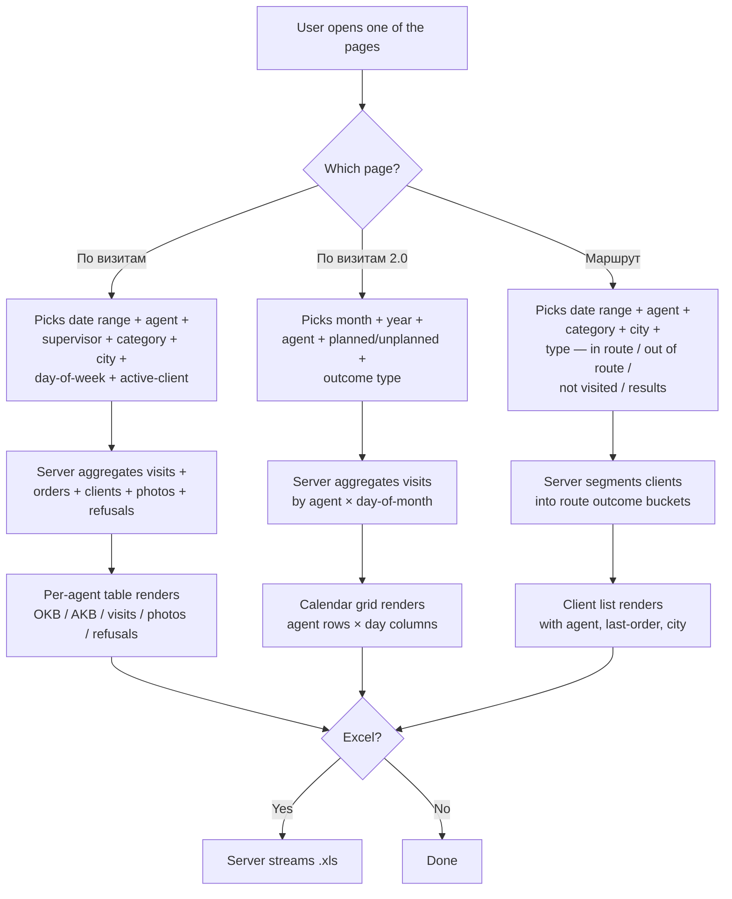

# Visit reports — AKB, OKB and strike-rate pages

## What this feature is for

These pages answer the field-discipline question: **"did the agent actually visit the clients on their route, and did the visit result in an order, a photo, a refusal, or nothing?"** Three related pages share this purpose:

- **По визитам (старая страница)** — `/report/agent/visit` — per-agent summary for a date range: OKB (visited), AKB (ordered), photos, refusals, not-visited.
- **По визитам 2.0** — `/report/reportVisit` — a calendar grid: rows = agents, columns = days of the chosen month, cell = % or count of the chosen visit-outcome (visited / order / photo / refusal / not-visited).
- **Маршрут / результативность** — `/report/report` — per-client outcome for the period: was the client visited? in or out of route? did the visit produce an order? a refusal? a photo? Used for daily route audits.

Visits drive **OKB** (the denominator of strike rate); orders drive **AKB** (the numerator). Without visit discipline, every other report's strike rate is wrong.

## Who uses it and where they find it

| Role | What they do here | How they get to the screen |
|---|---|---|
| Supervisor (8) | Daily check on their team's route discipline | Web → Отчёты → **По визитам 2.0** |
| Manager (2) | Cross-team check | Web → Отчёты → **По визитам** / **2.0** / **Маршрут** |
| KAM (9) | Visit history of own accounts | Web → Отчёты → **По визитам** |
| Operator (3) | Per-client outcome audit | Web → Отчёты → **Маршрут** |
| Admin (1) | Everything | Web → Отчёты → ... |

Agents themselves do not see this report — they see their own daily plan on the mobile app.

## The workflow

## Filters and columns

### Filters

| Filter | Type | Server-side or client-side? |
|---|---|---|
| Date range (or month + year for 2.0) | Date pickers | **Server-side** |
| Agent | Multi-select | **Server-side** (capped by supervisor) |
| Supervisor | Drop-down | **Server-side** |
| City | Multi-select | **Server-side** |
| Client category | Multi-select | **Server-side** |
| Day-of-week (visit plan) | Multi-select | **Server-side** — only meaningful for a one-week date range |
| Active client? | Y / N / both | **Server-side** |
| Product category | Multi-select | **Server-side** (capped by partner) |
| Product | Multi-select | **Server-side** |
| Status | Multi-select (По визитам) | **Server-side** |
| Currency | Multi-select | **Server-side** |
| Outcome (2.0) | Visited / Order / Photo / Refusal / Not visited | **Server-side** |
| Planned vs unplanned (2.0) | Radio | **Server-side** |
| Display mode (2.0) | Percentage / count | **Client-side** — affects formatting only |
| Visit type (Маршрут) | Not productive / productive / not visited | **Server-side** — selects different SQL bucket |
| Route mode (Маршрут) | In route / out of route | **Server-side** — `route=1` vs `route=2` |
| Excluded products | Hidden | **Server-side**, always on |

### Columns

**По визитам**

| Column | What it shows |
|---|---|
| Agent name | |
| OKB | Distinct clients visited in the period |
| AKB | Distinct clients with at least one order in the period |
| Strike rate | AKB ÷ OKB |
| Visited count | Total visit events |
| Refused | Visits that ended in refusal |
| Photo | Visits with at least one photo report |
| Not visited | OKB − Visited |
| Photo gallery | Lightbox-style links to actual photos per agent |

**По визитам 2.0**

| Column | What it shows |
|---|---|
| Agent name | |
| Day 1 ... Day N | One cell per day of the chosen month; cell shows percentage (e.g. `83%`) or count (e.g. `25/30`) depending on the display-mode toggle |

**Маршрут / результативность**

| Column | What it shows |
|---|---|
| Client ID, name, phone | |
| Agents | Who visited the client (comma-separated) |
| Visit days | Which weekdays the client is on the route |
| Last order date | Most recent order across all time |
| City | |
| Agent IDs | Internal IDs of agents who visited (used as a tooltip / drill link) |

## Step by step

1. The user opens one of the three pages.
2. *Default range:*
   - **По визитам**: today − 6 days through today (7-day window).
   - **По визитам 2.0**: current month.
   - **Маршрут**: today − 30 days through today.
3. *If supervisor*, agent drop-down restricted silently.
4. The user picks filters specific to the page (outcome / route mode / etc).
5. The user presses **Apply**.
6. *The server runs the relevant SQL* — joining visits, orders, clients, photo reports, refusals as needed.
7. The grid renders. На По визитам, a photo gallery panel appears at the bottom.
8. (По визитам 2.0) The user can toggle between **percent** and **count** without re-running the query — the toggle is client-side.

## What can go wrong

| Trigger | What the user sees | Plain-language meaning |
|---|---|---|
| Day-of-week filter with a > 7-day window | Filter silently ignored | Day-filter only valid for a one-week window. |
| 2.0: agent never visited anyone in the month | Agent row missing entirely | The grid is built from visits, not from the agent list. |
| 2.0: percentage = 0% but count = 0/0 | Renders "NaN%" if not handled defensively | Known bug pattern — verify the page handles division-by-zero. |
| Маршрут: type = "not productive" with route = "in route" but no orders | Shows clients who were on route, were visited, but ordered nothing | Standard. |
| Маршрут: route = "out of route" → clients **off** the agent's route who still ordered | Useful for catching out-of-route deliveries | Standard. |
| Visit that was opened but never closed | Counts as a Visit attempt but not as an Order. | Standard. |
| Agent visited a client but order was created the next day | The order is **not** counted toward AKB for the visit-day unless the date filter spans both days | This is why AKB on visit pages does not always match AKB on Customer report. |
| Supervisor scoping | Only the supervisor's agents | Silent. |
| Partner scoping | Only the partner's categories affect Order vs Visit pairing | Silent. |
| Currency mixing | OKB/AKB are counts, not money — currency is irrelevant | But sum columns on По визитам still respect currency. |
| Wide date range × big team | 2.0 calendar grid becomes wide and slow | Performance gotcha. |
| Empty result | Empty table, no JavaScript errors expected | |

## Rules and limits

- **OKB = distinct clients with a completed visit in the period.**
- **AKB = distinct clients with at least one Shipped/Delivered order in the period.**
- **Strike rate = AKB ÷ OKB.** Division-by-zero must render as a dash.
- **Day-of-week filter only applies within a one-week window.**
- **2.0's percent/count toggle is the **only** client-side filter** across these pages — everything else re-runs the query.
- **Visit must be paired with an order on the same calendar day** to count for AKB on the visit page. (Customer report pairs by date range; visit page pairs by day.)
- **Маршрут "in route" vs "out of route"** is a hard filter — the same client may appear in only one of the two buckets per agent.
- **Supervisor and partner scoping are silent.**
- **No currency conversion.**

## What to test

### Happy paths

- По визитам default window → table renders, OKB ≥ AKB for every agent.
- 2.0 current month → calendar grid renders, every weekday column shows a value.
- 2.0 toggle from percent to count → numbers change format, query does not re-run.
- Маршрут default 30-day window → client list non-empty.

### Filter combinations

- По визитам: day-of-week = Monday with a 7-day window starting Monday → only Monday visits counted.
- По визитам: day-of-week = Monday with a 30-day window → day filter is silently ignored.
- 2.0: outcome = Order → cells show "order completion" percentage.
- 2.0: outcome = Refusal → cells show refusal percentage.
- 2.0: outcome = Not visited → cells show miss percentage.
- Маршрут: type = "not productive" + route = "in route" → clients on-route but with no result.
- Маршрут: type = "productive" + route = "out of route" → off-route clients who still ordered.
- Маршрут: type = "not visited" → clients on the route who were not visited at all.

### Permissions / scoping

- Supervisor A → only A's agents in any grid.
- Manager → all agents across the filial.
- KAM → only their accounts in Маршрут's client list.
- Partner → category filter only affects the order pairing, not the visit pairing.

### Performance

- 2.0 with one agent for one month → snappy.
- 2.0 with 50 agents for one month → grid 50 × 31 cells; expect a few seconds.
- По визитам 7 days × 50 agents → fast.
- По визитам 30 days × 50 agents → slower but acceptable.
- Маршрут 90 days → expect slow if client list is large.

### Edge cases

- Agent with zero visits in the month → row absent from 2.0 grid (verify this is expected, not a bug).
- Agent with one visit per day for the full month → 100% in every cell.
- Visit recorded with no client (geofencing issue) → not counted anywhere — verify it does not crash.
- Order created without a visit (operator-built) → counts toward AKB on Customer report but **not** on По визитам's AKB.
- Photo report with no associated visit → does not appear in the photo column.
- Refused visit + later order on the same day → counts as both refused **and** ordered (rare; verify both columns increment).
- Empty result → all KPIs render zero or dash.

## Where this leads next

- [Заказы по агентам](./report-agent.md) — to see the sales side of the same agents.
- [Продажи по клиентам](./report-customer.md) — to see the client side of OKB / AKB.

## For developers

Developer reference: `report` module → `AgentController::actionVisit`, `ReportVisitController::actionIndex` + `actionAuditor`, `ReportController::actionIndex` + `actionAjaxReport`.
