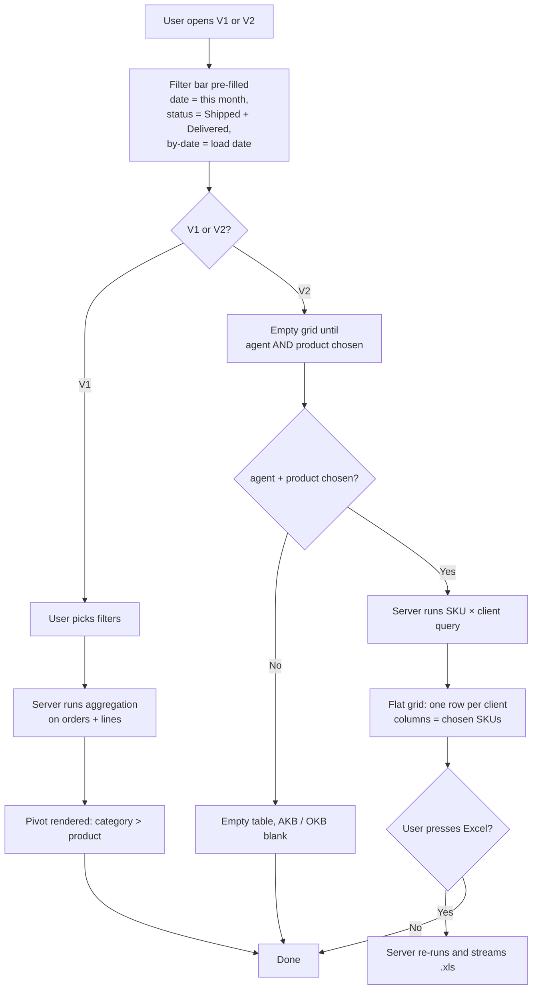

# Продажи по товарам / по SKU — sales-by-product pages

## What this feature is for

These two pages answer the product-side question: **"which products are selling, in what quantity, and to how many distinct clients?"** There are two related screens that share a filter bar:

- **Продажи по товарам (V1)** — a pivot per product category × product. Shows count, volume, sum, AKB (distinct buyers) per SKU. The default tab for category-level managers.
- **Продажи по SKU (V2)** — a flat table of client × SKU, used to measure **numeric distribution** (does each client buy each SKU). Shows units per client per SKU and a "% distribution" column. Includes an Excel export.

Together they let the dealer answer questions like *"how many of my active clients bought our flagship SKU last month?"* (V2) and *"which category over- or under-performed?"* (V1).

## Who uses it and where they find it

| Role | What they do here | How they get to the screen |
|---|---|---|
| Operator (3) / Manager (2) | Category and SKU review | Web → Отчёты → **Продажи по товарам** / **по SKU** |
| Supervisor (8) | Same, restricted to their agents | Web → Отчёты → ... |
| Brand / category manager | Numeric-distribution check (V2 only — Excel export) | Web → Отчёты → **Продажи по SKU** |
| Partner (7) | Restricted to their product categories | Web → Отчёты → ... |
| Admin (1) | Everything | Web → Отчёты → ... |

Agents and expeditors do not see these pages.

## The workflow

## Filters and columns

### Filters

| Filter | Type | Server-side or client-side? |
|---|---|---|
| Date range (from / to) | Date pickers | **Server-side** |
| **By what date?** — order / load / delivery | Radio | **Server-side** |
| Status | Multi-select; default Shipped + Delivered (V1) or hard-coded Shipped + Delivered (V2) | **Server-side** |
| Agent | Multi-select | **Server-side**, capped by supervisor |
| Supervisor | Drop-down | **Server-side** |
| City | Multi-select | **Server-side** |
| Client category | Multi-select | **Server-side** |
| Currency | Multi-select | **Server-side** |
| Price type | Multi-select | **Server-side** |
| Warehouse (store) | Multi-select (V1) | **Server-side** |
| Expeditor | Multi-select (V2) | **Server-side** |
| Product category | Multi-select | **Server-side** (capped by partner) |
| Product group | Multi-select — expands | **Server-side** |
| Product | Multi-select | **Server-side** |
| MML only? (V2) | Yes / No / both | **Server-side** — picks only marketing-master-list products |
| Active product only? | Y / N | **Server-side** |

### Columns — V1 (Продажи по товарам)

| Column | What it shows |
|---|---|
| Category total | For each category: total units, volume, weight, sum, AKB, per-currency sum |
| Product line | For each product within the category: units, volume, weight, packs, sum, AKB, per-currency sum |
| Pack count | Units ÷ pack-quantity (rounded) |

### Columns — V2 (Продажи по SKU)

| Column | What it shows |
|---|---|
| Client name | One row per client |
| For each chosen SKU | Units sold to that client (0 cells are highlighted red) |
| Sum | Per-client sum |
| Distinct SKUs sold to this client | Numerator of distribution |
| % distribution | Distinct SKUs ÷ chosen-SKUs × 100 |
| Footer | OKB (clients visited by chosen agents), AKB (clients who bought *all* chosen SKUs) |

## Step by step

1. The user opens **Отчёты → Продажи по товарам** (V1) or **по SKU** (V2).
2. *V1*: pre-fills filters with current month / Shipped + Delivered / by load date, then renders the pivot.
3. *V2*: pre-fills the same defaults, but **shows nothing in the grid** until the user picks at least one agent **and** one product. (This is by design — without a SKU list, the report has no meaning.)
4. The user picks filters.
5. *V2*: the user may also flip the **MML** toggle — Yes restricts to marketing-master-list products only.
6. The user presses **Apply**.
7. *The server runs the aggregation.* V1 groups by category + product; V2 groups by client + product.
8. The grid renders. In V2, cells where the client bought zero of a chosen SKU are highlighted red.
9. For V2, **Excel export** generates a `.xls` with the same matrix.

## What can go wrong

| Trigger | What the user sees | Plain-language meaning |
|---|---|---|
| V2 with no agent and no product | Empty page, no numbers | By design — V2 needs both inputs. |
| V2 with MML = Yes but none of the chosen products are MML | Empty grid | The MML filter intersects with the product list. |
| Volume / weight column blank | Likely a product card with no volume/weight configured | These come from the product card, not the order. |
| Pack count = unit count | Product card has no pack-quantity | Same source. |
| Currency mixing | Per-currency sum row appears at category total; product rows aggregate without conversion | Standard. |
| Excluded categories / products | Silently removed | Excluded list is hard-coded out. |
| V2: a client who bought 4 of 5 chosen SKUs | Appears with 80% distribution, one red cell | This is the central V2 use case. |
| Wide date range × many SKUs in V2 | Slow | The matrix is clients × products. |
| Supervisor scoping in V1/V2 | Only their agents' orders count | Silent. |
| Date by delivery, status default | Some orders with NULL delivery date are silently excluded | Hidden cause of "missing rows". |
| Product de-activated mid-period | Still appears with its historical numbers (V1); the "Active = N" filter can be used to hide it | Standard. |

## Rules and limits

- **V1 default status is Shipped + Delivered.** V2 hard-codes Shipped + Delivered — the status filter is not on the V2 filter bar.
- **V2 needs at least one agent and one product** to produce a result.
- **The "% distribution" column uses the **chosen SKU list as the denominator**, not the dealer's full SKU list.** Test cases must record which SKUs were chosen.
- **AKB in V2 means clients who bought every chosen SKU.** Different from the AKB used elsewhere.
- **OKB in V2 means active clients visited by the chosen agents.** The filter set is narrower than on the customer report.
- **Excluded products are always removed.** Even if the user explicitly picks one.
- **Supervisor scoping is silent.**
- **Partner scoping is silent.**
- **No currency conversion.**
- **Excel export is only on V2** (and a separate `/excelExport` endpoint). V1 has no built-in Excel export.

## What to test

### Happy paths

- V1: open with default filters → pivot renders, category totals = sum of product rows.
- V1: pick a single product category → only its products are listed; AKB is plausible.
- V2: pick one agent and one SKU → grid shows that agent's clients and units bought; red cells mark zero buys.
- V2: pick five SKUs → % distribution is `bought / 5 × 100`; AKB is the count of clients who bought all five.
- V2: Excel export → file matches on-screen grid row-for-row, red cells preserved as zero values.

### Filter combinations

- V1: switch by-date radio between order / load / delivery — numbers change consistently.
- V1: warehouse filter = one warehouse → totals match the warehouse's outbound stock.
- V1: price type filter excludes one price list → that price list's orders are gone.
- V2: MML = Yes → only MML products in the SKU list.
- V2: MML = No → only non-MML products.
- V2: MML mismatch → empty grid.

### Permissions / scoping

- Supervisor A opens V1 → only A's agents' orders contribute.
- Partner with categories {X, Y} → only X / Y in the V1 pivot, even if Z is in the URL.
- KAM with restricted client list → only their accounts appear in V2.

### Performance

- V1, 30 days × 200 SKUs → page returns under 10 seconds.
- V1, 90 days × 500 SKUs → expect 30+ seconds; should not 504.
- V2, 10 agents × 50 SKUs → snappy.
- V2, 30 agents × 200 SKUs × 60-day range → flag slow path.

### Edge cases

- Product with no volume / weight on its card → V1 column blank, no error.
- Product with no pack-quantity → V1 packs column = units column.
- A line whose product was deleted → row label is the product ID, no name.
- Currency mixing → per-currency rows present.
- Empty filter result → totals show zero, no JavaScript errors.
- V2 with one chosen SKU and one client who bought it → 100% distribution.
- V2 with one chosen SKU and zero buyers → 0% distribution, grid has 0 rows, AKB = 0.

## Where this leads next

- [Заказы по агентам](./report-agent.md) — to see *which agent* drove these SKU numbers.
- [Продажи по клиентам](./report-customer.md) — to see the same numbers cut by client rather than by SKU.

## For developers

Developer reference: `report` module → `VolumeReportController::actionIndex` (V1), `actionVersion2` (V2), `actionExcelExport`.
