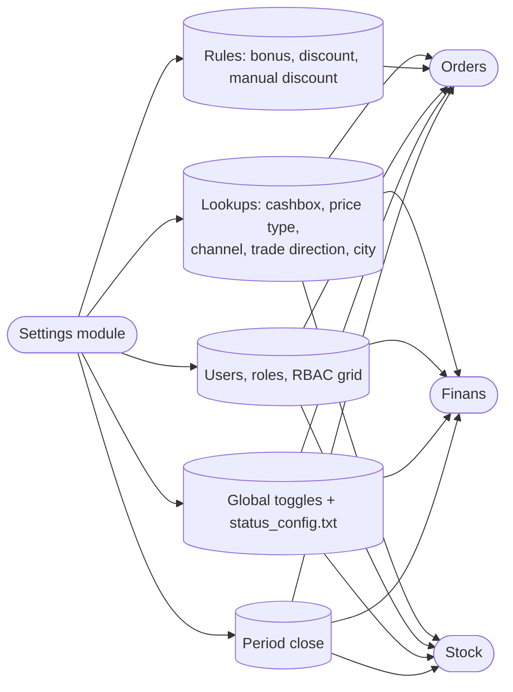

# Settings module — QA test guide

> **Reader.** A QA engineer who tests anything that changes the dealer's *configuration* — the master switches, lookup tables, and rule books that every other module reads. Almost nothing in Settings is interesting on its own; almost everything is interesting because turning a knob here changes behaviour over in Orders, Finans, Stock, or Clients.
>
> **Why this guide is structured around impact, not screens.** Settings has fifty-plus admin pages. Most are isolated lookup tables (one-line edits, almost no logic). A few are *meta-configuration* — they govern entire workflows. The priority table below ranks every Settings feature by how much breakage you can cause downstream if it is misconfigured.

## What this module does

The Settings module is the dealer's **control panel**. It owns:

- Lookup catalogues (price types, currencies, channels, trade directions, cities, …).
- The list of users, their roles, and the per-task permission grid.
- The active rule books — bonus rules, discount rules, manual-discount caps.
- Global on/off switches that change how Orders / Finans / Stock behave at runtime.
- The period-close locks that freeze edits on historical data.

Everything is dealer-scoped: changes here apply to one dealer, never across the platform.

## How to use this guide

| When you want to test… | Open this page |
|---|---|
| The cashbox list and which cashier sees which cashbox | [Cashbox management](./cashbox-management.md) |
| Price-type catalogue and its effect on order pricing | [Price types](./price-types.md) |
| Trade-direction and client-channel catalogues used by rule matching | [Trade direction and channel](./trade-and-channel.md) |
| Users, roles, login uniqueness, the licence cap | [RBAC and users](./rbac-and-users.md) |
| Bonus rule books (auto and manual) | [Bonus rules](./bonus-rules.md) |
| Discount rule books (auto and manual) | [Discount rules](./discount-rules.md) |
| Global toggles, the sub-status config file, period close | [Server toggles and period close](./server-toggles-and-period-close.md) |

## Glossary shortlist (full glossary in [QA glossary](../glossary.md))

| Term | Plain meaning |
|---|---|
| **Lookup catalogue** | A small list a user picks from elsewhere (price types, channels, trade directions, …). Editing one row here changes every dropdown that reads it. |
| **Rule book** | A set of rows where matching fields decide if the rule applies (bonus rules, discount rules). |
| **Auto vs manual** | An *auto* rule fires by itself when its match conditions hold; a *manual* rule has to be picked by the salesperson on the order line. |
| **Active flag** | A Y/N flag on most catalogue rows. `N` hides the row from new screens but does not break historical data that already references it. |
| **Date window** | Most rule books carry `DATE_FROM` / `DATE_TO`. The rule is only eligible inside the window. |
| **Period close** | A per-data-model lock — once set, rows in that model with a date before the lock cannot be created, edited, or deleted (except by listed roles). |
| **Sub-status config** | A plain-text JSON file at `/upload/status_config.txt` that defines extra "fine-grained" labels on top of the five main order statuses. |
| **Licence cap** | The paid-subscription limit on the number of agents / supervisors / sellers a dealer may have active. Set centrally; verified at user-creation time. |
| **Cashbox scoping** | Cashiers see only cashboxes whose `KASSIR` field equals their user-id. The `ACCESS_CASHBOX` override lifts that filter. |

## Master view

## Priority table — QA value per feature

The priority is based on how much downstream behaviour breaks when this feature is misconfigured. **HIGH** features are tested as part of every release. **LOW** features are isolated admin screens, regression-only.

| Feature | Priority | Why |
|---|---|---|
| Bonus rules | **HIGH** | Direct effect on order totals; every change can shift the auto-bonus engine. |
| Discount rules (auto + manual) | **HIGH** | Direct effect on order totals; per-line vs header discount interaction is a frequent regression source. |
| RBAC and users | **HIGH** | Every screen's role gating depends on it; login uniqueness blocks new hires. |
| Price types | **HIGH** | Selected on the order; wrong active/`HAND_EDIT` settings break pricing on mobile. |
| Cashbox management | **HIGH** | Cashier scoping comes from here; mis-binding hides cashboxes or exposes others. |
| Trade direction / channel | **HIGH** | Bonus / discount matching uses these fields; delete-after-use is blocked. |
| Server toggles | **HIGH** | One flag (`debtNewOrder`, `enableDeleteOrders`, …) changes whole workflows. |
| Period close (Closed) | **HIGH** | Locks edits on historical orders, payments, purchases. |
| Sub-status config file | **MEDIUM** | Changes the values in a single dropdown; failure mode is empty / wrong list. |
| City | **MEDIUM** | Bonus / discount match against it; used in client filters. |
| Currency | **MEDIUM** | Lookup. Activating a wrong currency would surface on every multi-currency screen. |
| Client category / client type / client class | **MEDIUM** | Used by bonus matching and reports. |
| Product / product category / brand / producer / unit | **MEDIUM** | Catalogues fed into Orders and Stock. |
| Inventory type / inventory group | **MEDIUM** | Pickers on inventory documents. |
| Reject / reject defect / order comment | **LOW** | Small dropdowns on the order page. |
| Telegram-bot configs | **LOW** | Internal integration; isolated. |
| Backup, system log | **LOW** | Admin-only; regression check on roles. |
| Knowledge base (category, post) | **LOW** | Help content; no logic. |
| Tag, segment, working days, photo-report category | **LOW** | Small admin catalogues. |
| Loyalty, royalty, RLP-bonus | **LOW** | Optional add-on modules; isolated. |
| Diler, region, integration, smart-up, API | **LOW** | Tenant-level / external integration screens. |
| View, table-control, params persistence | **LOW** | UI personalisation; cosmetic. |

## Common test patterns

Every test in this section should at minimum:

1. Record the **before** state of the rule / catalogue row that you are about to change.
2. Execute the change.
3. Open the downstream screen the rule feeds (an order, the cashbox-balance screen, the bonus picker, …) and verify the change is visible **on the next refresh**.
4. Where a date window or active flag is involved, also verify the inverse — the rule must *not* fire when outside the window or when `ACTIVE=N`.

## For developers

Developer reference: `protected/modules/settings/controllers/`, `protected/components/ServerSettings.php` (file lives at `protected/models/ServerSettings.php`), `protected/modules/settings/components/ParamStoreService.php`.
