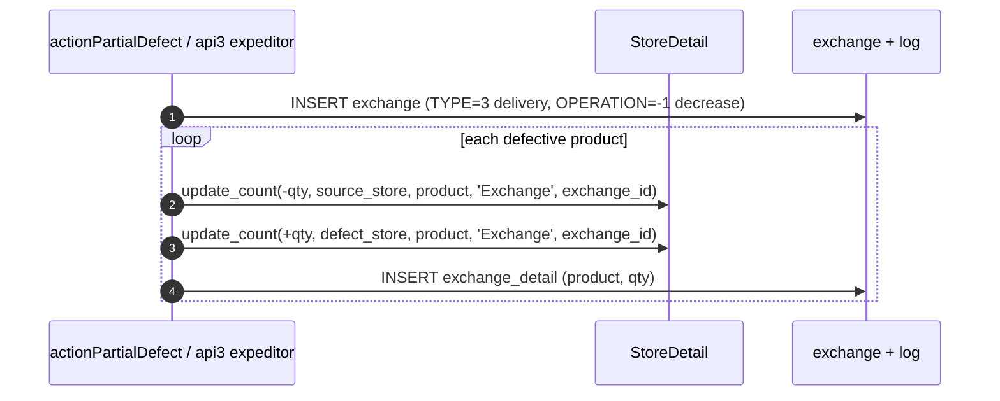
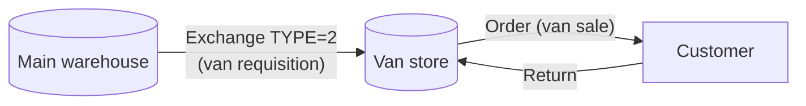

# Defect store & van-selling stock

## What this feature is for

Two specialised stock-movement flows:

- **Defect-store movement**: when an order has a partial defect on delivery, the defective quantity moves to the expeditor's *defect store* (a separate warehouse for damaged goods). Already covered for the order side in [Partial defect](../orders/partial-defect.md) — this page covers the receiving stock side.
- **Van-selling stock**: a van-selling agent's van is itself a `Store` (with `VAN_SELLING=1`). Stock arrives there via *van requisition* (`Exchange.TYPE=2`), not via supplier receipt. Stock leaves on each van sale.

## Defect-store movement

### Where it's triggered

Two paths:

1. **Web**: operator runs `EditController::actionPartialDefect` on the orders module → defect quantity per line.
2. **Mobile**: expeditor marks delivery items defective on their phone → `api3/ExpeditorController` → same defect-store call.

In both cases, the engine is `StoreDetail::exchange_expeditor`.

### Preconditions

- The order's `EXPEDITOR` field is set to an agent.
- That expeditor has `DEFECT_STORE` configured on their profile.
- Defect quantity is > 0.
- Source store has enough stock (unless `DISABLE_STOCK_CHECK=1`).

### What happens on the stock side

The defect store **gains** the defective stock; the source store **loses** it.

### Critical gotcha

**If the expeditor has no `DEFECT_STORE` configured, the defect-store call is silently skipped.** The defect is still recorded on the order, but the stock does not move anywhere — it's lost. This is a real, silent behavioural fork.

Test plans must run both:

- Expeditor *has* defect store → stock moves.
- Expeditor *has no* defect store → no exchange row, no stock movement, defect still recorded on order.

## Van-selling stock

### Where stock comes from

Each van-selling agent has a Store with `VAN_SELLING=1`. Stock arrives via a *van requisition*:

1. Agent (or office) creates a van requisition (functionally similar to a transfer with `TYPE=2`).
2. Main warehouse approves.
3. Stock is decremented from the main store and incremented in the agent's van store.
4. `Exchange.TYPE=2` records this movement type.

### Where stock goes

On each van sale, the order references the agent's van store. On order delivery, `update_count(-qty, agent_van, product, 'Order', order_id)` runs — decrementing the van's stock.

For van returns (the customer refused), stock moves back to the van — same mechanism, reverse sign.

### Rules

- **Van stores are filtered out of supplier-receipt flows.** Stock never arrives directly from a supplier; it must transit through a main warehouse.
- **One agent ↔ one van store** is the design intent. The schema doesn't enforce it.
- **Negative van stock** is possible if `DISABLE_STOCK_CHECK=1` on the van store.

## What can go wrong

| Trigger | What you see | Plain-language meaning |
|---|---|---|
| Expeditor has no DEFECT_STORE; partial defect declared | Defect recorded on order; no exchange row; no stock moves | Silent fork — high-priority QA test. |
| Defect-store movement on a deactivated defect store | Save likely fails | Verify the form rejects deactivated defect stores. |
| Van requisition with insufficient stock at main | Rejected | Standard transfer rules apply. |
| Van sale when van store is empty | Rejected unless DISABLE_STOCK_CHECK=1 | Check the agent's van store config. |
| Two agents pointing at the same van store | Schema allows it; behaviour undefined | One-to-one is the design. Test plans should verify uniqueness in fixtures. |

## What to test

### Defect-store movement

- Order delivered; partial defect declared via web → `actionPartialDefect`. With expeditor's `DEFECT_STORE` set:
  - Verify `exchange` row exists (TYPE=3, OPERATION=-1).
  - Verify `store_log` shows minus at source, plus at defect store.
  - Verify defect store's `store_detail.COUNT` grew by the defective qty.
- Same scenario, expeditor's `DEFECT_STORE` NOT set: defect recorded on order, no exchange, no stock movement.
- Same on the mobile expeditor side via `api3/ExpeditorController`.

### Van-selling stock

- Create a van-selling agent with a van store. Run a van requisition from main → van. Verify `Exchange.TYPE=2` and balances.
- Take an order on the van. Verify the van's `store_detail.COUNT` drops by the order qty.
- Take a return on the van order. Verify the van's stock recovers.
- Van store is empty; agent tries to take an order. With `DISABLE_STOCK_CHECK=0`, rejected. With `=1`, allowed (negative balance).
- Try to receive stock to the van directly via the supplier-receipt form. Should be blocked.

### Audit / conservation

- For a defect-store move: `SUM(store_log.COUNT WHERE MODEL_ID=:exchange_id) = 0` (source = −qty, defect = +qty).
- For a van requisition: same zero-sum.
- After a partial defect, the order's `Defect` row + the `exchange_detail` qty must match. If they diverge, audit failure.

## Where this leads next

- For the order-side mechanics of partial defect, see [Partial defect](../orders/partial-defect.md).
- For van-selling agent setup, see [Role — Agent](../team/role-agent.md).

## For developers

Developer reference: `protected/models/StoreDetail.php` — `exchange_expeditor`, `VsExchange`. Orders side: `protected/modules/orders/controllers/EditController.php::actionPartialDefect`. Mobile expeditor: `protected/modules/api3/controllers/ExpeditorController.php`.
