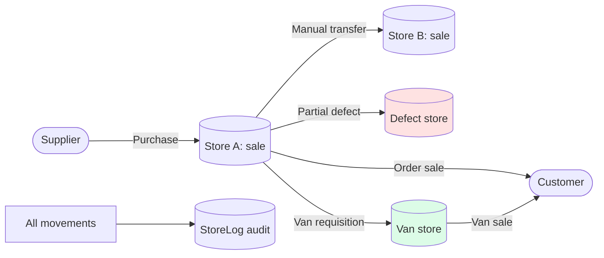

# Stock & Warehouses — QA test guide

> **Reader.** A QA engineer who tests anything that moves goods between warehouses — receipts, transfers, defects, van-selling, inventory adjustments.
>
> **What this section emphasises.** *Conservation of stock.* Every movement must zero-sum across warehouses. No leak, no double-count, no negative stock unless the warehouse has the *stock-check-disabled* flag explicitly on.

## The four-module surface

The stock area in sd-main spans **four** modules that overlap in confusing ways. Here's who owns what:

| Concept | Stored in | Owning module | Edit screen |
|---|---|---|---|
| **Store** (a physical place stock is held) | `store` table | `warehouse` module | `warehouse/AddController`, `warehouse/EditController` |
| **StoreDetail** (per-store, per-product balance) | `store_detail` | central models | No UI — updated only via `StoreDetail::update_count` |
| **StoreLog** (movement audit trail) | `store_log` | central models | Read-only (`stock/StockController`, `stock/StockReportController`) |
| **Exchange / ExchangeDetail** (transfers) | `exchange`, `exchange_detail` | central models | `stock/ExchangeStoresController` (manual); `orders` + `api3/ExpeditorController` (auto) |
| **Warehouse / WarehouseDetail** (per-agent product-qty *limits*, not balances) | `warehouse`, `warehouse_detail` | central models | `agents/LimitController` — see [agents-packet](../team/agents-packet.md) |
| **StoreCorrector** (manual adjustment / count) | `store_corrector` | `warehouse` module | `warehouse/ApiController::CreateAdjustmentAction` |
| **Inventory** (fixed assets — equipment, not consumables) | `inventory*` | `inventory` module | Separate flow — **not** stock balances |

The `inventory` module's name is misleading: it tracks **fixed assets** (cooler equipment, devices) assigned to outlets, not consumable stock. Do not confuse the two.

## How to use this guide

| When you want to test… | Open this page |
|---|---|
| Creating a store, store types, the stock-check-disabled toggle | [Store CRUD](./store-crud.md) |
| The per-store stock balance screen | [Stock balance view](./stock-balance-view.md) |
| Incoming goods from a supplier | [Stock receipt](./stock-receipt.md) |
| Manual transfer between two stores | [Stock transfer](./stock-transfer.md) |
| Defective stock moving to the defect store; van-selling stock | [Defect & van stock](./defect-and-van-stock.md) |
| Physical count / manual adjustment | [Inventory & correction](./inventory-and-correction.md) |

## Glossary shortlist (full glossary in [QA glossary](../glossary.md))

| Term | Meaning |
|---|---|
| **STORE_TYPE** | **1**=sale, **3**=virtual (unused), **4**=defect, **5**=reserve. |
| **VAN_SELLING** | Flag (0/1) on a store. If 1, this store belongs to an agent's van — bypasses the supplier-receipt flow. |
| **DISABLE_STOCK_CHECK** | Per-store toggle (0/1). If 1, orders can go negative on this store. Only role 3 can flip it. |
| **TYPE_LIMIT** | On the *Warehouse* table (agent limits, not balances): **1**=daily, **2**=monthly, **3**=rolling 30 days. Stored as strings; unknown values silently accepted. |
| **Exchange TYPE** | **1**=manual movement, **2**=van-selling load, **3**=delivery (defect / expeditor return), **4**=reception. |

## The conservation invariant

For any product across all stores on any date:

> SUM(`store_detail.COUNT`) across all stores  =  initial balance + (receipts in) − (sales out) ± (transfers, defects, adjustments)

If this doesn't hold, stock has leaked. Every QA test plan in this section should compute the SUM before and after and verify the delta matches the action taken.

## Master view

## For developers

Developer reference: `docs/modules/stock.md`, `docs/modules/store.md`, `docs/modules/warehouse.md`, `docs/modules/inventory.md`. Central model: `protected/models/StoreDetail.php` — `update_count`, `Exchange`, `VsExchange`, `exchange_expeditor`, `Corrector`.
