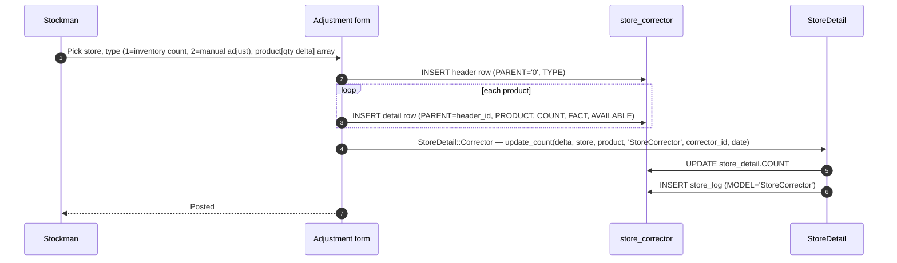

# Inventory count & manual correction

## What this feature is for

When the physical stock on the shelf disagrees with what the system says, someone runs a count and posts an adjustment. The system table is `StoreCorrector` (one header + many detail rows). On approval, the delta is applied to `store_detail.COUNT` and logged in `store_log` with `MODEL='StoreCorrector'`.

There is **no separate auto-recount module** for consumables — adjustments are manual via this flow. (Note: the `inventory` module of sd-main tracks *fixed assets* like cooler equipment, not consumables; do not confuse the two.)

## Who uses it and where they find it

| Role | Action | Path |
|---|---|---|
| Stockman (20), Manager (2, 9), Admin (1) | Create adjustment | Web → Warehouse → Adjustments |
| Operator (3, 5) | Often read-only | — |
| Others | No | — |

Gate: `operation.stock.corrector`.

## The workflow

## Step by step

1. Stockman opens **Warehouse → Adjustments → New**.
2. Picks a store.
3. Picks a **TYPE**: 1 = inventory (physical count), 2 = manual adjustment.
4. For each product entered:
   - `FACT` — the physically counted quantity.
   - `AVAILABLE` — what the system currently says.
   - `COUNT` — the delta (FACT − AVAILABLE), positive or negative.
5. Submits.
6. *The header row inserts.* `PARENT='0'` marks it as a header. The TYPE distinguishes count from adjustment.
7. *Detail rows insert*, each linked to the header via `PARENT=header_id`.
8. *`StoreDetail::Corrector` runs* — applies the delta to `store_detail.COUNT` and logs to `store_log`.

## What can go wrong

| Trigger | What you see | Plain-language meaning |
|---|---|---|
| Negative delta drives `store_detail.COUNT` below zero | Allowed (no validation against the result) | Check it. May be intentional (shortage write-off) or a bug. |
| Positive delta is huge | Allowed (no ceiling check) | Overage write-up. |
| TYPE value outside `{1, 2}` | Silently stored | Enum not enforced. |
| Concurrent adjustments on same store + product | Both apply (no lock) | Last save wins on `store_detail`, both log rows appear. |
| User without `operation.stock.corrector` | Save rejected | Permission gate. |

## Rules and limits

- **No reversal action.** Once posted, the adjustment is final. To undo, post the opposite-sign delta as a new adjustment.
- **TYPE field is informational** — both 1 and 2 trigger the same `update_count` write path.
- **No physical-count workflow** — the form doesn't enforce that FACT was actually measured. Operator could fudge numbers.
- **No approval queue** — adjustments are immediate. If the dealer needs manager approval, that has to be wrapped around this layer externally.

## What to test

### Happy paths

- Post an adjustment with `+5` on one product. Verify `store_detail.COUNT` grew by 5 and a `store_log` row exists with MODEL=StoreCorrector and COUNT=5.
- Post `-3` on another product. Verify `store_detail.COUNT` dropped by 3.
- Post an adjustment that includes both gainers and losers in the same document. All applied.

### Validation

- User without permission → save rejected.
- TYPE=99 (out of enum) → stored without error. Document this gotcha.
- Date before close period → respect or bypass? Document the behaviour.

### Audit

- After a series of adjustments on one product, sum of `store_log.COUNT` over MODEL=StoreCorrector should match the cumulative net adjustment.
- Conservation check across all movement types still holds.

### Edge cases

- Adjustment that would push `store_detail.COUNT` below zero on a store with `DISABLE_STOCK_CHECK=0`. Test whether it's blocked (consistency) or allowed (the corrector path bypasses the order-time check). Document.
- Two concurrent adjustments. Verify both `store_log` rows appear.

## Where this leads next

- For the balance view to verify the result, see [Stock balance view](./stock-balance-view.md).
- For the larger picture of who moves stock, see the [Stock & Warehouses index](./index.md).

## For developers

Developer reference: `protected/modules/warehouse/controllers/ApiController.php::CreateAdjustmentAction`. Engine: `StoreDetail::Corrector`.
