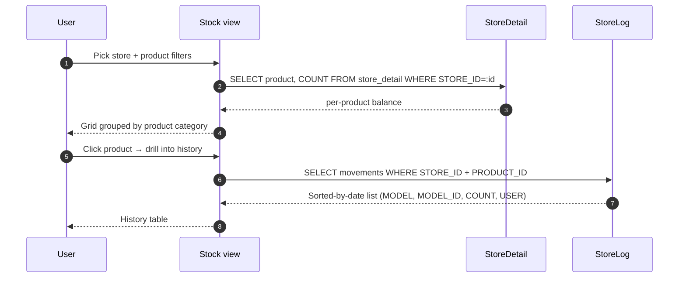

# Stock balance view — what's where, right now

## What this feature is for

The read-only screen for *"how much of product X is currently in store Y?"* and *"who moved it last?"*. Drill-down to `StoreLog` for the historical audit.

## Who uses it and where they find it

| Role | Action | Path |
|---|---|---|
| Operator (3, 5), Manager (9), Supervisor (8), Stockman (20) | View | Web → Stock |
| Admin (1) | View | Same |
| Agent, Expeditor | No access | — |

## The workflow



## Step by step

1. User opens **Stock**.
2. Pick a store from the dropdown (only `ACTIVE='Y'` stores in the user's filial).
3. *The system fetches `StoreDetail.COUNT` per product for that store.*
4. Display: grid grouped by product category (`PRODUCT_CAT_ID`).
5. Click a product → drill into `StoreLog` showing every movement on that product in that store, sorted by date.
6. Each StoreLog row carries: `MODEL` (Order / Exchange / Purchase / etc.), `MODEL_ID` (the source record), `COUNT` (signed delta), `DATE`, `CREATE_BY` (which user).

## What can go wrong

| Trigger | What you see | Plain-language meaning |
|---|---|---|
| Store has no inbound movements yet | Empty grid | Working as designed. |
| Negative balance | Number shown in red (UI convention) | Either DISABLE_STOCK_CHECK is on, or a data integrity bug. Investigate via StoreLog. |
| StoreLog row count doesn't match StoreDetail.COUNT | Audit mismatch | Half-committed mutation — see *Gotchas* below. |
| Wide date range on drill-down | Slow load | No pagination on the drill-down query. |

## Rules and limits

- **Read-only screen.** Writes happen elsewhere ([Stock receipt](./stock-receipt.md), [Stock transfer](./stock-transfer.md), [Defect & van stock](./defect-and-van-stock.md), [Inventory & correction](./inventory-and-correction.md)).
- **No real-time alerts** — low-stock thresholds aren't implemented. QA must query manually.
- **Negative `COUNT` is allowed** if `DISABLE_STOCK_CHECK=1` on the store. The view will display it.
- **`StoreLog` is append-only.** A movement always logs one row per product per store affected.

## Critical audit query (the conservation invariant)

For any product on any date, this must hold:

```sql
SELECT product_id, SUM(COUNT) AS computed_balance
FROM store_log
WHERE store_id = :id AND date <= :asof
GROUP BY product_id
```

Should equal `store_detail.COUNT` for that store + product. If not, there's a half-committed mutation. Test plans should run this query as a smoke test after every batch of movements.

## What to test

- Open the view; pick a store; verify the grid shows non-zero `COUNT` rows.
- Drill into one product; verify each row has a `MODEL` (Order / Exchange / Purchase / StoreCorrector) and a `MODEL_ID`.
- Date-range drill-down: pick today only. Only today's movements appear.
- Negative balance: enable DISABLE_STOCK_CHECK on a store, place an over-quantity order, return to view. Confirm the negative balance is visible.
- Conservation query: pick a product + store, sum `store_log.COUNT` over all dates, compare to `store_detail.COUNT`. Should be equal.
- Filter by category: verify only products in that category appear.

## Where this leads next

- For the source of each `MODEL` value in StoreLog, see the relevant workflow page — [Stock receipt](./stock-receipt.md), [Stock transfer](./stock-transfer.md), [Defect & van stock](./defect-and-van-stock.md).

## For developers

Developer reference: `protected/modules/stock/controllers/StockController.php`, `protected/models/StoreDetail.php`, `protected/models/StoreLog.php`.
