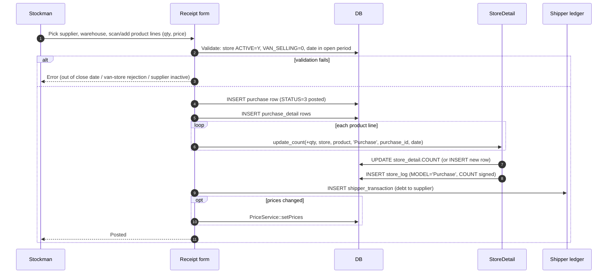

# Stock receipt — incoming goods from a supplier

## What this feature is for

When a supplier delivers goods to one of the dealer's warehouses, the stockman creates a *purchase document* that records what arrived and at what cost. On posting, the document increments `store_detail.COUNT` and logs to `store_log`.

There's also a *draft → approval* layer: a draft purchase can be created (e.g., on mobile by a stockman), then reviewed and approved by a manager before posting.

## Who uses it and where they find it

| Role | Action | Path |
|---|---|---|
| Stockman (20) | Create / edit drafts, sometimes post directly | Web → Warehouse → New receipt |
| Manager (2, 9) | Approve drafts | Web → Warehouse → Pending drafts |
| Admin (1) | Full | Same |
| Others | No | — |

## The workflow

## Step by step — Post a receipt directly (no draft)

1. Stockman opens **Warehouse → New receipt** (`type=sales`).
2. Picks the **supplier** (Shipper) and the **destination store**.
3. Adds product lines: product, quantity, unit price, optional lot.
4. *Date is recorded* (defaults to today).
5. Submits.
6. *The system validates*:
   - Store exists and `ACTIVE='Y'`.
   - Store `VAN_SELLING=0` (van stores are receipt-rejected — stock to a van comes via transfer / requisition).
   - Store `STORE_TYPE` is 1 (sale) or 5 (reserve).
   - Supplier `ACTIVE='Y'`.
   - Date is not before the dealer's *close date*.
7. *The purchase row inserts with `STATUS=3` (posted).*
8. *For each product line*, `StoreDetail::update_count(+qty, ...)` runs — incrementing the balance and writing a `store_log` row with `MODEL='Purchase'`.
9. *Shipper ledger gets a row* — supplier debt incremented by total.
10. *Prices are updated* via `PriceService::setPrices` if a price_type was specified.

## Step by step — Via the draft → approval layer

1. Stockman creates a **draft** instead — `STATUS=1`. The draft row exists; **no stock is moved yet**.
2. Manager opens **Pending drafts** and reviews.
3. **Approve** → `AcceptPurchaseDraftAction` converts the draft to a posted purchase; stock moves now.
4. **Reject** → draft is set to `STATUS=3` (rejected) — but **stock was never posted**, so nothing rolls back.

The draft layer is a manager-approval workflow; it does not affect what stock looks like.

## What can go wrong

| Trigger | What you see | Plain-language meaning |
|---|---|---|
| Pick a VAN_SELLING=1 store | "Store is van-selling, cannot receive" | Receipts don't go into vans. |
| Pick a deactivated supplier | Save fails | Activate the supplier first. |
| Date older than close date | `ERROR_CODE_OUT_OF_CLOSE_DATE` | Can't post into a closed period. |
| Negative quantity | Field error | Receipts are always positive. |
| Price assignment fails partway | Receipt posts, prices are inconsistent | The purchase is NOT rolled back. Manual fix needed. |
| Concurrent receipts to same store | Both apply (no lock) | Conservation should still hold. |

## Rules and limits

- **Draft `STATUS` enum:** 1=draft, 3=posted (after approve), 3=rejected (semantically different, same number — gotcha). Confirm the dealer's actual code.
- **A rejected draft does not roll back stock** because it was never posted.
- **Price updates happen after document insert.** A failed price write doesn't undo the receipt.
- **`shipper_transaction` row is the supplier-debt entry.** Suppliers have their own ledger separate from clients.
- **Van stores reject receipts entirely** — there is no override.

## What to test

### Happy paths

- Post a 3-line receipt to a sale store. Verify: `purchase` + 3 `purchase_detail` rows; `store_detail.COUNT` incremented for each product; `store_log` row per product; `shipper_transaction` row exists.
- Same via draft → approve. Verify the draft sits with STATUS=1 and no stock has moved until approval.
- Approve. Stock moves at approval time, not at draft creation time.
- Reject a draft. Verify no stock changes.

### Validation

- Pick a van store. Receipt rejected.
- Pick a deactivated supplier. Rejected.
- Date before close date. Rejected with `ERROR_CODE_OUT_OF_CLOSE_DATE`.
- Negative quantity in any line. Rejected.

### Audit / conservation

- Run conservation check: `SUM(store_log.COUNT WHERE STORE_ID=X AND MODEL='Purchase')` for a date range should equal the SUM of `purchase_detail` for those receipts.

### Edge cases

- Receipt post that triggers price update but price update fails (mock the failure). Verify the receipt posts and the inconsistency is recorded somewhere (log, error queue).
- Two concurrent receipts on the same store + product. Verify the final `store_detail.COUNT` equals initial + sum of both increments.

## Where this leads next

- For the balance view, see [Stock balance view](./stock-balance-view.md).
- For inter-store transfer, see [Stock transfer](./stock-transfer.md).

## For developers

Developer reference: `protected/modules/warehouse/controllers/AddController.php`, `protected/modules/warehouse/controllers/ApiController.php::CreatePurchaseDraftAction`, `AcceptPurchaseDraftAction`.
