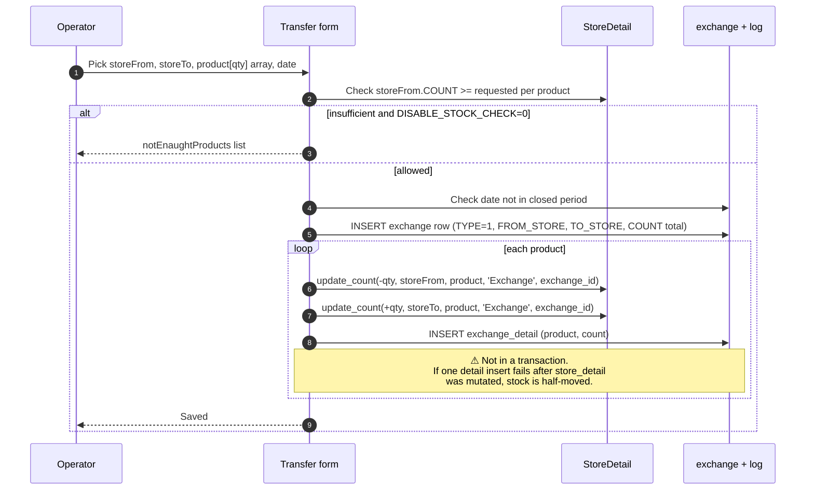

# Stock transfer — moving goods between stores

## What this feature is for

A manual transfer when the dealer wants to rebalance: too much stock at warehouse A, not enough at warehouse B; or staging stock from main to a branch. Creates one `exchange` document, decrements source, increments destination, logs both ends in `store_log`.

This is also the **mechanism for loading a van** — though that variant uses `Exchange.TYPE=2` (van-selling) instead of TYPE=1 (manual). See [Defect & van stock](./defect-and-van-stock.md) for the van-specific variant.

## Who uses it and where they find it

| Role | Action | Path |
|---|---|---|
| Operator (3, 5), Manager (9), Stockman (20) | Create transfer | Web → Stock → Inter-store transfer |
| Others | No | — |

## The workflow

## Step by step

1. Open **Stock → Inter-store transfer**.
2. Pick **source store** (`storeFrom`) and **destination store** (`storeTo`).
3. Add product lines: product, quantity.
4. Pick the date (defaults to today). Comment optional.
5. Submit.
6. *The system validates*:
   - Both stores `ACTIVE='Y'` and `STORE_TYPE=1` (sale stores only).
   - Source store has `COUNT >= requested` for every product, **unless source has `DISABLE_STOCK_CHECK=1`**.
   - Date not in the closed period (`Closed::model()->check_update`).
7. *The exchange row inserts.* `TYPE=1` for manual movement.
8. *Per product*: `update_count` runs twice — once at source (negative), once at destination (positive). Two `store_log` rows per product.
9. *An `exchange_detail` row* records each product's quantity.

## What can go wrong

| Trigger | What you see | Plain-language meaning |
|---|---|---|
| Source insufficient stock | `notEnaughtProducts` list | Reduce qty or use a source with enough. |
| Source has DISABLE_STOCK_CHECK=1 | Transfer allowed, source can go negative | Hard-coded check at line ~66 ignores the flag — **confirm if your dealer's code allows negative on transfer too**. |
| Date in closed period | "Period closed" error | Pick a current date or change closed-period rules. |
| Wrong STORE_TYPE (e.g., reserve, defect) | Form blocks at dropdown | Sale-store-only constraint. |
| Half-committed transfer (no transaction) | Stock at source decreased but exchange_detail failed | **Audit risk.** Run the conservation check after batches. |
| Concurrent transfers from same source | Both apply (no row lock) | Race: source may overdraw. |

## Rules and limits

- **Two `store_log` rows per product per exchange** — one negative at source, one positive at destination. The pair always sums to zero.
- **Zero-sum invariant:** `SUM(store_log.COUNT)` across both stores for one `exchange.id` = 0.
- **Sale-store-only constraint** is form-time, not server-side strict; URL-hacking might bypass — test it.
- **No transaction wrapper** around the multi-step write. Concurrent / partial-failure scenarios can leak.

## What to test

### Happy paths

- 3-product transfer between two sale stores. Verify both stores' balances change correctly; `exchange` row exists; 3 `exchange_detail` rows; 6 `store_log` rows (3 negative + 3 positive).
- Transfer all of one product's stock to the other store. Source goes to zero.
- Transfer reverse (destination back to source). Stock returns to original distribution.

### Validation

- Source has 10, request 15. With DISABLE_STOCK_CHECK=0, rejected. With =1, allowed (source goes to −5).
- Date in closed period. Rejected.
- Pick a defect store (TYPE=4) as destination. Rejected at form / server.

### Race conditions

- Two operators initiate simultaneous transfers from the same source with combined qty > available. Verify whether one is blocked or both pass (the source overdraws). Document either way.

### Audit / conservation

- For an exchange id, `SUM(store_log.COUNT WHERE MODEL='Exchange' AND MODEL_ID=:id) = 0`.
- For a product across both stores after transfer, total `store_detail.COUNT` is unchanged from before the transfer.

## Where this leads next

- For van-load and defect-store specific transfers, see [Defect & van stock](./defect-and-van-stock.md).
- For supplier receipts, see [Stock receipt](./stock-receipt.md).

## For developers

Developer reference: `protected/modules/stock/controllers/ExchangeStoresController.php`, `StoreDetail::Exchange`.
