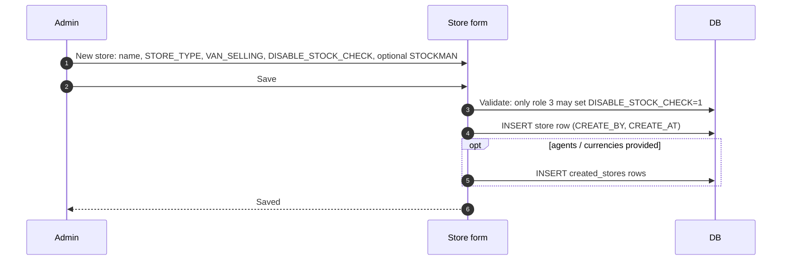

# Store CRUD — creating and editing warehouses

## What this feature is for

A *store* is a physical or logical place stock is held — main warehouse, branch warehouse, defect store, expeditor's van. The admin path for managing them is in the `warehouse` module.

## Who uses it and where they find it

| Role | Action | Path |
|---|---|---|
| Admin (1, 3), Manager (9), Stockman (20) | Create / edit / deactivate | Web → Warehouse → New / Edit |
| Operations, Operator | Often read-only | — |
| Agents, Expeditors | No access | — |

Gate: `operation.stock.create`. The `DISABLE_STOCK_CHECK` toggle is admin-only (role 3 only).

## Store types — what each does

| `STORE_TYPE` | Name | Purpose |
|---|---|---|
| **1** | Sale store (реализации) | Normal warehouse from which orders ship. Most stores are this. |
| **3** | Virtual store | Reserved code — not used in active flows. |
| **4** | Defect store (дефект) | Receives defective stock from partial-defect declarations. |
| **5** | Reserve store (резерв) | Buffer; cannot have orders placed against it. |

Plus the **VAN_SELLING** flag (0/1): if 1, the store belongs to one agent's van.

## The workflow

## Step by step — Create

1. Open **Warehouse → New store**.
2. Pick:
   - **Name** — required.
   - **STORE_TYPE** — 1 / 4 / 5 (3 not used).
   - **VAN_SELLING** — 0 or 1. Setting to 1 marks it as an agent's van; only one agent should be linked.
   - **DISABLE_STOCK_CHECK** — 0 or 1. **Only role 3 may enable.** When on, orders can decrement the balance below zero.
   - **STOCKMAN** — optional User id of the warehouse operator.
3. Save.
4. *The store row inserts.* Initial `store_detail.COUNT` rows are **not** created — they appear on first inbound movement.

## Step by step — Edit / Deactivate

- Edit any field. Changes go to `store` table; not propagated retroactively.
- Deactivate: flip `ACTIVE='N'`. The store disappears from new-order and receipt dropdowns. Existing `store_detail` rows remain.
- **Hard delete is not exposed in the UI.** Even if it were, orphaned `store_detail` rows would remain (no FK cascade).

## What can go wrong

| Trigger | What you see | Plain-language meaning |
|---|---|---|
| Non-admin tries to set DISABLE_STOCK_CHECK=1 | Save rejected | Admin-only field. |
| Save VAN_SELLING=1 with no linked agent | Allowed, but functionally orphan | Test plans must pair van store with an agent. |
| Deactivate a store with non-zero stock | Allowed; stock remains stranded | Operations must transfer it out first. |

## Rules and limits

- **`DISABLE_STOCK_CHECK` is dangerous** — orders / van requisitions / corrections will accept negative stock when on. Use only for transition periods (data fixes, migrations).
- **Deactivation hides the store but doesn't delete its data.** Reports on historical movements still work.
- **VAN_SELLING stores are filtered out of supplier-receipt flows** (`CreatePurchaseDraftAction`) — stock arrives only via inter-store transfer or van requisition.

## What to test

- Create a sale store (TYPE=1). Verify it appears in the order-form's warehouse picker.
- Create a defect store (TYPE=4). Verify it appears in expeditor-config's defect-store picker.
- Create a van store (VAN_SELLING=1). Verify it's filtered OUT of supplier-receipt dropdown.
- As non-admin, attempt to flip DISABLE_STOCK_CHECK=1 — save rejected.
- As admin, flip DISABLE_STOCK_CHECK=1. Test plan: place an order whose qty exceeds available stock. Order accepts (negative balance results).
- Deactivate a store with stock. Verify the stock is still readable historically but the store isn't in new-action dropdowns.

## Where this leads next

- For balance viewing, see [Stock balance view](./stock-balance-view.md).
- For loading stock into a new store, see [Stock receipt](./stock-receipt.md).

## For developers

Developer reference: `protected/modules/warehouse/controllers/AddController.php`, `EditController.php`.
