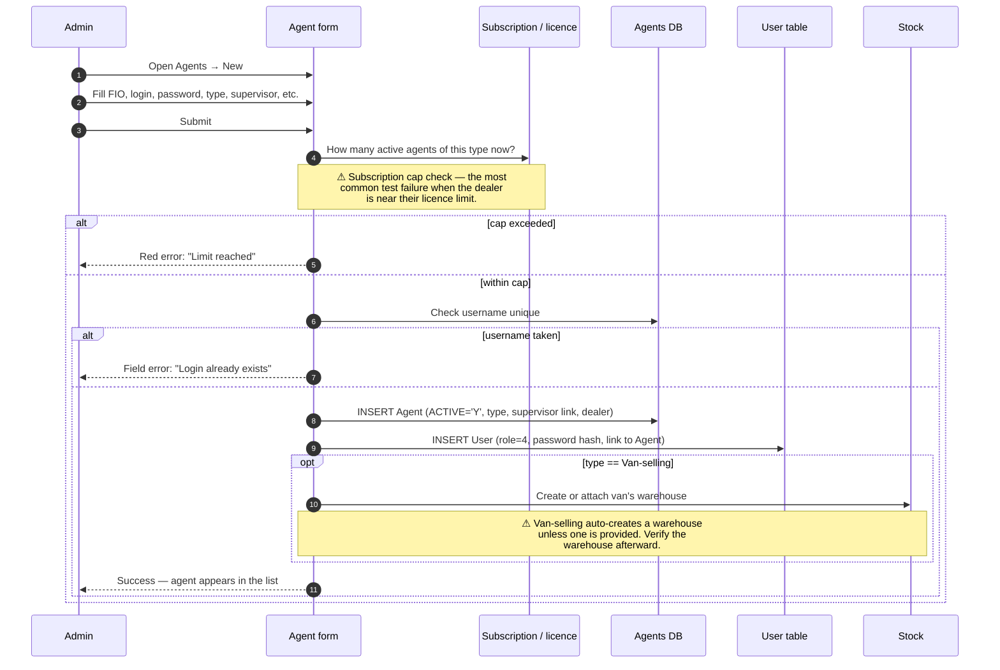

# Agents screen — create, edit, deactivate, delete

## What this screen is for

The **Команда → Агенты** screen lists every agent at the dealer and lets an admin / manager / key-account create new agents, edit existing ones (including changing the agent's type and re-issuing credentials), deactivate them when they leave the company, and — rarely — hard-delete them when they have no historical data.

It is the **gate** through which every agent enters the system. Every other QA test plan that says *"…as agent X"* depends on this screen having created X correctly.

## Who uses it and where they find it

| Role | What they do here | How they get to the screen |
|---|---|---|
| Admin (1) | Full create / edit / deactivate / delete | Web → Команда → Агенты |
| Manager (2) | Same | Same |
| Key-account (9) | Create / edit, usually within their country scope | Same |
| Supervisor (8) | **Read-only** for their team's agents | Same |
| Agent (4), Expeditor (10), Operator (3), Operations (5) | No access | — |

## The workflow — at a glance

## Step by step — Create

1. The admin opens **Команда → Агенты** and clicks **New agent**.
2. The admin fills in:
   - **FIO** (full name) — required.
   - **Login** — required, must be unique across all users, no spaces.
   - **Password** — required.
   - **Agent type** — Field (0), Van-selling (1), or Seller (2).
   - **Phone number, email, birthdate** — optional.
   - **Supervisor** — optional; creates the `Supervayzer` link if filled.
   - **(Van-selling only)** Warehouse — pick an existing warehouse, or leave it as "0" to auto-create one.
3. The admin presses **Save**.
4. *The system runs the subscription-cap check.* It counts existing active agents of the chosen type and compares against the licence cap. ⛔ If the cap is full, the form rejects with *"You have reached the limit on active … agents"*.
5. *The system validates the login* is not already in use. ⛔ If it is, *"This login is already taken"*.
6. *The system validates the login* contains no spaces. ⛔ If it does, *"The login contains spaces"*.
7. *The system creates the Agent row* (active, with the dealer ID inherited from the current tenant).
8. *The system creates the linked User row* (role 4, password stored as MD5, SYNC='N' so the device will be re-authed).
9. **If the agent is van-selling and no warehouse was picked:** *the system creates a fresh warehouse* (`Store.VAN_SELLING=1`) and writes a `CreatedStores` audit row tracking that this warehouse belongs to this agent. **If a warehouse was picked:** *the system attaches it* and clears any previous `AGENT_ID` reference on that store.
10. *The form returns success* with the new agent's id. The list refreshes; the agent is visible.

## Step by step — Edit

1. The admin clicks an agent in the list.
2. The edit dialog opens pre-filled.
3. The admin can change any field, including the agent's type.
4. The admin presses **Save**.
5. *The system re-runs the subscription cap check* — this time allowing the change if the count is below the cap, or if it equals the cap and the agent being edited already counts towards it (so editing a non-type field doesn't fail just because the cap is full).
6. *The system validates the username is unique and space-free* — same checks as create.
7. *The system updates the Agent row*.
8. *If the password field was filled*, the User's password is updated **and the existing device tokens are wiped** — every phone the agent was logged into is signed out. *If the password field is left blank*, the password is unchanged and device tokens are preserved.
9. **If the type changed** from non-van-selling to van-selling: a warehouse is created or attached, same as create.
10. **If the type changed** from van-selling to non-van-selling: the agent's `CreatedStores` row has its `AGENT_ID` zeroed (the warehouse stays, but is no longer linked).

## Step by step — Deactivate

1. The admin clicks **Deactivate** on an agent.
2. The system presents a confirmation listing **what data is linked** to this agent (plans, orders, bonuses, etc.). This is informational — deactivation does not delete linked data.
3. The admin confirms.
4. *The system flips the agent and their User to `ACTIVE='N'`.*
5. *The system renames the User's login* to `deleted_user_<timestamp>` so the original login becomes available for reuse.
6. **If the agent was van-selling**, the `CreatedStores` link is cleared.
7. The agent disappears from the active list (appears in the **Inactive** filter).
8. The agent cannot log into the mobile app from this moment.

## Step by step — Delete (hard delete)

Hard deletion is rarely possible — most agents accumulate historical data fast.

1. The admin clicks **Delete**.
2. *The system runs `Agent::check_agent()`* — looks for any link from this agent to a Plan, Bonus, Stock, Order, Visit, etc.
3. **If any link is found**, the delete is rejected with a list of which tables block the deletion.
4. **If no links exist**, the Agent row and its linked User are physically removed.

For QA: hard-delete is only realistic on a fresh dealer or on an agent created and immediately discarded. For real teams, *deactivation is the only feasible path*.

## What can go wrong (errors the admin sees)

| Trigger | Error | Plain-language meaning |
|---|---|---|
| Subscription cap full for the chosen type | "You have reached the limit on active … agents" | Dealer needs to upgrade their licence or deactivate someone else first. |
| Login already in use | "This login is already taken" | Another agent / user has it. |
| Login has spaces | "The login contains spaces" | Logins must be space-free. |
| Password missing on create | "Password is not set" | Required on initial create. |
| Type-change to van-selling without warehouse available | Warehouse error | The system tries to create one, but if the dealer's store config is unusual it can fail. |
| Hard-delete blocked by linked data | "Cannot delete: agent has Plan, Order, Visit, …" | Use deactivate instead. |

## Rules and limits

- **The cap is per agent type.** Field agents, van-selling agents and sellers each have their own count and their own cap.
- **A free-trial dealer has no real cap** (all caps are 999,999).
- **Re-using a deleted-user's login is possible** because deactivation renames the original. Test plans must cover the renamed-then-reused scenario.
- **The supervisor link is optional.** An agent without a supervisor is *unscoped* — they show up only for admin / manager visibility, not for any supervisor's team list.
- **Editing the password forces re-login on every device** the agent was logged into. Use carefully on agents in the field.
- **Switching type is allowed** but doesn't migrate historical data. Old orders keep the type the agent had at the time of the order.

## What to test

### Happy paths

- Create a field agent. Mobile login works. Mobile app shows the route.
- Create a van-selling agent (without picking a warehouse). Verify a warehouse was auto-created. The agent's mobile app shows their van's stock.
- Create a van-selling agent picking an existing warehouse. Verify the warehouse is attached to this agent.
- Create a seller. Verify they can log in but no route screen appears.
- Create three agents in succession on a clean dealer. All save.
- Edit an agent's FIO. Verify it changes everywhere (reports, list, mobile profile).
- Edit an agent's type from Field to Van-selling. Verify a warehouse is attached and the next order route stock from there.
- Edit an agent's password. Their phone is signed out. They log back in and the device is re-registered.
- Deactivate, then reactivate, an agent. Mobile login works again.

### Cap & licence

- Create agents until the cap is reached, then one more. The last one fails with *"Limit reached"*.
- Same scenario on a free-trial dealer. Should succeed regardless.
- Trial expires. Try to create. Should fail.

### Validation failures

- Empty FIO. Field error.
- Empty login. Field error.
- Login that already exists. Field error.
- Login with a space. Field error.
- Empty password on create. Field error.

### Side effects to verify

- One new `Agent` row.
- One new `User` row, role 4, linked to the agent.
- One `Supervayzer` row if a supervisor was assigned.
- One new `Store` and one `CreatedStores` row if van-selling and no warehouse was picked.
- A row in the agent's history when fields change (the system records who edited what and when).
- After deactivation: User.LOGIN renamed; `CreatedStores.AGENT_ID = 0` if van-selling.

### Cross-module touchpoints

- After creating the agent, set up KPI targets for them. See [KPI setup and views](./kpi-setup-and-views.md).
- After creating the agent, configure their agents-packet. See [agents-packet](./agents-packet.md).
- After creating the agent, take an order on their mobile app. See [Create order — mobile](../orders/create-order-mobile.md).

## Where this leads next

- The agent's mobile-app behaviour: [Role — Agent](./role-agent.md).
- The mobile-app config: [agents-packet](./agents-packet.md).
- KPI for the new agent: [KPI setup and views](./kpi-setup-and-views.md).

## For developers

Developer reference: `protected/modules/staff/actions/agent/CreateAgentAction.php`, `EditAgentAction.php`, `EditDeactivateAgentAction.php`, `DeleteAgentAction.php`, `ListBeforeDeactivateAgentAction.php`, `ListBeforeDeleteAgentAction.php`. Subscription cap logic in `Distr::getSubscription()`.
