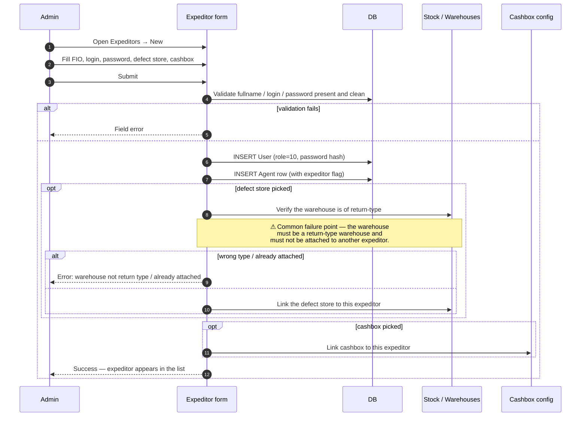

# Expeditors screen — create and manage

## What this screen is for

The **Команда → Экспедиторы** screen creates, edits, and deactivates expeditors — the drivers who deliver orders and collect cash. Like agents, expeditors use the mobile app, so the create flow has more moving parts than for supervisors: cashbox assignment, defect store assignment, and the linked User profile that the mobile login depends on.

This page covers the screen itself. For what an expeditor *does* once they're logged in to the driver app, see [Role — Expeditor](./role-expeditor.md).

## Who uses it and where they find it

| Role | What they do here | How they get to the screen |
|---|---|---|
| Admin (1) | Full create / edit / deactivate | Web → Команда → Экспедиторы |
| Manager (2) | Same | Same |
| Key-account (9) | Read / edit within scope | Same |
| Operations (5) | May have read access depending on RBAC | Same |
| Supervisor (8), Agent (4), Expeditor (10) | No access | — |

## The workflow — at a glance

## Step by step — Create

1. The admin opens **Команда → Экспедиторы** and clicks **New expeditor**.
2. The admin fills in:
   - **FIO** (full name) — required.
   - **Login** — required, unique, no spaces.
   - **Password** — required.
   - **Phone, email, birthdate** — optional.
   - **Defect store** — optional. Pick a return-type warehouse. ⚠ Without this, the expeditor's partial-defect declarations on delivery will silently fail to move stock anywhere — a critical gap.
   - **Cashbox** — required if the expeditor will collect cash. Without this, the payment screen on the mobile app is disabled.
   - **Active** — defaults to true.
3. The admin presses **Save**.
4. *The system validates* presence and cleanliness of FIO, login, password. ⛔ Each missing or invalid field returns a precise error.
5. *The system validates* that the chosen defect store is of return-type and not already assigned to another expeditor. ⛔ Otherwise: *"warehouse not return type"* or *"warehouse already attached other agent"*.
6. *The system creates the User row* with role 10.
7. *The system creates the linked Agent row* (with the expeditor flag set; expeditors share the Agent table with field agents but with role 10 + a flag).
8. *The system links the defect store* (if chosen) and the cashbox.
9. *The form returns success.* The expeditor appears in the list.

## Step by step — Edit

1. The admin clicks an expeditor in the list.
2. The edit dialog opens pre-filled.
3. The admin can change any field — FIO, login, password, defect store, cashbox, active flag.
4. *Same validations as create* run on save.
5. **If password is filled**, it's updated and the device tokens are wiped — every phone signed in as this expeditor is logged out.
6. **If the defect store changed**, the old link is broken and the new one is attached (the old store stops being "this expeditor's defect store" but remains a return-type warehouse).
7. **If the cashbox changed**, the new cashbox is now where the expeditor's collected cash lands. Reports may show a discontinuity at the date of the change — verify how the daily-cash report handles this.

## Step by step — Deactivate

1. The admin clicks **Deactivate**.
2. The system asks for confirmation. It may list the expeditor's pending deliveries — review them.
3. The admin confirms.
4. *The Agent + User rows flip to `ACTIVE='N'`.*
5. *The login is renamed* to `deleted_user_<timestamp>`.
6. *The defect store and cashbox stay assigned in the database* but no longer surface in any list because the expeditor is inactive.
7. The mobile login fails from this point.

## What can go wrong

| Trigger | Error | Plain-language meaning |
|---|---|---|
| Empty FIO / login / password | Missing-required-param error | Required fields. |
| Login with spaces | `ERROR_CODE_INVALID_PARAM` for login | No spaces. |
| Defect store is not a return-type warehouse | `ERROR_CODE_WAREHOUSE_NOT_RETURN_TYPE` | Pick a warehouse marked as return-type in the Stock module. |
| Defect store already assigned to another expeditor | `ERROR_CODE_WAREHOUSE_ALREADY_ATTACHED_OTHER_AGENT` | Use a free defect store, or first detach it from the other expeditor. |
| Login already exists | Duplicate-login error | Another user has it. |
| Cashbox missing on create | Save succeeds, but expeditor cannot collect cash on mobile | Test plans should always set at least one cashbox unless explicitly testing the no-cashbox case. |

## Rules and limits

- **One expeditor — one defect store.** A defect store cannot belong to multiple expeditors at once; the validation enforces this.
- **An expeditor without a defect store can still be created.** Partial-defect declarations on their deliveries will record the defect on the order **but not move any stock**. This is a real, silent behavioural fork — test plans must cover both configurations.
- **An expeditor without a cashbox** cannot record payments. The mobile UI greys out the Payment button.
- **Cashbox change mid-day** is allowed but messy for reporting. The daily-cash report may split the day's intake across two cashboxes; QA must verify reconciliation reports tolerate this.
- **Expeditors share the Agent table.** The same FIO might appear in the Agents screen as well, depending on the dealer's data shape. Use the role filter (role 10 vs role 4) to confirm which screen owns which.
- **Editing the password wipes device tokens** — the expeditor's phone is signed out, just like agents. Avoid mid-day password changes.

## What to test

### Happy paths

- Create an expeditor with a defect store and a cashbox. Mobile login succeeds. Mobile app shows today's delivery list.
- Create an expeditor *without* a defect store. Mobile login still succeeds. Delivery list works. Defects on delivery don't move stock anywhere — confirm via the [Partial defect](../orders/partial-defect.md) test cases.
- Create an expeditor *without* a cashbox. Login works. Payment screen on mobile is disabled.
- Edit an expeditor's defect store to a new return-type warehouse. Partial defects after the change land in the new store; before the change, they landed in the old one (or nowhere).
- Edit the expeditor's password. Their phone is signed out.

### Validation failures

- All the field-level validations from the *What can go wrong* table.
- Pick a warehouse that is **not** a return-type. Should fail.
- Pick a warehouse already attached to another expeditor. Should fail.

### Cross-module touchpoints

- Mark an order Delivered as this expeditor — the order's history names the expeditor.
- Mark a partial defect — verify stock moves to the defect store (if set) or stays in place (if not).
- Record a cash payment — verify the payment lands in the configured cashbox.
- Deactivate the expeditor — their assigned cashbox is freed for re-use.

## Where this leads next

- What the expeditor does after login: [Role — Expeditor](./role-expeditor.md).
- The expeditor's configuration: [expeditor-packet](./expeditor-packet.md).
- The order-lifecycle actions the expeditor performs: [Status transitions](../orders/status-transitions.md), [Mobile payment](../orders/mobile-payment.md), [Partial defect](../orders/partial-defect.md).

## For developers

Developer reference: `protected/modules/staff/actions/expeditor/CreateExpeditorAction.php`, `EditExpeditorAction.php`, `EditExpeditorConfigAction.php`. ExpeditorPaket model at `protected/modules/agents/models/ExpeditorPaket.php`.
