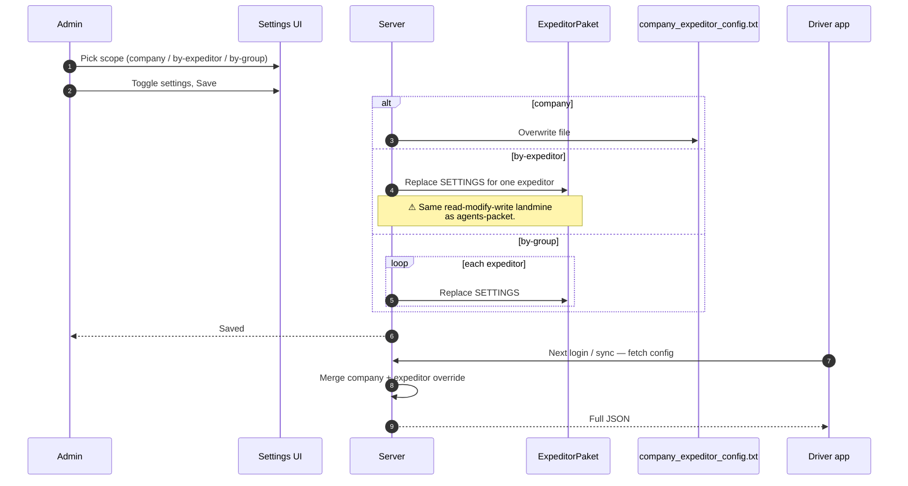

# expeditor-packet — the configuration bundle pushed to the driver app

## What this feature is for

The **expeditor-packet** is the equivalent of [agents-packet](./agents-packet.md) but for the **driver** build of the mobile app — the build the expeditor uses to confirm deliveries, declare defects, and collect cash. Internally it is the **`ExpeditorPaket`** model, with its own `SETTINGS` JSON blob and its own company-defaults file at **`/upload/company_expeditor_config.txt`**.

If you understand the agents-packet, the expeditor-packet is the same idea on a smaller surface — the driver app has fewer features than the agent app, so the toggles are fewer.

## Who uses it and where they find it

| Role | Action | How they get to the screen |
|---|---|---|
| Admin (1), Manager (2) | Read / edit | Web → Команда → Экспедиторы → Settings |
| Key-account (9) | Edit within scope | Same |
| Operations (5) | Often read-only | Same |
| Expeditor themselves | Implicitly read it on every login / sync | Mobile (driver app) |

Gated by `operation.expeditor.paket` (parallel to agents).

## The scopes — same shape, smaller surface

| Scope | Where stored | What it covers |
|---|---|---|
| **Company-wide** | `/upload/company_expeditor_config.txt` | Defaults for every expeditor at this dealer |
| **Per-expeditor** | `ExpeditorPaket.SETTINGS` for one expeditor | Overrides for one specific driver |
| **Per-group** | `ExpeditorPaket.SETTINGS` for multiple expeditors at once | Bulk override |

The same **read-modify-write hazard** applies: simultaneous edits can clobber each other. See [agents-packet — Conflict landmine](./agents-packet.md#conflict-landmine--the-read-modify-write-hazard) for the explanation.

## What's in the expeditor SETTINGS JSON

Driver-side toggles are narrower than agent-side. Expect categories like:

| Category | What it controls |
|---|---|
| `delivery` | Whether to require GPS at delivery; whether to require photo proof; whether the expeditor must visit (check in) at the client before marking Delivered |
| `payment` | Allowed cashboxes; required currencies; cashbox-balance check |
| `defect` | Whether to require a photo when declaring defects; whether defective stock auto-moves to the defect store |
| `return` | Whether to require a comment / photo on whole-order returns |
| `sync` | Sync intervals; mandatory sync windows |
| `gps` | Accuracy threshold; tracking interval; battery threshold |

These names are illustrative — for the authoritative list, the source is the company's `ExpeditorPaket::mainConfig()` definition. QA should not hard-code names in test plans; instead, name the *behaviour* under test ("photo is required when declaring defect") and let the toggle name be wherever it lives in the JSON at the time the test runs.

## The workflow — at a glance

## Step by step — Editing

Same flow as the agents-packet. Pick scope, toggle settings, save. The server replaces the full blob at the chosen scope. The driver's phone fetches the new merged JSON at next login or manual sync.

## Step by step — Mobile reads

1. Driver logs in to the driver app, or triggers a sync.
2. The app calls **`api4/config/expeditor`**.
3. The server loads `ExpeditorPaket` by EXPEDITOR_ID and merges with the company defaults file.
4. The flattened JSON is returned to the app.
5. The app applies the toggles.

No version / ETag.

## What can go wrong

Mirrors the agents-packet. See the table in [agents-packet — What can go wrong](./agents-packet.md#what-can-go-wrong).

## Rules and limits

- Full-blob replace per save (same hazard).
- No version field.
- New expeditor with no override reads the company defaults.
- Company-level file is plain text on the filesystem — a `/upload` filesystem issue breaks every driver until the file is restored.

## What to test

### Mirror of the agents-packet test pattern

- Change a company-level toggle. Confirm the file is updated. Confirm an expeditor without override sees the new value on next sync.
- Change a per-expeditor toggle. Confirm only that expeditor sees it.
- Bulk-change two expeditors. Confirm both apply.
- Two admins, one expeditor, simultaneous edits — confirm clobbering happens. Document.

### Driver-specific behaviour to verify

- Toggle "require photo for defect". Try to declare a defect on a delivered order without uploading a photo. Should be blocked when on, allowed when off. See [Partial defect](../orders/partial-defect.md).
- Toggle "require visit check-in before delivery". Try to mark a Shipped order as Delivered without checking in. Blocked when on; allowed when off.
- Toggle "cashbox-balance check". Try to collect cash that would push the cashbox above its limit. Blocked or warned, depending on dealer's setup.
- Toggle "GPS required for delivery". Try to confirm a delivery with GPS off on the phone. Blocked.

### Cross-module touchpoints

- Each toggle should change the driver's app behaviour on its specific screen. Match the toggle to the Orders module page that exercises that screen — see the per-screen test plans in [Status transitions](../orders/status-transitions.md), [Whole-order return](../orders/whole-return.md), [Partial defect](../orders/partial-defect.md), [Mobile payment](../orders/mobile-payment.md).

## Where this leads next

- The role this configures: [Role — Expeditor](./role-expeditor.md).
- The agent equivalent: [agents-packet](./agents-packet.md).
- The order-lifecycle actions the expeditor performs: pages under the Orders QA guide.

## For developers

Developer reference: `protected/modules/agents/models/ExpeditorPaket.php`, `protected/modules/staff/actions/expeditor/EditExpeditorConfigAction.php`, `DeleteExpeditorConfigAction.php`, `ListExpeditorPaketAction.php`. Mobile read at `protected/modules/api4/controllers/ConfigController.php` (actionExpeditor).
