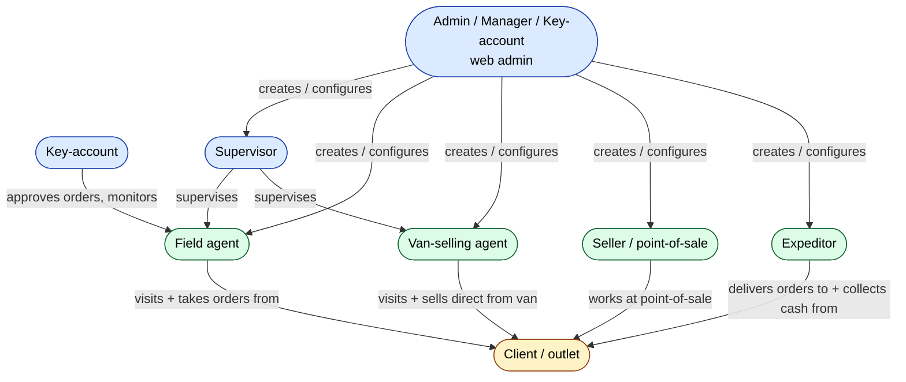

# Team module — QA test guide

> **Who this is for.** QA engineers who need to test everything under the **Команда (Team)** menu in the web admin. This section explains *who* the people in the system are (agents, supervisors, expeditors) before going into *what* they do (orders, visits, payments — covered in other modules).
>
> **Why we start with roles.** Almost every other QA test plan eventually asks *"what does this user role see / can do / is blocked from?"*. This guide is the answer key.

---

## What the Team module is for, in one paragraph

The Team module is where the dealer's office staff *create, edit, deactivate and delete* every person who works in the field — sales agents, their supervisors, and the expeditors who deliver and collect cash. It is the **identity store** for the field force. It is also where each person's **mobile-app configuration** is set: which products they can sell, which prices they can offer, what KPI targets they're chasing this month, what visit rules they must follow. Everything that constrains how the mobile app behaves is configured here, then pushed down to the phones.

---

## The roles, at a glance

| Role | Name in the UI | Where they work | What this guide covers |
|---|---|---|---|
| Field agent | Агенты | Mobile app | [Agent role](./role-agent.md) |
| Supervisor | Супервайзеры | Web admin (light usage) | [Supervisor role](./role-supervisor.md) |
| Expeditor | Экспедиторы | Mobile / driver app | [Expeditor role](./role-expeditor.md) |
| Operator / Manager / Admin / Key-account | (Settings module — not Team) | Web admin | Briefly covered below |

The Team menu *only* manages the three field-facing roles. Web-side staff (operators, managers, admins, key-account managers) are created in the **Settings → Access & Staff** module, not here.

---

## How they map onto each other

---

## How each role connects to the rest of the system

This is the table QA returns to **every time** they plan a test in another module: it tells you which role is even allowed to do what, and which other modules a role's actions show up in.

| Role | Reads / Acts In | Writes Into | Test plans must verify |
|---|---|---|---|
| **Agent** | Mobile app — clients, products, prices, route, KPI tile | `Order` (creates), `Visit` (records check-in), `Gps` (location), `OrderDetail`, `BonusOrder` | Their orders appear in Orders list; their visits appear on supervisor / report screens; their stock decrements correctly |
| **Van-selling agent** | Same as agent, plus their van's warehouse | Same as agent, plus the van's `StoreDetail` (stock leaves van) | The van's stock balance after each sale; the fresh-debt-per-order path |
| **Seller** | Mobile / outlet app — limited features | `Order` (point-of-sale specific) | Order rows tagged as seller-origin; what they cannot do (no agent-style visits) |
| **Supervisor** | Web admin — agents they supervise, their KPI, their visits | `Kpi` (when admin/supervisor sets up KPI), occasionally `Visiting` (route changes) | They see only agents under them; they can edit only their own scope |
| **Expeditor** | Mobile / driver app — orders to deliver, payment screen | `Order` (status updates: Shipped → Delivered / Returned), `ClientTransaction` (cash payment), `Defect` (delivery defects), `Exchange` (stock to defect store) | Status moves are correctly attributed; cash recorded into their cashbox; defect store movement when they have one configured |
| **Operator** | Web admin everywhere | `Order` (CRUD), `Client`, `ClientTransaction`, `OrderHistory` | Most of the QA Orders Module pages assume this role |
| **Manager** | Web admin — approvals, reports | `Order.STATUS`, approvals | Approval queues; bulk actions |
| **Admin** | Everything everywhere | All tables | Should pass every test that any other role passes |
| **Key-account** | Web admin — B2B orders, large clients | Same as operator for their scope | Filial / country scoping |

---

## Glossary — terms and role numbers QA will see

> The full cross-module glossary lives at [QA glossary](../glossary.md). The shortlist below covers the team-specific terms.

| Stored role number | Name | Where it appears |
|---|---|---|
| **1** | Admin | Web admin (full access) |
| **2** | Manager | Web admin |
| **3** | Operator | Web admin |
| **4** | Field agent | Mobile app |
| **5** | Operations | Web admin |
| **8** | Supervisor | Web admin (read-mostly) |
| **9** | Key-account | Web admin |
| **10** | Expeditor | Mobile / driver app |
| **11** | Merchandiser | Mobile app (lightweight) |

Agent *type* (a separate concept from role) is stored on the `Agent` record as `VAN_SELLING`:

| Stored type | Name | Meaning |
|---|---|---|
| **0** | TYPE_AGENT — regular field agent | Visits clients, takes orders for later delivery |
| **1** | TYPE_VANSEL — van-selling | Has their own warehouse on the truck; goods leave the van the moment they're sold |
| **2** | TYPE_SELLER — point-of-sale seller | Works from a fixed location, not a route |
| **3** | TYPE_SYSTEM — system bot | Internal use only |

| Term | Meaning |
|---|---|
| **Команда** (team) | The UI menu where you manage all of the above |
| **agents-packet** | The configuration bundle pushed to the **sd-agents** mobile app. Internal name: `AgentPaket`. Carries everything from "which products can the agent sell" to "force GPS at check-in". See [agents-packet](./agents-packet.md). |
| **expeditor-packet** | The same idea for expeditors. Internal name: `ExpeditorPaket`. |
| **Sales team** (Торговая команда) | A grouping page that shows the team structure — supervisor and the agents under them. |
| **KPI setup** (KPI установка) | The screen where admin or supervisor enters this month's KPI targets per agent / supervisor / expeditor. |
| **KPI view** (KPI агентов / KPI супервайзеров / KPI экспедиторов) | The reporting screens that show plan-versus-actual numbers. |
| **Product distribution** (Распределение товаров) | A bulk-edit screen for the `PRODUCT_ID` column on each agent's packet — *"which agents can sell which products"*. |
| **Tasks** (Задачи) | New feature — assigns one-off tasks to agents (separate from the routine visit-and-sell flow). |

---

## How to use this guide

Each role has three layers of pages.

| Layer | Pages |
|---|---|
| **Who the role is** — definition, responsibilities, where they work | [role-agent](./role-agent.md) · [role-supervisor](./role-supervisor.md) · [role-expeditor](./role-expeditor.md) |
| **The screens that manage them** — create, edit, deactivate, delete | [create-edit-agent](./create-edit-agent.md) · [create-edit-supervisor](./create-edit-supervisor.md) · [create-edit-expeditor](./create-edit-expeditor.md) |
| **The configuration that drives the mobile apps** — the packet feature | [agents-packet](./agents-packet.md) · [expeditor-packet](./expeditor-packet.md) |

Plus three cross-cutting pages that span all three roles:

| Page | What it covers |
|---|---|
| [KPI setup and views](./kpi-setup-and-views.md) | Setting targets per role and watching plan-vs-actual roll in |
| [Tasks](./tasks.md) | Assigning ad-hoc tasks to field staff |
| [Product distribution](./product-distribution.md) | The bulk-edit screen that controls which agents can sell which products |

---

## Common test patterns for any team-module change

Whenever you change anything in the Team module (create, edit, deactivate, switch type, change packet), include the following pattern in your test:

1. **Make the change in the web admin.** Confirm the success message.
2. **Re-open the page** — verify the data is persisted (rules out optimistic-UI bugs).
3. **Force the mobile app to sync** — log out and log back in on the device. The mobile app re-reads its packet at login.
4. **Confirm the mobile app reflects the change.** Look for the specific feature you toggled (e.g. if you turned on "force GPS at check-in", make a visit on the phone and verify GPS is now required).
5. **Confirm cross-module effects.** Whatever the role does next — orders, payments, reports — should reflect the new configuration. Use the per-role table above to know where to look.

---

## What every QA test case for a team-module change should record

1. **The role and the screen** under test (e.g. *Agents → Create new*, *Expeditors → Edit*).
2. **The actor** doing the change (admin / manager / supervisor / key-account).
3. **Steps** — UI clicks and field values.
4. **Expected primary result** — what the admin sees in the web admin.
5. **Expected secondary result** — what the affected person sees on their mobile app after their next sync.
6. **Expected side effects** — KPI rows, packet JSON, linked User record, cashbox assignment, license count.
7. **Cleanup** — usually deactivating the test person; rarely hard-deleting (deletion is blocked once they have history).

---

## For developers

The developer-facing references live at `docs/modules/agents.md` (agent CRUD, KPI, limits) and across `protected/modules/staff/actions/{agent,supervisor,expeditor}/` for the actual server-side actions, plus `protected/modules/agents/models/{AgentPaket,ExpeditorPaket}.php` for the packet models.
