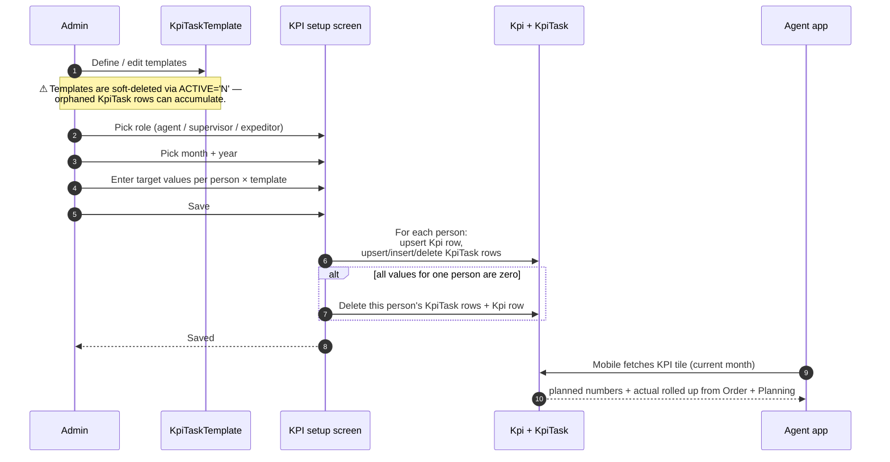

# KPI setup and views — all three role flavours

## What this covers

The Team menu has **six** KPI screens — three for *setting* targets, and three for *viewing* the results:

| Set targets | View results |
|---|---|
| KPI установка (агент) — set agent targets | KPI агентов — view agent results |
| KPI установка (супервайзер) — set supervisor targets | KPI супервайзеров — view supervisor results |
| KPI установка (экспедитор) — set expeditor targets | KPI экспедиторов — view expeditor results |

This page combines all six because they share the same plumbing — `KpiTaskTemplate` (the "what we measure" definitions) and `Kpi` + `KpiTask` (the per-person, per-month assignments and values).

There is an older **KPI v1** module that has been mostly replaced. **New tests should always target KPI v2 (`KpiNewController`)** unless a specific legacy regression is being chased.

## Who uses each screen

| Screen | Admin / Manager | Supervisor | Key-account | Operations |
|---|---|---|---|---|
| KPI setup (agent) | ✅ all agents | ✅ own team only | ✅ within scope | ❌ |
| KPI setup (supervisor) | ✅ | ❌ | depends on RBAC | ❌ |
| KPI setup (expeditor) | ✅ | ❌ | depends | ❌ |
| KPI views (any) | ✅ all | ✅ own team / self | ✅ within scope | ✅ read-only |

All screens are gated by `operation.kpi.view`.

## The three concepts

| Concept | What it is | Where it lives |
|---|---|---|
| **KpiTaskTemplate** | A definition: *"Sales sum this month"*, *"AKB (active client base)"*, *"Number of visits"*, etc. Has a name, a measurement type, and seven bonus-tier thresholds (`MARK1..7`) with payout percentages. | One row per definition per dealer. Cross-filial replication via `COPY=1`. |
| **Kpi** | A row per person per month per type. Carries `TEAM_TYPE` (agent / supervisor / expeditor), `TEAM` (the person's id), and `FIX_SALARY` (the fixed monthly salary base). | One row per person per month. |
| **KpiTask** | Child of `Kpi` — the actual target value for one template. *"Agent X's target for Sales sum this month is 50,000,000 UZS."* | One row per template per Kpi. |

## The workflow — at a glance

## Step by step — Defining a template

1. Open **Команда → KPI → templates** (or via Settings, depending on UI version).
2. Click **New template** (or edit an existing one).
3. Fill in:
   - **Name** — short label.
   - **Task type** — what to measure: `summa` (sales sum), `count` (item count), `volume`, `AKB`, `OKB`, etc.
   - **Tier thresholds and shares** — `MARK1..7` and their `MARK*_KPI_SHARE` percentages. Defines the payout curve.
   - **Bonus / Bonus type** — the basis for the payout.
   - **Active** — Y/N (Y by default).
   - **Supervisor flag** — if checked, this template applies to supervisor KPIs only.
   - **COPY checkbox** — if checked, the template is replicated across all the dealer's filials. The system creates a `KpiTaskTemplateGroup` linking the original and the replicas.
4. Save.

**Soft-delete only.** Deleting a template sets `ACTIVE='N'`. Existing assignments and history remain. Hard delete is commented out and not exposed in the UI. QA should verify that templates with linked `KpiTask` rows do not vanish.

## Step by step — Setting per-person targets

1. Open **Команда → KPI установка (агент / супервайзер / экспедитор)**.
2. Pick the **month** and **year**.
3. The grid shows every applicable person (agents / supervisors / expeditors, depending on the screen) as rows, and every applicable template as columns.
4. Enter numeric target values per cell. Empty / zero means "no target for this template".
5. Optionally enter **FIX_SALARY** per person.
6. Save.

What the server does on save:

- For each person whose row contains at least one non-zero value:
  - Find or create the `Kpi` row for *(this person, this month, this year, this team-type)*.
  - Set `FIX_SALARY`.
  - Upsert one `KpiTask` per template with the entered value.
- For each person whose row is *entirely zero / blank*:
  - Delete all their `KpiTask` rows.
  - Delete the `Kpi` row.

If the dealer has multi-filial replication enabled on certain templates, the server also writes to each filial's `KpiTask` table.

## Step by step — Viewing results

The viewing screens (KPI агентов / KPI супервайзеров / KPI экспедиторов) compute live plan-vs-actual:

- **Plan** comes from `KpiTask.VALUE`.
- **Actual** comes from the relevant operational tables: `Order` (sales), `OrderDetail` (volume, count), `Visit` / `Visiting` (AKB / OKB), `ClientTransaction` (payments / debt).

The viewing screens **do not run on the mobile app** (the agent's own KPI tile is a separate, simpler endpoint — see below). They are web-only and meant for office staff / supervisors.

## Mobile KPI tile (agent's own view)

The agent's own mobile KPI screen is a different code path:

- Mobile calls **`api3/kpi/index`** (which routes to `version2`).
- The server reads `Planning.Planning` for *(agent, year, month, total)* and compares against the agent's order activity in the same month.
- It returns: planned quantity, sum, AKB, volume → and the actual rolled-up numbers.
- Time range defaults to current month; can be overridden via `from` / `to` query parameters in milliseconds.

This is a *read-only*, *current-month-by-default* tile. Test plans for KPI changes must cover both the web setup screen and the mobile tile.

## What can go wrong

| Trigger | What you see | Plain-language meaning |
|---|---|---|
| All values for an agent set to zero | The agent's row + tasks are deleted from DB | Intended — the deletion path is implicit. |
| Template soft-deleted while still in use | Template name still appears in the matrix; assignments remain | `ACTIVE='N'` doesn't cascade. |
| Supervisor tries to set KPI on an agent outside their team | Save rejected | RBAC scoping is enforced. |
| Cross-filial replication misses a filial | Some filials have the row, others don't | Multi-filial save runs sequentially; an error on one filial may leave a partial state. |
| Mobile tile shows zero for a month with sales | Probably no `Planning` row matches; the tile fell back to zero | Verify the `Planning` row exists for the agent/month. |

## Rules and limits

- **One Kpi row per person per month.** Composite key on `(TEAM, MONTH, YEAR, TEAM_TYPE)`.
- **No range validation on KpiTask.VALUE.** Negative values are silently accepted; QA should test negative-value handling.
- **`TASK_TYPE` is a free-form string** with no enum guard. Unknown types are silently stored.
- **Templates are dealer-level by default**; cross-filial copy is opt-in via `COPY=1`.
- **The all-zero-deletion path is implicit** — admins clearing a row may not realise they've deleted the entire month's data for that person. Easy mistake to make; worth a test case.
- **The mobile tile is read-only and current-month by default.** Historical KPI for an agent is only visible from the web.

## What to test

### Templates

- Create a template with all seven tier thresholds. Verify saved.
- Soft-delete a template. Verify it disappears from active dropdowns but assignments referencing it still load.
- Create a template with `COPY=1`. Verify replica rows appear in each filial's table.
- Edit a template name. Verify the change reflects everywhere the template is referenced.

### Setup screen

- Enter targets for three agents for the current month. Verify three `Kpi` rows + N `KpiTask` rows (N = templates per agent).
- Clear all targets for one of the agents. Verify deletion path runs: their Kpi + KpiTask rows are gone.
- Set targets for next month. Verify the current-month rows are untouched.
- Save FIX_SALARY for an agent. Verify it persists on the Kpi row.
- Set negative targets. Verify they save (this is the unguarded behaviour — document it).

### Scoping (most important for supervisor / key-account)

- As a supervisor, set targets for an agent in their team. Save succeeds.
- As the same supervisor, try to set targets for an agent **not** in their team. Should fail (RBAC).
- As key-account, repeat with their scope.

### Cross-role coverage

- Repeat the setup tests against each of the three KPI setup screens (agent / supervisor / expeditor). Confirm the team-type field on the `Kpi` row differs per screen.
- Open each viewing screen and confirm the rows align with what was saved.

### Mobile tile

- Agent's targets set for current month. Agent opens mobile KPI tile. Verify planned values match the targets.
- Take an order on the agent's phone. Refresh the KPI tile. Verify the "actual" numbers reflect the new order.
- Set targets for a *past* month. Verify the mobile tile, defaulting to current month, doesn't show them. Then override `from` / `to` to fetch the past month — verify it works.

### Audit / data integrity

- After any save, verify the row count in `Kpi` and `KpiTask` matches the expected count from the matrix.
- After all-zero deletion, verify no orphan `KpiTask` rows remain.

## Where this leads next

- The role-views that this configures: [Role — Agent](./role-agent.md), [Role — Supervisor](./role-supervisor.md), [Role — Expeditor](./role-expeditor.md).
- The agents-packet (which doesn't touch KPI but is the other major per-agent configuration screen): [agents-packet](./agents-packet.md).

## For developers

Developer reference: `docs/modules/agents.md` — see *Workflow 1.3 KPI v2 monthly plan assignment*. Source files: `protected/modules/agents/controllers/KpiNewController.php` (setup, templates), `protected/models/Kpi.php`, `protected/models/KpiTask.php`, `protected/models/KpiTaskTemplate.php`. Mobile tile at `protected/modules/api3/controllers/KpiController.php` (`version2`).
