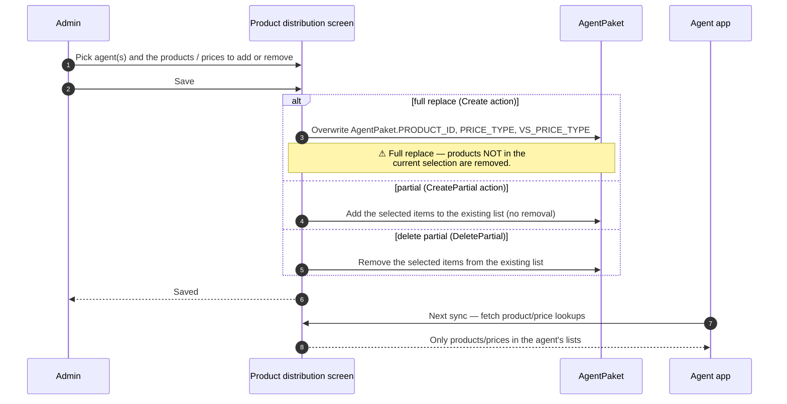

# Product distribution — who can sell what

## What this feature is for

**Product distribution** (Распределение товаров) is the bulk-edit screen for the *"which products and prices may this agent sell"* question. It writes three columns on the agent's packet record:

| Column | Plain-language meaning |
|---|---|
| `AgentPaket.PRODUCT_ID` | Comma-separated list of product IDs this agent may sell |
| `AgentPaket.PRICE_TYPE` | Comma-separated list of price types this agent may quote on regular orders |
| `AgentPaket.VS_PRICE_TYPE` | Comma-separated list of price types this agent may quote on van-selling orders |

These are *not* part of the JSON `SETTINGS` blob (which the [agents-packet](./agents-packet.md) page covers); they are separate database columns. That means edits here do **not** clobber the agents-packet JSON — the two screens are independent.

## Why this is QA-critical

Misconfigured product distribution is a silent failure mode:

- An agent who shouldn't have access to product X but is given it can sell it — accounting reconciles wrong.
- An agent who should have access to product Y but isn't given it can't sell it — they don't see it on their mobile app, and the office can't tell from the agent's phone whether the missing product is a stock issue or an access issue.

QA should treat the product distribution screen as the source-of-truth for *"what does this agent see in their product list?"* before chasing any other cause.

## Who uses it and where they find it

| Role | Action | Screen |
|---|---|---|
| Admin (1), Manager (2) | Full edit | Web → Команда → Распределение товаров |
| Key-account (9) | Edit within scope | Same |
| Operations (5) | Often read-only | Same |
| Supervisor (8), Agent (4), Expeditor (10) | No access | — |

Gated by `operation.agents.paket` — the same permission as the agents-packet JSON editor.

## The workflow — at a glance

## Two save modes — important for QA

| Mode | Effect |
|---|---|
| **Full set** (Create) | Replaces the entire list. *Items not in the saved set are deleted.* |
| **Partial add** (CreatePartial) | Adds items without removing anything already there. |
| **Partial delete** (DeletePartial) | Removes specific items without touching the rest. |
| **Delete all** (Delete) | Wipes the whole list — agent can sell nothing until refilled. |

Most accidental data losses happen when an admin uses the **full set** mode thinking it's an add. The first checkbox they tick determines whether the rest of the existing list survives the save.

## Step by step — Editing one agent's distribution

1. Open **Команда → Распределение товаров**.
2. Pick the agent from a list or search.
3. The current selections (products, price types, van-selling price types) are shown — separated into three lists.
4. The admin makes changes:
   - To add or remove products in **bulk-replace** mode: tick the products that should be in the final set. Save. The result is exactly that set.
   - To add a few products without disturbing the rest: use the **add** UI. Save.
   - To remove a few products without disturbing the rest: use the **remove** UI. Save.
5. *The server writes the comma-separated lists* back to `AgentPaket`.

## Step by step — Bulk editing many agents

1. Open the same screen and pick a group of agents.
2. Choose products/prices that apply to all selected agents.
3. Save (full set / partial add / partial delete — same three modes).
4. *The server loops over every selected agent* and applies the change. Errors on one agent do not stop the others.

## Mobile read path

When the mobile app asks for the product / price list, the server filters the dealer's full catalog through this agent's `PRODUCT_ID` / `PRICE_TYPE` lists. The agent **never sees** products that aren't on their list. The same applies to price types.

This filtering happens on every product / price fetch — there is no cache.

## What can go wrong

| Trigger | What you see | Plain-language meaning |
|---|---|---|
| Full-replace save with empty selection | Agent's list is now empty | They cannot sell anything until corrected. |
| Full-replace save with only some items | Other items are removed silently | Easy mistake — verify against expected list count. |
| Comma-handling bug in the stored string | Stray empty entries between commas | If the UI sends `123,,456`, the empty middle entry can confuse filtering later. |
| Adding a product that doesn't exist in the catalog | Stored, but ignored at read time | No validation against the catalog. |
| Removing the last price type | Agent cannot quote prices — every order they try to take fails | High-impact misconfiguration. |
| Mixed PRICE_TYPE / VS_PRICE_TYPE handling | Van-selling agent fails on a non-van price | Confirm which list is used in which mode. |

## Rules and limits

- **No validation against the catalog.** A non-existent product ID stored in the list is silently ignored at read time. QA should verify the UI presents only valid choices.
- **The lists are plain comma-separated strings.** Edge cases: empty middle entries, leading/trailing commas, spaces inside the list — all should be tolerated by the read code, but worth a test.
- **Two save modes can be mixed in the same session.** Verify each mode's effect independently.
- **Edits here do not affect the JSON `SETTINGS` blob.** They are safe from the [agents-packet conflict landmine](./agents-packet.md#conflict-landmine--the-read-modify-write-hazard) — different code path, different column.
- **Bulk save loops sequentially.** Mid-loop failure on one agent leaves earlier agents updated and later agents untouched. Document the partial-state behaviour in test reports.

## What to test

### Single agent

- Replace the whole list with three products. Verify only those three appear on the mobile app.
- Add a fourth product via partial-add. Verify all four now appear.
- Remove one of the four via partial-delete. Verify three remain.
- Delete-all the agent's list. Verify the mobile product list is empty.
- Add a product that does not exist in the dealer's catalog. Verify it stores but doesn't appear in the mobile list.

### Price types

- Repeat the above for `PRICE_TYPE`. Each price type addition/removal should reflect in the agent's available price-type picker on mobile.
- Van-selling agent: edits to `VS_PRICE_TYPE` should change van-selling pricing while regular orders still use `PRICE_TYPE`.

### Bulk

- Pick a group of three agents. Full-replace their lists with a common set. Verify all three agents now have that exact set.
- Pick a group, partial-add a product. Verify each agent gained that product without losing existing ones.
- Pick a group, partial-delete a product. Verify each agent lost it.
- Simulate a failure on one agent in the bulk save (e.g. permission revoked mid-save). Verify the others are still updated and the failed one is unchanged.

### Cross-module

- After restricting an agent to a single category, take an order on their phone. Verify they cannot pick products outside that category.
- After removing all price types from an agent, take an order. Verify the order fails with a price-type error.
- For a van-selling agent, set `VS_PRICE_TYPE` to a different list than `PRICE_TYPE`. Verify van-selling orders use the VS list and any regular orders use the regular list.

### Mobile re-read

- Edit the list. Without re-syncing the phone, the agent still sees the old list. Force sync. Phone now shows the new list.

## Where this leads next

- The JSON `SETTINGS` blob editor (different concern, same screen family): [agents-packet](./agents-packet.md).
- The role this configures: [Role — Agent](./role-agent.md).
- Pricing rules in the Orders module: [Discounts](../orders/discounts.md) and the pricing references there.

## For developers

Developer reference: `protected/modules/staff/actions/agent/CreateAgentLimitAction.php`, `CreateAgentLimitPartialAction.php`, `DeleteAgentLimitAction.php`, `DeleteAgentLimitPartialAction.php`. The mobile read side: `protected/modules/api4/controllers/BaseController.php::getRestrictedProductsID()`.
