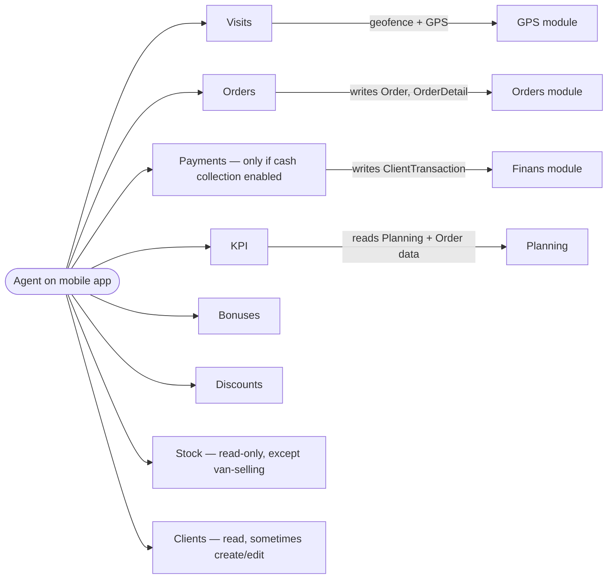

# The Agent role

## Who an agent is, in business language

An **agent** is a person who works in the field, visits clients (shops, pharmacies, restaurants, kiosks), and submits sales orders from a mobile phone. The dealer's whole business runs on what agents capture. Everything the office staff does in the web admin — building reports, watching debt, running KPI — is downstream of the orders that agents created during their visits.

There are three flavours of agent. They all use the **sd-agents mobile app**, but they behave differently when they sell.

| Flavour | Internal name | What's different |
|---|---|---|
| **Regular field agent** | `TYPE_AGENT` (stored as 0) | Takes an order at the client's place; the goods are shipped later from the dealer's warehouse by an expeditor. |
| **Van-selling agent** | `TYPE_VANSEL` (stored as 1) | Drives a vehicle full of stock; goods leave the van the moment they sell them. Has their own personal warehouse (the van). |
| **Seller / point-of-sale** | `TYPE_SELLER` (stored as 2) | Works from a fixed shop or counter, not a route. Limited feature set on the mobile app. |

A separate fourth type, `TYPE_SYSTEM` (3), exists for internal bots only and is **not** in scope for QA.

## What an agent is responsible for

| Responsibility | Where they do it | Connected module |
|---|---|---|
| Logging in to the mobile app | sd-agents app → Login screen | Auth / Users |
| Reading their daily route — which clients to visit today | sd-agents app → Today screen | Visiting / Routes |
| Checking in at a client (often with GPS proof) | sd-agents app → Visit screen | Visits, GPS |
| Taking the order line-by-line | sd-agents app → Take order | Orders ([Create order — mobile](../orders/create-order-mobile.md)) |
| Picking a price type and applying discounts within their limits | sd-agents app → Take order | Pricing, [Discounts](../orders/discounts.md) |
| Picking bonus items (retro-bonus) when allowed | sd-agents app → Take order | [Bonuses](../orders/bonuses.md) |
| Checking out and (optionally) photographing the visit | sd-agents app → Visit screen | Visits, Audit |
| Reading their own KPI tile | sd-agents app → KPI screen | KPI |
| (Van-selling only) Driving with their own warehouse | sd-agents app + their van's stock | Stock |
| (Van-selling only) Selling directly from the van | sd-agents app → Take order | Orders + Stock |

An agent **cannot**:

- Edit orders after the office staff has reviewed them.
- Approve their own orders past the agent's discount or credit limit (those orders go to a manager-approval queue).
- See orders that are not theirs.
- See other agents' KPI numbers.
- Use the web admin. The web admin has no UI built for role 4.

## Where the agent connects to other modules

Anything the agent does on the phone eventually shows up in one of these modules. When QA tests an order created by an agent, the test plan must verify each downstream module.

## What the agent's identity record looks like

The agent is stored in two linked records:

- An `Agent` row — carries the agent's name (FIO), type, dealer ID, active flag, whether they're van-selling.
- A linked `User` row with **role = 4** — carries the username, password, device token (which physical phone they're logged in on).

Creating one without the other is not allowed: every agent must have exactly one User record, and that User must be role 4.

When an agent is **deactivated**, both records have their `ACTIVE` flag flipped to `N` and the username is renamed to `deleted_user_<timestamp>` so the login becomes free for re-use. The orders, visits and history they generated stay in the database — they are not deleted with the agent.

## License / subscription cap

Every dealer has a subscription cap on how many active agents they can have, broken down by type. The cap comes from the dealer's licence file, which has separate counts for `agent`, `vansel`, and `seller`. The cap is checked at **two** times:

1. **At Create.** Adding a new agent fails with *"Limit reached"* if creating it would push the count above the cap for that type.
2. **At type-change.** Switching an existing agent from regular to van-selling does the same check against the *destination* cap.

If the dealer is on a free trial (`license.free_to` is in the future), the cap is effectively unlimited (the system sets each cap to 999,999).

## Mobile-app login — what an agent sees

1. Agent opens the sd-agents app, enters username and password.
2. The server confirms the user exists, is role 4 (or 11 for merchandiser), is `ACTIVE='Y'`, and the dealer's licence is not expired.
3. The server stores the agent's device token (push notification ID). Up to **4 devices** per agent are remembered; the oldest is dropped if a fifth shows up.
4. The server returns the agent's identity and triggers the mobile app's first config fetch — see [agents-packet](./agents-packet.md).
5. On every later sync, the same device token is used; if the agent's password is changed in the web admin, the device tokens are wiped, forcing every phone to log in again.

## What can go wrong from the agent's perspective

| Trigger | What the agent sees | Plain-language meaning |
|---|---|---|
| Wrong username / password | "Wrong login or password" | Either the agent typed it wrong or office staff changed it. |
| Account deactivated | Login fails silently | Office staff has deactivated the agent. |
| Dealer's licence expired | "Licence expired" | The dealer's payment is overdue; *every* mobile user is blocked until it's renewed. |
| Phone changed (new device) | Login asks for password again | The new device gets a slot. After 4 devices, the oldest is forgotten. |
| Stock too low on a product line | "Out of stock" with product list | The product was sold by someone else (or by themselves on a van) since their last sync. |
| Order exceeds discount or credit limit | Order saves but is flagged for approval | The agent's manager has to approve it before it ships. |

## What to test for the Agent role

### Identity & login

- Admin creates an agent of each type (field, van-selling, seller). For each, the agent can log into the sd-agents app and see a route.
- Admin deactivates the agent. The next login attempt fails.
- Admin reactivates. Login succeeds again.
- Admin changes the password. Verify the agent's existing device is signed out.
- Same agent logs in on 5 different phones in sequence. Verify only the 4 most recent retain their tokens; the first phone is signed out.

### Type behavior

- **Van-selling**: create one, confirm a warehouse is auto-attached, take an order, confirm the van's stock balance dropped.
- **Van-selling vs regular debt path**: take an order with a van-selling agent and a regular agent on the same client; confirm the **debt rows are different shapes** (per-order for van-selling, running balance for regular).
- **Seller**: confirm point-of-sale agents do not see the route screen / visit flow.

### Subscription cap

- Dealer has a cap of N agents of a given type, currently uses N–1. Try to create one more. Succeeds.
- Same scenario but the dealer is already at the cap. Try to create one more. Fails with *"Limit reached"*.
- On a free-trial dealer, create 1,000 agents. All succeed.

### Cross-module touchpoints (run each at least once)

- Agent takes an order → it appears in the web Orders list.
- Agent records a visit → it appears in the supervisor's visit report.
- Agent's order matches an auto-bonus rule → a bonus order is created and linked.
- Agent's order exceeds their discount limit → the order is flagged for manager approval.

## Where this leads next

- The web flow that creates and edits agents: [create-edit-agent](./create-edit-agent.md).
- The mobile-app configuration the admin can change for an agent: [agents-packet](./agents-packet.md).
- The agent's KPI: [KPI setup and views](./kpi-setup-and-views.md).
- What the agent does in the Orders module: [Create order — mobile](../orders/create-order-mobile.md).

## For developers

Developer reference: `docs/modules/agents.md` — see *Workflow 1.1* (agent creation), and `protected/modules/staff/actions/agent/*` for the actions.
