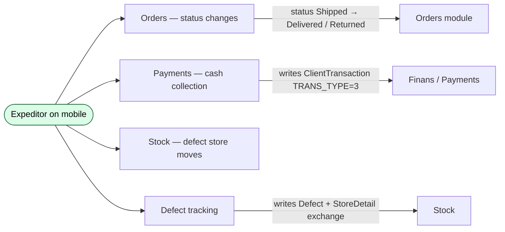

# The Expeditor role

## Who an expeditor is, in business language

An **expeditor** is the driver who actually delivers the orders that agents captured. The agent takes the order at the client's place; the expeditor shows up later (or the next day) with the goods and the paperwork. The expeditor confirms delivery, collects cash if the order was on COD terms, and brings any rejected or defective stock back to the dealer's warehouse. Internally the role is stored as **role = 10**.

If you've read [Role — Agent](./role-agent.md), the expeditor is the *complement* to the agent: agents create orders, expeditors close them out.

## What an expeditor is responsible for

| Responsibility | Where they do it | Connected module |
|---|---|---|
| Logging in to the expeditor mobile app | Mobile (expeditor build of the app) | Auth / Users |
| Seeing today's deliveries — which orders to deliver and to which clients | Mobile → Today screen | Orders |
| Marking an order **Delivered** when handed over | Mobile → order detail | [Status transitions](../orders/status-transitions.md) |
| Marking an order **Returned** when the client refused everything | Mobile → order detail | [Whole-order return](../orders/whole-return.md) |
| Recording defects (some items broken / expired) | Mobile → mark-defect dialog | [Partial defect](../orders/partial-defect.md) |
| Recording cash payment when client pays on delivery | Mobile → payment screen | [Mobile payment](../orders/mobile-payment.md) |
| Carrying defective stock back to the dealer's defect store | The defect-store move is automatic on partial-defect declaration if the expeditor has a defect store assigned | Stock |
| Confirming load-onto-vehicle at the start of the day | Web (operator) or Mobile (expeditor) | Expeditor load screen |

An expeditor **cannot**:

- Create orders. (Orders come from the agent or the office.)
- Modify an order's lines or prices. (The operator handles edits.)
- Use the web admin. (They are mobile-only.)
- See orders that are not on their delivery list for today.

## Where the expeditor connects to other modules

Every action the expeditor takes ends up in one of three modules: **Orders** (status), **Finans** (cash), or **Stock** (defect movement).

## What the expeditor's identity record looks like

Expeditors are stored similarly to agents, but in their own slice of the system:

- A `User` row with **role = 10**, carrying username + password.
- An `Agent` row marked with the expeditor flag — yes, expeditors share the `Agent` table, but with a different *type* / *role* combination. (This is a historical artefact: in older versions, all field staff were a single table.)
- An optional **defect store** assignment. The defect store is a special warehouse that defective goods are moved into when the expeditor marks a partial defect on a delivered order.

The defect-store link matters: an expeditor with **no defect store** assigned has the defective stock silently *not moved anywhere* on a partial-defect declaration — see the gotcha in the [Partial defect](../orders/partial-defect.md) page.

## What an expeditor's mobile app shows them

The expeditor's mobile app is a **different build** of the sd-agents codebase — it shows a delivery-centric UI instead of the route-and-take-order UI:

1. **Today's delivery list** — orders the warehouse loaded onto their vehicle, ordered by either client distance or pre-planned sequence.
2. **Order detail** — for each delivery, the line items, total, the client's address, and the buttons:
   - **Mark Delivered** — moves the order to status Delivered.
   - **Mark Returned** — moves the order to status Returned (whole-order rejection).
   - **Mark partial defect** — opens a dialog to enter defective quantity per line.
   - **Record payment** — opens the cash-collection screen.
3. **Cash collection** — the expeditor enters how much the client paid, in which currencies, into which cashbox.
4. **End-of-day report** — what they collected, what they delivered, what they're bringing back.

## Cashbox assignment matters

When the expeditor records a payment, the money goes into a specific cashbox. The cashbox is configured on the expeditor's User profile:

| Configuration | Effect |
|---|---|
| Expeditor has one cashbox | All payments land there. |
| Expeditor has multiple cashboxes | They pick at payment time. |
| Expeditor has no cashbox | Cannot record payments — the screen is disabled. |
| `ACCESS_CASHBOX = 1` on User | Can write to *any* cashbox. (Use sparingly.) |

Reports filter by cashbox, so misconfigured cashboxes cause real money to be invisible in daily-cash reports. This is a high-priority QA scenario for any onboarding test plan.

## The expeditor-packet

Expeditors have their own configuration bundle, parallel to the agents-packet:

| | Agents | Expeditors |
|---|---|---|
| Model | `AgentPaket` | `ExpeditorPaket` |
| Company-level defaults file | `/upload/company_config.txt` | `/upload/company_expeditor_config.txt` |
| What's in the JSON | Visiting rules, GPS, order rules, … | Delivery-specific rules: required-photo, payment-confirmation, defect-photo, … |
| Web admin screen | Team → Agents → Settings | Team → Expeditors → Settings |
| Mobile reads via | `api3/config/index` | `api4/config/expeditor` |

See [expeditor-packet](./expeditor-packet.md) for the full surface.

## What can go wrong

| Trigger | What happens | Plain-language meaning |
|---|---|---|
| Expeditor not assigned to today's order | Order doesn't appear on their delivery list | The dispatcher forgot to assign them. |
| Tries to mark Delivered without checking in | Sometimes blocked by the packet's `visit-before-delivery` toggle | Depends on dealer config. |
| Cashbox not assigned | Payment screen disabled | Admin must assign at least one cashbox. |
| Defect store not configured | Defects record but stock isn't moved | Silent — easy to miss in QA. |
| Phone offline during delivery | Actions queue locally and sync later | Must verify the sync resolves duplicates correctly. |

## What to test for the Expeditor role

### Identity & login

- Admin creates an expeditor with a username, password, defect store, cashbox. Expeditor logs in and sees their delivery list.
- Admin deactivates them. Login fails on next attempt.
- Expeditor's password changes — verify their device is signed out.

### Delivery flow

- Order in **Shipped** is loaded to expeditor's vehicle. They mark it **Delivered**. Order moves to Delivered, history records *"changed to Delivered by expeditor X"*.
- Same order, but they mark it **Returned**. Order moves to Returned, all stock returns to the original warehouse, client debt is reset to zero. See [Whole-order return](../orders/whole-return.md).
- They mark **partial defect** — 5 of 12 boxes broken. Order stays Delivered, line quantities drop, debt drops proportionally, defect-store stock rises (only if defect store is configured). See [Partial defect](../orders/partial-defect.md).

### Payment

- Client pays 100% in cash → expeditor records full payment, debt clears, SMS goes to client. See [Mobile payment](../orders/mobile-payment.md).
- Client pays partially → debt is partial, payment row is written.
- Client overpays → overpayment is tracked, not refunded.
- Cashbox misassigned → payment lands in wrong cashbox; verify daily-cash report.

### Configuration

- Toggle the expeditor-packet setting *"require photo for defect"*. Sync. Try to declare a defect without uploading a photo. Should be blocked.
- Toggle *"require visit check-in before delivery"*. Sync. Try to mark Delivered without checking in. Should be blocked.
- Toggle the same setting off. Verify the block disappears after next sync.

### Cross-module touchpoints

- Status changes show up in the order's history.
- Payments show up in finance reports and on the client's debt page.
- Defects show up in the defect-store stock balance and in the defect report.

## Where this leads next

- The web flow that creates and edits expeditors: [create-edit-expeditor](./create-edit-expeditor.md).
- The expeditor's configuration: [expeditor-packet](./expeditor-packet.md).
- The order-lifecycle actions the expeditor performs: [Status transitions](../orders/status-transitions.md), [Mobile payment](../orders/mobile-payment.md), [Partial defect](../orders/partial-defect.md), [Whole-order return](../orders/whole-return.md).

## For developers

Developer reference: `protected/modules/staff/actions/expeditor/*` for create / edit, `ExpeditorPaket` model in `protected/modules/agents/models/`, `api4/config/expeditor` for the mobile read path.
