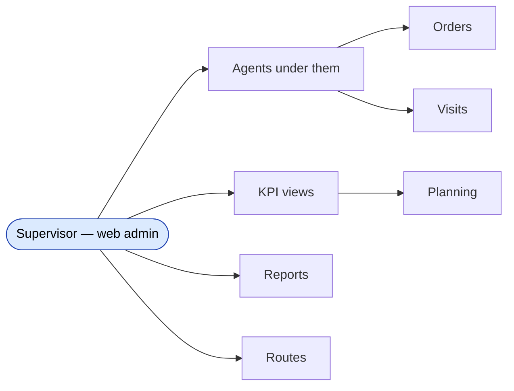

# The Supervisor role

## Who a supervisor is, in business language

A **supervisor** is the field manager who oversees a team of agents. They don't usually take orders themselves — instead they set targets, monitor whether their team hits the numbers, occasionally tweak a route, and report up to the dealer's management. Internally the role is stored as **role = 8**.

Some companies call them by other names — territory manager, sales captain, regional supervisor — but in the system they are *Супервайзер* (Supervayzer) for historical reasons and *Supervisor* in English UI.

## What a supervisor is responsible for

| Responsibility | Where they do it | Connected module |
|---|---|---|
| Seeing the list of agents in their team | Web admin → Team → Supervisors | Team module |
| Reading the team's KPI: plan-vs-actual per agent | Web admin → KPI agents | KPI |
| Setting KPI targets per agent (if their permission allows) | Web admin → KPI setup (agent) | KPI |
| Monitoring visits, orders, debt rolling up from their agents | Web admin → reports | Reports |
| Adjusting route order or week-type for an agent | Web admin → Routes / Visiting | Routes |
| Approving certain order types if the dealer's workflow requires | Web admin → Orders approval queue | Orders |
| Reading their own supervisor KPI tile | Web admin → KPI supervisors | KPI |

A supervisor **cannot**:

- Create or delete agents (admin / manager / key-account does that — the supervisor is read-mostly on the agent record).
- Create or delete supervisors (only admin / manager).
- See agents who don't report to them. (Their visibility is scoped by the supervisor → agent link in the `Supervayzer` table.)
- Use the mobile app (the sd-agents app is for role 4 — agents — only).

## Where the supervisor connects to other modules

The supervisor is a *read-mostly aggregator*: most of what they see is the rolled-up output of their agents in the Orders, Visits, and Planning modules. Their writes are concentrated in KPI setup and the routes screen.

## What the supervisor's identity record looks like

A supervisor is stored as:

- A `User` row with **role = 8**, carrying username + password.
- A row in the `Supervayzer` (sic — Russian spelling) table that links the supervisor User to one or more agents (`SV_AGENT_ID` ↔ `AGENT_ID`).

The link table is the scoping mechanism: when the supervisor logs in to the web admin, every list filters by *"agents whose supervisor is me"*. Test plans for any view that supports multiple supervisors must verify cross-supervisor isolation.

## Mapping agents to a supervisor

When the admin creates an agent (or edits one), one of the fields is the supervisor. That selection creates the `Supervayzer` row. Re-assigning an agent to a different supervisor:

1. Updates the link record.
2. Does **not** retroactively change the agent's historical orders or visits. Old data still belongs to the agent, regardless of who their supervisor was when the data was created.
3. KPI data for the old period stays where it was; the *new* supervisor only sees data from the day of the re-assignment forwards in the live UI.

This is a common QA gap — test the day-of-reassignment to confirm the UI splits the timeline correctly.

## Permissions cheatsheet (what the supervisor can do on each screen)

| Screen | Read | Edit / Save |
|---|---|---|
| Team → Agents | ✅ own team only | ❌ |
| Team → Supervisors | ❌ (sees only own) | ❌ |
| Team → Expeditors | ❌ | ❌ |
| KPI → KPI agents | ✅ own team only | ❌ |
| KPI → KPI setup (agent) | depends on dealer's RBAC | depends — usually allowed on own team |
| KPI → KPI supervisors | ✅ own row only | ❌ |
| Orders list | ✅ orders by their agents | ❌ |
| Reports | ✅ scoped to their team | ❌ |
| Routes / Visiting | ✅ own team | ✅ own team |
| Settings | ❌ | ❌ |

## What can go wrong

| Trigger | What the supervisor sees | Plain-language meaning |
|---|---|---|
| No agents assigned yet | Empty agent list and empty KPI views | Admin forgot to link any agents to this supervisor. |
| Looking for an old agent that was re-assigned | Doesn't appear in current list | They're now under a different supervisor. Their historical orders still appear in reports filtered by the old date range. |
| Trying to view another supervisor's team | Blocked / empty | Scoping is working. |
| Edits to KPI targets fail silently | Permission gap | Their role does not have KPI write permission — verify the dealer's RBAC. |

## What to test for the Supervisor role

### Identity

- Admin creates a supervisor with username/password and assigns 3 agents. Supervisor logs in and sees those 3 agents and only those.
- Admin re-assigns one of those agents to a different supervisor. The original supervisor's agent list drops to 2. The new supervisor's list grows by 1.
- Admin deactivates the supervisor. They cannot log in. Their previous agent-link rows are still in the database but ignored by every list (the join filters by `Supervayzer.ACTIVE`).

### Scoping (most important)

- Two supervisors A and B, each with their own agents. Log in as A — confirm only A's agents/orders/visits/KPI rows are visible. Repeat as B. There should be **zero overlap** unless an agent has been re-assigned.
- Reports filtered by date range that crosses a re-assignment should show the agent's data in the supervisor who had them at *the data's creation date*, not the current supervisor.

### KPI setup

- Supervisor sets a KPI target on one of their agents — verify it saves.
- Supervisor tries to set a KPI target on an agent **not** on their team — should be blocked.
- After supervisor edits a target, the agent's mobile app reflects the new target after next sync.

### Cross-module touchpoints

- Run an Orders module test as one of the supervisor's agents — the new order should appear in the supervisor's order list.
- Run a Visits test — the visit should appear in the supervisor's visit report.
- Move an agent's status — verify the supervisor's dashboard updates after refresh.

## Where this leads next

- The web flow that creates and edits supervisors: [create-edit-supervisor](./create-edit-supervisor.md).
- The KPI screens the supervisor uses: [KPI setup and views](./kpi-setup-and-views.md).
- Agents under their team: [Agent role](./role-agent.md).

## For developers

Developer reference: `protected/modules/staff/actions/supervisor/*` for create / edit / delete, `protected/modules/agents/controllers/SupervayzerController.php` for the team scoping logic, `Supervayzer` model in `protected/models/`.
