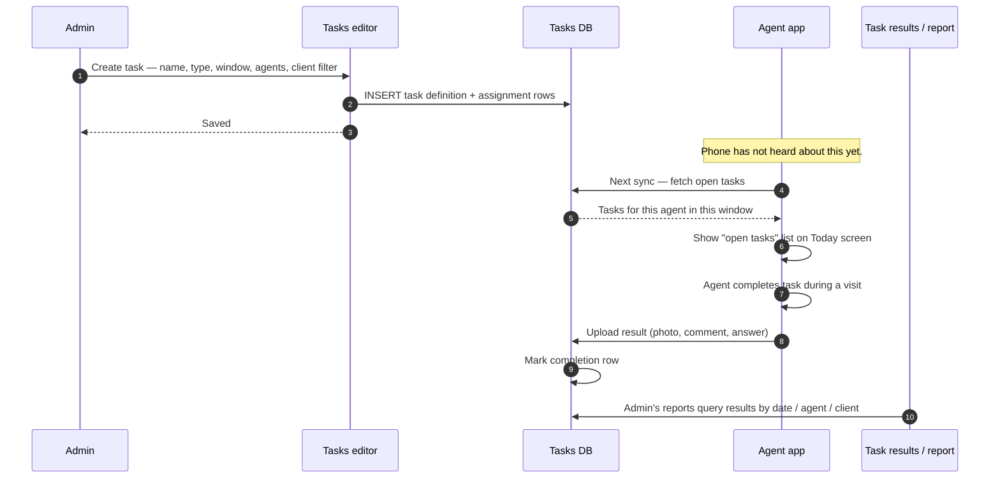

# Tasks — ad-hoc assignments to agents

> **Status:** This is the **new** feature flagged in the Team menu (the *"новый"* badge). It is separate from the routine route-and-sell flow that agents do every day, and separate from KPI. Treat it as immature surface — bugs are more likely here than in older features.

## What this feature is for

A **task** is a single, one-off thing the office wants a specific agent to do — beyond just visiting their route. Examples in the field:

- *"Photograph the freezer at every store this week so we can confirm the cooler-rental compliance."*
- *"Ask every pharmacy whether they're stocking the new SKU launched last month."*
- *"Survey: collect this short questionnaire from your top 10 clients."*
- *"Distribute these promotional leaflets at every visit."*

The Tasks feature lets the admin define what the task is, who it's for (which agents), the time window, and what to collect (photo / text / yes-no / numeric). Agents see the task in their mobile app and check it off as they go.

## Who uses it and where they find it

| Role | Action | How they get to the screen |
|---|---|---|
| Admin (1), Manager (2) | Create, assign, monitor | Web → Команда → Задачи |
| Key-account (9) | Same within their scope | Same |
| Supervisor (8) | View tasks for their team | Same |
| Agent (4) | See their tasks; mark them done | Mobile → Tasks screen |

## What a task carries

A task definition typically includes:

| Field | Plain-language meaning |
|---|---|
| Name | What the agent sees |
| Description | Longer text; the *"why"* |
| Type | What the agent must collect — photo, comment, yes/no, numeric value, choice from a list |
| Required | Whether the agent has to complete it to close their visit |
| Time window | Start date, end date — the task is visible only inside this window |
| Assignment | Which agents (one, many, or all) |
| Client filter | Optional — applies only to certain client categories / cities / types |
| Frequency | Once per visit, once per day, once per client, etc. |

The exact field names and the categorisation may evolve — this is the new feature. Test plans should name the *behaviour* under test, not specific field names.

## The workflow — at a glance

## Step by step — Creating a task

1. Admin opens **Команда → Задачи** and clicks **New task**.
2. Admin fills in:
   - Name and description.
   - Type (photo / comment / yes-no / numeric / choice).
   - Required / optional.
   - Time window (from / to).
   - Assignment: pick specific agents OR pick a tag / group / filial.
   - Client filter (optional).
   - Frequency.
3. Admin saves.
4. *The server stores the task definition* and writes an assignment row per included agent.
5. The task is now live for the chosen window.

## Step by step — Agent sees the task on mobile

1. On next sync (login or manual refresh), the mobile app pulls open tasks.
2. The Today screen shows open tasks as a list above (or next to) the route.
3. At a visit, the agent opens the task, completes it (takes a photo, types a comment, picks an answer), and submits.
4. *The mobile app uploads the result.* If offline, the result queues locally and uploads on next sync.
5. The task entry on the Today list moves to *Done*.

## Step by step — Admin sees the results

1. Admin opens the **Tasks report** or filter on the same Tasks page.
2. The report lists task completions by date, agent, and client.
3. Each row may have an attached photo / comment / answer that the admin can preview.

## What can go wrong

| Trigger | What you see | Plain-language meaning |
|---|---|---|
| Time window in the past | Task is invisible to agents | Working as designed. |
| Time window with date arithmetic error (from > to) | Save rejected, or task is never visible | Verify the UI catches this. |
| Agent not in the assignment list | Task does not appear on their phone | Working as designed. |
| Client filter set, agent visits a non-matching client | Task is not shown for that visit | Working as designed. |
| Required task not completed by agent | Verify whether the mobile app blocks check-out or just warns | Behaviour may vary by dealer config. |
| Photo upload fails due to network | Local queue; uploads on next sync | Verify the queue resolves correctly. |
| Admin edits an in-flight task | Existing completions stay; new completions follow the new rules | Document the cutover behaviour explicitly. |

## Rules and limits

- **Tasks are role-4 only** (agents). Supervisors don't *do* tasks; they see results.
- **Time windows are inclusive of both ends** unless documented otherwise — confirm boundaries in your test.
- **Mobile re-reads tasks on sync**, similar to the agents-packet. There's no push.
- **Bulk assignment + filter combination** can create subtle invisibility bugs ("I assigned it to all agents but nobody sees it"). Common reason: a client filter that no client actually matches.
- **The feature is new.** Treat reported bugs here as higher priority than in older modules.

## What to test

### Authoring

- Create a task with the simplest setup: one agent, one-day window, comment type, no client filter. Agent sees it on mobile, completes it, result appears in admin report.
- Each task type: photo, comment, yes/no, numeric, choice. Confirm each saves, displays correctly on mobile, and uploads its result type.
- Time window in the future. Task is invisible until the start date.
- Time window in the past. Task is invisible.
- From > To. Should be rejected at save.

### Assignment

- Assign to one agent. Verify only that agent sees it.
- Assign to all agents. Verify all agents see it.
- Assign to a group/tag. Verify the included agents see it; excluded agents don't.

### Client filter

- Apply a filter that matches 5 clients out of 50. Agent visits matching clients — task appears. Agent visits non-matching client — task does not appear.
- Apply a filter that matches zero clients. Task is silently invisible — verify this matches design intent.

### Required vs optional

- Required task, agent tries to close visit without completing. Verify behaviour — blocked or warning.
- Optional task, same scenario. Should allow close.

### Offline / sync

- Agent goes offline, completes task, comes back online. Result eventually uploads.
- Admin edits the task while a completion is in flight. Confirm the cutover behaviour.

### Reporting

- Filter results by date range, by agent, by client. Verify each filter narrows correctly.
- Export results — if export exists, confirm it includes the photo / comment / answer.

### Cross-module

- Mark a visit as completed; confirm the task results sit alongside the visit, not as standalone records.
- Task with a photo type — confirm the photo goes to the right Stock / Audit module pool.

## Where this leads next

- The role that consumes tasks on the mobile app: [Role — Agent](./role-agent.md).
- The configuration of the mobile app that may gate task behaviour: [agents-packet](./agents-packet.md).

## For developers

This feature is new and undergoing change. Source files live under `protected/modules/agents/views/task/` and `protected/modules/agents/views/taskNew/`, with reporting under `protected/modules/report/views/tasks/` and `tasksReport/`. The controller is likely a `TaskController` / `TaskNewController` inside the agents module — confirm the active path before chasing a specific bug, as new code is appearing here.
