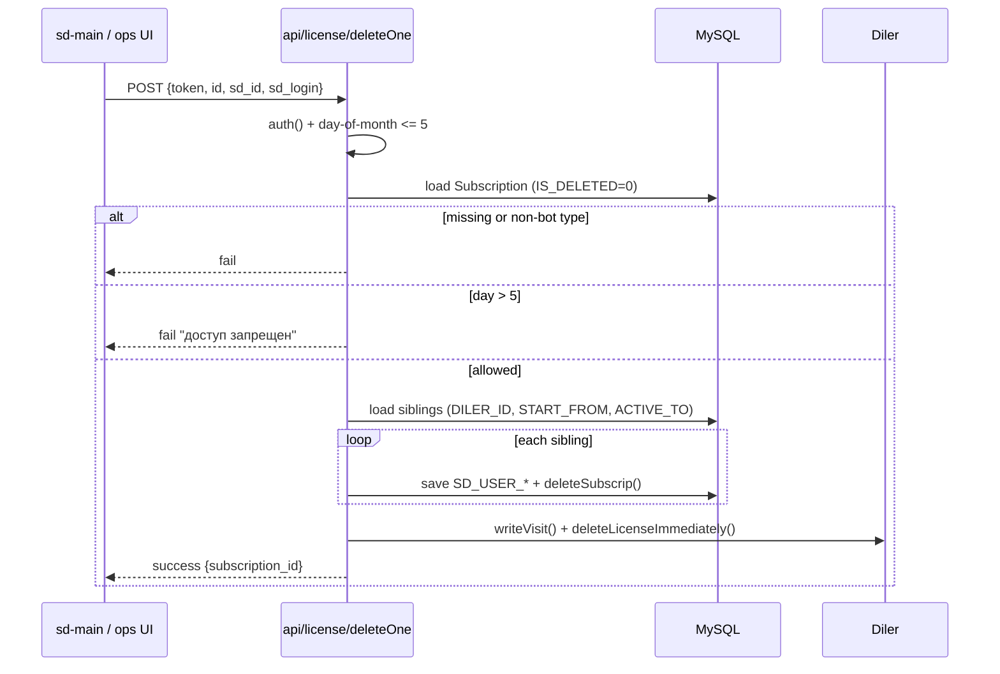
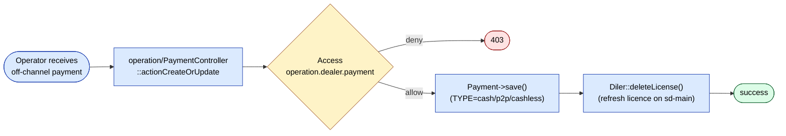
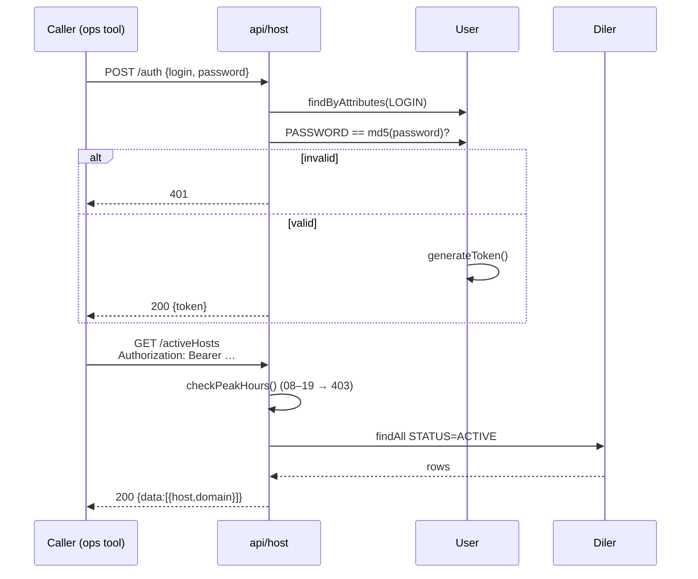
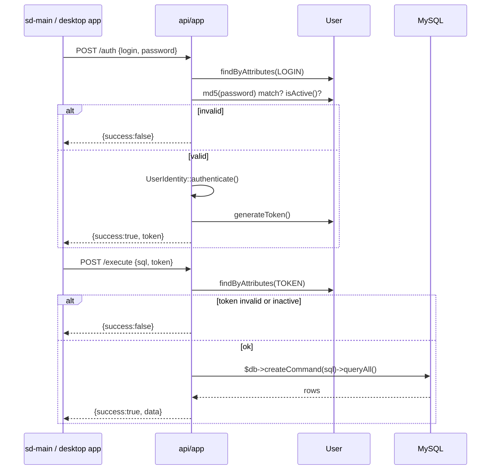

# API reference (inbound)

Every endpoint under `sd-billing/protected/modules/api/`. This is the
**inbound** surface — what other systems (dealers' `sd-main`, payment
gateways, 1C, partner tools) call against sd-billing.

> Outbound calls (sd-billing → dealer's `sd-main`, sd-billing → sd-cs)
> are documented in [Cross-project integration](../architecture/cross-project-integration.md).

## Auth schemes at a glance

The api module uses **five different auth schemes**, one per
controller (or sometimes per action). When you add an endpoint, match
the existing scheme of the controller you're in — don't mix.

| Scheme | Where | What it means |
|--------|-------|---------------|
| **Shared static `TOKEN`** | `LicenseController` | `$_POST['token']` must equal `LicenseController::TOKEN` constant |
| **Pseudo-user `sd/sd`** | `SmsController::init` | Logs in `User(LOGIN='sd')` automatically; everything past that is "authenticated" |
| **Body-embedded login** | `Api1CController::checkAuth` | JSON body has `auth: {login, password}`; `password` is MD5 |
| **Bearer token** | `HostController`, parts of `AppController` | `Authorization: Bearer <User.TOKEN>` after first `actionAuth` exchange |
| **Gateway signature** | `ClickController`, `PaymeController`, `PaynetController` | Per-gateway HMAC / sign verification |
| **HTTP Basic** | `QuestController` | `Authorization: Basic …` |

> ⚠️ The shared `LicenseController::TOKEN` is **hard-coded in source**.
> See [security landmines](./security-landmines.md). Same warning for
> any `new UserIdentity("sd","sd")` use.

## Module config

`api` is registered in `protected/config/main.php` like the other
modules. Routes resolve as
`/api/<controller>/<action>` (e.g. `/api/license/buyPackages`,
`/api/click`, `/api/payme`).

---

## 1. `LicenseController` — `/api/license/*`

Auth: hard-coded `const TOKEN = "...";` checked as `$_POST['token']`. The
shared user logged in for these calls is typically `UserIdentity("sd","sd")`.

The most-used controller in the whole api module. Called by every
dealer's `sd-main` whenever the dealer interacts with packages or
balance.

| Action | Method | Body | Returns | Notes |
|--------|--------|------|---------|-------|
| `actionIndex` | `POST /api/license` | `{token, dealer}` | `{balance, minAmount, currency, credit_limit, credit_date, …}` | Legacy — file-comment `// old, we should delete it` |
| `actionIndexBatch` | `POST /api/license/indexBatch` | `{token, dealers[]}` | as above, batched | |
| `actionPackages` | `POST /api/license/packages` | `{token, dealer}` | `[{package_id, name, type, price, currency, …}]` | Filtered by `Diler.COUNTRY_ID`, `CURRENCY_ID`, demo flag |
| `actionBotPackages` | `POST /api/license/botPackages` | same | bot-only packages (`bot_order`, `bot_report`) | |
| `actionHalfPackages` | `POST /api/license/halfPackages` | same | half-month/partial packages | |
| `actionBuyPackages` | `POST /api/license/buyPackages` | `{token, dealer, packages[], date?}` | `{success, balance, subscriptions[]}` | **Money-moving call.** Inserts `Subscription` rows + a negative `Payment(TYPE=license)`. See [Subscription flow](./subscription-flow.md). |
| `actionChangePackage` | `POST /api/license/changePackage` | `{token, dealer, sub_id, new_package_id}` | `{success, …}` | Prorates the days |
| `actionRevise` | `POST /api/license/revise` | `{token, dealer, from, to}` | reconciliation snapshot | |
| `actionDistrRevise` | `POST /api/license/distrRevise` | `{token, distr, from, to}` | distributor-level reconciliation | |
| `actionPayments` | `POST /api/license/payments` | `{token, dealer}` | recent `Payment` rows | |
| `actionCheckMin` | `POST /api/license/checkMin` | `{token, dealer}` | `{ok\|fail, min_summa}` | Validates `BALANS ≥ MIN_SUMMA` |
| `actionBonusPackages` | `POST /api/license/bonusPackages` | `{token, dealer}` | bonus catalog rows | |
| `actionExchangeable` | `POST /api/license/exchangeable` | `{token, dealer}` | subscriptions eligible to exchange | |
| `actionExchange` | `POST /api/license/exchange` | `{token, dealer, src_sub_id, dst_package_id}` | new `Subscription` rows | Swaps unused days from one package to another |
| `actionDeleteOne` | `POST /api/license/deleteOne` | `{token, dealer, sub_id}` | `{success}` | Soft-deletes a single subscription |

### `init` behaviour

```php
public function init() {
    $this->date = date("Y-m-d");
    if (DateHelper::validateDate($_POST["date"], "Y-m-d")) {
        $this->date = $_POST["date"];
    }
}
```

Pass `date` in the body when the dealer's clock is in a different
timezone (Kazakhstan vs Uzbekistan, etc.).

### Token check

Every action calls `auth()` which evaluates `self::TOKEN != $_POST['token']`
and short-circuits on miss. There's no per-token rotation today.

---

## 2. `ClickController` — `/api/click`

Auth: Click-side **HMAC sign** verified via `ClickTransaction::checkSign`.

Click hits a single endpoint with an `action` field that drives prepare/confirm.

| `action` | Phase | Effect |
|----------|-------|--------|
| `0` (prepare) | reserve | Insert `ClickTransaction` (state = prepared) |
| `1` (confirm) | settle | Set state = confirmed, insert `Payment(TYPE_CLICKONLINE)`, `Diler::deleteLicense()`, `Diler::refresh()` |

Idempotency: a duplicate `prepare` or `confirm` returns the same
response without inserting another `Payment` (the `ClickTransaction`
state machine guards against it).

Error codes (via `ClickController::send`):

| Code | Meaning |
|------|---------|
| `0` | success |
| `-1` | signature verification error |
| `-2` | incorrect `amount` |
| `-3` | action not found |
| `-4` | already paid |
| `-5` | dealer not found |
| `-6` | transaction not found |
| `-7` | transaction expired |
| `-8` | DB transaction failed |
| `-9` | something else |

See [Payment gateways · Click flow](./payment-gateways.md#click-flow-canonical) for the sequence diagram.

---

## 3. `PaymeController` — `/api/payme`

Auth: Payme **HMAC** via `Authorization` header verified inside
`api/helpers/PaymeHelper`.

Single JSON-RPC endpoint dispatching by `method`:

| Payme method | Effect |
|--------------|--------|
| `CheckPerformTransaction` | Validate dealer + amount, no DB write |
| `CreateTransaction` | Insert `PaymeTransaction(state=created)` |
| `PerformTransaction` | Set state = performed, insert `Payment(TYPE_PAYMEONLINE)`, settle |
| `CancelTransaction` | Reverse |
| `CheckTransaction` | Read state |
| `GetStatement` | Range query for reconciliation |

Errors follow the Payme JSON-RPC error contract.

The controller body is short (`PaymeController.php:16`) — almost all
logic lives in `PaymeHelper` and the `PaymeTransaction` model.

---

## 4. `PaynetController` — `/api/paynet`

Auth: SOAP / WS-Security via the `paynetuz` extension
(`protected/extensions/paynetuz/`). Credentials template lives in
`_constants.php`.

This is a SOAP endpoint, not REST. Paynet's gateway hits the soap
endpoint with `Pay`, `Status`, `Cancel` calls; the controller dumps
each into a `PaynetTransaction` and (on success) a
`Payment(TYPE_PAYNETONLINE)` row.

---

## 5. `Api1CController` — `/api/api1C/*` (1C integration)

Auth: **body-embedded login** — JSON body must contain
`auth: {login, password}`. Password matches `User.PASSWORD = MD5($pwd)`.

Inbound 1C integration — large controller (985 lines), touches
cashless payment imports and subscription queries.

| Action | Method | Purpose |
|--------|--------|---------|
| `actionIndex` | `POST /api/api1C` | Health/auth check |
| `actionAddCashless` | `POST /api/api1C/addCashless` | Bulk import of cashless payments from 1C; inserts `Payment(TYPE_CASHLESS)` keyed by `(inn, payment_1c)` for idempotency |
| `actionGetSubscriptionsOld` | `POST /api/api1C/getSubscriptionsOld` | Legacy subscription export — kept for older 1C deployments |
| `actionGetSubscriptions` | `POST /api/api1C/getSubscriptions` | Current subscription export |

Request shape for `addCashless`:

```json
{
  "auth": {"login": "...", "password": "..."},
  "content": [
    {
      "inn": "123456789",
      "payment_1c": "PAY-2026-00001",
      "amount": 100000,
      "currency": "UZS",
      "date": "2026-05-08",
      "comment": "..."
    }
  ]
}
```

Response includes a per-row `errors[]` array so partial successes are
visible to the 1C side.

---

## 6. `SmsController` — `/api/sms/*`

Auth: `init()` auto-logs-in as `User(LOGIN='sd', PASSWORD='sd')`.

| Action | Method | Purpose |
|--------|--------|---------|
| `actionPackages` | `POST /api/sms/packages` | List buyable SMS packages for a currency |
| `actionBuySmsPackage` | `POST /api/sms/buySmsPackage` | Charge `BALANS`, attach SMS pack to dealer |
| `actionBoughtSmsPackages` | `POST /api/sms/boughtSmsPackages` | Dealer's purchase history |
| `actionCreateTemplate` | `POST /api/sms/createTemplate` | Register a template with Eskiz |
| `actionCheckingTemplates` | `POST /api/sms/checkingTemplates` | Sync local ↔ Eskiz templates |
| `actionOne` | `POST /api/sms/one` | Send one SMS |
| `actionSend` | `POST /api/sms/send` | Bulk send via `Sms::multy` |
| `actionSendingForward` | `POST /api/sms/sendingForward` | Forward queued sends |
| `actionCallback` | `POST /api/sms/callback?host=…` | Eskiz delivery-receipt webhook |

SMS provider details (Eskiz UZ, Mobizon KZ): see
[Notifications · SMS](./notifications.md#7-sms--eskiz-uz-and-mobizon-kz).

---

## 7. `HostController` — `/api/host/*`

Auth: **Bearer token** (`User.TOKEN`) from a prior `actionAuth` exchange.

Used by internal monitoring tools / dashboards that need a list of
"who's deployed where".

| Action | Method | Purpose |
|--------|--------|---------|
| `actionAuth` | `POST /api/host/auth` | `{login, password}` (MD5) → `{token}` (refreshes `User.TOKEN`) |
| `actionActiveHosts` | `GET /api/host/activeHosts` | All `Diler` rows with `STATUS = ACTIVE` |
| `actionActivities` | `GET /api/host/activities?date_from=&date_to=` | Multi-curl fan-out across active hosts to pull their activity. |
| `actionActivityByHost` | `GET /api/host/activityByHost?host=` | Single-host detail |

Note `actionActivities` opens dozens of outbound curls in parallel via
`curl_multi_init` — be mindful when adding hosts; the sd-billing
container needs the network egress to reach every dealer.

---

## 8. `InfoController` — `/api/info/*`

Auth: mixed. Most actions are **public-ish** (no token) and rely on
network-level access controls.

| Action | Method | Purpose |
|--------|--------|---------|
| `actionIndex` | `POST /api/info` | Look up a dealer by `dealer_id` or `host`; returns `{id, host, domain, is_demo, status, db_name, db_status, max_id, min_id}` |
| `actionSdToken` | `POST /api/info/sdToken` | Issue / refresh the shared "sd" token used by some downstream tools |
| `actionChangePassword` | `POST /api/info/changePassword` | Change a `User`'s password — rare admin path |

Treat `actionIndex` as **dealer-discovery** — anyone who can reach the
endpoint can enumerate dealer hosts. Tighten before exposing widely.

---

## 9. `QuestController` — `/api/quest/*`

Auth: **HTTP Basic** (`Authorization: Basic …`) on `actionIndex`,
**`token` query param** on `actionDetail`.

| Action | Method | Purpose |
|--------|--------|---------|
| `actionIndex` | `GET /api/quest` | KPI snapshot — price, idokon, ibox, np, churn, upSall, netSale, golden |
| `actionDetail` | `GET /api/quest/detail?token=…` | Per-user detail; `User.TOKEN` query param |

This is mostly an internal partner-portal-adjacent surface — rarely
touched in normal billing flows.

---

## 10. `AppController` — `/api/app/*`

Auth: `actionAuth` does login and returns a `token`; subsequent
actions look up `User.TOKEN`.

| Action | Method | Purpose |
|--------|--------|---------|
| `actionAuth` | `POST /api/app/auth` | Login, returns `{success, token}` |
| `actionGetPrinters` | `POST /api/app/getPrinters` | Printer registry for the desktop app |
| `actionExecute` | `POST /api/app/execute` | Generic dispatcher — used by the desktop app to run pre-canned ops |

Used by the operator desktop app, not by dealers.

---

## 11. Shared response helpers

All controllers ultimately render through one of:

| Helper | Where defined | Shape |
|--------|---------------|-------|
| `sendSuccessResponse($data)` | `application.modules.api.components.*` | `{success: true, data: <data>}` |
| `sendFailResponse($errors[, $extra])` | same | `{success: false, errors: [...], data?: <extra>}` |
| `_sendSuccessResponse($code, $data, $errors)` (`Api1CController`) | inline | 1C-specific — different shape |
| `response($payload, $statusCode = 200)` (`HostController`) | inline | sets HTTP status, JSON-encodes |
| `json($data)` | controller-base | JSON, dies after print |
| `send($data, $errorCode, $click=false, …)` (`ClickController`) | inline | Click-specific — see code |

The shapes are **not consistent** across controllers — match the one
already used by the controller you're touching, don't mix.

---

## 12. Logging

`Logger::writeLog2($data, $is_req, $path)` writes per-day per-action
JSON files under `log/<controller>/<YYYY-MM-DD>/`. Used heavily by
gateway and 1C controllers.

> ⚠️ Sanitise inputs before logging. Never log card details, full
> Payme/Click payloads, or dealer passwords. The current
> implementation logs raw `$body` in several places — fix
> case-by-case as you touch them.

---

## 13. Error / status code conventions

The API surface predates a unified convention. Today:

| Origin | What you'll see |
|--------|-----------------|
| `LicenseController` | HTTP 200 with `{success: false, errors: [...]}` body for almost all errors; 4xx is rare |
| `Api1CController` | `_sendFailResponse(401, [...])` for auth, `_sendSuccessResponse(200, ...)` otherwise |
| `HostController` | proper HTTP status codes (`401`, `200`, `400`) |
| `Click`, `Payme`, `Paynet` | Gateway-specific error envelopes |

When adding new actions, prefer the `HostController` style (real HTTP
status codes) — it's the right pattern going forward. Don't refactor
the others without explicit approval; downstream callers depend on
the old shapes.

---

## 14. Hardening checklist

- [ ] Replace `LicenseController::TOKEN` with per-caller signed JWTs.
- [ ] Replace `new UserIdentity("sd","sd")` with explicit service
      accounts that have minimal `Access` rows.
- [ ] Add rate limits (login, gateway-callback) at the WAF layer.
- [ ] Standardise on `HostController`'s response shape — and migrate
      callers over a release window.
- [ ] Sanitise `Logger::writeLog2` inputs across `Api1CController`.
- [ ] Add per-endpoint structured request/response audit (replace
      ad-hoc per-day JSON files).

## 15. Workflow diagrams

### License delete (revoke a subscription)

`LicenseController::actionDeleteOne` (line 1090 of
`protected/modules/api/controllers/LicenseController.php`) only accepts
`bot_report` / `bot_order` subscriptions and refuses any call past the
5th of the month. On success it marks every same-period sibling row
deleted and immediately invalidates the dealer's cached licence via
`deleteLicenseImmediately`.



### License pay (manual fallback)

There is **no** `LicenseController::actionPay` today; the manual
payment path uses `operation/PaymentController::actionCreateOrUpdate`
(see [Cron & settlement → Operation: manual payment entry](./cron-and-settlement.md#operation-manual-payment-entry)).
The flow below illustrates the operator-side fallback that takes the
role of a "license pay" endpoint when the dealer cannot reach a
gateway.



### License batch buy (read-side variant)

`LicenseController::actionIndexBatch` (line 68 of the same file) is the
batched read companion to `buyPackages` — UI loads a 13-month
subscription window in one shot via `getSubscriptionsBatch($dilerId)`,
which fetches all `Subscription` rows + their `Payment`s in two
queries and folds them per month in PHP. Failures inside the loop
isolate per-row so a single bad month doesn't break the whole batch.

```mermaid
flowchart LR
  S(["sd-main loads<br/>billing screen"]) --> A["actionIndexBatch"]
  A --> AU{"auth() token"}
  AU -- "fail" --> R1(["fail"])
  AU -- "ok" --> D["getDilerWithRelations(host)"]
  D --> BAT["getSubscriptionsBatch(dilerId)<br/>13-month window"]
  BAT --> SQ["one SELECT Subscription<br/>+ one SELECT Payment"]
  SQ --> FOLD["group rows by month"]
  FOLD --> OUT["return balance, types,<br/>bonusLimit, subscriptions"]
  OUT --> OK(["success"])

  class S,A,D,BAT,SQ,FOLD,OUT action
  class AU approval
  class R1 reject
  class OK success
  classDef action   fill:#dbeafe,stroke:#1e40af,color:#000
  classDef approval fill:#fef3c7,stroke:#92400e,color:#000
  classDef success  fill:#dcfce7,stroke:#166534,color:#000
  classDef reject   fill:#fee2e2,stroke:#991b1b,color:#000
  classDef external fill:#f3f4f6,stroke:#374151,color:#000
  classDef cron     fill:#ede9fe,stroke:#6d28d9,color:#000
```



### Host status report

`HostController::actionAuth` and `actionActiveHosts`
(`protected/modules/api/controllers/HostController.php`) implement a
two-step session: login swaps `login`/`password` (MD5) for a bearer
`User.TOKEN`, then subsequent calls read it from
`Authorization: Bearer …`. `beforeAction` blocks all non-auth actions
during peak hours (08:00–19:00) with a 403.



### App auth (sd-main → sd-billing)

`AppController::actionAuth` / `actionExecute`
(`protected/modules/api/controllers/AppController.php`) is the fixed
"desktop / sd-main app" session. `actionAuth` verifies
`User.PASSWORD == md5($password)` and `User::isActive()`, then
`UserIdentity::authenticate()` followed by `User::generateToken()`
returns a token. `actionExecute` accepts arbitrary SQL keyed by the
returned token — `User` must still be `isActive()`.



## See also

- [Payment gateways](./payment-gateways.md) — Click/Payme/Paynet flows in detail.
- [Subscription & licensing](./subscription-flow.md) — what `actionBuyPackages` actually does.
- [Notifications](./notifications.md) — `SmsController` details + Eskiz/Mobizon.
- [Cross-project integration](../architecture/cross-project-integration.md) — outbound side of the wire.
- [Security landmines](./security-landmines.md) — hard-coded tokens, MD5 passwords, partner check off.
