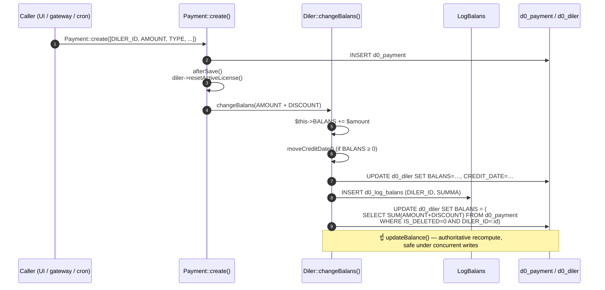
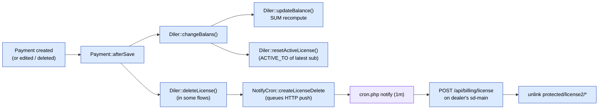

# Balance & money math

> **Heads-up — common doc/code mismatch.** Older docs say "DB triggers maintain `Diler.BALANS`". They do not. The trigger migration `m221114_070346_create_triggers_to_payment.php` is **deliberately commented out** (`// $this->execute($sql); // xato ishlayapti, shunga komment qilindi` — "it works incorrectly, so commented out"). Balance is maintained in PHP. This page is the truth.

## TL;DR

| Stage | Where | What it does |
|-------|-------|--------------|
| 1 | `Payment::create([...])` | Insert a row in `d0_payment` (any caller — UI, gateway, cron) |
| 2 | `Payment::afterSave()` | If `disabledAfterSave` is **off** and `diler` is set: call `diler->resetActiveLicense()`, then `diler->changeBalans($amount)` |
| 3 | `Diler::changeBalans($amount)` | `$this->BALANS += $amount`, save, log to `LogBalans`, then call `updateBalance()` |
| 4 | `Diler::updateBalance()` | Authoritative SQL recomputation: `UPDATE diler SET BALANS = SUM(payment.AMOUNT + payment.DISCOUNT) WHERE diler_id = X AND IS_DELETED = 0` |

The PHP increment in step 3 is a **fast path**; step 4 is a **safety net** that recomputes the whole balance from the `Payment` table so concurrent writes can't drift.

## Sequence



## The four code paths through `afterSave`

`Payment::afterSave` branches based on the row state:

```php
if ($this->isNewRecord) {
    $amount = $this->AMOUNT + $this->DISCOUNT;
    $this->diler->changeBalans($amount);
}
else if ($this->IS_DELETED == self::ACTIVE_DELETED) {
    $amount = $this->AMOUNT + $this->DISCOUNT;
    $this->diler->changeBalans($amount * -1);   // reverse the contribution
    $this->uncomputeDebt();
}
else {
    $amount = $this->AMOUNT - $this->OLD_AMOUNT;  // edited
    if ((float) $amount != 0) {
        $this->diler->changeBalans($amount);
        $this->uncomputeDebt();
    }
}
```

| Trigger | Branch | Effect |
|---------|--------|--------|
| `Payment::create([...])` | new record | `BALANS += AMOUNT + DISCOUNT` |
| Soft-delete (`IS_DELETED = 1`) | deleted branch | `BALANS -= AMOUNT + DISCOUNT`, also unwinds matching `DistrPayment` |
| Edit `AMOUNT` | edited branch | `BALANS += new − old`, plus matching `DistrPayment.AMOUNT` update |
| `disabledAfterSave(true)` | bypass | none — used by bulk loaders that recompute later |

## Direction (sign) of `AMOUNT` per `Payment.TYPE`

`AMOUNT` is signed. The convention:

| `Payment.TYPE` | Direction | Sign of AMOUNT | Source |
|----------------|-----------|----------------|--------|
| `cash`, `cashless`, `p2p` | inbound (offline) | **+** | cashier / dashboard |
| `payme`, `click`, `paynet`, `mbank` | inbound (online) | **+** | gateway controllers |
| `license` | outbound (consumed) | **−** | `LicenseController::actionBuyPackages` |
| `service` | inbound (manual fee) | **+** | manual entry |
| `distribute` | settlement | varies (paired) | `cron settlement` |

The `distribute` rows come in **pairs** that net to zero across distributor + dealer, so the running totals stay consistent system-wide.

## After balance changes — license refresh

After money lands, the dealer's licence on `sd-main` is invalidated so the
next page load picks up the new state:



`deleteLicense()` itself does **not** hit `sd-main` synchronously — it
enqueues a `NotifyCron` row of type `license_delete` (the URL is
`Diler.DOMAIN + /api/billing/license`). The minute-cron drains the
queue (Notifications page pending — see [Cron & settlement](./cron-and-settlement.md) for the cron-side detail).

## Authoritative recompute SQL

This is what `Diler::updateBalance()` runs (`Diler.php:478`):

```sql
UPDATE d0_diler
   SET BALANS = (
       SELECT IF(SUM(pay.AMOUNT + pay.DISCOUNT) IS NULL, 0,
                 SUM(pay.AMOUNT + pay.DISCOUNT))
         FROM d0_payment pay
        WHERE pay.IS_DELETED = 0
          AND pay.DILER_ID   = :dilerId
   )
 WHERE ID = :dilerId;
```

If you ever suspect a dealer's `BALANS` has drifted, re-running
`Diler::updateBalance()` (or this SQL directly) is **always safe** —
it's a pure recompute from `d0_payment`.

## Distributor balance

`Distributor::BALANS` is **derived**, not maintained incrementally:

```php
// Distributor.php:169
$this->BALANS = $this->getTranBalans(null);
```

`getTranBalans` walks `DistrPayment` rows. There's no write path that
mutates `Distributor.BALANS` directly outside this recompute.

## Audit trail — `LogBalans` and `LogDistrBalans`

| Table | Granularity | When written |
|-------|-------------|--------------|
| `d0_log_balans` | One row per `Diler.changeBalans` call | every PHP change to a dealer balance |
| `d0_log_distr_balans` | One row per distributor settlement step | written by `SettlementCommand` |

Both are append-only. Use them for "what did this dealer's balance
look like on date X" queries — `Diler.BALANS` is the running total, but
`LogBalans` is the journal.

## Credit window — `CREDIT_LIMIT` / `CREDIT_DATE`

A dealer may be allowed to run a negative balance up to
`Diler.CREDIT_LIMIT` until `Diler.CREDIT_DATE`:

```php
// Diler.php:277
public function balansWithCredit() {
    if ($this->isDateActive()) return $this->BALANS;       // grace window
    if (negative)               return $this->BALANS + $this->CREDIT_LIMIT;
    return $this->BALANS;
}

public function isInDebt() { return $this->BALANS < 0; }   // 343
```

`Diler::moveCreditDate()` rolls `CREDIT_DATE` forward to "the 3rd of
next month" whenever `BALANS ≥ 0`.

## Concurrency

The PHP fast path (`$this->BALANS += $amount; save()`) is **not**
atomic across processes — two simultaneous payments can race. The
recompute-from-`SUM` step at the end of `changeBalans()` (and the
matching `updateBalance()` call) is what saves correctness. As long as
both writers' inserts to `d0_payment` commit, the final `UPDATE … SET
BALANS = SUM(...)` converges.

> Don't replace `updateBalance()` with the increment alone — you'll
> reintroduce drift, the very reason the trigger migration was disabled.

## What about the disabled trigger migration?

`m221114_070346_create_triggers_to_payment.php` defines:

- `UpdateBalanceOfDealer(IN dealerId)` — stored procedure that runs
  `UPDATE d0_diler SET BALANS = SUM(...) WHERE id = dealerId`.
- `AfterInsertToPayment` / `AfterUpdateToPayment` — triggers that call
  the procedure.

But the body of `up()` ends with `// $this->execute($sql); // xato
ishlayapti, shunga komment qilindi`. The `down()` is similarly
disabled. So **the migration is a no-op** — it leaves no triggers in
the database.

If you ever re-enable it: be aware that the trigger and PHP path
together would execute the SUM-recompute **twice** per insert. That's
wasted work but not incorrect. The original concern was the trigger
running inside Yii's transaction context and producing inconsistent
intermediate states; whoever re-enables it needs to confirm the
transaction-isolation interaction.

## See also

- [Domain model](./domain-model.md) — `Diler`, `Payment`, `Subscription` shape.
- [Subscription & licensing](./subscription-flow.md) — where `TYPE_LICENSE` payments come from.
- [Cron & settlement](./cron-and-settlement.md) — where `TYPE_DISTRIBUTE` pairs come from.
- [Payment gateways](./payment-gateways.md) — where inbound online payments enter.
- [Cron & settlement](./cron-and-settlement.md) — how the licence-delete queue propagates to dealer hosts (Notifications page pending).
