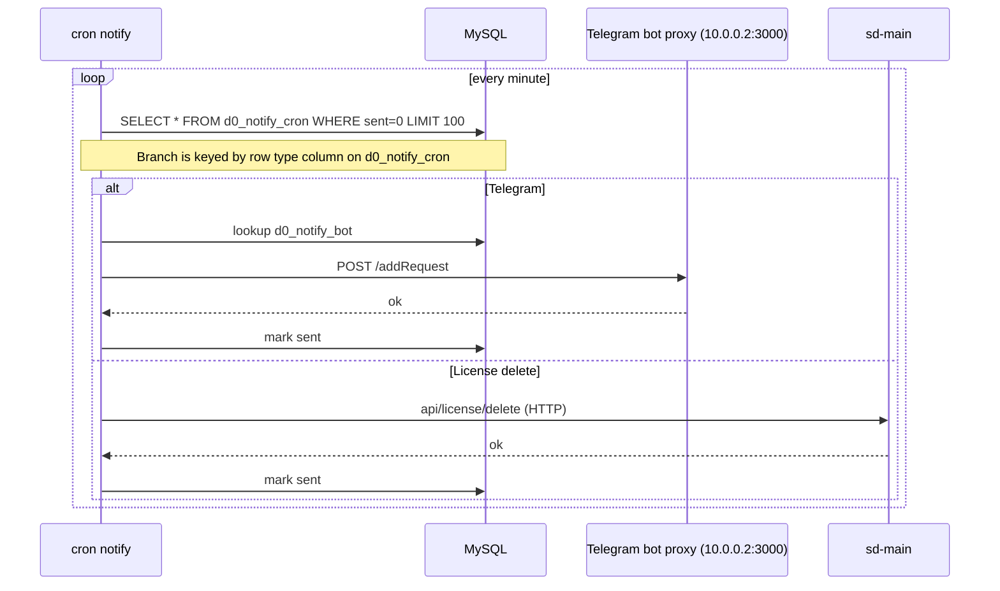
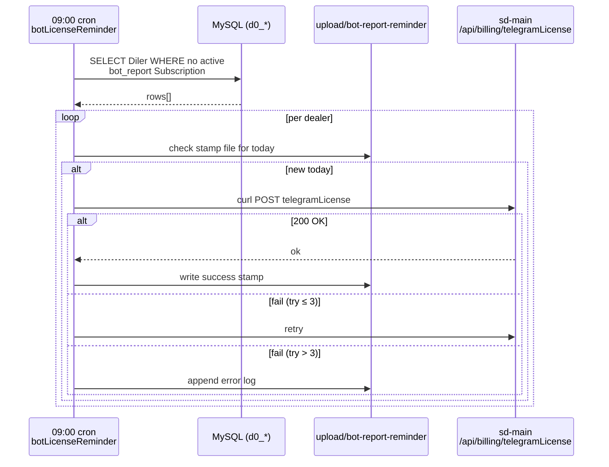
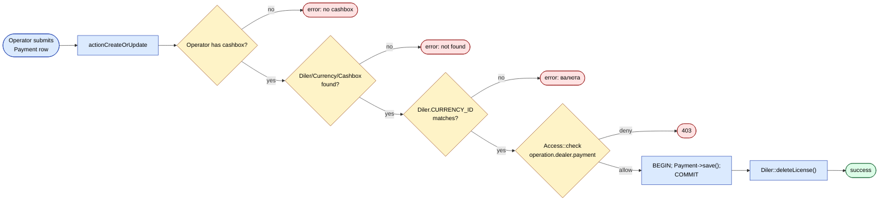
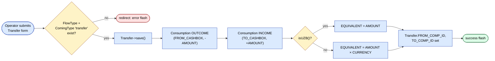

# Cron & settlement

`cron.php` is the console entry point. Schedules live in
`protected/commands/cronjob.txt` and on the host crontab.

## Schedule

| Command | When | Purpose |
|---------|------|---------|
| `notify` | every minute | Drain `d0_notify_cron` queue → Telegram + license-delete actions. Bot id resolved per row from `d0_notify_bot`. |
| `visit` / `visitOptimized` | daily 02:00 | Snapshot dealer visit data |
| `stat` | daily 03:00 | Daily statistics aggregation |
| `settlement` | daily 01:00 | Distributor ↔ dealer monthly debt computation |
| `botLicenseReminder` | daily 09:00 | Notify dealers near licence expiry |
| `pradata` (HTTP) | 05:30 / 05:40 / 05:50 | External `salesdoc.io` instances pull pre-computed data via curl |
| `cleanner` | Sat 22:00 | Weekly cleanup (subscriptions, etc.) |
| `reportBot send` / `countrysale` | hourly | Internal report bots |
| `notifyCleanup --days=7` | daily 08:00 | Trim sent notify rows |
| `log cleanup --days=7` | Sun 02:45 | Trim `log/` |

All commands extend `BaseCommand`
(`protected/components/BaseCommand.php`).

## Settlement

`SettlementCommand` (daily 01:00) computes monthly debts/credits
between distributors and dealers.

```mermaid
flowchart LR
  S(["01:00 cron"]) --> READ["Pull last-month payments grouped by Distributor + Diler"]
  READ --> CALC["Compute share % per agreement"]
  CALC --> DEB["Insert Payment TYPE=distribute (debit Distributor)"]
  DEB --> CRE["Insert Payment TYPE=distribute (credit Diler)"]
  CRE --> LOG["LogDistrBalans rolling balance row"]
  LOG --> NOTIF[("Telegram summary to ops")]

  class S cron
  class READ,CALC,DEB,CRE,LOG action
  class NOTIF external
  classDef action   fill:#dbeafe,stroke:#1e40af,color:#000
  classDef approval fill:#fef3c7,stroke:#92400e,color:#000
  classDef success  fill:#dcfce7,stroke:#166534,color:#000
  classDef reject   fill:#fee2e2,stroke:#991b1b,color:#000
  classDef external fill:#f3f4f6,stroke:#374151,color:#000
  classDef cron     fill:#ede9fe,stroke:#6d28d9,color:#000
```



The pair of `Payment` rows nets out across distributors so the running
`BALANS` is consistent — the DB triggers handle the math.

## Notifications cron



**Cron tenants gotcha:** sd-billing is single-tenant (one DB), so cron
commands don't need to fan out across tenants like `sd-main` would.

## botLicenseReminder cron (sequence)

`BotLicenseReminderCommand` (`protected/commands/BotLicenseReminderCommand.php`)
fires daily at 09:00. The SQL inside `run()` joins `Diler`, `City`,
`Subscription`, and `Package` to find active dealers whose
`bot_report` subscription has lapsed (`NOT EXISTS … sub.ACTIVE_TO`
covers today), then iterates the result and posts to each dealer's
`telegramLicense` endpoint via `sendRequest()` with retry-up-to-3.



## Operation: manual payment entry

`operation/PaymentController::actionCreateOrUpdate`
(`protected/modules/operation/controllers/PaymentController.php`) is
the operator-side fallback when an inbound payment arrives off-gateway
(P2P, cash, cashless). It checks `Access` on
`operation.dealer.payment`, validates that the dealer's
`CURRENCY_ID` matches the posted currency, opens a DB transaction,
saves the `Payment` row, then commits and calls
`$dealer->deleteLicense()` so the dealer's `sd-main` notices the new
balance.



## Cashbox transfer

`cashbox/TransferController::actionAdd` /
`actionCreateAjax`
(`protected/modules/cashbox/controllers/TransferController.php`) moves
money between two cash desks. The action saves a `Transfer` model
then creates a paired `Consumption` outcome (negative `AMOUNT` on
`FROM_CASHBOX_ID`, `flowType=transfer`) and `Consumption` income
(positive on `TO_CASHBOX_ID`, `comingType=transfer`), backfilling
`Transfer.FROM_COMP_ID` / `TO_COMP_ID`. Cross-currency rows multiply
`EQUIVALENT` by `model->CURRENCY`.



## Idempotency

- Notify rows have a `sent` flag — once-only delivery.
- Settlement is keyed by `(distributor, diler, month)` so re-running
  the command (within the same month) produces no duplicates.
- `pradata` jobs are pull-only — safe to re-run.

## Backfilling

Use `dbservice` module utilities to backfill missing days. Example:

```bash
docker compose exec web php cron.php settlement --year=2026 --month=4
```

(Adjust the action signature based on the actual `SettlementCommand`
options — confirm before running in production.)

## Error handling

`FileLogRoute` (web) / `CFileLogRoute` (console) catches error-level
logs. A failed cron run leaves the affected rows in their previous
state, so the next minute's tick retries cleanly.
