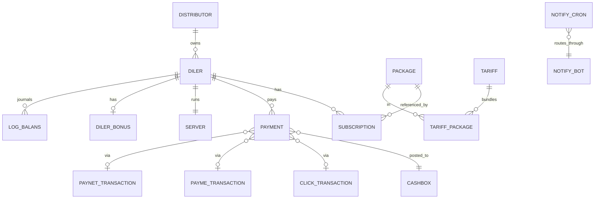

# Data scheme reference

Authoritative table-by-table listing for sd-billing's `d0_*` schema.
Every section here is grounded in the `@property` doc-comments on the
matching `protected/models/*.php` (or
`protected/modules/<m>/models/*.php`) file.

> Looking for the **shape** view (Mermaid ERD)? See
> [Domain model](./domain-model.md).
>
> Looking for the **behaviour** view (afterSave hooks, balance math,
> license refresh)? See
> [Balance & money math](./balance-and-money-math.md).
>
> Looking for the **migration** workflow? See
> [Local setup → Migrations](./local-setup.md#migrations).

## Conventions

- Tables use the `d0_` prefix; in models always reference as
  `{{name}}` so Yii applies it.
- Column casing is **mixed by era**:
  - `UPPER_SNAKE_CASE` on legacy tables: `d0_diler`, `d0_payment`,
    `d0_subscription`, `d0_package`, `d0_user`,
    `d0_distributor`, `d0_currency`, `d0_log_balans`, `d0_cashbox`,
    `d0_consumption`, `d0_transfer`, `d0_click_transaction`,
    `d0_payme_transaction`.
  - `lower_snake_case` on newer tables: `d0_notify_cron`,
    `d0_notify_bot`, `d0_access_user`, `d0_access_operation`,
    `d0_access_relation`, `d0_server`, `d0_paynet_transaction`,
    `d0_dealer_blacklist`, `d0_notification_sent`, `d0_tariff`.
- Soft delete is implemented by an `IS_DELETED` (or `is_deleted`)
  flag, never hard delete. Always filter on it in joins and reports.
- Audit columns: `CREATED_BY`, `UPDATED_BY`, `CREATED_AT`,
  `UPDATED_AT` (or lower-case equivalents on newer tables) — written
  by `ActiveRecordLogableBehavior`.

---

## 1. `d0_diler` — dealer / customer record

Model: `Diler` (`protected/models/Diler.php`).
The most-touched table in the system. Anything that affects a dealer
either reads or writes here.

| Column | Type | Notes |
|--------|------|-------|
| `ID` | `int` PK | |
| `DISTR_ID` | `int` FK → `d0_distributor.ID` | nullable — dealer may have no distributor |
| `COUNTRYSALE_ID` | `int` FK → `d0_countrysale.ID` | which sd-cs the dealer rolls up to |
| `BALANS` | `int` | running balance — see [balance & money math](./balance-and-money-math.md) |
| `MIN_SUMMA` | `float` | minimum top-up to be eligible to buy packages |
| `MIN_LICENSE` | `int` | minimum licence-purchase cost (anti-abuse) |
| `NAME` | `string` | display name |
| `FIRM_NAME` | `string` | legal entity |
| `HOST` | `string` | sd-main subdomain (e.g. `acme`) |
| `DOMAIN` | `string` | full URL incl. scheme |
| `COUNTRY_ID` | `int` FK | |
| `CITY_ID` | `int` FK | |
| `CURRENCY_ID` | `int` FK → `d0_currency.ID` | money is denominated in this |
| `GROUP_ID` | `int` FK | dealer-group bucket |
| `TARIFF_ID` | `int` FK → `d0_tariff.id` | bundles `Package` rows |
| `DIRECTION_ID` | `int` FK | |
| `CUSTOMER_TYPE_ID` | `int` FK | |
| `ACTIVE_TO` | `date` | derived — max `Subscription.ACTIVE_TO` |
| `STATUS` | `int` | enum below |
| `USER_ID` | `int` FK → `d0_user.USER_ID` | dealer-side primary contact |
| `SALE_ID` | `int` FK → `d0_user.USER_ID` | sales rep |
| `INN` | `string` | tax id |
| `CONTACT` | `string` | phone / contact text |
| `HAS_DISTRIBUTOR` | `int` (0/1) | shortcut for `DISTR_ID IS NOT NULL` |
| `IS_DEMO` | `int` (0/1) | demo tenant flag |
| `FREE_TO` | `date` | free-trial end |
| `ACCESS_BONUS` | `int` (0/1) | eligible for bonus packages |
| `MONTHLY` | `int` | `15` = "all packages" mode |
| `MIGRATION_ID` | `int` | legacy migration tag |
| `CREDIT_LIMIT` | `int` | how negative `BALANS` may go |
| `CREDIT_DATE` | `date` | overdraft window end |
| `AGREEMENT` | `string` | contract reference |
| `COMMENT` | `string` | free text |
| `COMPETITOR_ID` | `int` FK | |
| `UPDATED_BY` / `CREATED_BY` / `UPDATED_AT` / `CREATED_AT` | audit | |

### `Diler::STATUS` enum

| Constant | Value | Meaning |
|----------|-------|---------|
| `STATUS_NO_ACTIVE` | `0` | onboarding / suspended |
| `STATUS_ACTIVE` | `10` | live |
| `STATUS_DELETED` | `20` | soft-deleted |
| `STATUS_ARCHIVE` | `30` | archived |

### Hook side-effects

| Hook | Effect |
|------|--------|
| `beforeSave` | forces `STATUS`, captures `OLD_HOST` so the after-hook can detect host changes |
| `afterSave` | if `HOST` changed → `updateServer()` + `sendRequest()` (provisions/notifies dealer's sd-main) |
| `changeBalans()` | append-only `LogBalans`, then `updateBalance()` SUM-recompute (see [balance math](./balance-and-money-math.md)) |
| `deleteLicense()` | enqueues `NotifyCron(license_delete, DOMAIN/api/billing/license)` — does **not** hit dealer synchronously |
| `resetActiveLicense()` | recomputes `Diler.ACTIVE_TO` from latest non-deleted `Subscription` |

---

## 2. `d0_distributor`

Model: `Distributor` (`protected/models/Distributor.php`).
Wholesale layer above dealers — region or contractual partner.

| Column | Type | Notes |
|--------|------|-------|
| `ID` | `int` PK | |
| `NAME` | `string` | |
| `DIRECTION` | `string` | direction code |
| `NOT_DISTRIBUTED` | `int` (0/1) | "this distributor doesn't take a share" flag |
| `CURRENCY_ID` | `int` FK | |
| `TYPE` | `int` | distributor type |
| `CITY_ID` | `int` FK | |
| `COUNTRY_ID` | `int` FK | |
| `COUNTRYSALE_ID` | `int` FK | |
| `RESPONSIBLE` | `int` FK → `d0_user.USER_ID` | account manager |
| `INN` | `string` | tax id |
| `AGREEMENT` | `string` | contract |
| audit cols | | |

### Computed / non-persisted fields

These are model-level virtual fields filled by `getTranBalans()`:

| Field | Source |
|-------|--------|
| `BALANS` | `SUM(DistrPayment.AMOUNT) WHERE distr=this` (recomputed each read) |
| `DEBT` | derived |
| `PREPAYMENT` | derived |

---

## 3. `d0_subscription`

Model: `Subscription` (`protected/models/Subscription.php`).
A purchased package window for a dealer.

| Column | Type | Notes |
|--------|------|-------|
| `ID` | `int` PK | |
| `DILER_ID` | `int` FK → `d0_diler.ID` | |
| `DISTRIBUTOR_ID` | `int` FK → `d0_distributor.ID` | snapshot of dealer's distr at buy time |
| `PACKAGE_ID` | `int` FK → `d0_package.ID` | |
| `SD_USER_ID` | `string` | dealer-side user reference (FK into the dealer's own sd-main `d0_user`) |
| `SD_USER_LOGIN` | `string` | mirror of dealer-side login |
| `COUNT` | `int` | seats purchased |
| `START_FROM` | `date` | window start |
| `ACTIVE_TO` | `date` | window end (`START_FROM + Package.TYPE` days) |
| `IS_DELETED` | `int` (0/1) | soft delete |
| `ADD_BONUS` | `int` (0/1) | bonus seat — counted but not billed |
| audit cols | | |

A `Diler` is "covered" if any non-deleted `Subscription` row's
`ACTIVE_TO ≥ today`.

---

## 4. `d0_package`

Model: `Package` (`protected/models/Package.php`).
The licence catalog.

| Column | Type | Notes |
|--------|------|-------|
| `ID` | `int` PK | |
| `CURRENCY_ID` | `int` FK | UZS / KZT / RUB / … |
| `SUBSCRIP_TYPE` | `string` | role gated by this package — see enum below |
| `NAME` | `string` | |
| `AMOUNT` | `double` | price in `CURRENCY_ID` |
| `PACKAGE_TYPE` | `int` | `paid` / `free` / `demo` (see model) |
| `CLIENT_TYPE` | `int` | `private` / `public` |
| `TYPE` | `int` | duration in days: `1`, `10`, `20`, `30`, `90`, `180`, `360` |
| audit cols | | |

### `SUBSCRIP_TYPE` values

Enumerates the role / surface a package licences. Read out of the
`Package` model:

| Value | Gates |
|-------|-------|
| `admin` | sd-main admin user |
| `agent` | field agent |
| `merchant` | merchandiser |
| `seller` | counter seller |
| `bot_report` | sd-main report bot |
| `bot_order` | sd-main order bot |
| `smpro_user` | SmPro user |
| `smpro_bot` | SmPro bot |

Cross-reference: a dealer's `MONTHLY = 15` short-circuits per-type
gating and grants all packages until `Diler.ACTIVE_TO`.

---

## 5. `d0_payment`

Model: `Payment` (`protected/models/Payment.php`).
One row per money movement.

| Column | Type | Notes |
|--------|------|-------|
| `ID` | `int` PK | |
| `CASHBOX_ID` | `int` FK → `d0_cashbox.ID` | which cash desk recorded it |
| `DILER_ID` | `int` FK → `d0_diler.ID` | which dealer this affects |
| `DISTRIBUTOR_ID` | `int` FK | "current distributor" snapshot |
| `DISTR_ID` | `int` FK | "the distributor this payment was distributed to" — set only on `TYPE_DISTRIBUTE` rows |
| `DISTR_PAYMENT_ID` | `int` FK → `d0_distr_payment.id` | matching pair row for distribute payments |
| `CURRENCY_ID` | `int` FK | |
| `AMOUNT` | `double` (signed) | sign drives `BALANS` direction (see below) |
| `DISCOUNT` | `double` | added to `AMOUNT` when computing `BALANS` |
| `COMP` | `double` | comp account / commission |
| `TYPE` | `int` | enum below |
| `DATE` | `date` | business date |
| `COMMENT` | `string` | |
| `IS_DELETED` | `int` (0/1) | `0 = DEFAULT_DELETED`, `1 = ACTIVE_DELETED` |
| `SUBSCRIPTION_ID` | `int` FK | set when `TYPE_LICENSE` ties to a specific sub |
| `PAYMENT_1C` | `string` | external 1C reference for cashless imports |
| audit cols | | |

### `Payment::TYPE` enum

| Constant | Value | Direction | Source |
|----------|-------|-----------|--------|
| `TYPE_CASH` | `1` | inbound | cashier UI |
| `TYPE_CASHLESS` | `2` | inbound | dashboard / 1C import |
| `TYPE_P2PCLICK` | `3` | inbound | dashboard P2P |
| `TYPE_LICENSE` | `10` | outbound (consumed) | `LicenseController::actionBuyPackages` |
| `TYPE_DISTRIBUTE` | `11` | settlement (paired) | `cron settlement` |
| `TYPE_PAYMEONLINE` | `12` | inbound (Payme gateway) | `api/payme` |
| `TYPE_CLICKONLINE` | `13` | inbound (Click gateway) | `api/click` |
| `TYPE_SERVICE` | `14` | manual fee | dashboard |
| `TYPE_PAYNETONLINE` | `15` | inbound (Paynet gateway) | `api/paynet` |
| `TYPE_MBANK` | `16` | inbound (MBANK KG) | gateway-specific |

`AMOUNT + DISCOUNT` is what `Diler::updateBalance()` sums to
recompute `BALANS`.

### Hook side-effects

`Payment::afterSave` calls `Diler::resetActiveLicense()` and
`Diler::changeBalans($amount)` (where `$amount` depends on
new/edited/deleted state). See
[balance & money math · the four code paths](./balance-and-money-math.md#the-four-code-paths-through-aftersave).

---

## 6. Gateway transaction tables

### `d0_click_transaction` — Click gateway

Model: `ClickTransaction`.

| Column | Type |
|--------|------|
| `ID` | `int` PK |
| `TRANS_ID` | `int` Click transaction id |
| `PAYDOC_ID` | `int` Click pay-doc id |
| `AMOUNT` | `int` |
| `STATUS` | `int` enum: `ACTION_PREPARE=0`, `ACTION_COMPLETE=1`, `ACTION_CANCELLED=2` |
| `DILER_ID` | `int` FK |
| `HOST` | `string` source host |
| `PAYMENT_ID` | `int` FK → `d0_payment.ID` (set on confirm) |
| `CREATE_AT` / `UPDATE_AT` | timestamps |

### `d0_payme_transaction` — Payme gateway

Model: `PaymeTransaction`.

| Column | Type |
|--------|------|
| `ID` | `int` PK |
| `DILER_ID` | `int` FK |
| `HOST` | `string` |
| `STATUS` | `int` enum: `STATE_CREATED=1`, `STATE_COMPLETED=2`, `STATE_CANCELLED=-1`, `STATE_CANCELLED_AFTER_COMPLETE=-2` |
| `AMOUNT` | `int` |
| `TRANS_ID` | `string` Payme transaction id |
| `TRANS_CREATE_TIME` / `TRANS_PERFORM_TIME` / `TRANS_CANCEL_TIME` | Payme timestamps |
| `PAYMENT_ID` | `int` FK |
| `REASON` | `int` Payme cancel reason code |

### `d0_paynet_transaction` — Paynet gateway

Model: `PaynetTransaction`.

| Column | Type |
|--------|------|
| `id` | `int` PK |
| `transaction_id` | `string` Paynet id |
| `amount` | `double` |
| `host` | `string` |
| `timestamp` | `string` |
| `status` | `int` |
| `payment_id` | `int` FK |
| `created_at` / `updated_at` | timestamps |

---

## 7. `d0_server` — dealer's sd-main provisioning

Model: `Server` (`protected/models/Server.php`).

| Column | Type | Notes |
|--------|------|-------|
| `ID` | `int` PK | |
| `diler_id` | `int` FK → `d0_diler.ID` | one-to-one |
| `domain` | `string` | full URL |
| `db_user` / `db_name` / `db_password` | dealer DB creds | |
| `db_server` | `string` | dealer DB host |
| `web_server` | `string` | dealer web host |
| `web_branch` | `string` | which sd-main branch the dealer runs |
| `status` | `int` | `STATUS_NEW=0`, `STATUS_SENT=1`, `STATUS_OPENED=2` (provision lifecycle) |
| `status_code` | `int` | last HTTP status from provisioning ping |
| `response_body` | `string` | last response body |

Provisioning is driven from `Diler::sendRequest()` →
`Server::createServer()`. See
[Cross-project integration · Provisioning a new dealer](../architecture/cross-project-integration.md#6-provisioning-a-new-dealer-end-to-end).

---

## 8. `d0_user`

Model: `User` (`protected/models/User.php`).

| Column | Type |
|--------|------|
| `USER_ID` | `int` PK |
| `NAME` | `string` |
| `ROLE` | `int` (see enum) |
| `LOGIN` | `string` UNIQUE |
| `PASSWORD` | `string` MD5 — see [security landmines](./security-landmines.md) |
| `PHONE_NUMBER` | `string` |
| `CHAT_ID` | `int` Telegram chat id |
| `ACTIVE` | `int` (0/1) |
| `IS_ADMIN` | `int` (0/1) — short-circuits all `Access::has()` checks |
| `ACCESS_CASHBOX` | `int` (0/1) — bypass all-cashboxes restriction |
| `TOKEN` | `string` — used by `HostController` Bearer auth + `App` desktop token |
| `LAST_AUTH` | `datetime` |

### `User::ROLE` enum

| Constant | Value | Notes |
|----------|-------|-------|
| `ROLE_ADMIN` | `3` | short-circuits Access checks |
| `ROLE_MANAGER` | `4` | |
| `ROLE_OPERATOR` | `5` | |
| `ROLE_API` | `6` | machine accounts |
| `ROLE_SALE` | `7` | |
| `ROLE_MENTOR` | `8` | |
| `ROLE_KEY_ACCOUNT` | `9` | |
| `ROLE_PARTNER` | `10` | restricted by `PartnerAccessService` |

---

## 9. `d0_currency`

Model: `Currency`.

| Column | Type |
|--------|------|
| `ID` | `int` PK |
| `NAME` | `string` |
| `SHORT` | `string` (`UZS`, `KZT`, `RUB`, …) |
| `CODE` | `int` ISO numeric |
| `RATE` | `int` to-base rate |
| audit cols | |

`Diler.CURRENCY_ID` and `Package.CURRENCY_ID` must match for a buy
call to succeed.

---

## 10. `d0_cashbox` (cashbox module)

Models in `protected/modules/cashbox/models/`:

### `Cashbox`

| Column | Type |
|--------|------|
| `ID` | `int` PK |
| `NAME` | `string` |
| `USER_ID` | `int` FK |
| `CODE` | `string` |
| `IS_DELETED` | `int` (0/1) |
| audit cols | |

`Cashbox::CASHBOX_NONE = 0` is a sentinel for "no cashbox".

### `Consumption` — outflow / inflow at a cashbox

| Column | Type | Notes |
|--------|------|-------|
| `ID` | `int` PK | |
| `CASHBOX_ID` | `int` FK | |
| `CONSUM_TYPE` | `int` | `TYPE_OUTCOME=1` or `TYPE_INCOME=2` |
| `FLOW_TYPE_ID` | `int` FK → `d0_flow_type.ID` | what budget category |
| `COMING_TYPE_ID` | `int` FK → `d0_coming_type.ID` | revenue category |
| `PAYMENT_TYPE` | `int` | matches `Payment::TYPE` |
| `CURRENCY_ID` | `int` FK | |
| `NAME` | `string` | |
| `AMOUNT` | `string` | stored as decimal-string |
| `ADDITION` | `string` | |
| `EQUIVALENT` | `string` | converted-to-base value |
| `DATE` | `date` | |
| `USER_ID` | `int` FK | who recorded |
| `IS_PL` | `int` (0/1) | counts toward P&L |
| `COMMENT` | `string` | |
| `IS_DELETED` | `int` (0/1) | |
| `SYNC_ID` | `string` | external sync key |
| audit cols | |

### `FlowType`, `ComingType`

Reference tables for budget/revenue categorisation. Same shape:
`ID`, `NAME`, `CODE`, `IS_DELETED`, audit cols.

### `Transfer` — money movement between cashboxes

| Column | Type |
|--------|------|
| `ID` | `int` PK |
| `FROM_CASHBOX_ID` / `TO_CASHBOX_ID` | int FK |
| `FROM_CURRENCY_ID` / `TO_CURRENCY_ID` | int FK |
| `FROM_PAYMENT_TYPE` / `TO_PAYMENT_TYPE` | int |
| `FROM_AMOUNT` / `TO_AMOUNT` | string (decimal) |
| `CURRENCY` | string |
| `ADDITION` | string |
| `DATE` | date |
| `COMMENT` | string |
| `IS_DELETED` | int |
| `FROM_COMP_ID` / `TO_COMP_ID` | int |
| `CREATED_BY` / `CREATED_AT` | audit |

---

## 11. `d0_log_balans` — balance journal

Model: `LogBalans`.

| Column | Type | Notes |
|--------|------|-------|
| `ID` | `int` PK | |
| `DILER_ID` | `int` FK | |
| `USER_ID` | `int` FK | who triggered the change |
| `SUMMA` | `int` | signed delta |
| `CREATED_AT` | datetime | |

Append-only. One row per `Diler::changeBalans` invocation. Use this
for "what was the dealer's balance on date X" — `Diler.BALANS` is the
running total, this table is the journal.

`d0_log_distr_balans` is the distributor analogue (written by
`SettlementCommand`).

---

## 12. `d0_diler_bonus`

Model: `DilerBonus`. One-to-one with `Diler`.

| Column | Type | Purpose |
|--------|------|---------|
| `ID` | `int` PK | |
| `DILER_ID` | `int` FK UNIQUE | |
| `AGENT_LIMIT`, `MERCHANT_LIMIT`, `DASTAVCHIK_LIMIT` | `int` each | per-role bonus quotas |

Used by `actionBonusPackages` to size the dealer's bonus offering.

---

## 13. Notification queue tables

### `d0_notify_cron`

Model: `NotifyCron`.

| Column | Type | Notes |
|--------|------|-------|
| `id` | int PK | |
| `chat_id` | string | Telegram chat (or `0` for non-Telegram rows) |
| `bot_id` | int FK → `d0_notify_bot.id` | nullable (= default bot) |
| `text` | string | message body OR target URL |
| `parse_mode` | string(16) | default `HTML` |
| `type` | string(32) | `telegram` / `license_delete` / `visit_write` |
| `status` | int | `STATUS_DEFAULT=0` (pending), `STATUS_RUN=1` (delivered) |
| `error_response` | string | last failure reason |
| `created_by` | int | enqueuer |
| `created_at` | datetime | |

### `d0_notify_bot`

Model: `NotifyBot`.

| Column | Type | Notes |
|--------|------|-------|
| `id` | int PK | |
| `name` | string(50) UNIQUE | `default`, `billing`, … |
| `token` | string(255) | Telegram bot token |
| `api_url` | string(255) | bot proxy URL passed to `Telegram::queue` |
| `created_at` | datetime | |

See [Notifications](./notifications.md) for queue drain semantics and
retry rules.

---

## 14. Access-control tables

Models under `protected/modules/access/models/`.

### `d0_access_user` — per-user permission grid

| Column | Type | Notes |
|--------|------|-------|
| `user_id` | string PK part | |
| `operations` | string PK part | operation key |
| `access` | int | bit flags: `DELETE=8 SHOW=4 UPDATE=2 CREATE=1` |

### `d0_access_operation` — operation catalog

| Column | Type | Notes |
|--------|------|-------|
| `operations` | string PK | unique key |
| `name` | string | display name |
| `type` | string | grouping |
| `accessable` | string | comma-separated bit-flag mask |

### `d0_access_relation` — operation hierarchy

| Column | Type | Notes |
|--------|------|-------|
| `parent` | string FK → `d0_access_operation.operations` | |
| `child` | string FK → `d0_access_operation.operations` | |

`Access::has($op, $bit)` resolves through the relation tree. Admins
(`User.IS_ADMIN` or `ROLE_ADMIN`) short-circuit to allow.

---

## 15. `d0_tariff` / `d0_tariff_package`

Models in `protected/modules/operation/models/`.

### `Tariff`

| Column | Type |
|--------|------|
| `id` | int PK |
| `name` | string |
| `created_at` | datetime |

### `TariffPackage` — tariff ↔ package join

Composes a bundle of `Package` rows that a dealer can subscribe to as
one SKU. Selected via `Diler.TARIFF_ID`.

---

## 16. Operation extras

### `d0_dealer_blacklist`

Model: `DealerBlacklist` (`modules/operation`).

| Column | Type | Notes |
|--------|------|-------|
| `id` | int PK | |
| `dealer_id` | int FK | |
| `reason` | string | `REASON_NOT_PAID_LICENSES = 'not_paid_licenses'`, `REASON_ANOTHER = 'another'` |
| `comment` | string | |
| `created_by` / `created_at` | audit | |
| `removed_by` / `removed_at` | un-blacklist audit | |

### `d0_notification_sent`

Model: `NotificationSent`.

| Column | Type |
|--------|------|
| `id` | int PK |
| `notification_id` | int FK |
| `dealer_id` | int FK |
| `response` | string |

Records that an `operation` notification has been sent to a given
dealer (idempotency for batch announcements).

---

## 17. `d0_distr_payment` / `d0_log_distr_balans` (settlement)

Written exclusively by `SettlementCommand`. They mirror the dealer-
side `Payment` / `LogBalans` shape but are bucketed by distributor.

See [Cron & settlement](./cron-and-settlement.md).

---

## ERD (shape view)

The Mermaid ER diagram is in [domain-model](./domain-model.md).
Reproduced here as a smaller version focused on the most-touched
tables (sales-time core):

---

## Refresh procedure

This page is grounded in the `@property` tags on each model. To
refresh after a schema change:

1. Run the migration so the column is in `d0_<table>`.
2. Edit the matching model file's doc-comment to add the new
   `@property` line.
3. Update this page's section for the affected table.
4. If a new table was added, append a new numbered section.
5. Update the [domain model ERD](./domain-model.md) Mermaid block if a
   relationship changed.

> Tables not yet listed: `d0_log_distr_balans`, `d0_distr_payment`,
> `d0_distr_comp_detail`, `d0_comp_details`, `d0_dealer_inn`,
> `d0_dealer_origin`, `d0_dealer_contact`, `d0_diler_direction`,
> `d0_diler_group`, `d0_diler_package`, `d0_log_distr_balans`,
> `d0_user_country`, `d0_system_log`, `d0_active_record_log`,
> `d0_country_sale`, `d0_customer_type`. They follow the same
> conventions; add sections as you touch them.

## See also

- [Domain model](./domain-model.md) — high-level ERD + entity narratives.
- [Balance & money math](./balance-and-money-math.md) — `Payment.afterSave` → `Diler::changeBalans` flow.
- [Notifications](./notifications.md) — `d0_notify_cron` queue semantics.
- [Auth & access](./auth-and-access.md) — `d0_access_*` tables.
- [Cross-project integration](../architecture/cross-project-integration.md) — `Server` row drives sd-main provisioning.
