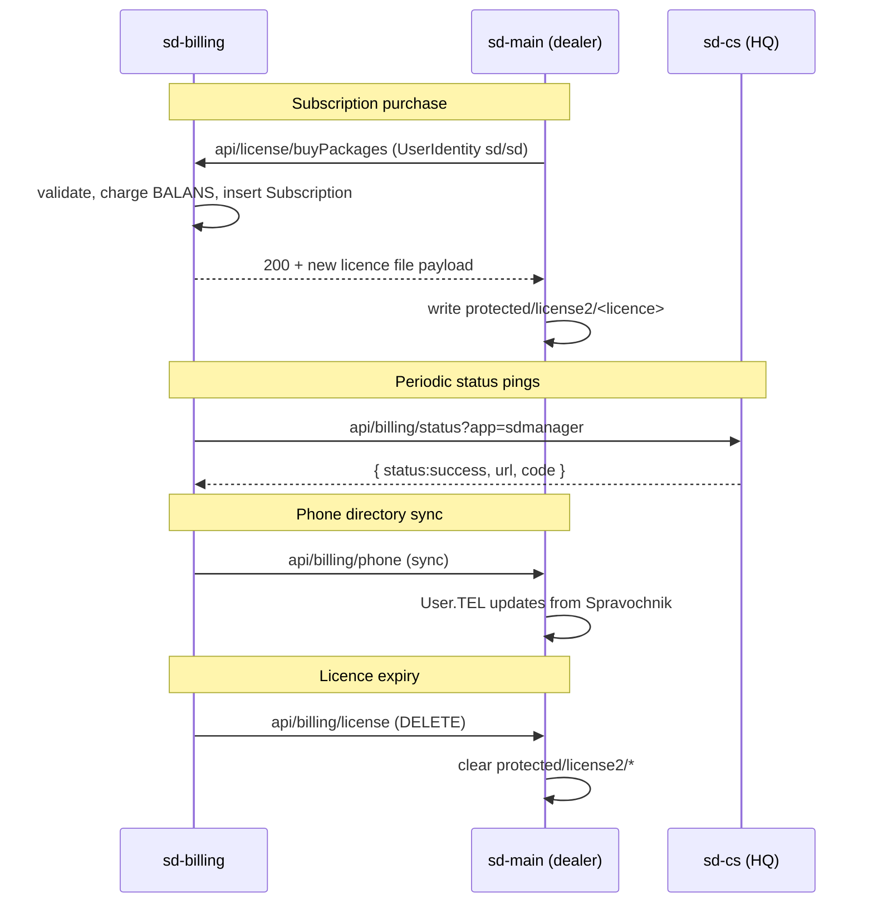

# Integration with sd-main & sd-cs

`sd-billing` is upstream of every dealer's `sd-main` and every HQ's
`sd-cs`. The integration surface is small and **one-directional**:
sd-billing pushes to dealers; dealers do read-only licence checks back.

## Endpoints exposed by sd-main (called by sd-billing)

| Endpoint | Purpose |
|----------|---------|
| `GET /api/billing/license` | Trigger licence-file refresh (clears `protected/license2/*` so a new one can land). IP-restricted to `185.22.234.226`. |
| `POST /api/billing/phone` | Sync phone numbers for agents and expeditors from the Spravochnik master. |
| `/dashboard/billing` | Internal billing UI inside sd-main; reads licence info. |

## Endpoints exposed by sd-cs (called by sd-billing)

| Endpoint | Purpose |
|----------|---------|
| `GET/POST /api/billing/status?app=sdmanager` | Liveness / capability check. Returns `{ status:"success", url, code, type:"countrysale" }`. |

## Endpoints exposed by sd-billing (called by sd-main)

The dealer's `sd-main` mostly pulls licence info on login. The
authoritative API is in `sd-billing/protected/modules/api/`:

| Endpoint | Purpose |
|----------|---------|
| `POST /api/license/buyPackages` | Buy / renew packages |
| `POST /api/license/exchange` | Special "swap one package for another" |
| `GET /api/license/info` | Dealer's current entitlements |
| `POST /api/host/heartbeat` | Dealer reports it's alive (some flows) |

Several of these log in via `new UserIdentity("sd","sd")` — **fix as
part of the auth hardening track**.

## Identifiers

- **`Diler.HOST`** in sd-billing = the dealer's `sd-main` hostname.
- **`Diler.DILER_ID`** = primary integration key. Mirror it into
  `sd-main` config and into `sd-cs` directory rows.
- **Licence files** stored in
  `sd-main/protected/license2/<diler-id>.license` (or similar).

## Failure modes

| Scenario | Effect |
|----------|--------|
| Licence push fails | Dealer keeps the previous licence until expiry. Add grace-period config. |
| sd-billing → sd-cs ping fails | Billing dashboard shows HQ as offline. No customer-visible impact. |
| Mass licence revocation | Equivalent to deleting `license2/*` everywhere. Avoid; prefer per-tenant freezes. |

## Hardening checklist

- Replace IP allowlist with mutual TLS or signed JWT.
- Move licence files outside the web root.
- Add `/api/billing/healthz` returning version + last licence applied.
- Audit-log every licence change (see `IntegrationLog` pattern in
  sd-main).
- Replace `UserIdentity("sd","sd")` machine logins with API tokens.

## See also

- [sd-main billing-integration surface (legacy redirect)](/docs/billing/overview)
- [Subscription flow](./subscription-flow.md)
- [Cron & settlement](./cron-and-settlement.md)
- [Security landmines](./security-landmines.md)
