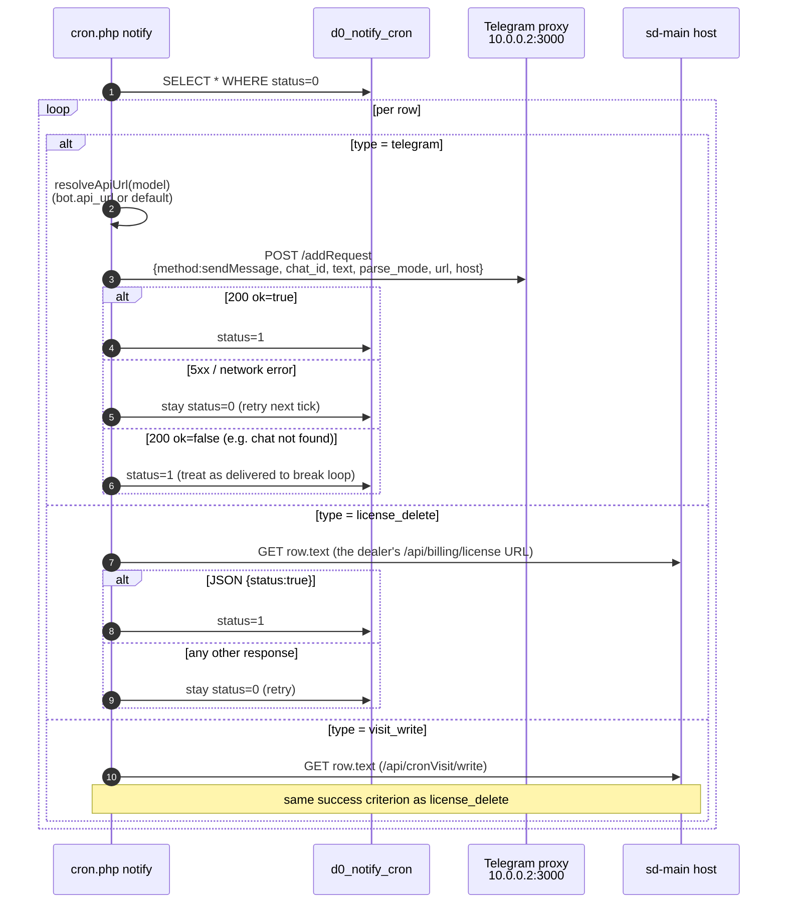

# Notifications (Telegram + SMS)

There are two delivery channels — **Telegram** (the dominant one) and
**SMS** — and one shared queue table that both Telegram messages and
"do this HTTP call" jobs ride on.

## 1. Channel summary

| Channel | Code | Transport | Used for |
|---------|------|-----------|----------|
| Telegram (queued) | `Telegram::queue` | HTTP `POST` to bot proxy `http://10.0.0.2:3000/addRequest` | Almost all dealer-facing notifications |
| Telegram (synchronous) | `Telegram::sendNow` | HTTP `POST` to `http://10.0.0.2:3000/sendNow` | Pages/critical alerts that need a reply within the request |
| SMS (UZ) | `Sms::send` / `Sms::multy` | HTTPS to `notify.eskiz.uz` | UZ dealers and partners |
| SMS (KZ) | `Sms::sendKz` | HTTPS to `api.mobizon.kz` | KZ dealers and partners |

The Telegram path goes through an **internal bot proxy** at
`10.0.0.2:3000`, not directly to `api.telegram.org`. The proxy
isolates rate-limit handling and bot-token storage from sd-billing.

## 2. The shared queue — `d0_notify_cron`

`NotifyCron` (`protected/models/NotifyCron.php`) is the queue model and
**also doubles as a generic delayed-HTTP queue**. The `type` column
discriminates:

| `type` constant | Value | What the row means |
|-----------------|-------|--------------------|
| `NotifyCron::TYPE_TELEGRAM` | `telegram` | `text` is the message; `chat_id` is target; `bot_id` selects which bot (`d0_notify_bot`) to send through |
| `NotifyCron::TYPE_LICENSE_DELETE` | `license_delete` | `text` holds the **URL** (e.g. `https://dealer.salesdoc.io/api/billing/license`) to GET; expected to return JSON `{status: true}` |
| `NotifyCron::TYPE_VISIT_WRITE` | `visit_write` | Same as above but for `/api/cronVisit/write` on the dealer host |

| Column | Purpose |
|--------|---------|
| `id` | PK |
| `chat_id` | Telegram chat id (or `0` for non-Telegram rows) |
| `bot_id` | FK → `d0_notify_bot` (null = legacy default) |
| `text` | Message body **or** target URL |
| `parse_mode` | Telegram parse mode (`HTML` default) |
| `type` | one of the values above |
| `status` | `0 = STATUS_DEFAULT` (pending), `1 = STATUS_RUN` (delivered) |
| `error_response` | last failure reason (string) — kept for debugging |
| `created_by` | user id at enqueue time |
| `created_at` | timestamp |

Failure handling: a row that fails delivery stays at `status = 0` and
the next minute's cron retries it. Telegram-side **permanent** errors
(e.g. `chat not found`) are treated as delivered to avoid an infinite
loop — see `NotifyCommand::sendTelegram` for the `ok=false` branch.

## 3. Bots — `d0_notify_bot`

Multiple Telegram bots can deliver from the same queue. Rows in
`d0_notify_bot`:

| Column | Purpose |
|--------|---------|
| `id` | PK |
| `name` | `default`, `billing`, etc. — string used by `NotifyBot::findByName` |
| `token` | Telegram bot token |
| `api_url` | Bot proxy base URL passed to `Telegram::queue` |

Constants:

```php
NotifyBot::NAME_DEFAULT = 'default';
NotifyBot::NAME_BILLING = 'billing';
```

Resolution logic in `NotifyCommand::resolveApiUrl`:

1. If the row has `bot_id`, use that bot's `api_url`.
2. Else fall back to bot named `default`.
3. If neither exists, the row fails permanently with
   `No api_url available (bot not configured)`.

## 4. Enqueue API

Three static factory methods on `NotifyCron`:

```php
// Telegram message
NotifyCron::create(
    $chat_id,                        // int
    $text,                           // string
    $bot_id = null,                  // int from NotifyBot, or null
    $parse_mode = 'HTML',            // Telegram parse mode
    $type = NotifyCron::TYPE_TELEGRAM
);

// Delayed HTTP GET — called when a dealer's licence cache must be cleared
NotifyCron::createLicenseDelete($url);   // POSTs to dealer's /api/billing/license

// Delayed HTTP GET — called to seed daily visits
NotifyCron::createVisitWrite($url);
```

Don't call `Telegram::queue` directly from a request that should
**not block on Telegram availability** — enqueue via `NotifyCron::create`
and let cron drain it.

## 5. Queue drain — `cron.php notify`

`NotifyCommand` runs every minute (see
[cron-and-settlement](./cron-and-settlement.md)).



Key behaviours:

- **One pending row → one HTTP call** per cron tick. There's no
  batching; throughput is bounded by tick frequency × parallelism.
- **At-least-once** delivery — the proxy and `sd-main` endpoints must
  be **idempotent**. License-delete already is (delete-then-recreate);
  visit-write should be idempotent per dealer/day too.
- Connection timeout 20 s, total timeout 60 s for license-delete /
  visit-write GETs (`NotifyCommand::sendUrlGetExpectingStatusOk`).
- Telegram proxy failures (network/5xx) are **transient** → row stays
  at `status=0` and retries. Telegram **logical** failures
  (`ok=false`) are **permanent** → row marked done.

## 6. The Telegram bot proxy

`Telegram` component (`protected/components/Telegram.php`):

```php
const QUEUE_URL        = 'http://10.0.0.2:3000/addRequest';   // async
const SEND_NOW_URL     = 'http://10.0.0.2:3000/sendNow';      // sync

const CONNECT_TIMEOUT  = 3;     // seconds
const REQUEST_TIMEOUT  = 8;     // seconds  (queue path)
const SEND_NOW_TIMEOUT = 35;    // seconds  (sendNow path waits for Telegram reply)
const MAX_RETRIES      = 2;     // retry only on curl errno 28 (timeout)

const NOTIFY_CHAT_ID   = 122420625;   // ops alert channel
```

| Method | When to use |
|--------|-------------|
| `Telegram::queue($method, $params, $apiUrl, $stop=false, $oneAttempt=false)` | Default. Returns immediately if the proxy accepts the job. Use for fire-and-forget. |
| `Telegram::sendNow($method, $params, $apiUrl, $stop=false, $oneAttempt=false)` | Use only when you need Telegram's response in the same request (e.g. show "message_id" back to the user). Adds 35 s to your worst-case latency. |

Both call sites swallow exceptions and log to
`log/telegram-queue-error-<ts>.txt` /
`log/telegram-sendnow-error-<ts>.txt`. Treat those files as
debug-only — the structured log via `Logger::writeLog2` is the one
you query.

## 7. SMS — Eskiz (UZ) and Mobizon (KZ)

`Sms` component (`protected/components/Sms.php`).

### 7.1 Eskiz — UZ

| Property | Value |
|----------|-------|
| Base URL | `https://notify.eskiz.uz` |
| Auth | `POST /api/auth/login` returns a 30-day token, persisted to `upload/sms_token.txt` |
| Refresh | `Sms::deleteToken()` runs daily 08:00 (cron) — next call re-auths |
| Send single | `Sms::send($phone, $text)` → `POST /api/message/sms/send` |
| Send batch | `Sms::multy($messages, $host = null)` → `POST /api/message/sms/send-batch` |
| Sender | hard-coded `'4546'` (no nickname registered yet) |
| Templates | `createTemplate()`, `templateList()` |
| Callback | If `$host` is passed to `multy`, callbacks land on `https://billing.salesdoc.io/api/sms/callback?host=…` (`SmsController::actionCallback`) |

> ⚠ `EMAIL` and `PASSWORD` are **hard-coded constants** in
> `Sms.php`. Tracked in [security landmines](./security-landmines.md);
> rotate when secrets are publicly leaked.

### 7.2 Mobizon — KZ

| Property | Value |
|----------|-------|
| URL | `https://api.mobizon.kz/service/Message/SendSmsMessage` |
| Auth | API key in URL (`apiKey=…`) |
| Method | `Sms::sendKz($phone, $text)` |

> ⚠ `apiKey` is hard-coded in the URL — same landmine.

### 7.3 Counting + language detection

```php
Sms::isRussian($text)                 // matches Cyrillic
Sms::countSms($text)                  // 70 chars/sms (Cyrillic), 160 chars/sms (ASCII)
```

Use `countSms` before billing the dealer for SMS units.

## 8. Concrete enqueue sites

Where in the codebase notifications are produced:

| Caller | Type | Purpose |
|--------|------|---------|
| `Diler::deleteLicense` | `license_delete` | Push licence-cache invalidation to dealer's sd-main |
| `Diler::resetVisits` (via `createVisitWrite`) | `visit_write` | Trigger daily visit snapshot on dealer |
| `BotLicenseReminderCommand` | `telegram` | 7/3/1-day expiry reminders to dealer Telegram |
| `CleannerCommand` | `telegram` | Weekly cleanup summary to ops |
| `VisitCommand`, `VisitHealthCommand` | `telegram` | Visit-snapshot job summaries |
| `ReportBotCommand` | `telegram` | Hourly internal report bot output |
| `FileLogRoute` (PHP error route) | `telegram` | Fatal error → ops chat |
| `ActiveRecordLogableBehavior` | `telegram` | Audit trail — sends to chat `-4241387119` |

## 9. SMS API surface (inside sd-billing)

`api/sms` module (`SmsController`):

| Action | Method | Purpose |
|--------|--------|---------|
| `actionPackages` | `POST` | List SMS packages a dealer can buy |
| `actionBuySmsPackage` | `POST` | Charge `BALANS` for an SMS package |
| `actionBoughtSmsPackages` | `POST` | History |
| `actionCreateTemplate` | `POST` | Register a template with Eskiz |
| `actionCheckingTemplates` | `POST` | Cross-check local vs. Eskiz template lists |
| `actionOne` | `POST` | Send a single SMS |
| `actionSend` | `POST` | Bulk send (uses `Sms::multy`) |
| `actionSendingForward` | `POST` | Forward queued sends |
| `actionCallback` | `POST` | Eskiz delivery callback (DLR) |

Auth: same `LicenseController::TOKEN`-style pattern; `Sms::isRussian`
and `countSms` are used internally to bill in correct units.

## 10. Failure modes & runbook

| Symptom | Likely cause | First check | Action |
|---------|--------------|-------------|--------|
| Dealer reports "I don't see Telegram alerts" | Bot proxy down, or wrong `api_url` on the bot row | `curl -v http://10.0.0.2:3000/sendNow` from a `web` container | Restart proxy; verify `d0_notify_bot.api_url` |
| Queue length grows unbounded | Cron not running, or every row is failing | `SELECT type, COUNT(*) FROM d0_notify_cron WHERE status=0 GROUP BY type;` | Tail `log/notify-command-errors-*` for the type causing it |
| Dealer's `sd-main` keeps stale licence | `license_delete` rows not draining, or dealer host unreachable | `SELECT * FROM d0_notify_cron WHERE type='license_delete' AND status=0` | Curl the URL from billing host; confirm dealer's nginx is up |
| SMS auth keeps failing | Eskiz token expired, file not writable, creds rotated | `ls -la upload/sms_token.txt` and Eskiz dashboard | `php cron.php sms deleteToken` (or just `rm` the file) |
| Permanent Telegram errors flood logs | Stale `chat_id` (user blocked the bot) | `error_response` column on the row | Mark the row delivered; clear the offending `chat_id` from the source data |
| Mass alert misfired | Bug in caller (e.g. wrong template substitution) | Recent commits to caller | Pause cron (`crontab -l | sed -i …`), drain queue manually, fix |

## 11. Hardening checklist

- [ ] Move Eskiz / Mobizon credentials to environment variables.
- [ ] Add a dead-letter table for rows that hit a retry cap (currently
      they retry forever unless they hit a logical Telegram failure).
- [ ] Track per-row attempt count so we can alert on hot retries.
- [ ] Bound the queue drain per tick (e.g. `LIMIT 500`) so a backlog
      can't cause one cron tick to overrun the next.
- [ ] Sign the bot-proxy `POST` body so Eskiz callbacks can't be spoofed.

## See also

- [Cron & settlement](./cron-and-settlement.md) — schedule of `notify` and friends.
- [Balance & money math](./balance-and-money-math.md) — `Diler::deleteLicense` is on the money flow.
- [Cross-project integration](../architecture/cross-project-integration.md) — `license_delete` is the wire from sd-billing → sd-main.
- [Security landmines](./security-landmines.md) — hard-coded SMS/Telegram secrets.
