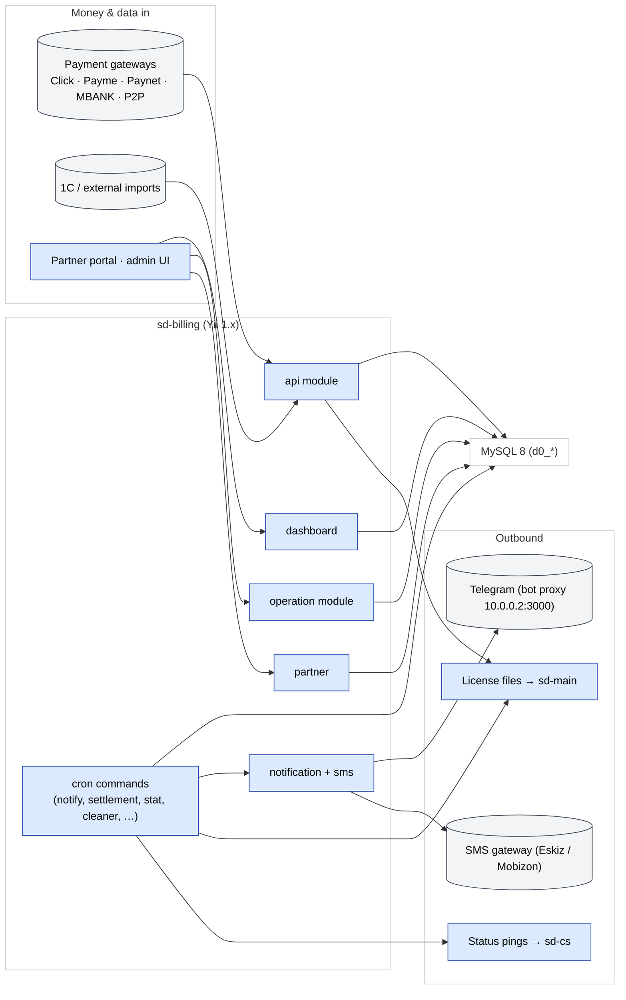

# sd-billing — subscriptions, licenses, payments

**sd-billing** is the **platform-vendor** application that bills every
SalesDoctor dealer (each `sd-main`) and every HQ (each `sd-cs`).

It owns:

- **Subscriptions** — which dealer can use which packages and for how
  long.
- **Licences** — the signed token that `sd-main` reads at login to gate
  features.
- **Payments** — money in, from gateways (Click, Payme, Paynet, MBANK,
  P2P) and offline (cash, P2P).
- **Settlement** — daily reconciliation of distributor ↔ dealer
  balances.
- **Notifications** — Telegram + SMS when a dealer's licence is about
  to expire or money has arrived.

## Tech stack

| Layer | Tech |
|-------|------|
| Framework | **Yii 1.1.15** (vendored under `framework/`) |
| Language | PHP (php-fpm 7.x in Docker) |
| Database | **MySQL 8**, charset `utf8mb4`, table prefix `d0_` |
| Cache / sessions | DB-backed (no Redis component) |
| Cron | OS cron driving `cron.php` (see `protected/commands/cronjob.txt`) |
| Auth | Session + cookie (`WebUser` + `UserIdentity`) |
| Notifications | Telegram bot proxy at `http://10.0.0.2:3000` |
| SMS | **Eskiz** (UZ), **Mobizon** (KZ) |
| Payments | Payme, Click, Paynet, P2P, MBANK, plus 1C integration |

## Modules

13 Yii modules under `protected/modules/`:

| Module | Purpose |
|--------|---------|
| `api` | Inbound integrations (Click, Payme, Paynet, 1C, License, SMS, Host, Quest, Maintenance) |
| `dashboard` | Internal admin UI — dealers, distributors, payments, subscriptions, charts |
| `operation` | Domain CRUD — packages, subscriptions, payments, tariffs, blacklist, notifications |
| `partner` | Partner self-service portal (restricted via `PartnerAccessService`) |
| `cashbox` | Cash desks, flow types, transfers, consumption |
| `report` | Reporting screens |
| `setting` | App settings + system log viewer |
| `notification` | In-app notifications |
| `sms` | SMS templates + sending |
| `bonus` | Bonus / discount logic (quarters, etc.) |
| `access` | Per-user permission grid |
| `directory` | Reference data |
| `dbservice` | DB maintenance utilities |

## Repository layout

```
sd-billing/
├── index.php / cron.php        Web + console entry
├── _index.php / _constants.php Sample / template entries
├── docker/, docker-compose.yml Local + prod-like env
├── doc/                        Ad-hoc notes (security, integrations,
│                               testing plan)
├── log/, upload/, runtime/     Runtime artefacts (gitignored)
├── framework/                  Vendored Yii 1.1.15 (do not edit)
├── vendors/                    Pinned vendored libs
└── protected/                  ALL application code
    ├── config/
    │   ├── main.php            Web config
    │   ├── console.php         Cron config
    │   ├── db.php              MySQL connection (env-driven)
    │   └── auth.php            PhpAuthManager rules
    ├── components/             Cross-cutting services (Curl, Telegram,
    │                           Access, …)
    ├── helpers/                ArrayHelper, DateHelper, QueryBuilder,
    │                           Validator
    ├── behaviors/              AjaxCrudBehavior,
    │                           ActiveRecordLogableBehavior
    ├── actions/                Reusable actions (ApiAction, …)
    ├── controllers/            SiteController (login / logout / error)
    ├── models/                 Top-level AR models
    │                           (Diler, Payment, Subscription, …)
    ├── modules/                See module table above
    ├── commands/               Cron / CLI commands
    ├── migrations/             m*.php (yiic migrate)
    ├── extensions/             paynetuz, …
    └── views/                  Site views
```

## Architecture diagram



## See also

- [Domain model](./domain-model.md)
- [Modules](./modules.md)
- [Payment gateways](./payment-gateways.md)
- [Subscription & licensing flow](./subscription-flow.md)
- [Cron & settlement](./cron-and-settlement.md)
- [Auth & access](./auth-and-access.md)
- [Local setup](./local-setup.md)
- [Security landmines](./security-landmines.md)
- [Integration with sd-main and sd-cs](./integration.md)
