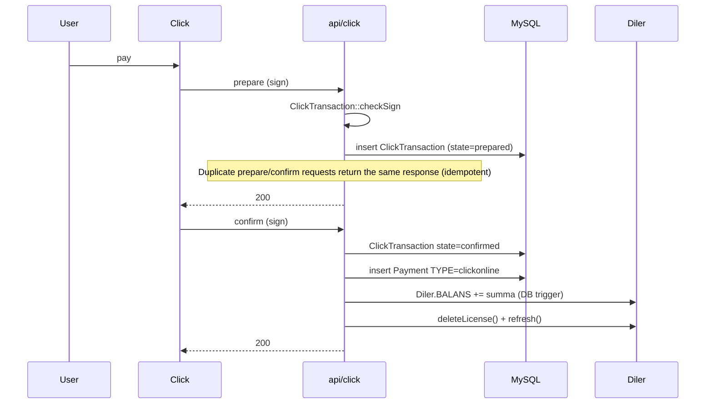
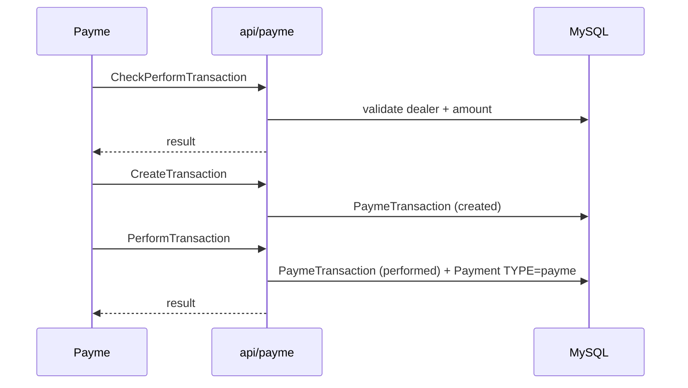

# Payment gateways

sd-billing accepts money from five online + several offline channels.
Every successful inbound payment ultimately writes a `Payment` row of
the right `TYPE`, increments `Diler.BALANS`, and triggers
`Diler::deleteLicense()` / `Diler::refresh()` to settle outstanding
subscriptions.

## Online

| Gateway | `Payment.TYPE` | Controller | Notes |
|---------|----------------|------------|-------|
| **Click** | `TYPE_CLICKONLINE` | `api/click` | Two-phase prepare/confirm with HMAC signature (`ClickTransaction::checkSign`) |
| **Payme** | `TYPE_PAYMEONLINE` | `api/payme` | JSON-RPC; HMAC auth header verified in `PaymeHelper` |
| **Paynet** | `TYPE_PAYNETONLINE` | `api/paynet` | SOAP via `extensions/paynetuz/`; creds template in `_constants.php` |
| **MBANK** (KG) | `mbank` | gateway-specific | Stub-level today — re-confirm with maintainer |
| **P2P** | `p2p` | manual entry | Operator confirms incoming bank transfer |

## Offline

| Source | `Payment.TYPE` | Captured by |
|--------|----------------|-------------|
| Cash | `cash` | `cashbox` module |
| Cashless / wire | `cashless` | `cashbox` |
| License redemption | `license` | `Diler::refresh()` consuming credits |
| Distribute / settlement | `distribute` | `cron settlement` (see [Cron](./cron-and-settlement.md)) |
| Service fee | `service` | manual |

## Canonical `Payment.TYPE` enum

The full enum is defined as class constants on the `Payment` model
(`protected/models/Payment.php` in sd-billing). String labels above
map to integer codes; new code MUST use the constants, not the bare
integers or strings:

| Constant | String label | Direction |
|----------|--------------|-----------|
| `Payment::TYPE_CASH` | `cash` | inbound (offline) |
| `Payment::TYPE_CASHLESS` | `cashless` | inbound (offline) |
| `Payment::TYPE_P2P` | `p2p` | inbound (offline) |
| `Payment::TYPE_LICENSE` | `license` | outbound (consumed) |
| `Payment::TYPE_DISTRIBUTE` | `distribute` | settlement |
| `Payment::TYPE_SERVICE` | `service` | manual fee |
| `Payment::TYPE_PAYMEONLINE` | `payme` | inbound (gateway) |
| `Payment::TYPE_CLICKONLINE` | `click` | inbound (gateway) |
| `Payment::TYPE_PAYNETONLINE` | `paynet` | inbound (gateway) |
| `Payment::TYPE_MBANK` | `mbank` | inbound (gateway, KG) |

The numeric integer values are intentionally not reproduced here so
this doc can't drift from the model — read the constant declarations
in `Payment.php` for the authoritative numbers.

## Click flow (canonical)

## Payme flow

## Paynet flow

SOAP-based. The gateway provider hits a SOAP endpoint exposed by the
`paynetuz` extension; the controller turns the request into a
`PaynetTransaction` and matching `Payment` row.

## Idempotency

Each gateway's transaction table is the idempotency key. Receiving the
same `prepare` (Click) or `CreateTransaction` (Payme) twice returns the
same response without inserting another `Payment`.

## Failure modes

| Scenario | Behaviour |
|----------|-----------|
| Bad sign | 4xx, `Payment` not created |
| Dealer inactive | 4xx, transaction stays in `prepared` |
| Duplicate id | Same response as first call |
| Network error mid-`PerformTransaction` | Gateway retries; idempotency holds |

## Logging

`Logger::writeLog2($data, $is_req, $path)` writes per-day per-action
JSON files under `log/<controller>/<YYYY-MM-DD>/`. **Sanitise inputs
before logging** — never log card details or full payment payloads.

## Manual payment entry

Cashiers / operators add payments through the dashboard `operation`
module. Uses `Payment::create([...])` directly — same DB triggers fire.
