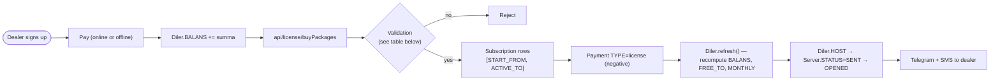

# Subscription & licensing

The end-to-end flow from a dealer signing up to their `sd-main`
unlocking features.

The `Validation` step rejects on any of these independent checks:

| Check | Reject when |
|-------|-------------|
| Balance | `Diler.BALANS` < `Package.PRICE` (total across requested packages) |
| Minimum thresholds | `MIN_SUMMA` or `MIN_LICENSE` anti-abuse limit not met |
| Currency match | Posted currency ≠ `Diler.CURRENCY_ID` |

## Buy packages

`POST /api/license/buyPackages` — called by the dealer's `sd-main` (a
fixed-user login session via `new UserIdentity("sd","sd")`).

Validation done in `LicenseController::actionBuyPackages`:

1. Dealer exists + is active.
2. Posted currency matches `Diler.CURRENCY_ID`.
3. Each requested package is sellable to this dealer's
   `Diler.COUNTRY_ID`.
4. `Diler.BALANS` ≥ total.
5. `MIN_SUMMA` / `MIN_LICENSE` thresholds satisfied (anti-abuse).

On success:

- Insert `Subscription` rows for each chosen package, dated
  `START_FROM = today`, `ACTIVE_TO = today + Package.TYPE` days.
- Insert one `Payment` row with `TYPE = license` and a **negative**
  `SUMMA` (so triggers decrement `BALANS` by the cost).
- Call `Diler::refresh()` to recompute the dealer's balance, `FREE_TO`,
  and `MONTHLY` summary.
- Touch `Server.STATUS` so the dealer's `sd-main` receives the new
  licence.

## Free trial

`Diler.IS_DEMO` and `Diler.FREE_TO` give a date-bounded free window.
While the trial is active, `hasSystemActive(systemId)` (called by
`sd-main` at login) returns `true` even without subscriptions.

## Renewal

Renewal is just another **buy** call with the same packages. The new
`Subscription` rows extend the dealer's coverage from the **end of the
last active subscription** (not from today), so users don't lose days.

## Expiry

Daily cron `botLicenseReminder` warns dealers approaching expiry:

- 7, 3, 1 days before `ACTIVE_TO` — Telegram + SMS notification.
- After expiry — `Diler::refresh()` flips the licence file (consumed by
  `sd-main`).

## Bonus packages

`Subscription` rows can be marked `is_bonus = true` (free seat grants).
They count toward licence checks but don't bill against `BALANS`.

## All-packages mode (`MONTHLY=15`)

If `Diler.MONTHLY = 15`, the dealer is on an "all packages" plan. The
licence file gates by global expiry rather than per-package
`SUBSCRIP_TYPE`.
