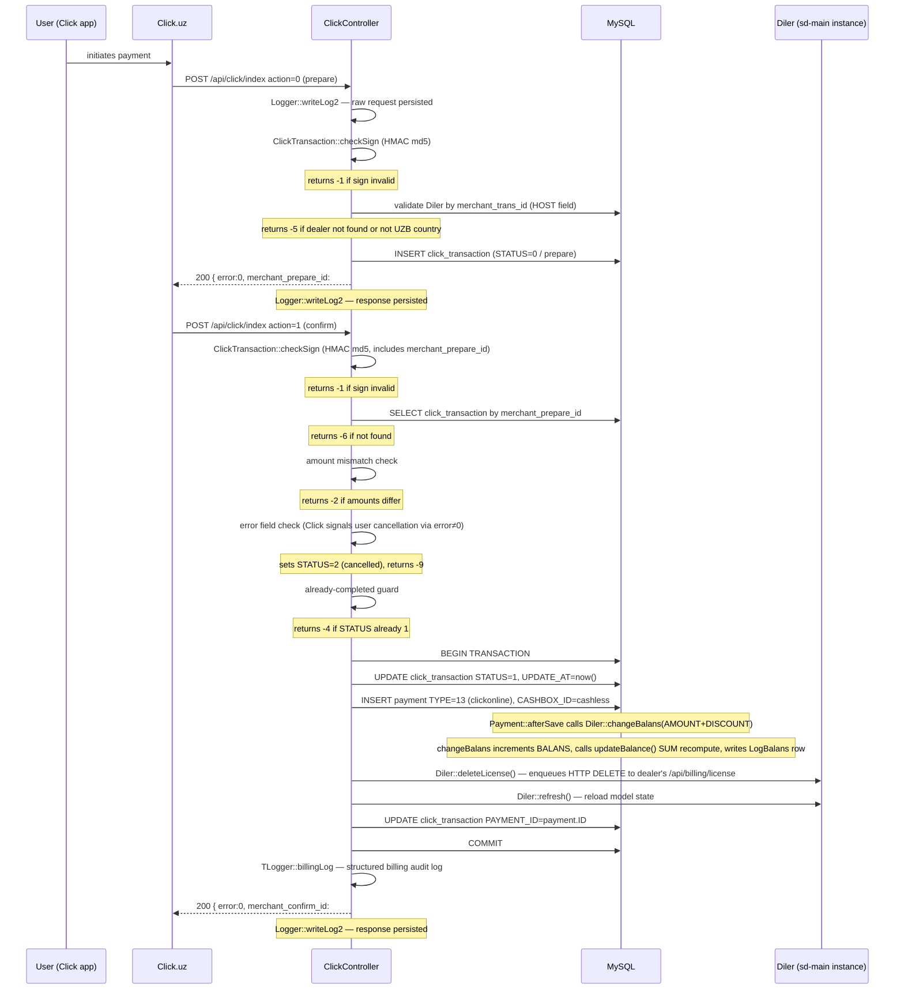

# api · Click gateway

## Purpose

Receives two-phase payment notifications from the Click.uz gateway and converts
a confirmed payment into a `Payment` row of type `TYPE_CLICKONLINE` (13), which
triggers balance recalculation and subscription settlement for the dealer. The
handler is a single Yii controller action that routes on the `action` field in
the incoming request body — it does not expose separate URL endpoints for the
two phases.

## Who uses it

This endpoint is called exclusively by the Click.uz payment system — not by
any sd-billing UI or human operator. There is no RBAC role required from the
sd-billing access module because auth is entirely HMAC-signature based. The
controller does perform an internal login as the fixed `click` system user
(`User.LOGIN = 'click'`) before any model work.

No `Access::check()` call is made; signature failure at `checkSign` returns
error `-1` and halts processing before any DB write.

## Where it lives

| Artifact | Path |
|---|---|
| Controller | `protected/modules/api/controllers/ClickController.php` |
| Transaction model | `protected/models/ClickTransaction.php` |
| Payment model | `protected/models/Payment.php` |
| Diler model | `protected/models/Diler.php` |
| Cashbox model | `protected/modules/cashbox/models/Cashbox.php` |
| Request/response logger | `protected/modules/api/components/TLogger.php`, `protected/components/Logger.php` |
| Inbound URL | `POST /api/click/index` (module `api`, controller `click`, action `index`) |

The URL resolves through Yii's generic `<controller>/<action>` path rule; no
custom route rule is registered for Click specifically.

## Workflow

Steps 1–6 (prepare) and 7–18 (confirm) each begin and end with a
`Logger::writeLog2` call, writing both the raw request and the raw response as
JSON files under `log/click/YYYY-MM-DD/`.

## Rules

- `checkSign` validates that `service_id` in the request matches the
  hard-coded constant `ClickTransaction::$service_id` (15603); requests with a
  mismatched or missing `service_id` return error `-1` immediately, before any
  DB read.
- The HMAC string is `md5(click_trans_id + service_id + secret_key +
  merchant_trans_id + merchant_prepare_id + amount + action + sign_time)`; for
  the prepare phase `merchant_prepare_id` is `null` (literal PHP null, not an
  empty string).
- `merchant_trans_id` maps to `Diler.HOST` (the dealer's subdomain), not to
  `Diler.ID`; a lookup by `HOST` attribute is performed on each call.
- Dealers with `country.CODE != 'UZB'` are rejected with error `-5` during the
  prepare phase; Click.uz is UZ-only and KZ/KG dealers must use Paynet or
  MBANK.
- The confirm handler reads the `error` field from Click's request body; a
  non-zero `error` value means Click itself is signalling a user-side failure.
  The handler sets `STATUS = 2` (cancelled) inside a DB transaction and returns
  `-9`, not `-8`.
- Amount immutability: the confirm call's `amount` field must exactly match
  `ClickTransaction.AMOUNT` set during prepare; any deviation returns `-2`
  without touching the transaction status.
- Idempotency: a confirm request arriving for a transaction already in
  `STATUS = 1` (complete) returns `-4` (Already paid) without inserting a
  duplicate `Payment` row.
- A transaction already in `STATUS = 2` (cancelled) also returns `-9` on any
  further confirm attempt; the guard fires before the already-completed check.
- `Payment::create(...)` sets `CASHBOX_ID` to `Cashbox::getIDByCode("cashless")`
  — i.e., the cashless cashbox, not the cash one.
- `Payment::afterSave` runs `Diler::changeBalans(AMOUNT + DISCOUNT)` in PHP (an
  in-memory increment followed by `save(false)`), then calls `updateBalance()`
  which issues a `SUM`-based SQL recompute to guard against concurrent
  requests arriving within the same second.
- `Diler::deleteLicense()` does not delete anything directly; it enqueues an
  HTTP request to the dealer's sd-main instance at
  `<domain>/api/billing/license` via `NotifyCron::createLicenseDelete`. If the
  domain is empty the method returns silently after setting a flash error.
- The DB transaction wraps only the `click_transaction` update, `Payment`
  insert, and second `click_transaction` save (adding `PAYMENT_ID`); the
  `deleteLicense` / `refresh` calls occur inside the try block but are
  non-transactional HTTP operations.
- On any exception during the confirm transaction, the handler rolls back and
  returns `-8` (Error in request from click).

## Data sources

| Table | Why it is read / written |
|---|---|
| `click_transaction` | Idempotency record; created on prepare, updated on confirm; `STATUS` values: 0 prepare, 1 complete, 2 cancelled |
| `payment` | Inserted on successful confirm; `TYPE = 13` (`TYPE_CLICKONLINE`); triggers balance update via `afterSave` |
| `diler` | Looked up by `HOST`; `BALANS` updated by `changeBalans` + `updateBalance` |
| `log_balans` | Append-only balance-change audit row written inside `changeBalans` |
| `cashbox` | Queried once by `CODE = 'cashless'` to resolve `CASHBOX_ID` for the new `Payment` |
| `user` | Queried once to authenticate the system user `LOGIN = 'click'` for the Yii session |

All tables are in the single sd-billing MySQL database. There is no second
control-plane database; the `cs_*` / `d0_*` split described in sd-cs docs does
not apply here.

## Gotchas

- **Both phases hit the same URL and action.** Unlike Payme (which uses named
  JSON-RPC methods) or Paynet (SOAP operations), Click sends `action=0` (prepare)
  or `action=1` (confirm) as a plain POST field to `POST /api/click/index`.
  There is no routing differentiation at the framework level.

- **`merchant_prepare_id` is the local PK, not Click's ID.** The prepare
  response returns the sd-billing `click_transaction.ID` as
  `merchant_prepare_id`. Click then echoes this value back in the confirm
  request, which is how the controller looks up the transaction. Confusion
  between `click_trans_id` (Click's own integer) and `merchant_prepare_id`
  (sd-billing's PK) is the most common source of debugging mistakes.

- **The DB transaction does not cover the full confirm path.** `deleteLicense`
  and `refresh` are called inside the `try` block but after the DB commit has
  not yet happened — if `deleteLicense` throws, the rollback fires and the
  `Payment` row is never written. Conversely, if the final `$model->save()`
  (writing `PAYMENT_ID` back) fails after `Payment::create` has already run,
  the transaction rolls back but `Payment::afterSave` has already incremented
  `Diler.BALANS` in memory via PHP (though the SQL-based `updateBalance` will
  have set the correct SUM). In practice this is safe because the rollback
  prevents the `PAYMENT_ID` link, but the `payment` row itself survives if the
  `click_transaction` save failed. Investigate with `TLogger` billing logs if a
  dealer shows a balance credit with no linked transaction.

- **`Logger::writeLog2` uses directory-per-day under `log/click/`.** Each
  request generates two files (one `req.txt`, one `res.txt`) named with a
  seconds-precision timestamp. On high-traffic days multiple files per second
  are possible; the collision is in practice rare but not impossible. Log files
  are plain JSON, not line-delimited — grep for `click_trans_id` to trace a
  specific payment.

## See also

- [Payment gateways](../payment-gateways.md) — canonical flow diagram, full
  `Payment.TYPE` enum, Payme and Paynet patterns, idempotency and failure-mode
  table.
- [Balance & money math](../balance-and-money-math.md) — how `changeBalans`,
  `updateBalance`, and `Payment::afterSave` interact to maintain `Diler.BALANS`.
- [Modules](../modules.md) — `api` module overview; auth patterns across
  gateway controllers.
- Source: `protected/modules/api/controllers/ClickController.php`
