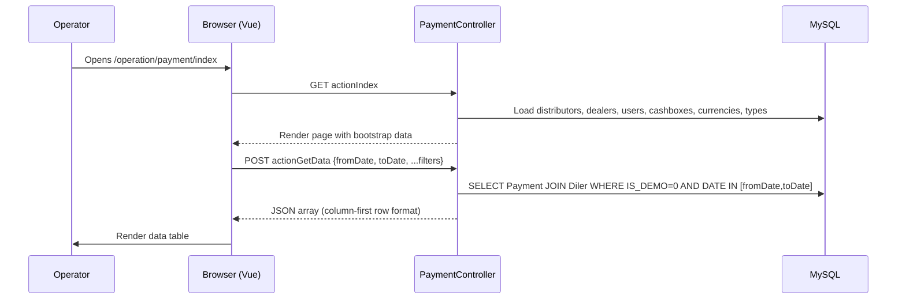

# operation · Payment recording

## 1. Purpose

The Payment recording feature is the administrative ledger entry point for
all money that reaches a dealer's balance inside sd-billing. It gives
operators, managers, and key-account staff a single view to list, add,
edit, and soft-delete payment rows, and to trigger the downstream
subscription-settlement chain that re-activates licenses after a payment
is registered.

---

## 2. Who uses it

| Role | Access key | Capability |
|------|-----------|------------|
| Admin (`IS_ADMIN = 1`) | `operation.dealer.payment` SHOW | Full list with all cashboxes |
| Manager (ROLE = 4) | `operation.dealer.payment` SHOW | Scoped to own country IDs |
| Operator (ROLE = 5) | `operation.dealer.payment` SHOW/CREATE/UPDATE/DELETE | Scoped to own cashbox |
| Key-account (ROLE = 9) | `operation.dealer.payment` SHOW | Scoped to own country IDs |
| Sale (ROLE = 7) | `operation.dealer.payment` SHOW | Scoped to own country IDs |

Access constants checked via `Access::check('operation.dealer.payment', Access::SHOW/CREATE/UPDATE/DELETE)`.

Create, update, and delete permissions are only granted when the acting
user has at least one cashbox (`count($ownCashboxes) > 0`). Users whose
`ACCESS_CASHBOX = 1` can read and act on all cashboxes; others are
restricted to cashboxes where `Cashbox.USER_ID = User.USER_ID`.

---

## 3. Where it lives

| Item | Path |
|------|------|
| Controller | `protected/modules/operation/controllers/PaymentController.php` |
| Payment model | `protected/models/Payment.php` |
| Diler model (balance methods) | `protected/models/Diler.php` |
| Index view | `protected/modules/operation/views/payment/index.php` (rendered by `actionIndex`) |
| URL | `/operation/payment/index` |

Actions exposed:

| Action | Method | Access constant |
|--------|--------|-----------------|
| `actionIndex` | GET | SHOW |
| `actionGetData` | POST | SHOW |
| `actionCreateOrUpdate` | POST | CREATE or UPDATE (decided per-record) |
| `actionDelete` | POST | DELETE |

---

## 4. Workflow

### 4a. Listing payments

Default date range is first-to-last day of the current calendar month.
Non-admin users are country-scoped: `getUserCountryIds()` returns the
acting user's country IDs; admins receive an empty array, skipping the
`COUNTRY_ID IN (...)` filter entirely.

### 4b. Creating a payment (manual / admin path)

1. Operator clicks **Add payment** in the UI.
2. Browser POSTs to `actionCreateOrUpdate` with fields: `dealer`, `currency`, `cashbox`, `type`, `amount`, `date`, `comment`, and `id = null`.
3. Controller validates cashbox ownership, dealer existence, currency existence, cashbox existence, currency match with dealer (`Diler.CURRENCY_ID`), type membership in `Payment::getPaymentTypes()`, and date format.
4. Controller opens a DB transaction, instantiates `new Payment()`, sets `AMOUNT = abs(floatval($postData["amount"]))`, `DISCOUNT = 0`, and saves.
5. `Payment::beforeSave` stamps `CREATED_BY` and resolves `DISTRIBUTOR_ID` from the dealer's active distributor.
6. `Payment::afterSave` calls `Diler::changeBalans(AMOUNT + DISCOUNT)`, which increments `Diler.BALANS`, appends a `LogBalans` row, and then runs the authoritative `Diler::updateBalance()` SUM recompute against `d0_payment`. Then `Diler::resetActiveLicense()` refreshes `ACTIVE_TO`.
7. After `save()` succeeds and the transaction commits, `Diler::deleteLicense()` enqueues a `NotifyCron` license-delete request to the dealer's SD-app host (`/api/billing/license`) for immediate subscription settlement.
8. Browser receives `{"success": true}` and refreshes the table.

### 4c. Editing a payment

Same endpoint (`actionCreateOrUpdate`) with a non-null `id`. Controller
loads the existing `Payment` record (`findByPk`), checks UPDATE access,
sets new field values, and saves. `afterSave` detects a non-new, non-deleted
record and calls `changeBalans(NEW_AMOUNT - OLD_AMOUNT)`. If the dealer has
a distributor and a linked `DistrPayment` exists, its `AMOUNT` is patched
in the same pass.

### 4d. Soft-deleting a payment

1. Browser POSTs to `actionDelete` with `{id}`.
2. Controller calls `Payment::deletePayment()`, which sets `IS_DELETED = 1` and calls `save(false)` (bypassing validation rules).
3. `afterSave` detects `IS_DELETED = ACTIVE_DELETED`, subtracts `-(AMOUNT + DISCOUNT)` from `Diler.BALANS`, calls `uncomputeDebt()` to reverse any `CompDetails` linkage, and, if the dealer has a distributor with a linked `DistrPayment`, calls `DistrPayment::deletePayment()` to mirror the reversal.

---

## 5. Rules

- `Payment.TYPE` for manually created payments is restricted to types returned by `Payment::getPaymentTypes()`, which is `Payment::getTypes()` minus `TYPE_LICENSE (10)`, `TYPE_DISTRIBUTE (11)`, and `TYPE_SERVICE (14)`. Manual operators cannot create license-consumption, settlement, or service-fee rows.
- The `amount` field is always stored as `abs(floatval($postData["amount"]))` — the controller coerces negative input to positive before writing `AMOUNT`. `DISCOUNT` is always `0` on manually created payments.
- `Diler.BALANS` is maintained **in PHP only**: `Diler::changeBalans()` adjusts the in-memory value, writes `save(false)`, records a `LogBalans` row, then calls `Diler::updateBalance()` which does a full `SUM(AMOUNT + DISCOUNT)` recompute as a safety net. The DB trigger migration `m221114_070346_create_triggers_to_payment.php` exists but its `$this->execute($sql)` is commented out and is **not active**.
- Currency must match the dealer's own `Diler.CURRENCY_ID`; mismatches are rejected with HTTP 200 + `{"success": false}` before any DB write.
- Demo dealers (`Diler.IS_DEMO = 1`) are excluded from the payment list: the `actionGetData` query has a hard `WHERE dil.IS_DEMO = 0` condition.
- Editability of a row in the list is gated by a per-row SQL expression: `TYPE NOT IN (10, 11)` (no editing license-consumption or distribution rows) **and** the cashbox belongs to the acting user (`Cashbox.USER_ID = :userId`) or the user has `ACCESS_CASHBOX = 1`. Deletability drops the type restriction — any type can be deleted if the cashbox ownership check passes.
- `getUserCountryIds()` returns `[]` for admins (`Yii::app()->user->isAdmin()`), in which case the `COUNTRY_ID IN (...)` clause is omitted and all dealers are visible. For non-admins it returns `User::getCountryIds()` and the query is scoped accordingly.
- `Diler::deleteLicense()` enqueues a `NotifyCron` row (type: license-delete) pointing to the dealer's `DOMAIN + '/api/billing/license'`. The actual HTTP call is made by the `notify` cron job (every minute) — it is **not** synchronous in the request cycle.
- `Payment::afterSave` is skipped when `$this->disabledAfterSave === true`; this flag is set by `saveWithoutAfterSave()` used internally when patching `COMP` fields to prevent recursion.

---

## 6. Data sources

| Table | DB / connection | Why read |
|-------|-----------------|----------|
| `d0_payment` | sd-billing default DB | Primary ledger — listed, created, updated, soft-deleted |
| `d0_diler` | sd-billing default DB | Dealer lookup, currency match, balance update, `deleteLicense` call |
| `d0_distributor` | sd-billing default DB | Populate distributor filter in index; `beforeSave` resolves `DISTRIBUTOR_ID` |
| `d0_cashbox` | sd-billing default DB | Cashbox ownership check per row; user's own cashboxes for access gating |
| `d0_currency` | sd-billing default DB | Currency dropdown; validates currency match with dealer |
| `d0_user` | sd-billing default DB | User dropdown (ROLE ≠ 6 = non-API, ACTIVE = 1); country-scope lookup |
| `d0_log_balans` | sd-billing default DB | Written by `Diler::changeBalans` on every balance change (audit trail) |
| `d0_comp_details` | sd-billing default DB | Read/deleted by `uncomputeDebt()` when reversing a payment against a debt row |
| `d0_distr_payment` | sd-billing default DB | Mirrored update/delete when a dealer has a distributor and a linked `DistrPayment` |
| `d0_notify_cron` | sd-billing default DB | Written by `Diler::deleteLicense()` to enqueue the async license-settlement call |

All tables use the `d0_` prefix. The `{{tableName}}` Yii placeholder resolves
via `tablePrefix` in the DB config — models reference the table as
`{{payment}}`, `{{diler}}`, etc.

---

## 7. Gotchas

**`deleteLicense()` is asynchronous.** After a payment save the controller
calls `$dealer->deleteLicense()`, which writes a `d0_notify_cron` row, not
an HTTP call. The actual license push to the dealer's SD-app happens up to
one minute later when the `notify` cron fires. If the cron is down,
subscriptions remain unsettled even though the payment row and balance are
already updated.

**`ACCESS_CASHBOX` flag bypasses all cashbox ownership filters.** A user
with `User.ACCESS_CASHBOX = 1` sees every payment row as both editable and
deletable regardless of which cashbox the payment belongs to. This is not a
role check — it is a column-level flag on the `d0_user` table distinct from
`IS_ADMIN`.

**Edit is blocked for `TYPE IN (10, 11)` rows no matter who the user is.**
Payments with `TYPE_LICENSE (10)` or `TYPE_DISTRIBUTE (11)` are marked
non-editable by the `actionGetData` SQL expression. They can still be
soft-deleted (if cashbox ownership passes). This means gateway-created
license-consumption rows can be deleted by a cashbox owner but cannot be
edited.

**`DISCOUNT` is always 0 on manual creation; historical rows may differ.**
The controller always writes `$model->DISCOUNT = 0`. However, older payment
rows (created by settlement, gateway, or legacy imports) may carry non-zero
`DISCOUNT` values. Balance queries must use `AMOUNT + DISCOUNT`, not
`AMOUNT` alone — as `actionGetData` correctly does with `(pay.AMOUNT +
pay.DISCOUNT) AS amount`.

---

## 8. See also

- [Payment gateways](../payment-gateways.md) — Click/Payme/Paynet flows that
  also produce `Payment` rows via the `api/*` controllers.
- [Domain model](../domain-model.md) — `Payment`, `Diler`, `Cashbox`, and
  gateway transaction table schemas.
- [Cron & settlement](../cron-and-settlement.md) — `SettlementCommand` that
  creates `TYPE_DISTRIBUTE (11)` rows, and the `notify` cron that processes
  the `d0_notify_cron` queue (including license-delete entries queued by
  this feature).
- [Balance & money math](../balance-and-money-math.md) — why `Diler.BALANS`
  is PHP-maintained, the trigger migration that is disabled, and the
  `updateBalance()` SUM recompute safety net.
- Source: `protected/modules/operation/controllers/PaymentController.php`
