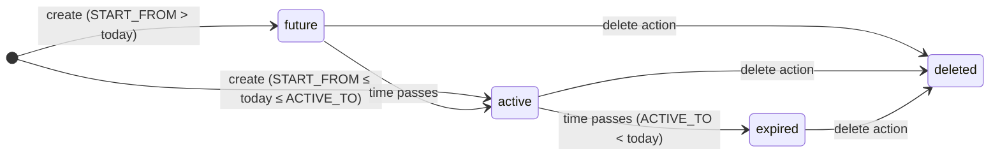

# operation · Subscription lifecycle

## 1. Purpose

The Subscription lifecycle feature lets billing staff create, adjust, reassign, and soft-delete the time-bounded license rows (`d0_subscription`) that determine which packages a dealer can use inside `sd-main`. Every write operation immediately invalidates the dealer's cached license file on the `sd-main` server, so the change takes effect at the next login.

## 2. Who uses it

| Role | Access key | Permitted operations |
|------|-----------|----------------------|
| Admin (`IS_ADMIN = true`) | `operation.dealer.subscription` | All four operations |
| Manager, Operator, Key-account (role 4/5/9) | `operation.dealer.subscription` | Subject to their bitmask grant |

Permission is checked via `Access::check('operation.dealer.subscription', $type)` where `$type` is one of the bitmask constants:

| Constant | Value | Required by |
|----------|-------|-------------|
| `Access::SHOW` | 4 | `list`, `info` |
| `Access::CREATE` | 1 | `create` |
| `Access::UPDATE` | 2 | `update`, `exchange`, `calculate-bonus` |
| `Access::DELETE` | 8 | `delete` |

The `info` endpoint calls `$this->authenticate()` rather than `authorize()`, so any authenticated session may read package-type metadata.

## 3. Where it lives

| Item | Path |
|------|------|
| Controller | `protected/modules/operation/controllers/SubscriptionController.php` |
| Action classes | `protected/modules/operation/actions/subscription/` |
| Subscription model | `protected/models/Subscription.php` |
| Package model | `protected/models/Package.php` |
| Diler model (license hooks) | `protected/models/Diler.php` |
| Notify-cron model | `protected/models/NotifyCron.php` |
| Bot-reminder cron command | `protected/commands/BotLicenseReminderCommand.php` |
| Cron runner | `cron.php` (project root) |

URL pattern (Yii `operation` module routes):

```
POST   /operation/subscription/list
GET    /operation/subscription/info
POST   /operation/subscription/create
DELETE /operation/subscription/delete
POST   /operation/subscription/update
PATCH  /operation/subscription/exchange
PUT    /operation/subscription/exchange
POST   /operation/subscription/calculate-bonus
```

## 4. Workflow

The state of a subscription row is captured by two fields:

- `IS_DELETED` ∈ `0` (active) / `1` (soft-deleted)
- The date window `[START_FROM, ACTIVE_TO]` relative to today



There is no separate `cancelled` or `suspended` status column — the model only distinguishes live (`IS_DELETED = 0`) from soft-deleted (`IS_DELETED = 1`). "Expired" is a derived read-only state: `ACTIVE_TO < today AND IS_DELETED = 0`.

### Create flow (`POST /operation/subscription/create`)

1. Caller POSTs `dealer_id`, `package_id`, `quantity`, `months[]` (array of `Y-m` strings), and optional `end_of_month` flag.
2. `SubscriptionCreateAction` validates dealer exists, package exists and has a recognized `SUBSCRIP_TYPE`, currencies match (`Diler.CURRENCY_ID == Package.CURRENCY_ID`), quantity is ≥ 1 (and = 1 for `admin` and `bot_order` types), and every month string matches format `Y-m`.
3. For `bot_report` packages, amount is looked up from a tiered table via `Package::getBotPackages()` unless a `DilerPackage` override exists for that dealer, in which case the package's flat `AMOUNT` is used.
4. Inside a single DB transaction, one `Subscription` row is inserted per requested month. `START_FROM` / `ACTIVE_TO` are computed by `Subscription::setStartAndActiveDateByMonth()` (end-of-month alignment if `end_of_month = true`).
5. For each saved subscription, a `Payment` row is inserted with `TYPE = 10` (license), `AMOUNT = -1 * amount`, linked by `SUBSCRIPTION_ID`.
6. On commit, `Diler::deleteLicense()` enqueues a `notify_cron` row of `type = license_delete` pointing at `{dealer.DOMAIN}/api/billing/license`. The `notify` cron command dispatches this DELETE request to `sd-main` asynchronously.

### Delete flow (`DELETE /operation/subscription/delete`)

1. Caller sends `dealer_id` and `ids[]` (array of subscription IDs).
2. Action verifies all IDs exist with `IS_DELETED = 0` and all belong to the given dealer.
3. Inside a transaction, each subscription calls `Subscription::deleteSubscrip()`: sets `IS_DELETED = 1`, then calls `Payment::deletePayment()` on the linked payment, which credits the amount back to `Diler.BALANS` via `Diler::changeBalans()`.
4. `Diler::deleteLicense()` is called after commit to invalidate the cached license.

### Update (quantity change) flow (`POST /operation/subscription/update`)

1. Caller sends `dealer_id` and `subscriptions[]` array of `{subscription_id, quantity}` pairs.
2. Action loads and validates each subscription (must be non-deleted and owned by the dealer).
3. Inside a transaction, for each subscription: soft-deletes the old row (and its payment), then creates a replacement row with the same `START_FROM` / `ACTIVE_TO` / `PACKAGE_ID` but new `COUNT`, and creates a new payment for `priceOfOneLicense * newQuantity`.
4. `Diler::deleteLicense()` is called after commit.

### Exchange (transfer between dealers) flow (`PATCH /operation/subscription/exchange`)

1. Caller sends `subscription_ids[]`, `from_dealer_id`, `to_dealer_id`.
2. Action validates `from_dealer` and `to_dealer` have the same `CURRENCY_ID`; all subscriptions must be non-deleted and owned by `from_dealer`.
3. Inside a transaction, each subscription is soft-deleted from `from_dealer` and recreated verbatim for `to_dealer` (same `START_FROM`, `ACTIVE_TO`, `COUNT`, `PACKAGE_ID`). The payment amount is preserved exactly.
4. Both `from_dealer.deleteLicense()` and `to_dealer.deleteLicense()` are called after commit.

### Bot-reminder cron (`botLicenseReminder`)

Invoked via `php cron.php botLicenseReminder`. Queries for active dealers (`STATUS = 10`, `ACTIVE_TO >= CURRENT_DATE`) that have **no** active `bot_report` subscription today, then POSTs to `{dealer.HOST}.salesdoc.io/api/billing/telegramLicense` on each dealer's `sd-main`. Writes a per-dealer log file at `/var/www/novus/data/www/billing.salesdoc.io/upload/bot-report-reminder/`. Retries up to 3 times on non-200 responses. Skips dealers in `COUNTRY_ID IN (7, 9, 10)` and those whose city `LOCAL_CODE = 'smpro'`.

## 5. Rules

- `IS_DELETED = 0` means live; `IS_DELETED = 1` means soft-deleted. No hard deletes. The `Subscription::active` scope filters `IS_DELETED = 0`.
- `Subscription::isActive()` returns `true` when `START_FROM <= today <= ACTIVE_TO AND IS_DELETED = 0`. `isActiveAndMore()` returns `true` when `today <= ACTIVE_TO` (includes future-starting rows).
- `quantity` must be ≥ 1 for all packages. For `SUBSCRIP_TYPE = admin` and `SUBSCRIP_TYPE = bot_order`, `quantity` must equal exactly 1; attempting `quantity > 1` returns a 400 error.
- Currency must match: `Diler.CURRENCY_ID === Package.CURRENCY_ID`. Mismatch returns a 400 error with both currency values in the error body.
- `SUBSCRIP_TYPE` must be one of the keys returned by `Package::getSubscripTypes()`: `admin`, `agent`, `merchant`, `dastavchik`, `supervisor`, `vansel`, `seller`, `bot_report`, `bot_order`, `smpro_user`, `smpro_bot`. Packages with unlisted types are rejected.
- Payment amount for `bot_report` uses `DilerPackage` override (flat `Package.AMOUNT`) if a `DilerPackage` row exists for that dealer; otherwise amount is resolved by `Package::getBotPackages()` using the quantity as a range lookup.
- `Subscription.DISTRIBUTOR_ID` is set automatically in `beforeSave` from `Diler.distr.ID`; callers do not supply it.
- `ADD_BONUS = 1` is set on creation and controls whether the subscription counts toward bonus-calculation logic (`SubscriptionCalculateBonusAction` can toggle it post-create).
- `Diler::deleteLicense()` enqueues a row into `d0_notify_cron` with `type = license_delete`. It does **not** call `sd-main` synchronously. The actual HTTP DELETE reaches `sd-main` only when the `notify` cron command runs (`php cron.php notify`).
- `Subscription.DISTRIBUTOR_ID` is required by model validation — inserts without a live `Diler.distr` relation will fail.
- On exchange, both dealers must share the same `CURRENCY_ID`; cross-currency transfers are rejected with a 400 error listing both dealer IDs.
- `Subscription::deleteSubscrip()` calls `returnBalans()` which soft-deletes the linked `Payment` row; this triggers `Diler::changeBalans()` → `Diler::updateBalance()`, which recomputes `Diler.BALANS` as `SUM(pay.AMOUNT + pay.DISCOUNT)` over all non-deleted payments.

## 6. Data sources

| Table | DB & connection | Why it's read |
|-------|----------------|---------------|
| `d0_subscription` | `b_*` (billing), `db` connection | Primary entity; every action reads/writes it |
| `d0_package` | `b_*` (billing), `db` connection | Validates package type, duration, currency, and amount |
| `d0_diler` | `b_*` (billing), `db` connection | Validates dealer existence; currency match; triggers license invalidation |
| `d0_payment` | `b_*` (billing), `db` connection | Linked 1:1 to each subscription row; soft-deleted on subscription deletion |
| `d0_notify_cron` | `b_*` (billing), `db` connection | Queue table for async license-delete calls to `sd-main` |
| `d0_diler_package` | `b_*` (billing), `db` connection | Per-dealer `bot_report` price override |

## 7. Gotchas

- **License invalidation is asynchronous.** `Diler::deleteLicense()` only writes to `d0_notify_cron`. The change reaches `sd-main` when `php cron.php notify` fires. If the notify cron is stalled, subscriptions written in sd-billing won't be visible in `sd-main` yet.
- **Update is delete-and-recreate, not a field patch.** `SubscriptionUpdateAction` soft-deletes the old subscription and payment, then inserts new rows. This means the old `ID` disappears and a new one is created. Any external reference to the old ID (reports, links) becomes stale.
- **`bot_report` amount is computed from quantity tiers at create time, not stored as a rate.** The amount written to `d0_payment` reflects the tier that applied when the subscription was created. Later changes to tiers do not retroactively adjust existing payments.
- **No `refresh()` call in the `operation` module.** Unlike `api/license/buyPackages` (which calls `Diler::refresh()` to recompute `ACTIVE_TO`, `FREE_TO`, and `MONTHLY`), the `SubscriptionCreateAction::refreshDealerLicense()` method only calls `deleteLicense()`. `Diler.ACTIVE_TO` is **not** recomputed by operation-module writes; it is updated separately (e.g. via the dashboard `SubscripController`).
- **`BotLicenseReminderCommand` log files are written to an absolute production path** (`/var/www/novus/data/www/billing.salesdoc.io/upload/bot-report-reminder/`). This path is hard-coded in the command; it does not exist in local dev containers, which causes the `mkdir` call to silently create an unintended directory.

## 8. See also

- [Subscription & licensing flow](./subscription-flow.md) — end-to-end flow from dealer signup through payment to `sd-main` licence unlock; covers `api/license/buyPackages`, renewal, bonus packages, and the `botLicenseReminder` expiry notifications.
- [Domain model](./domain-model.md) — ERD and field-level descriptions for `Subscription`, `Package`, `Diler`, `Payment`, and related tables.
- [Balance & money math](./balance-and-money-math.md) — how `Diler.BALANS` is maintained, why DB triggers are disabled, and the `Payment::afterSave` → `Diler::changeBalans` chain.
- Source: `protected/modules/operation/controllers/SubscriptionController.php` and `protected/modules/operation/actions/subscription/`
