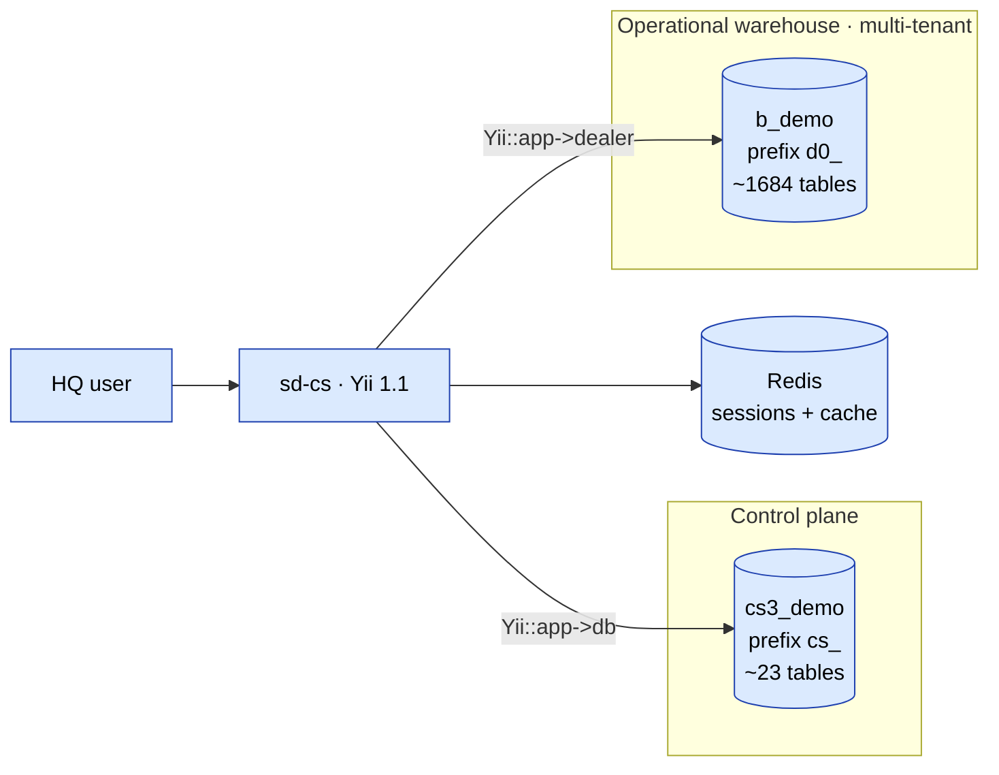
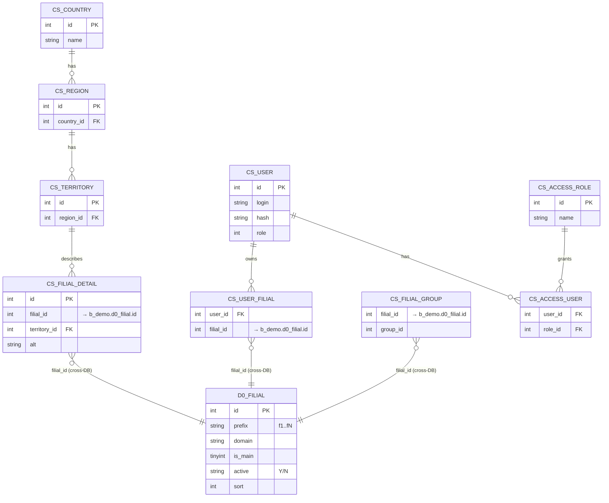
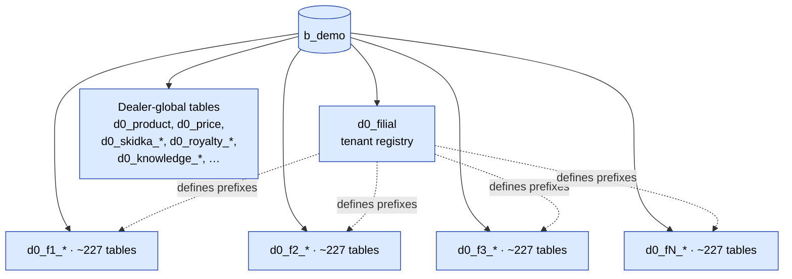
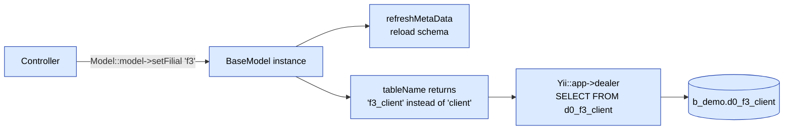
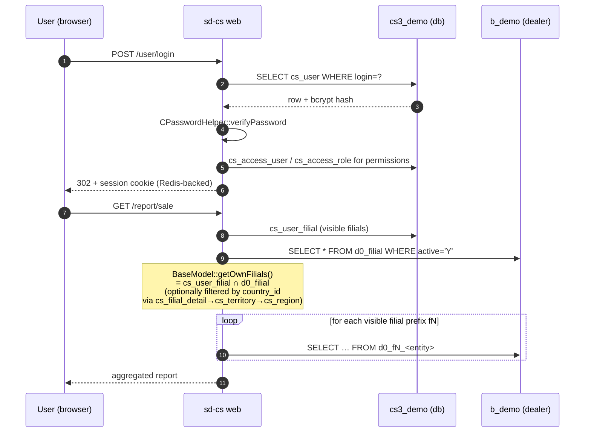
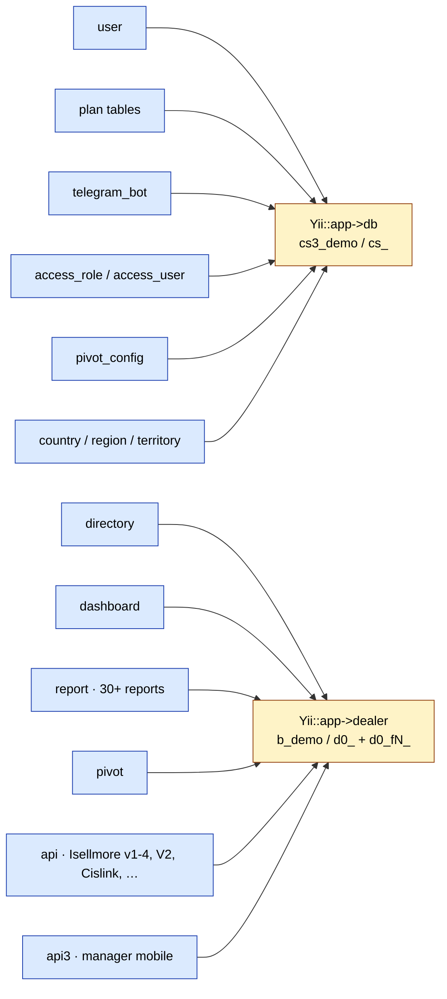

# sd-cs — Architecture (verified from running code)

These diagrams reflect the **actual** behaviour of the deployed sd-cs:
two MySQL schemas (control + warehouse) and a per-tenant **filial**
prefix scheme inside the warehouse DB. Verified against the
`cs3_demo` / `b_demo` schemas and the `BaseModel` / `V2Controller`
code paths.

> Visual taxonomy follows the
> [Diagram gallery](/docs/diagrams) standard
> (blue = action, amber = approval, green = success, red = reject,
> grey = external, purple = cron).

## Two-DB connection map

`Yii::app()->db` connects to `cs3_demo` (control plane, 23 tables,
prefix `cs_`). `Yii::app()->dealer` connects to `b_demo` (operational
warehouse, ~1 684 tables, prefix `d0_`). Both are configured in
`protected/config/db.php`.

`cs3_demo` holds auth, RBAC, geography, plans, telegram bots, pivot
configs. `b_demo` holds all operational dealer data, partitioned per
filial.

## Cross-DB linkage (filial bridge)

There are **no foreign keys across the two schemas** — the two DBs are
joined logically by `filial_id`. The canonical filial registry lives
in `b_demo.d0_filial`; `cs3_demo` enriches each filial with country /
territory metadata and per-user ACLs.

## Multi-tenant layout inside `b_demo`

`b_demo` mixes two kinds of tables: dealer-global (no filial prefix)
and per-filial (`d0_fN_*`). Demo size: 7 active filials (`f1..f7`),
~227 tables per filial, plus ~50 dealer-global tables.

Per-filial entities include `client`, `agent`, `order`, `visit`,
`audit`, `cashbox`, `bonus_*`, `cars`, `catalog_*`, etc. — each filial
gets its own copy, scoped by the `fN_` prefix.

## `setFilial()` table rewrite

The mechanism that lets one model class address many tenants lives in
`protected/components/BaseModel.php` (`tableName()`,
`getFilialTable()`, `setFilial()`). Calling `setFilial('f3')` rewrites
the table token from `{{client}}` to `{{f3_client}}`, which Yii
expands using the `dealer` connection's `tablePrefix='d0_'`,
producing `d0_f3_client`.

## Login → filial scoping → query

End-to-end request flow: auth happens in `cs3_demo`; data fetch
happens in `b_demo`, scoped to the user's allowed filials via
`cs_user_filial` and (optionally) `country_id`.

## Module → connection matrix

Code-level signal: ~440 calls to `Yii::app()->dealer` vs ~14 to
`Yii::app()->db` in `protected/`. The control DB is small and
metadata-shaped; the dealer DB is where the work happens.

## Notes vs the older description

The page [Multi-DB connection](./multi-db.md) describes a model where
sd-cs constructs short-lived `CDbConnection` objects per dealer
(many separate dealer DBs). The current deployment uses a **single**
dealer DB (`b_demo`) with **internal multi-tenancy via filial
prefixes**. The diagrams above reflect what the running code does
today; the older note is kept for historical context.
