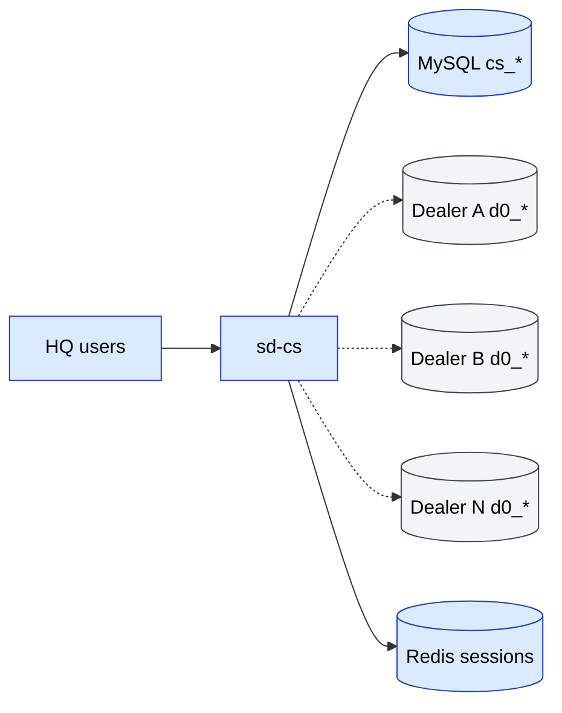

# sd-cs — Country Sales 3

**sd-cs** ("Country Sales 3") is the **head-office** application that
sits above many `sd-main` (dealer) installations. It exists to give the
brand owner a single pane of glass across all their dealers.

## What sd-cs does

- **Consolidated reports** — sales, debt, KPI, AKB (active customer
  base), bonuses, defects, returns — across every dealer.
- **Pivot analytics** — RFM, SKU, expeditor, transactions.
- **HQ directory** — master records (country-level catalog, brands,
  segments).
- **Read-mostly** — most operational writes happen in `sd-main`. sd-cs
  reads dealer DBs and writes only to its own.

## Tech stack

Same family as sd-main:

| Layer | Tech |
|-------|------|
| Framework | Yii 1.x |
| Language | PHP |
| DB | MySQL — **two connections** (own + dealer) |
| Cache / sessions | Redis (single component, `redis_cache`) |
| Theme | `themes/classic` (Yii theme system) |
| Asset manager | symlinked (`linkAssets: true`) |

## Modules

| Module | Purpose |
|--------|---------|
| `user` | Auth + access |
| `directory` | HQ-level directory (catalogs, brands, segments) |
| `report` | 30+ consolidated reports |
| `pivot` | Pivot tables (RFM, SKU, sale detail, transactions, defects, …) |
| `dashboard` | Top-level KPIs |
| `api` | Server-to-server endpoints (operator, billing, telegram-report, etc.) |
| `api3` | Manager mobile endpoint(s) |

## Repository

```
sd-cs/
├── index.php / cron.php / a.php
├── default_folders.php          one-time bootstrap
├── composer.json
├── themes/                      classic theme files
├── fonts/
├── log/
└── protected/
    ├── config/
    │   ├── main.php
    │   ├── db.php (gitignored)  TWO connections: cs_* and d0_*
    │   └── db_sample.php
    ├── components/
    ├── controllers/             SiteController, CatalogController
    ├── models/                  DbLog (extra models defined per-module)
    ├── modules/                 (api, api3, dashboard, directory, pivot, report, user)
    └── migrations/
```

## Architecture (diagram)

See **SalesDoctor — sd-cs Architecture** in the
[FigJam board](../architecture/diagrams.md).



## See also

- [Multi-DB connection](./multi-db.md)
- [Modules](./modules.md)
- [Reports & pivots](./reports-pivots.md)
- [Local setup](./local-setup.md)
