# sd-cs ↔ sd-main integration

This is the most critical integration in the platform: every HQ
report depends on it being correct. Read this end-to-end before
touching either side.

## Context

| | sd-cs (HQ) | sd-main (Dealer) |
|--|------------|------------------|
| Run by | Brand owner / country sales | Each dealer |
| DB schema prefix | `cs_*` | `d0_*` |
| MySQL host | HQ MySQL cluster | Dealer's MySQL |
| Read direction | reads from many sd-main DBs | none |
| Write direction | writes only to its own `cs_*` schema | writes to its own `d0_*` schema |
| Goal | consolidate / pivot across dealers | run one dealer's daily ops |

The integration is **read-only from sd-cs's perspective**. sd-cs never
writes into a dealer's `d0_*` tables — every operational write happens
inside the dealer's own sd-main.

## Connection topology

sd-cs holds **two persistent Yii DB components** in parallel
(`protected/config/db.php`):

```php
return [
    'db' => [
        'connectionString' => 'mysql:host=hq-mysql;dbname=cs_country',
        'tablePrefix' => 'cs_',
    ],
    'dealer' => [
        'class' => 'CDbConnection',
        'connectionString' => 'mysql:host=dealer1-mysql;dbname=sd_dealerA',
        'tablePrefix' => 'd0_',
    ],
];
```

- **`db`** — pinned to the HQ schema. Default for all models that
  don't override `getDbConnection()`.
- **`dealer`** — the **swappable** connection. For multi-dealer
  reports, sd-cs constructs a new `CDbConnection` per dealer in a loop
  and reassigns `Yii::app()->dealer` for the duration of that
  iteration.

## Models

Define a model that targets the dealer DB by overriding
`getDbConnection`:

```php
class DealerOrder extends CActiveRecord {
    public function getDbConnection() {
        return Yii::app()->dealer;
    }
    public function tableName() { return '{{order}}'; }   // {{order}} → d0_order
}
```

Models against `cs_*` use the default `db` connection — no override
needed.

**Rule**: never reference dealer table names from a model bound to the
`db` connection. `{{order}}` resolves to `cs_order` if the connection
is `db` and to `d0_order` if it's `dealer` — that's how you stay safe.

## Cross-dealer report pattern

The canonical loop:

```php
$dealers = DealerRegistry::all($filters);   // dealer-list lookup in cs_*
$rows = [];

foreach ($dealers as $dealer) {
    // Construct a fresh dealer connection per iteration.
    $cn = new CDbConnection(
        $dealer['dsn'], $dealer['user'], $dealer['pass']
    );
    $cn->tablePrefix = 'd0_';
    $cn->emulatePrepare = true;
    $cn->charset = 'utf8';
    $cn->active = true;
    Yii::app()->setComponent('dealer', $cn);

    // Run the dealer-side query — narrow projection only!
    $sub = DealerOrder::model()->findAllBySql(
        "SELECT DATE(:dateCol) AS d, SUM(SUMMA) AS total
         FROM {{order}}
         WHERE STATUS IN (:paid, :delivered)
           AND DATE BETWEEN :from AND :to
         GROUP BY d",
        [
            ':dateCol'   => 'DATE',
            ':paid'      => Order::STATUS_PAID,
            ':delivered' => Order::STATUS_DELIVERED,
            ':from'      => $from,
            ':to'        => $to,
        ]
    );
    foreach ($sub as $r) {
        $rows[] = ['dealer' => $dealer['code'], 'd' => $r->d, 'total' => $r->total];
    }

    Yii::app()->dealer->active = false; // release connection — see runbook below
}

// Aggregate in PHP — cross-DB joins are NOT allowed (different hosts).
$result = $aggregator->fold($rows);
```

### Rules of the loop

- **Narrow projections only** — never `SELECT *`. Move filtering and
  grouping to the dealer side.
- **One dealer at a time** — don't fan out concurrently from a single
  PHP process; you'll exhaust the HQ MySQL connection pool.
- **Bounded** — apply a hard cap (e.g. 200 dealers per request); if
  more, paginate or queue.
- **Cache the aggregate** — keyed by `report:<name>:<filters_hash>:<dealers_hash>`.

### Performance budget

| Phase | Target |
|-------|--------|
| HQ DealerRegistry lookup | < 10 ms |
| Per-dealer query | < 200 ms median, < 1 s p99 |
| 50-dealer loop wall-clock | < 30 s |
| Cache TTL | 5–15 min for HQ reports |

## Schema mapping

### What sd-cs reads from `d0_*`

| Domain | Tables read |
|--------|-------------|
| Sales | `d0_order`, `d0_order_product`, `d0_defect` |
| Customers | `d0_client`, `d0_client_category` |
| Agents | `d0_agent`, `d0_visit`, `d0_kpi_*` |
| Catalog | `d0_product`, `d0_category`, `d0_price`, `d0_price_type` |
| Stock | `d0_stock`, `d0_warehouse`, `d0_inventory` |
| Audits | `d0_audit`, `d0_audit_result` |
| GPS | `d0_gps_track` |

### What sd-cs writes to `cs_*`

| Domain | Tables written |
|--------|----------------|
| HQ catalog | `cs_brand`, `cs_segment`, `cs_country_category` |
| Plans / targets | `cs_plan`, `cs_plan_product` |
| HQ users | `cs_user`, `cs_authassignment` |
| Pivoted intermediates | `cs_pivot_<name>` (for very large pivots) |
| Audit log | `cs_dblog` |

## Schema-drift handling

Different dealers can run **different versions of sd-main**. Tactics:

1. **Capability flags per dealer** — at registry level, mark which
   features each dealer's schema supports
   (e.g. `has_markirovka_v2`, `kpi_new_controller`).
2. **Tolerant SELECTs** — wrap queries that touch optional columns in
   `try/catch` and treat missing-column errors as "feature not
   available".
3. **Versioned views** — for stable queries, ship a per-dealer SQL
   view (created during onboarding) that translates the dealer's
   schema into a canonical shape.
4. **Don't aggregate across versions** — when running a report that
   relies on a column that varies by version, run it per-version-cohort
   only.

## Security

- **Read-only DB users** — the credentials sd-cs uses for the dealer
  connection are read-only at the MySQL level.
- **Network isolation** — HQ and dealer DB hosts live in private VPCs;
  the only path is via the HQ application's egress to the dealer's
  read-only replica.
- **No PII export** — dealer queries should not pull PII into
  `cs_*` storage unless required and signed off.
- **Audit log** — every cross-DB query is logged in `cs_dblog` with
  the report id, dealer, query hash, and row count.

## Onboarding a new dealer

```mermaid
flowchart LR
  A(["New dealer signs contract"]) --> B["sd-billing creates Diler row"]
  B --> C["sd-billing pushes licence file"]
  C --> D["Dealer's sd-main is provisioned"]
  D --> E["Dealer DB credentials registered in HQ"]
  E --> F["DealerRegistry row inserted in cs_*"]
  F --> G["Test report against new dealer"]
  G --> H["Capability flags filled in registry"]
  H --> I(["Dealer included in default HQ reports"])

  class A action
  class B,C,D,E,F,G,H action
  class I success
  classDef action   fill:#dbeafe,stroke:#1e40af,color:#000
  classDef approval fill:#fef3c7,stroke:#92400e,color:#000
  classDef success  fill:#dcfce7,stroke:#166534,color:#000
  classDef reject   fill:#fee2e2,stroke:#991b1b,color:#000
  classDef external fill:#f3f4f6,stroke:#374151,color:#000
  classDef cron     fill:#ede9fe,stroke:#6d28d9,color:#000
```



Pre-prod checklist:

- [ ] Read-only MySQL user created on dealer side.
- [ ] HQ can resolve the dealer's MySQL host (DNS / VPN).
- [ ] DealerRegistry row added with DSN + capability flags.
- [ ] Smoke report runs cleanly for one day's window.
- [ ] Cache key for the dealer is invalidated.

## Failure modes & runbook

| Symptom | Likely cause | Action |
|---------|--------------|--------|
| HQ report shows zero for one dealer | Dealer DB unreachable, or DSN wrong | Check dealer registry, test connection, alert dealer ops |
| Report times out | Dealer DB slow / missing index | Inspect slow query log, add index, or shrink window |
| Mixed totals after a sd-main upgrade | Schema drift | Add capability flag, switch query to versioned view |
| Cross-dealer total off by one | PHP aggregation bug | Add unit test for fold(); compare with single-dealer result |
| HQ MySQL connection exhaustion | Too many open `dealer` connections | Drop `Yii::app()->dealer->active = false` at end of each iteration |

## Diagrams

See **sd-cs · Architecture (multi-DB)** and
**sd-cs · Cross-dealer report sequence** in
[FigJam — sd-cs (HQ)](https://www.figma.com/board/n7CzNpfgyykdCYYJiuQG7L).

## See also

- [sd-cs overview](./overview.md)
- [sd-cs multi-DB connection](./multi-db.md)
- [sd-cs reports & pivots](./reports-pivots.md)
- [sd-billing ↔ sd-main + sd-cs](../sd-billing/integration.md)
