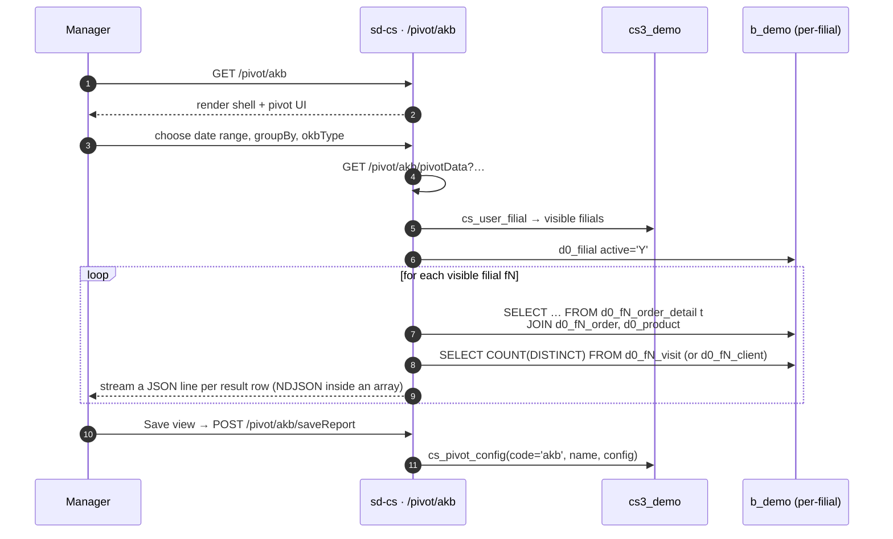

# AKB / OKB pivot

## Purpose

Answers *"how many distinct customers actually bought from us this
period (AKB), against how many we have in total or visited (OKB)?"*
AKB ÷ OKB is the headline KPI for sales-force coverage; the pivot
table lets a manager slice that ratio by product, brand, agent,
client category, city, or month.

- **AKB** — *Active Customer Base* — distinct clients with at least
  one positive-quantity order line in the period.
- **OKB** — *Overall Customer Base* — either active clients
  (`Client.ACTIVE='Y'`) or distinct clients visited in the period,
  depending on the `okbType` flag.

## Who uses it

| Role | What they do here |
|------|-------------------|
| Country / brand manager | Track AKB/OKB ratio over months; drill by product or brand |
| Field sales lead | Drill by `AGENT_ID` to compare agents' coverage |
| KPI / commission team | Re-use saved configurations for monthly KPI reviews |

Access is gated by `pivot.akb.*` keys in `cs_access_role`. Five
endpoints (`getData`, `reports`, `pivotData`, `saveReport`,
`deleteReport`) are listed in `AkbController::$allowedActions` and
bypass the page-level access check.

## Where it lives

| | |
|---|---|
| URL | `/pivot/akb` |
| Controller | [`protected/modules/pivot/controllers/AkbController.php`](https://github.com/salesdoctor/sd-cs/blob/master/protected/modules/pivot/controllers/AkbController.php) |
| Index view | `protected/modules/pivot/views/akb/index.php` |
| Connection | `Yii::app()->dealer` (the `b_*` warehouse) |
| Saved-report code | `akb` (constant `ReportConfigCode`; rows live in `cs3_demo.cs_pivot_config`) |

Per-filial models read here: `Order`, `OrderDetail`, `Client`,
`Visiting`, `Visit` — addressed via `setFilial($prefix)`.

Dealer-global models read here: `Product` (for the `BRAND` and
`PRODUCT_CAT_ID` columns) and `UserProduct` (for the per-user
product blacklist).

## Workflow

1. User opens `/pivot/akb`. The page is a thin shell — the pivot UI
   is client-side.
2. User picks date range, the `groupBy` dimension, the `date` field
   (DATE vs DATE_LOAD), and the `okbType`.
3. Page calls `GET /pivot/akb/pivotData?…`.
4. Server iterates `getOwnModels()` and, for each filial, runs the
   AKB SQL (distinct clients with positive-quantity order lines)
   and the OKB SQL (active clients or visits).
5. Server **streams** results as an array literal: it prints `[`,
   then a header row `["id","month","akb","okb","filial","prefix"]`,
   then one comma-prefixed JSON row per result, then `]`. The
   response is `Content-Type: application/json` but is built
   incrementally — clients should consume it as a single JSON document.
6. The pivot UI builds AKB / OKB / ratio columns from the streamed rows.
7. User can save the current pivot configuration (name + template
   JSON) into `cs_pivot_config` via *Save report*; saved templates
   reload via `actionReports`.

## Rules

- **Filial scope** is `BaseModel::getOwnModels()` — admins see all
  active filials; others see the intersection of `cs_user_filial` and
  `d0_filial.active='Y'`.
- **`date` is whitelisted** to one of `order.DATE`, `order.DATE_LOAD`.
  Any other value is silently coerced to `order.DATE`.
- **`groupBy` is whitelisted** to one of:
  `t.PRODUCT`, `t.PRODUCT_CAT`, `p.BRAND`, `order.AGENT_ID`,
  `order.AGENT_ID, t.PRODUCT_CAT`,
  `order.AGENT_ID, order.CLIENT_CAT`, `order.CITY_ID`,
  `order.CLIENT_CAT`. Any other value is silently coerced to
  `t.PRODUCT`.
- **Special `groupBy='diler'`**: when explicitly passed (not in the
  whitelist), the SQL groups by a literal of the filial prefix —
  effectively giving one row per filial.
- **Date range is inclusive** — `firstDate 00:00:00` to
  `lastDate 23:59:59` on the chosen `date` column.
- **User-product blacklist applies**:
  `t.PRODUCT NOT IN UserProduct::findByUser(userId, 3)`.
- **Optional product-category filter** (`prCat`): when present, the
  SQL adds `AND p.PRODUCT_CAT_ID IN (…)` with values whitelisted by
  `intval` chain in PHP (each id wrapped in single quotes).
- **AKB definition**: `COUNT(DISTINCT order.CLIENT_ID)` from
  `order_detail` joined to `order`, where `order_detail.COUNT > 0`.
- **OKB definition** depends on `okbType`:
  - `okbType=true` and grouping by agent → `COUNT(DISTINCT
    visiting.CLIENT_ID)` per agent (joined to active clients only).
  - `okbType=true` otherwise → `COUNT(client.CLIENT_ID)` where
    `client.ACTIVE='Y'` (one number, repeated for every row).
  - `okbType=false` and grouping by agent → `COUNT(DISTINCT
    visit.CLIENT_ID)` per agent per month from `visit`.
  - `okbType=false` otherwise → `COUNT(DISTINCT visit.CLIENT_ID)` for
    the whole period (one number, repeated for every row).
- **Saved reports** are stored in `cs3_demo.cs_pivot_config` keyed by
  `code='akb'`. `template` is the full pivot configuration as JSON.

## Data sources

| Schema | Table | Why it's read |
|--------|-------|---------------|
| `cs3_demo` | `cs_pivot_config` | Saved pivot views (code = `akb`) |
| `cs3_demo` | `cs_user_filial` | Filial scope for non-admins |
| `cs3_demo` | `cs_user_product` | Per-user product blacklist (via `UserProduct`) |
| `b_demo` | `d0_filial` | Tenant registry (active filials) |
| `b_demo` | `d0_product` | Joined for `BRAND` / `PRODUCT_CAT_ID` |
| `b_demo` | `d0_fN_order_detail` | Sales lines (AKB numerator) |
| `b_demo` | `d0_fN_order` | Order header (date, agent, client, city) |
| `b_demo` | `d0_fN_client` | Active flag for OKB when `okbType=true` |
| `b_demo` | `d0_fN_visit`, `d0_fN_visiting` | Visit-based OKB |

## Gotchas

- **The endpoint streams JSON.** The response opens with `[`, prints
  rows comma-prefixed, and closes with `]`. If a filial loop crashes
  mid-stream, the client receives invalid JSON. Watch the web log.
- **Whitelist coercion is silent.** A typo in `groupBy` does not
  return an error — it just falls through to `t.PRODUCT`. New
  employees frequently waste time wondering why their `BRAND`
  grouping looks like products; they typed `BRAND` instead of
  `p.BRAND`.
- **`okbType` is a *string* `'true'`** in `$_GET`, not a boolean. The
  controller compares string-equal — `okbType=1` does not work.
- **AKB ÷ OKB is computed in the UI**, not the server. If the UI
  shows nonsense ratios, the server returned the right rows in the
  wrong order (filial / prefix mismatch).
- **`actionReports` returns the entire saved-config payload** every
  call. There's no pagination — fine today (~tens of templates) but
  worth knowing.

## See also

- [sd-cs architecture](../architecture.md) — two-DB model and
  `setFilial()` mechanism.
- *report · OKB* (catalog stub, not yet written —
  `report/OkbController`) — single-screen report version of OKB.
- [Style guide](./style.md) — how this page was written.
