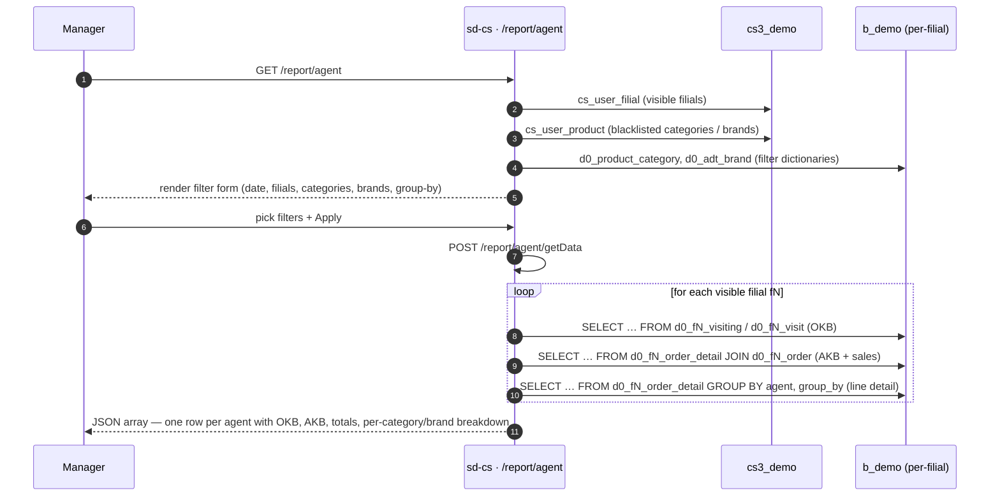

# Agent report

## Purpose

Answers *"how did each sales agent perform across all my filials — how
many clients did they visit (OKB), how many buying clients did they
convert (AKB), and what volume / value / units did they sell, broken
down by product category or brand?"* The report is the primary HQ
tool for evaluating individual agent productivity against their
client-coverage baseline.

## Who uses it

| Role | What they do here |
|------|-------------------|
| Country / brand manager | Compares agent AKB vs. OKB penetration rate across filials |
| Regional supervisor | Drills per-filial to spot under-performing agents |
| Sales-ops analyst | Browses the agent directory via the *List* tab |

Access is gated by `report.agent.index` in `cs_access_role`.
Three endpoints (`getData`, `getAgents`, `list`) are listed in
`AgentController::$allowedActions` and bypass the page-level access
check; the page itself (`actionIndex`) is gated by RBAC.

## Where it lives

| | |
|---|---|
| URL | `/report/agent` (main grid), `/report/agent/list` (agent directory) |
| Controller | [`protected/modules/report/controllers/AgentController.php`](https://github.com/salesdoctor/sd-cs/blob/master/protected/modules/report/controllers/AgentController.php) |
| Index view | `protected/modules/report/views/agent/index.php` |
| List view | `protected/modules/report/views/agent/list.php` |
| Connection | `Yii::app()->dealer` (the `b_*` warehouse) |
| Saved-report code | *not used* |

Per-filial models read here: `Order`, `OrderDetail`, `Agent`,
`Client`, `Visit`, `Visiting` — all addressed via
`setFilial($prefix)`, resolving to `d0_fN_*` tables.

Dealer-global models read here: `Product` (`d0_product`),
`ProductCategory` (`d0_product_category`), `AdtBrand` (`d0_adt_brand`).

Control-plane models read here: `UserFilial` (`cs_user_filial`),
`UserProduct` (`cs_user_product`).

## Workflow

1. User opens `/report/agent`.
2. Page loads filter dictionaries: product categories and brands
   (both filtered by the user's `UserProduct` restrictions), plus
   the list of visible filials.
3. User picks a date range, optional filial subset, group-by
   (category or brand), and OKB mode, then presses *Apply* — page
   POSTs to `/report/agent/getData`.
4. Server iterates over every visible filial. For each filial it
   issues three SQL queries on `Yii::app()->dealer`: the OKB query
   (visits or visiting, depending on `okb_type`), the AKB query
   (distinct buying clients from order lines), and the line-detail
   query (volume, value, units, grouped by the chosen dimension).
5. Server merges the three result sets in PHP, computing
   `pre_okb` (always `100%`) and `pre_akb` (AKB ÷ OKB × 100).
   Agents that appear in OKB but have no sales are still included
   with zero sales columns.
6. Server fills in zero-valued entries for every category/brand
   that a given agent did not sell, ensuring uniform column counts
   across all rows.
7. Server returns the full `data` array as JSON.

The *List* tab (`/report/agent/list`) is a lightweight directory:
it calls `actionGetAgents`, which queries `d0_fN_agent` for every
visible filial and returns a flat table with agent type, status, and
filial attribution.

## Rules

- **Visible filials** come from `BaseModel::getOwnModels()`. Admin
  users see all active filials; non-admins see the intersection of
  `cs_user_filial` and `d0_filial.active='Y'`.
- **Filial filter**: if `filial_id` is non-empty in the POST body,
  only filials whose `id` is in the array are queried; others are
  skipped.
- **Date filter applies to `order.DATE_LOAD`** (load date, not
  order date). The predicate is `BETWEEN date[0] 00:00:00 AND
  date[1] 23:59:59`.
- **Order status filter** is hard-coded to `STATUS IN (2, 3)` —
  confirmed and delivered orders only.
- **Zero-quantity lines excluded** by `t.COUNT > 0` in both the AKB
  and line-detail queries.
- **OKB mode** (`okb_type` parameter):
  - `1` → counts distinct clients from `d0_fN_visiting` whose
    `client.CREATE_AT ≤ date[1]` and `client.ACTIVE='Y'` (cumulative
    active-client baseline).
  - any other value → counts distinct clients from `d0_fN_visit`
    within the selected date range (visits-in-period baseline).
- **Group-by dimension** (`group_by` parameter):
  - `1` → rows are grouped by `product.PRODUCT_CAT_ID` (category);
    the sub-breakdown key is `category_id`.
  - any other value → grouped by `product.BRAND`; the sub-breakdown
    key is `brand_id`.
- **UserProduct blacklist** (type `3` — plain array of product IDs)
  is applied via `CDbCriteria::addNotInCondition('t.PRODUCT', $ups)`
  in the line-detail and AKB queries. The filter dictionary shown in
  the UI also excludes blacklisted categories and brands via separate
  `getUserRestrictions()` calls so filters stay in sync.
- **Agent type label** in `actionGetAgents` is resolved from the
  constant `AGENT_TYPES = ['Торговый представитель', 'Van-selling',
  'Продавец']` keyed by `VAN_SELLING` integer (0, 1, 2).
- **Agents with no sales but with OKB** are included in the response
  with all numeric fields set to `0` and `pre_akb = 0`.
- **Agents with sales but no OKB** are silently excluded (the PHP
  merge condition requires a non-empty entry in both `$all_okb` and
  `$all_akb`).

## Data sources

| Schema | Table | Why it's read |
|--------|-------|---------------|
| `cs3_demo` | `cs_user_filial` | Filial-visibility ACL for non-admins |
| `cs3_demo` | `cs_user_product` | Per-user product/category/brand blacklist |
| `b_demo` | `d0_filial` | Tenant registry — gives prefix and `active` |
| `b_demo` | `d0_product` | Product master (joins to order detail) |
| `b_demo` | `d0_product_category` | Category filter dictionary + group-by label |
| `b_demo` | `d0_adt_brand` | Brand filter dictionary + group-by label |
| `b_demo` | `d0_fN_order` | Order header — `STATUS`, `DATE_LOAD`, `AGENT_ID`, `CLIENT_ID` |
| `b_demo` | `d0_fN_order_detail` | Sales line items — `COUNT`, `VOLUME`, `SUMMA` |
| `b_demo` | `d0_fN_agent` | Agent master — `FIO`, `XML_ID`, `TEL`, `VAN_SELLING`, `ACTIVE` |
| `b_demo` | `d0_fN_client` | Client record — used in `okb_type=1` to filter `ACTIVE='Y'` |
| `b_demo` | `d0_fN_visit` | Visit log — OKB source when `okb_type ≠ 1` |
| `b_demo` | `d0_fN_visiting` | Visiting log — OKB source when `okb_type = 1` |

For the column reference, see [data schemes](../data-schemes.md).

## Gotchas

- **Agents with sales but no OKB are silently dropped.** The merge
  loop (`if ($all_okb[$model['agent_id']] && $all_akb[$model['agent_id']])`)
  requires a truthy entry in both maps. An agent who made sales but
  has zero visit records in the chosen period simply disappears from
  the grid. If a user says "agent X sold but isn't shown", check the
  visit / visiting table for that agent and period.
- **`pre_okb` is always `'100%'`** (a hard-coded string). It does
  not reflect the ratio of visited clients to the total client
  portfolio; it is a placeholder column. Do not rely on it for
  actual coverage calculations.
- **Three SQL round trips per filial.** For an admin with 20 filials
  this is 60 queries per `getData` call. Narrow date ranges and
  filial-id filters reduce the load significantly.
- **`okb_type=1` ignores the start of the date range.** The
  visiting query uses `CREATE_AT BETWEEN 0000-00-00 AND date[1]`,
  so it always accumulates from the beginning of time to the end
  date. Comparing with `okb_type=0` results over the same period
  will show different OKB numbers — this is intentional but
  unintuitive.
- **`actionGetAgents` has no filial filter.** It queries every
  visible filial regardless of any filter state from the main tab.
  The full agent roster is always returned.

## See also

- [sd-cs architecture](../architecture.md) — two-DB model and
  `setFilial()` mechanism.
- [report · Sale](./report-sale.md) — the per-product sales report
  that shares the same `getOwnModels()` / `UserProduct` scoping
  pattern.
- [report · Agent Visit](./report-agent-visit.md) — the companion
  report focusing on visit frequency rather than sales outcomes
  (`AgentVisitController`).
- [`protected/modules/report/controllers/AgentController.php`](https://github.com/salesdoctor/sd-cs/blob/master/protected/modules/report/controllers/AgentController.php) — source file.
