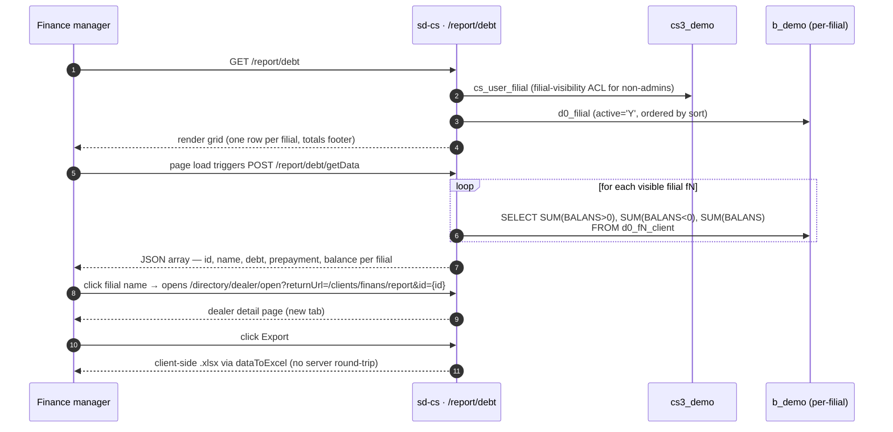

# Debt report

## Purpose

Answers *"across all dealer filials I'm allowed to see, how much do
clients collectively owe us, how much prepayment sits in their
accounts, and what is the net balance?"* The report gives HQ a
single-screen receivables snapshot grouped by filial, with a grand
total row at the bottom.

## Who uses it

| Role | What they do here |
|------|-------------------|
| Country / finance manager | Monitors total receivables and prepayments across all filials |
| Regional supervisor | Checks net balance exposure for their scoped filials |

Access is gated by the key `report.debt.index` in `cs_access_role`
(registered in `AccessManager` as *"По дебиторке"*). The data
endpoint `getData` is listed in `DebtController::$allowedActions` and
bypasses the page-level RBAC check; only `actionIndex` is gated.

## Where it lives

| | |
|---|---|
| URL | `/report/debt` |
| Controller | [`protected/modules/report/controllers/DebtController.php`](https://github.com/salesdoctor/sd-cs/blob/master/protected/modules/report/controllers/DebtController.php) |
| Index view | `themes/classic/views/report/debt/index.php` |
| Connection | `Yii::app()->dealer` (the `b_*` warehouse) |
| Saved-report code | *not used* (no saved configurations for this report) |

Per-filial model read here: `Client` (`d0_fN_client`) — addressed via
`setFilial($prefix)`, resolved to the per-filial table.

## Workflow

1. User opens `/report/debt`; the page renders immediately with an
   empty grid and triggers `updateData()` automatically.
2. The Vue component POSTs `current_country_id` to
   `/report/debt/getData`.
3. Server calls `BaseModel::getOwnModels()`, iterates each visible
   filial, and runs one `SELECT` against `d0_fN_client` per filial.
4. Server returns a JSON array; each element carries `id`, `name`,
   `debt`, `prepayment`, and `balance` as floats.
5. The grid computes grand totals (debt, prepayment, balance) in
   computed properties client-side and appends them as a footer row.
6. Clicking a filial name opens the dealer detail page in a new tab at
   `/clients/finans/report`.
7. *Export* calls `dataToExcel()` from `main.js` — it serialises the
   in-memory grid rows to an `.xlsx` without a server round-trip.

## Rules

- **Visible filials** come from `BaseModel::getOwnModels()` (called
  with the default `$activeOnly = true`). Admin users see all filials
  where `d0_filial.active='Y'`; non-admins see the subset listed in
  `cs_user_filial` for their `user_id`, also filtered by `active='Y'`.
- **Country filter** narrows filials further: when `current_country_id`
  is non-empty, `getOwnModels()` excludes any filial whose territory's
  `region.country_id` does not match. Filials without an assigned
  territory are also excluded in this path.
- **Balance split uses CASE in SQL**: `BALANS > 0` is counted as
  `prepayment`; `BALANS < 0` as `debt`; `SUM(BALANS)` is `balance`.
  Both signs are computed in a single query per filial.
- **No date filter exists.** The report always reflects the current
  snapshot of `BALANS` on each client row — there is no historical
  range parameter.
- **No product or category filter exists.** The debt figure is the
  aggregate client balance, not broken down by order line.
- **Grand totals are computed client-side.** The `debt`, `prepayment`,
  and `balance` computed properties in the Vue component sum the
  already-returned array; the server does not send a totals row.
- **Export is client-side only.** `dataToExcel()` in `main.js`
  converts the in-memory `data` array to `.xlsx`. It re-uses whatever
  is already in the grid — no second server request is made.
- **Filial name link** navigates to
  `/directory/dealer/open?returnUrl=/clients/finans/report&id={filial.id}`,
  opening in a new tab. If `id` is falsy the click handler returns
  early with no navigation.

## Data sources

| Schema | Table | Why it's read |
|--------|-------|---------------|
| `cs3_demo` | `cs_user_filial` | Filial-visibility ACL for non-admins |
| `cs3_demo` | `cs_territory`, `cs_region` | Country filter — maps filial → territory → region → country |
| `b_demo` | `d0_filial` | Tenant registry — provides prefix, `active` flag, and `sort` order |
| `b_demo` | `d0_fN_client` | Source of `BALANS`; one query per filial |

For the column reference, see [data schemes](../data-schemes.md).

## Gotchas

- **`BALANS` is not computed at query time.** It is a stored column on
  `d0_fN_client` that is updated by order and payment workflows. If an
  order or payment is written directly to the DB without going through
  the application, the balance will be stale. Always trace discrepancies
  to the client's transaction history in `/clients/finans/report`,
  not to this report.
- **N filials = N separate SQL round-trips.** There is no UNION query;
  the PHP loop issues one `SELECT` per filial. An admin with many
  filials will see proportionally slower load times; no caching layer
  exists.
- **Country filter is silently exclusive.** A filial that has no
  territory configured is excluded from results when `country_id` is
  set, with no warning in the UI. If a filial disappears from the grid
  after switching country, check `cs_filial_detail` first.
- **Export reflects the loaded state.** If the user changes country
  after load but before export, the `.xlsx` still contains the
  previously loaded data; `updateData()` must be called again to
  refresh.

## See also

- [sd-cs architecture](../architecture.md) — two-DB model and the
  `setFilial()` / per-filial table-prefix mechanism.
- [report · Sale](./report-sale.md) — the same per-filial loop pattern
  applied to order-detail data.
- [data schemes](../data-schemes.md) — column reference for
  `d0_fN_client.BALANS` and related tables.
- [`DebtController.php` source](https://github.com/salesdoctor/sd-cs/blob/master/protected/modules/report/controllers/DebtController.php) — the full controller (37 lines).
