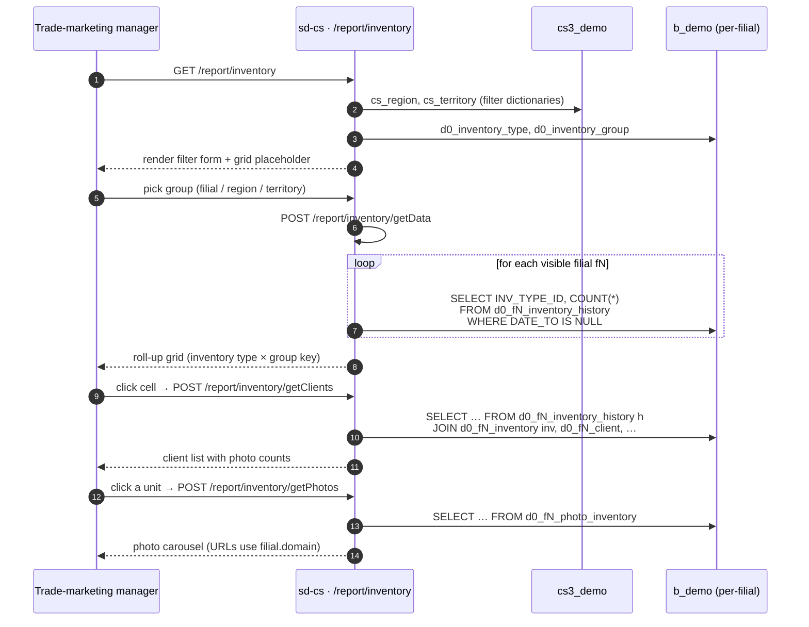

# Inventory report

## Purpose

Answers *"how much branded equipment (fridges, racks, displays) do we
have placed at customers, and where?"* — and on the *Scan* sub-tab,
*"who physically checked which unit, when, and what condition was it
in?"* The report supports both a roll-up by region/territory/filial
and a per-client drill-down with photos.

## Who uses it

| Role | What they do here |
|------|-------------------|
| Trade-marketing manager | Counts placed equipment by inventory type across filials |
| Audit / loss-prevention | Reviews the *Scan* tab to see which units were checked, by which agent, with photos |
| Regional supervisor | Drills into a filial cell to see clients, agents, and outstanding units |

Access is gated by `report.inventory.*` keys in `cs_access_role`.
Six endpoints (`getData`, `getClients`, `pivotData`, `saveReport`,
`deleteReport`, `reports`) are listed in
`InventoryController::$allowedActions`.

## Where it lives

| | |
|---|---|
| URL | `/report/inventory` (roll-up), `/report/inventory/scan` (scan timeline) |
| Controller | [`protected/modules/report/controllers/InventoryController.php`](https://github.com/salesdoctor/sd-cs/blob/master/protected/modules/report/controllers/InventoryController.php) |
| Index views | `protected/modules/report/views/inventory/index.php`, `…/scan.php` |
| Connection | `Yii::app()->dealer` (the `b_*` warehouse) |
| Saved-report code | `inventoryScan` (constant `ReportConfigCode`; rows live in `cs3_demo.cs_pivot_config`) |

Per-filial models read here: `InventoryHistory`, `InventoryCheck`,
`InventoryCheckPhoto`, `Inventory`, `PhotoInventory`, `Client`,
`City`, `Visiting`, `Agent`, `User` — all addressed via
`setFilial($prefix)`.

Dealer-global models read here: `InventoryType`, `InventoryGroup`.

Control-plane models read here: `Region`, `Territory`.

## Workflow

For the *Scan* sub-tab, the timeline endpoint
`/report/inventory/pivotData` streams one JSON row per scan event
(see *Rules*).

## Rules

- **Filial scope** is `BaseModel::getOwnModels()` — admins see all
  active filials; others see the intersection of `cs_user_filial` and
  `d0_filial.active='Y'`.
- **Outstanding-unit definition**: a row in
  `inventory_history` with `DATE_TO IS NULL` — i.e., the unit has
  not been collected back. The roll-up counts these.
- **Group key** (`label` parameter):
  - `0` → `filial.id`
  - `1` → `cs_filial_detail.territory.region_id`
  - `2` → `cs_filial_detail.territory_id`
- **Filial without territory**: dropped from the grid when grouping
  by region or territory (`key` becomes empty and the loop skips).
- **Client filter**: only clients that exist in the per-filial
  `client` table count toward the roll-up
  (`CLIENT_ID IN (SELECT CLIENT_ID FROM d0_fN_client)`). Orphaned
  history rows are silently excluded.
- **Photo URL** is constructed at read time as
  `https://{filial.domain}.salesdoc.io/{PHOTO}` from the per-filial
  `domain`. There is no CDN.
- **Scan timeline** (`actionPivotData`) `dateType` is whitelisted to
  one of `c.CREATE_AT`, `c.SCANNED_AT`. Any other value is silently
  coerced to `c.CREATE_AT`.
- **Scan timeline streams JSON** as an array literal, identical to
  the AKB pattern: `[`, header row, comma-prefixed data rows, `]`.
- **Scan timeline agent resolution**: scans store `CREATE_BY` as a
  `user_id`. The controller fetches `user.ROLE=4` (agents) once per
  filial and replaces `CREATE_BY` with the matching `AGENT_ID`
  before streaming.
- **Inventory types vs. groups**: `InventoryType` is dealer-global
  and joins to `InventoryGroup` via `INV_GROUP`. The page builds the
  group → type tree once at page load.
- **Saved scan-timeline reports** live in `cs3_demo.cs_pivot_config`
  keyed by `code='inventoryScan'`.

## Data sources

| Schema | Table | Why it's read |
|--------|-------|---------------|
| `cs3_demo` | `cs_user_filial` | Filial scope for non-admins |
| `cs3_demo` | `cs_region`, `cs_territory`, `cs_filial_detail` | Group key + filter dictionaries |
| `cs3_demo` | `cs_pivot_config` | Saved scan-timeline configs (code = `inventoryScan`) |
| `b_demo` | `d0_filial` | Tenant registry (prefix, domain, active) |
| `b_demo` | `d0_inventory_type`, `d0_inventory_group` | Inventory taxonomy (dealer-global) |
| `b_demo` | `d0_fN_inventory_history` | Open-unit roll-up source |
| `b_demo` | `d0_fN_inventory` | Comments, parent record |
| `b_demo` | `d0_fN_client`, `d0_fN_city` | Client + city for the drill-down |
| `b_demo` | `d0_fN_visiting`, `d0_fN_agent` | Last visiting agent per client |
| `b_demo` | `d0_fN_photo_inventory` | Photo URLs for the drill-down |
| `b_demo` | `d0_fN_inventory_check`, `d0_fN_inventory_check_photo` | Scan timeline source |
| `b_demo` | `d0_fN_user` | `CREATE_BY` → `AGENT_ID` resolver |

For the column reference, see [data schemes](../data-schemes.md).

## Gotchas

- **Photo URLs assume a `<domain>.salesdoc.io` host.** If a filial
  changes its domain in `d0_filial.domain` after photos are uploaded,
  old photo URLs go 404. There's no rewrite layer.
- **Outstanding count vs. lifetime count.** The roll-up is *open
  units* (`DATE_TO IS NULL`) — units returned to the warehouse drop
  out. Reporting on lifetime placement requires a different query;
  this report does not provide it.
- **`getClients` is not paginated.** It returns every open unit for
  the chosen filial in one shot. For large filials this is slow.
- **Scan timeline streams JSON** — same caveat as AKB. A crash in a
  per-filial loop produces invalid JSON.
- **`actionScan` is just `$this->render('scan')`** — the page-level
  access check still applies; the heavy data lives behind
  `actionPivotData` which is in `$allowedActions`.

## See also

- [sd-cs architecture](../architecture.md) — two-DB model and
  `setFilial()` mechanism.
- *pivot · Inventory* (catalog stub, not yet written —
  `report/PivotInventoryController`) — the pivot-grid version of the
  same data.
- [Style guide](./style.md) — how this page was written.
