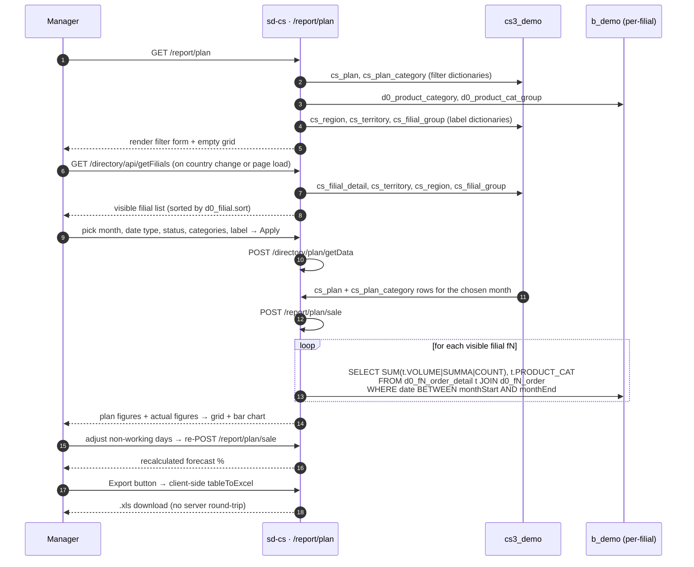

# Plan report

## Purpose

Answers *"how much did each filial (or region/territory/group) sell against its monthly target — and are we on track to hit the plan by end of month?"* The report compares a pre-set per-filial plan (stored in the control plane) against actual sales aggregated from per-filial warehouse tables, showing fulfilment percentage and an end-of-month forecast for the current period.

## Who uses it

| Role | What they do here |
|------|-------------------|
| Country / brand manager | Monitors monthly plan fulfilment across all filials at a glance |
| Regional supervisor | Filters to their filials/region to check progress mid-month |
| Sales operations | Adjusts holiday/non-working days to get a more accurate forecast |

Access is gated by the key `report.plan.index` in `cs_access_role`. Eight endpoints (`getData`, `getClients`, `getStore`, `getProducts`, `export`, `exportProducts`, `getFilials`, `sale`) are listed in `PlanController::$allowedActions` and bypass the page-level RBAC check; the page itself (`actionIndex`) requires the `report.plan.index` permission.

## Where it lives

| | |
|---|---|
| URL | `/report/plan` (monthly grid), `/report/plan?day=1` (day-by-day view) |
| Controller | [`protected/modules/report/controllers/PlanController.php`](https://github.com/salesdoctor/sd-cs/blob/master/protected/modules/report/controllers/PlanController.php) |
| Index view | `themes/classic/views/report/plan/index.php` |
| Day view | `themes/classic/views/report/plan/day.php` |
| Plan data source | `directory/PlanController::actionGetData` — reads `cs_plan` + `cs_plan_category` from control DB |
| Connections | `Yii::app()->db` (control plane, `cs_*`) for plan figures; `Yii::app()->dealer` (warehouse, `d0_*`) for actual sales |

Per-filial models read here: `Order`, `OrderDetail`, `OrderDefect`, `OrderDefectDetail` — addressed via `setFilial($prefix)`, resolved to `d0_fN_order`, `d0_fN_order_detail`, `d0_fN_order_defect`, `d0_fN_order_defect_detail`.

Dealer-global models read here: `Product`, `ProductCategory`, `ProductCatGroup`.

Control-plane models read here: `Plan`, `PlanCategory`, `Region`, `Territory`, `Group` (filial groups).

## Workflow

1. User opens `/report/plan`.
2. Page loads product categories (with `UserProduct` restrictions applied), category groups, regions, territories, filial groups, and filials sorted by `d0_filial.sort`.
3. On page load (and on country change), `getFilials` POSTs to `/directory/api/getFilials` to get the scoped filial list.
4. User picks a month, date-type column (`order.DATE_LOAD` or `order.DATE`), order statuses, optional category filter, grouping label, and presses *Filter*.
5. Page concurrently POSTs to `/directory/plan/getData` (plan targets) and `/report/plan/sale` (actual sales).
6. `/directory/plan/getData` reads `cs_plan` and `cs_plan_category` and returns per-key plan figures plus the unit type (`SUMMA`, `VOLUME`, or `COUNT`).
7. `/report/plan/sale` (`actionSale`) iterates each visible filial and runs one SQL against `d0_fN_order_detail`; optionally a second SQL for shelf-return defects when `with_defect` is true.
8. Client-side Vue computes fulfilment `%` and an end-of-month forecast, accounting for non-working days specified via the holiday calendar widget.
9. *Export* serialises the rendered HTML table to a base-64 `.xls` download entirely in the browser — no server round-trip.

## Rules

- **Visible filials** come from `BaseModel::getOwnModels(!$params['all'])`. Admin users see all active filials; non-admins see the intersection of `cs_user_filial` and `d0_filial.active='Y'`.
- **Filial filter** (`filial_id` array): when non-empty, `actionSale` skips any filial whose id is not in the list before querying the warehouse.
- **Date column** (`date_type`): the client passes either `order.DATE_LOAD` (shipment date) or `order.DATE` (order date). The value is interpolated directly into the `BETWEEN` predicate in both `actionSale` and the defect sub-query — no server-side whitelist validates it.
- **Date range**: always the full calendar month — `monthStart = {date}-01`, `monthEnd = date('Y-m-t 23:59:59', strtotime($monthStart))`.
- **Aggregation unit** (`type_id` in the response, `unit` in `cs_plan`): `1` → `SUMMA`, `2` → `VOLUME`, `3` → `COUNT`. The unit is determined by the stored plan record, not the filter form; `actionSale` reads `type_id` from the plan response and passes it back as `plans.data.type_id`.
- **Column grouping** (`label` parameter):
  - `0` → by `filial.id`
  - `1` → by `cs_filial_detail → cs_territory → cs_region.id`
  - `2` → by `cs_filial_detail.territory_id`
  - `≥3` → by `cs_filial_group.group_id` (a filial in multiple groups is added to each)
- **Filial without territory**: dropped when grouping by region or territory (`keys` array is empty and the loop skips).
- **Category filter**: when `cat_id` is non-empty, `directory/PlanController::actionGetData` skips plan category rows whose `product_category_id` is not in the list; the view also filters `this.categories` client-side before rendering.
- **Defect (shelf-return) adjustment** (`with_defect = true`): a second per-filial SQL joins `d0_fN_order_defect_detail` through `d0_fN_order` where `order.TYPE = 2` and subtracts the defect quantity from the actual total.
- **Forecast calculation** (current month only): `forecast% = (actual / workingDaysSoFar) × totalWorkingDays × 100 / plan`. For past months, `forecast% = actual × 100 / plan` (no extrapolation).
- **Working-day count**: auto-initialised by `getWeekdaysInMonth()` (excludes Sundays); the user can override by picking additional non-working days in the holiday-calendar widget.
- **`UserProduct` restrictions**: `actionIndex` calls `UserProduct::model()->getUserRestrictions()` and excludes restricted categories from the `ProductCategory` list before rendering — restricted categories do not appear in the filter or grid.
- **Zero-quantity lines excluded**: `t.COUNT > 0` is applied in both the main order-detail query and the defect sub-query.

## Data sources

| Schema | Table | Why it's read |
|--------|-------|---------------|
| `cs3_demo` | `cs_plan` | Monthly plan header — filial, date, unit type, summary total |
| `cs3_demo` | `cs_plan_category` | Per-category plan breakdown within a `cs_plan` row |
| `cs3_demo` | `cs_user_filial` | Filial-visibility ACL for non-admins |
| `cs3_demo` | `cs_filial_detail`, `cs_territory`, `cs_region` | Mapping filial → territory → region for grouping |
| `cs3_demo` | `cs_filial_group` | Grouping column when `label ≥ 3` |
| `b_demo` | `d0_filial` | Tenant registry — prefix, `active`, `sort` |
| `b_demo` | `d0_product_category` | Category filter dictionary |
| `b_demo` | `d0_product_cat_group` | Category-group filter widget (groups categories in the dropdown) |
| `b_demo` | `d0_fN_order_detail` | Actual sales line items (per filial) |
| `b_demo` | `d0_fN_order` | Order header — status, date columns, `TYPE` for defect join |
| `b_demo` | `d0_fN_order_defect_detail` | Shelf-return quantities, when `with_defect` is true |

For the column reference, see [data schemes](../data-schemes.md).

## Gotchas

- **Plan figures come from a separate controller.** `report/PlanController::actionSale` provides only the actual sales; the plan targets come from `directory/PlanController::actionGetData`. A broken or missing plan record in `cs_plan` silently returns `plan = 0` everywhere, making the grid show `-` instead of a percentage — not an error message.
- **`date_type` is interpolated into SQL without a whitelist.** `actionSale` (both the main query and the defect sub-query) interpolates `$params['date_type']` directly into the `BETWEEN` clause. The two safe values are `order.DATE_LOAD` and `order.DATE`; the form is the only caller today.
- **Export is client-side HTML-to-XLS**, not PHPSpreadsheet. The *Export* button serialises `#table4export` to a base-64 data URI. This means (a) it exports whatever is currently rendered — hidden rows stay hidden, (b) number formatting may differ from real xlsx, and (c) very large grids can make the browser pause.
- **Group double-counting.** A filial that belongs to two filial groups is added to both group columns. This is intentional but is frequently reported as a bug.
- **`with_defect` subtraction edge case.** When a filial has defect returns but zero regular sales in a category, the code path (`=- (float)`) assigns a negative value (`$data[$id][$key] =- $model['count']`) rather than subtracting from zero — this is a known quirk; the result is a negative actual figure for that cell.
- **`actionSaleOld` is still present** but is not wired to any UI route. It is an older variant without the `with_defect` branch or filial-id pre-filter; it can be ignored for operational purposes.

## See also

- [sd-cs architecture](../architecture.md) — two-DB model and `setFilial()` mechanism.
- *directory · Plan* (`directory/PlanController`) — the page where plan targets are entered and imported; `cs_plan` rows are written there, not here.
- *report · PlanProduct* (`report/PlanProductController`) — the product-level variant of this report; compares per-product plan targets (`cs_plan` via `PlanProduct` model) against per-product actuals.
- *report · Planning* (`report/PlanningController`) — the agent-level pivot version; reads `d0_fN_planning` (a per-filial warehouse table) instead of `cs_plan`.
- [data schemes](../data-schemes.md) — column reference for `d0_order*`.
