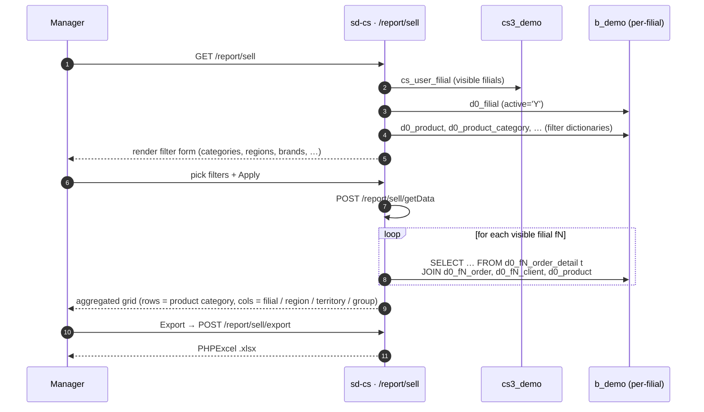

# Sale report

## Purpose

Answers *"how much did we sell, in what, where, and to whom — across
all the dealer filials I'm allowed to see?"* The Sale report is the
single most-used HQ report; it is the consolidated sales pulse for a
country manager.

## Who uses it

| Role | What they do here |
|------|-------------------|
| Country / brand manager | Daily / weekly check on aggregate sales across all filials |
| Regional supervisor | Same, but scoped to their region(s) and territories |
| Product manager | Filters by brand / category / segment to track a launch |

Access is gated by the keys `report.sell.*` in `cs_access_role`. Six
endpoints (`getData`, `getClients`, `getStore`, `getProducts`,
`export`, `exportProducts`, `getFilials`) are listed in
`SellController::$allowedActions` and bypass the page-level access
check; the page itself (`actionIndex`) is gated by RBAC.

## Where it lives

| | |
|---|---|
| URL | `/report/sell` |
| Controller | [`protected/modules/report/controllers/SellController.php`](https://github.com/salesdoctor/sd-cs/blob/master/protected/modules/report/controllers/SellController.php) |
| Index view | `protected/modules/report/views/sell/index.php` |
| Connection | `Yii::app()->dealer` (the `b_*` warehouse) |
| Saved-report code | *not used* (this report does not persist saved configurations) |

Per-filial models read here:

- `Order`, `OrderDetail`, `Client` — addressed via `setFilial($prefix)`,
  resolved to `d0_fN_order`, `d0_fN_order_detail`, `d0_fN_client`.

Dealer-global models read here: `Product` (`d0_product`), plus filter
look-ups (`Region`, `Territory`, `TradeDirection`, `ClientCategory`,
`ClientChannel`, `Group`, `AdtSegment`, `ProductSubcategory`,
`UserProduct`).

## Workflow

1. User opens `/report/sell`.
2. Page loads filter dictionaries: products, categories, brands,
   regions, territories, trade directions, client categories,
   channels, filial groups, segments, subcategories.
3. User picks filters and presses *Apply* — page POSTs to
   `/report/sell/getData`.
4. Server builds one SQL per visible filial (`getOwnModels()` loop),
   runs it on `Yii::app()->dealer`, and aggregates rows in PHP.
5. Server returns a JSON grid keyed by product category × column
   bucket (filial / region / territory / group).
6. User can drill down to clients (`getClients`), products
   (`getProducts`), or stores (`getStore`) for any cell.
7. *Export* triggers `actionExport` → PHPSpreadsheet builds an .xlsx
   with one sheet per breakdown.

## Rules

- **Visible filials** come from `BaseModel::getOwnModels(!$params['all'])`.
  Admin users see all active filials; non-admins see the intersection
  of `cs_user_filial` and `d0_filial.active='Y'`. The `all` flag, when
  true, includes inactive filials as well.
- **Date filter applies to one of two columns**: `dateType` is the
  literal SQL column name (typically `order.DATE` or
  `order.DATE_LOAD`). The value is interpolated directly into the
  `BETWEEN` predicate — callers must pass a known column.
- **Date range defaults**: empty `date[0]` → today 00:00:00; empty
  `date[1]` → today 23:59:59. Inputs are coerced through
  `strtotime()`.
- **Order status filter**: `orderType` maps to `order.STATUS` 1:1.
- **Trade / client-category / channel / brand / segment / subcategory
  / product / category / group** filters are passed to
  `CDbCriteria::compare()` — empty values are skipped (Yii compare
  semantics).
- **User-product restriction**: the report excludes products listed
  in `UserProduct::findByUser($userId, 3)` for the current user.
  This is the per-user product blacklist, not a per-filial one.
- **Aggregation type** (`type` parameter):
  - `0` → `COUNT` (order line count)
  - `1` → `VOLUME` (`order_detail.VOLUME`)
  - `2` → `SUMMA` (`order_detail.SUMMA`)
  - `3` → distinct-client count per category (no date breakdown)
  - `4` → packs (`COUNT / product.PACK_QUANTITY`)
- **Column grouping** (`label` parameter):
  - `0` → by filial id
  - `1` → by region id (via `cs_filial_detail → cs_territory →
    cs_region`)
  - `2` → by territory id
  - else → by `cs_filial_group.group_id` (a filial may belong to many
    groups; the row is added to each)
- **Filial without territory**: dropped from results when grouping by
  region or territory (the `keys` array becomes empty and the loop
  skips it).
- **Zero-quantity lines excluded** by `t.COUNT > 0` everywhere.

## Data sources

| Schema | Table | Why it's read |
|--------|-------|---------------|
| `cs3_demo` | `cs_user_filial` | Filial-visibility ACL for non-admins |
| `cs3_demo` | `cs_filial_detail`, `cs_territory`, `cs_region` | Mapping filial → territory → region |
| `cs3_demo` | `cs_filial_group` | Grouping column when `label > 2` |
| `b_demo` | `d0_filial` | Tenant registry — gives prefix and `active` |
| `b_demo` | `d0_product` | Product master + filter dictionary |
| `b_demo` | `d0_product_category`, `d0_product_subcategory`, `d0_product_group` | Filter dictionaries |
| `b_demo` | `d0_fN_order_detail` | Sales line items (per filial) |
| `b_demo` | `d0_fN_order` | Order header (status, date, client_id) |
| `b_demo` | `d0_fN_client` | Channel / category lookup at order time |

For the column reference, see [data schemes](../data-schemes.md).

## Gotchas

- **`dateType` is interpolated into SQL.** It is not validated by the
  server today; callers pass `order.DATE` or `order.DATE_LOAD`. Treat
  it as a trusted internal parameter — the form is the only caller.
- **N filials × N filter combinations = many SQLs.** The PHP loop
  issues one (or two) SELECTs per visible filial; for an admin with
  20 filials this is 20–40 round trips. Always favour narrow date
  ranges and as many product filters as possible.
- **Group-grouping double-counts**. A filial in two groups will
  contribute to both group columns. This is intentional, but new
  employees frequently report it as a bug. It is not.
- **`UserProduct` blacklist is silent**. Products in the user's
  blacklist disappear from the grid with no UI hint. If a user says
  "I don't see product X", check `cs_user_product` first.
- **Export uses `actionExport` / `actionExportProducts`** — they
  re-run the same queries from scratch (no shared cache with
  `getData`). Plan filter changes accordingly.

## See also

- [sd-cs architecture](../architecture.md) — two-DB model and
  `setFilial()` mechanism.
- *pivot · Sale* (catalog stub, not yet written — `pivot/SaleController`) — same data, pivot UI.
- [data schemes](../data-schemes.md) — column reference for `d0_order*`.
- [Style guide](./style.md) — how this page was written.
