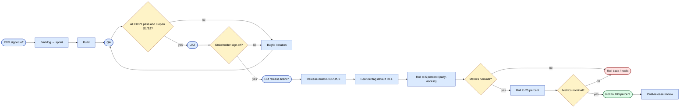

# Product Management — process & knowledge base

This page is for **Product Managers**. It covers the PM lifecycle,
templates, and the SalesDoctor-specific factors you should weigh when
designing or prioritising features.

The matching FigJam diagrams are
[Workflow · PM](https://www.figma.com/board/YvAliP5jI2oqizJeOReYxk)
and Workflow · Release train (same file).

## Phase loop

1. **Discover** — interviews, support tickets, sales feedback,
   analytics → opportunity tree.
2. **Define** — problem, hypothesis, metric, PRD, wireframes (Figma),
   tech spike, RICE.
3. **Deliver** — backlog, sprint, build, QA, UAT.
4. **Launch** — feature flag, release notes, train support, monitor.
5. **Learn** — outcome vs hypothesis, iterate / kill / scale.

```mermaid
flowchart LR
  D(["Discover"]) --> D1["Interviews / support / sales / analytics"]
  D1 --> D2["Opportunity tree"]
  D2 --> DEF(["Define"])
  DEF --> DEF1["Problem + hypothesis + metric"]
  DEF1 --> DEF2["PRD + wireframes + tech spike"]
  DEF2 --> RICE{"RICE score above threshold?"}
  RICE -- "no" --> KILL(["Kill / defer"])
  RICE -- "yes" --> DEL(["Deliver"])
  DEL --> DEL1["Backlog → sprint"]
  DEL1 --> DEL2["Build"]
  DEL2 --> DEL3["QA + UAT"]
  DEL3 --> L(["Launch"])
  L --> L1["Feature flag 5 percent"]
  L1 --> L2["25 percent"]
  L2 --> L3["100 percent"]
  L3 --> LRN(["Learn"])
  LRN --> LRN1["Outcome vs hypothesis"]
  LRN1 --> DECIDE{"Hypothesis confirmed?"}
  DECIDE -- "yes" --> SCALE(["Scale to all tenants"])
  DECIDE -- "no" --> ITERATE["Iterate"]
  ITERATE --> D

  classDef action   fill:#dbeafe,stroke:#1e40af,color:#000
  classDef approval fill:#fef3c7,stroke:#92400e,color:#000
  classDef success  fill:#dcfce7,stroke:#166534,color:#000
  classDef reject   fill:#fee2e2,stroke:#991b1b,color:#000
  class D,DEF,DEL,L,LRN,D1,D2,DEF1,DEF2,DEL1,DEL2,DEL3,L1,L2,L3,LRN1,ITERATE action
  class RICE,DECIDE approval
  class SCALE success
  class KILL reject
```



## PRD / one-pager template

```md
# PRD — <feature>

## Problem
What's broken / missing today, for whom.

## Hypothesis
If we ship X, we expect Y, measured by Z within N weeks.

## Goals & non-goals
- In scope
- Out of scope

## Success metrics
- Primary KPI
- Guard-rail metrics

## User stories
- As a <role>, I want <goal>, so that <benefit>.

## Solution sketch
- Wireframes link
- Key flows

## Edge cases & risks
## Rollout
- Target tenants
- Feature flag name
- Stages: 5 % → 25 % → 100 %
- Rollback plan

## Timeline & owners
```

## RICE scoring

| Field | Meaning |
|-------|---------|
| Reach | # tenants / agents impacted per quarter |
| Impact | 0.25 / 0.5 / 1 / 2 / 3 |
| Confidence | 50 % / 80 % / 100 % |
| Effort | person-weeks |
| Score | (R × I × C) / E |

## Release notes (multi-lingual)

Translate to **EN / RU / UZ** for every release. Template:

```md
## v<sem>.<minor> — <date>

### New
- ...

### Improved
- ...

### Fixed
- ...

### Breaking
- ...

### Migration
- DB: yes / no, see `m<id>_<name>.php`
- Config: ...
```

## Release train



## SalesDoctor-specific PM context

Every PRD should answer the questions below before it's signed off.

### Which projects are touched?

| Project | When to involve |
|---------|------------------|
| **sd-main** | The default — most features touch sd-main |
| **sd-cs** | If the feature requires consolidated HQ reporting (cross-dealer) |
| **sd-billing** | If the feature affects subscription, licence or payment flow |

If a feature touches **two** projects, identify the contract surface
(API endpoint, DB column, integration log) and design it like an
external integration.

### Which roles are affected?

The roles that matter for almost every feature:

`Agent` (4) · `Operator` (5) · `Cashier` (6) · `Supervisor` (8) ·
`Manager` (9) · `Admin Filial` (2) · `Super Admin` (1) · `Expeditor`
(10) · `Partner` (7).

A feature isn't "shipped" until the affected roles know it exists and
the affected screens are documented in the
[wireframes section](../ui/wireframes.md).

### Mobile companion?

For sd-main, the **mobile experience (api3) is often the bottleneck
for adoption**. No feature is "shipped" until the mobile companion is
documented (or explicitly out of scope).

### Compliance integrations?

In Uzbekistan, **1C, Didox and Faktura.uz integrations are
deal-breakers**. If a feature changes order data, plan the
integration impact as a P0 dependency.

### Multi-tenancy default

Feature flags should default **OFF** and be opt-in per tenant. Tenants
with a custom contract may roll out earlier; default tenants get the
feature only after verification.

### Languages

UI strings are in `ru / en / uz / tr` (and a `fa` partial). Do not
ship a feature with English-only strings.

## Useful internal links

- [Modules overview](../modules/overview.md) — to scope what's
  affected
- [Ecosystem](../ecosystem.md) — the 3-project map
- [API reference](../api/overview.md) — for endpoint surface design
- [Wireframes](../ui/wireframes.md) — current UI patterns
- [sd-billing security landmines](../sd-billing/security-landmines.md) —
  PM-visible debt items
