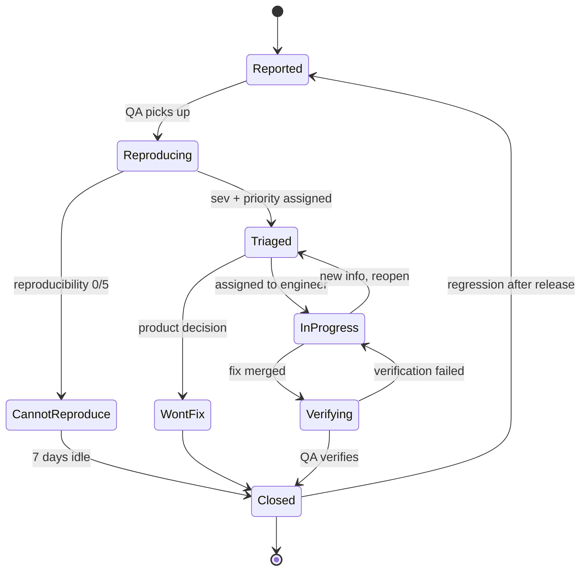

# QA — process & knowledge base

This page is for **QA team members**. It covers the testing process,
templates, and the SalesDoctor-specific regression areas you should
re-test on every release.

The matching FigJam boards are
[Workflow · QA process](https://www.figma.com/board/YvAliP5jI2oqizJeOReYxk)
and Workflow · Bug lifecycle (same file).

## Phases

1. **Plan** — read PRD, risk-rank features, define acceptance
   criteria.
2. **Design** — write test cases (positive, negative, edge), gather
   test data, identify automation candidates.
3. **Execute** — smoke → functional → regression → E2E (mobile + web +
   api3 + api4) → performance.
4. **Bugs** — reproduce → file → triage → fix → verify → close.
5. **Sign-off** — UAT, release notes, go / no-go.

```mermaid
flowchart LR
  P(["Plan"]) --> P1["Read PRD"]
  P1 --> P2["Risk-rank features"]
  P2 --> P3["Define acceptance criteria"]
  P3 --> D(["Design"])
  D --> D1["Write test cases"]
  D1 --> D2["Gather test data"]
  D2 --> D3["Identify automation candidates"]
  D3 --> E(["Execute"])
  E --> E1["Smoke"]
  E1 --> ESM{"Smoke passes?"}
  ESM -- "no" --> BUG["File S1/S2 bug"]
  ESM -- "yes" --> E2["Functional"]
  E2 --> E3["Regression"]
  E3 --> E4["E2E (mobile + web + api3 + api4)"]
  E4 --> E5["Performance"]
  E5 --> EQ{"Open S1/S2 bugs?"}
  EQ -- "yes" --> BUG
  EQ -- "no" --> S(["Sign-off"])
  BUG --> RT["Re-test on fix"]
  RT --> EQ
  S --> S1["UAT"]
  S1 --> S2["Release notes EN/RU/UZ"]
  S2 --> GO{"Go / no-go?"}
  GO -- "no-go" --> BLK(["Hold release"])
  GO -- "go" --> RELEASE(["Release"])

  classDef action   fill:#dbeafe,stroke:#1e40af,color:#000
  classDef approval fill:#fef3c7,stroke:#92400e,color:#000
  classDef success  fill:#dcfce7,stroke:#166534,color:#000
  classDef reject   fill:#fee2e2,stroke:#991b1b,color:#000
  class P,D,E,S,P1,P2,P3,D1,D2,D3,E1,E2,E3,E4,E5,S1,S2,RT action
  class ESM,EQ,GO approval
  class RELEASE success
  class BUG,BLK reject
```



## Test plan template

```md
# Test plan: <feature>

## Scope
- Included: ...
- Excluded: ...

## Risk assessment
| Risk | Likelihood | Impact | Mitigation |

## Environments
- Dev: ...
- Staging: ...
- Prod: ...

## Approach
- Manual: ...
- Automation: ...

## Entry / exit criteria
## Test cases
| ID | Title | Steps | Expected | Priority |

## Schedule & owners
```

## Bug report template

```md
# <one-line summary>
- Severity: S1 / S2 / S3 / S4
- Priority: P0 / P1 / P2 / P3
- Environment: prod / staging / dev
- Build / version: <git sha>
- Tenant: <subdomain>
- Role: <Agent / Admin / ...>

## Steps to reproduce
1. ...
2. ...

## Actual
## Expected
## Evidence
- Screenshots
- HAR / logs

## Reproducibility
- 5/5 — always
- 3/5 — intermittent
```

## Severity definitions

| Sev | Definition |
|-----|------------|
| S1 | Production down or data corruption |
| S2 | Major feature unusable, no workaround |
| S3 | Major feature degraded, workaround exists |
| S4 | Minor / cosmetic |

## Bug lifecycle



## SalesDoctor-specific regression hot spots

These are the high-value areas where regressions hide. Re-test them on
every release across all three projects.

### sd-main

| Area | What to verify | Why it matters |
|------|----------------|----------------|
| Order status transitions | Each STATUS / SUB_STATUS jump (`Draft → New → Reserved → Loaded → Delivered → Paid → Closed`, plus `Cancelled` / `Defect` / `Returned`) | Stuck orders mean no money |
| Multi-tenant isolation | Subdomain switch never leaks data — login on tenant A, query on tenant B → access denied | Compliance, contractual |
| Cache invalidation | Edit a price / category → next read shows new value within ≤ 10 min | Customers calling about wrong prices |
| Mobile offline → sync | Take a phone offline mid-visit, take orders, restore connectivity | Drivers in dead zones |
| 1C / Didox / Faktura.uz round-trip | Submit an order, verify it appears in 1C with correct INN + VAT | Compliance / dealer accounting |
| GPS geofence | Visit just inside vs just outside the radius | KPI accuracy |
| Bonus order linkage | Bonus order links back via `BONUS_ORDER_ID` | Settlement integrity |

### sd-cs

| Area | What to verify |
|------|----------------|
| Cross-dealer report consistency | Sum of per-dealer rows == HQ aggregate ± 0 |
| Dealer schema drift | Run a report against dealers on different sd-main versions |
| Read-only enforcement | sd-cs cannot UPDATE on a `d0_*` table (test with intentionally broken request) |
| Per-tenant cache | Bumping cache for dealer A doesn't affect B |

### sd-billing

| Area | What to verify |
|------|----------------|
| Click prepare/confirm | Re-send confirm with same trans id — same response, no double charge |
| Payme idempotency | `CreateTransaction` retried — no duplicate Payment row |
| Settlement | Distributor + dealer pair sums to zero for the month |
| Licence expiry → reminder | Expiry minus 7/3/1 days → Telegram + SMS sent |
| Subscription refresh | New `Payment` row triggers `Diler.refresh()` immediately |
| Notify-cron drain | `d0_notify_cron` queue empties within a minute |

## Done = these checks pass

- [ ] All P0 / P1 cases executed
- [ ] No open S1 / S2 bugs
- [ ] Regression suite green
- [ ] Performance baseline within ±10 % of last release
- [ ] Release notes drafted in EN / RU / UZ

## Useful internal links

- [Modules overview](../modules/overview.md) — to find what to test
- [API reference](../api/overview.md) — for endpoint-level test cases
- [sd-billing security landmines](../sd-billing/security-landmines.md) —
  active risks
- [sd-cs ↔ sd-main integration](../sd-cs/sd-main-integration.md) —
  cross-DB scenarios
