# RAG / vector DB indexing

The sd-docs site is fed into the team's **retrieval-augmented
generation (RAG) / vector database** so every team member can ask
"how does payment approval work?" or "what changes if we add a new
dealer?" and get the right passage returned. This page documents the
conventions that keep ingestion clean.

## Required frontmatter (every page)

Every page MUST start with frontmatter that tags it for retrieval:

```yaml
---
sidebar_position: <N>
title: <Human title>
audience: <comma-separated roles>     # e.g. "Backend engineers, QA, PM"
summary: <1–2 sentence chunk summary> # what the page covers, in plain language
topics: [<tag>, <tag>, …]             # short keywords for the embedding index
---
```

The four custom fields (`audience`, `summary`, `topics`) plus the
`title` are the **metadata** the RAG system attaches to every chunk
extracted from this page. They make per-audience filtering possible
("show me only PM pages about RBAC") and improve recall.

## Self-containment rule

A chunk read in isolation should make sense. Avoid:

- ❌ "see above" / "as mentioned earlier" — name the actual concept
- ❌ "this module" without naming it — say `sd-main · orders` instead
- ❌ Pronouns at the start of a section ("It runs daily…") — replace
  with the noun ("The settlement command runs daily…")
- ❌ Referencing tables by index number ("the table below") — give it
  a heading

A chunk should mention:

- The **project** (`sd-main` / `sd-cs` / `sd-billing`) once per
  section.
- The **module / area** in plain words.
- Any **role names** or **status values** that appear (don't assume
  the reader knows the role list).

## Chunking strategy

The pipeline currently uses **section-level chunking**:

- One chunk per `H2` header.
- Chunks under 1500 chars are merged with the next.
- Chunks over 4000 chars are split at the next paragraph break.
- Each chunk inherits the page's `audience`, `topics`, and `summary`.

If you write very long sections, keep the **first paragraph** punchy
and self-contained — that paragraph is the most retrieved part.

## Tables in chunks

Tables survive chunking better when:

- They have a header row.
- Each row is a complete fact (no row depending on the previous).
- Cells use full sentences, not "see X".

Avoid wide tables (more than 6 columns) — they get truncated by the
embedding model.

## Code blocks

Mark every code block with a language tag (`php`, `bash`, `mermaid`,
`sql`, `yaml`). The RAG pipeline indexes language-tagged blocks
separately and surfaces them in the IDE assistant.

## Mermaid diagrams

Inline Mermaid is preserved through ingestion as text. The vector DB
treats them as code blocks. Always pair a Mermaid block with a 1–2
sentence summary in plain language above it — that summary is what
gets retrieved when a user describes the diagram in words.

## Cross-page references

Use absolute internal paths starting with `/docs/`:

```md
✅  See [Order lifecycle](/docs/architecture/diagrams)
❌  See "Diagrams" (above)
```

The RAG pipeline rewrites internal paths into the search-result UI;
that only works when the path is absolute.

## Ingestion pipeline (high level)

```mermaid
flowchart LR
  REPO(["sd-docs git repo"]) --> BUILD["Docusaurus build"]
  BUILD --> RAW["Markdown + frontmatter"]
  RAW --> CHUNK["Section chunker"]
  CHUNK --> EMB[("Embedding model")]
  EMB --> VDB[("Vector DB")]
  VDB --> CHAT(["Team chat / IDE assistant"])

  classDef action   fill:#dbeafe,stroke:#1e40af,color:#000
  classDef approval fill:#fef3c7,stroke:#92400e,color:#000
  classDef success  fill:#dcfce7,stroke:#166534,color:#000
  classDef reject   fill:#fee2e2,stroke:#991b1b,color:#000
  classDef external fill:#f3f4f6,stroke:#374151,color:#000
  classDef cron     fill:#ede9fe,stroke:#6d28d9,color:#000

  class REPO,BUILD,RAW,CHUNK action
  class EMB,VDB external
  class CHAT success
```



Reindex cadence: **on every merge to `main`** (CI hook).

## Retrieval-friendly checklist

Before merging a new doc page:

- [ ] Frontmatter has `audience`, `summary`, `topics`.
- [ ] First paragraph after the H1 is a 1-sentence elevator pitch.
- [ ] Every H2 section starts with a complete-thought paragraph.
- [ ] No "see above" / "as mentioned" / "below".
- [ ] Tables under 6 columns wide.
- [ ] Code blocks have language tags.
- [ ] Mermaid diagrams are paired with prose summaries.
- [ ] Internal links are absolute (`/docs/...`).

## Why this matters for new developers

Onboarding new developers (see [Onboarding](./onboarding.md)) leans
heavily on the RAG knowledge base. A new hire types "how do I run a
cross-dealer report" into the chat assistant and gets the relevant
passage with a citation. That only works if the source page was
chunk-friendly.
