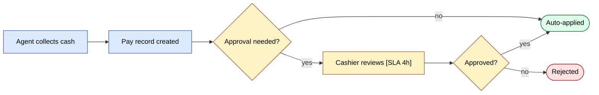
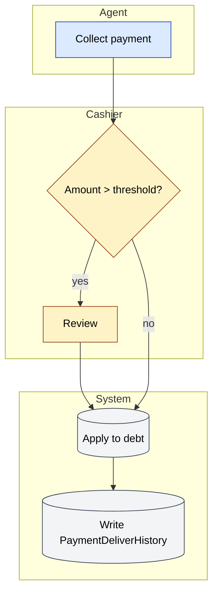

# Workflow design standards

Every SalesDoctor workflow — order approval, payment approval, client
approval, audit, settlement, integration — follows the same design
discipline. This page captures that discipline and shows where each of
our existing workflows stands today.

## Source — what "good" looks like

Adapted from Cflow's *Beginner's Guide to Workflow Design* and their
2026 trend report on AI-augmented workflow automation:

| # | Principle | What it means |
|---|-----------|---------------|
| 1 | **Document the manual process first** | Before automating, walk through the manual steps. If you can't draw it, you can't automate it. |
| 2 | **Modular design** | Design so steps can be added / removed / re-ordered without rewriting the whole flow. |
| 3 | **Visual taxonomy** | Use shape and colour to mark the special steps — approvals, branches, integrations, escalations. |
| 4 | **Explicit roles** | Every task names its owner role (`agent`, `manager`, …). No "someone does it". |
| 5 | **Clear stages** | Phases have human-readable names (e.g. *Requester* → *Manager Approval* → *Final Approval*). |
| 6 | **Parallel stages** | When two approvers can review simultaneously, model it as parallel — not artificially sequential. |
| 7 | **Thresholds and rules** | Approval triggers fire on **measurable** criteria (`> credit_limit`, `> discount_cap`, `< stock_available`). |
| 8 | **Escalation rules** | Define SLA per step. After SLA, escalate to the role above. |
| 9 | **Exception handling** | Every step has at least one explicit unhappy-path branch (reject, defer, retry). |
| 10 | **Governance & audit** | Every transition writes an audit row (who, what, when, before/after). |
| 11 | **Risk-tiered controls** | Higher-risk transitions (cancel, refund, mass-update) need stronger controls (4-eyes, MFA, audit). |
| 12 | **Start where ROI is provable** | Automate high-volume, rule-heavy, measurable steps first. Don't automate one-offs. |

## Our standard workflow specification

Use this template for any new workflow. When you propose a feature in a
PRD that introduces a new flow, fill this in and link it from the PRD.

```md
# Workflow: <name>

## Owner
Role(s) accountable for the flow's correctness and SLA.

## Stages
| # | Stage | Owner role | SLA | Action |

## Triggers
What event(s) start the workflow.

## Approval rules
| Criterion | Threshold | Approver |

## Escalation rules
| If stuck for | Escalate to |

## Exception paths
- Reject
- Defer / send back
- Cancel
- Manual override (with audit)

## Audit log
- Table: `<table>`
- Columns: actor, before_status, after_status, reason, timestamp

## Notifications
| Event | Channel | Recipients |

## Metrics
- Lead time
- Cycle time per stage
- Reject rate
- Escalation rate
- SLA-miss rate
```

## Visual taxonomy (FigJam / Mermaid colour code)

Apply consistently across every diagram. Colour the **node**, not the
edge.

| Colour | Meaning |
|--------|---------|
| **Blue** | Standard step (action) |
| **Amber** | Requires approval |
| **Green** | Success / final closed state |
| **Red** | Reject / cancel / failed final state |
| **Grey** | External system (1C, Didox, gateway, FCM) |
| **Purple** | Time-driven step (cron, scheduled job) |
| **Dashed border** | Parallel branch (two approvers can run at once) |

## Audit of existing SalesDoctor workflows

Existing flows audited against the 12 principles. ✅ = passes,
⚠️ = partial, ❌ = gap.

### sd-main · Order lifecycle

| Principle | Status | Notes |
|-----------|--------|-------|
| 1 Manual first | ✅ | Modelled on the legacy paper waybill flow |
| 2 Modular | ✅ | Each STATUS is a separate transition; new ones can be added |
| 3 Visual taxonomy | ⚠️ | FigJam diagrams don't yet use the colour code above |
| 4 Explicit roles | ✅ | Every action is owned (`agent` creates, `cashier` confirms, etc.) |
| 5 Clear stages | ✅ | `Draft → New → Reserved → Loaded → Delivered → Paid → Closed` |
| 6 Parallel stages | ❌ | All sequential — discount approval and credit approval could be parallel |
| 7 Thresholds | ⚠️ | Credit limit + discount cap are checked but encoded in code, not declarative config |
| 8 Escalation | ❌ | No SLA timers; orders can sit `New` forever |
| 9 Exception paths | ✅ | `Cancelled` / `Defect` / `Returned` |
| 10 Audit | ✅ | `OrderStatusHistory` |
| 11 Risk-tiered | ⚠️ | Cancel requires admin role, but no MFA |
| 12 ROI | ✅ | High volume, well-defined |

**Action items**: parallel approval branch for orders that need both
discount and credit clearance; SLA timers that move stuck orders to
`Manager Review`.

### sd-main · Payment collection & approval

| Principle | Status | Notes |
|-----------|--------|-------|
| 1 Manual first | ✅ | Direct mapping of cashier-desk practice |
| 2 Modular | ✅ | Cash / non-cash / online split clean |
| 3 Visual taxonomy | ⚠️ | – |
| 4 Explicit roles | ✅ | Agent collects, Cashier approves |
| 5 Clear stages | ✅ | `Pending → Approved → Applied` (or `Rejected`) |
| 6 Parallel stages | n/a | Single approver — appropriate |
| 7 Thresholds | ❌ | All payments require approval; no auto-approve under N |
| 8 Escalation | ❌ | A payment can wait days |
| 9 Exception paths | ✅ | Reject |
| 10 Audit | ⚠️ | `PaymentDeliver` has approver but no reason field |
| 11 Risk-tiered | ❌ | Same controls for ₽1 and ₽1,000,000 |
| 12 ROI | ✅ | High volume |

**Action items**: introduce an auto-approve threshold (e.g. payments
< average single-order amount with full match); SLA → escalate to
manager after 4 hours; capture rejection reason.

### sd-main · Client approval

| Principle | Status | Notes |
|-----------|--------|-------|
| 1 Manual first | ✅ | – |
| 2 Modular | ✅ | – |
| 3 Visual taxonomy | ⚠️ | – |
| 4 Explicit roles | ✅ | Agent → Manager |
| 5 Clear stages | ✅ | `Pending → Approved` (or `Rejected`) |
| 8 Escalation | ❌ | No SLA |
| 9 Exception paths | ⚠️ | Reject exists; "send back for fix" doesn't |
| 10 Audit | ⚠️ | `ClientPending.CREATE_BY` only — no full history |

**Action items**: add a *Send back* state so managers can ask for
correction without rejecting; add SLA + reminder.

### sd-main · Audit submission

| Principle | Status | Notes |
|-----------|--------|-------|
| 5 Clear stages | ⚠️ | No formal `Pending review` stage — submitted = final |
| 7 Thresholds | ❌ | No "below 60% facing → flag for re-audit" rule |
| 8 Escalation | ❌ | – |

**Action items**: add a *Pending Supervisor Review* stage; rule-based
flagging on compliance score.

### sd-billing · Subscription lifecycle

| Principle | Status | Notes |
|-----------|--------|-------|
| 1 Manual first | ✅ | – |
| 7 Thresholds | ✅ | `MIN_SUMMA`, `MIN_LICENSE`, currency match |
| 8 Escalation | ⚠️ | Reminders fire at -7/-3/-1 days only |
| 10 Audit | ⚠️ | `IntegrationLog` for licence push only |
| 11 Risk-tiered | ⚠️ | Manual licence override exists but no audit row |

**Action items**: capture every manual licence change in a dedicated
audit table; add reminder on day 0 (expiry day); add a 4-eyes
requirement for free-period extensions over N days.

### sd-billing · Payment gateway round-trip (Click / Payme / Paynet)

| Principle | Status | Notes |
|-----------|--------|-------|
| 1 Manual first | n/a | Gateway-defined |
| 7 Thresholds | ✅ | Sign verification |
| 9 Exception paths | ✅ | Idempotent; per-state error responses |
| 10 Audit | ✅ | Per-day per-action JSON in `log/` (sanitise!) |
| 11 Risk-tiered | ⚠️ | All gateways treated equally — Paynet (SOAP) is highest risk |
| 12 ROI | ✅ | Highest volume |

**Action items**: tighten Paynet sign verification + add a per-gateway
circuit breaker.

### sd-cs · Cross-dealer report

| Principle | Status | Notes |
|-----------|--------|-------|
| 5 Clear stages | ✅ | List dealers → swap connection → query → aggregate → cache |
| 9 Exception paths | ⚠️ | One dealer's failure currently fails the whole report |
| 10 Audit | ❌ | No log of which dealers were queried with which params |
| 12 ROI | ✅ | – |

**Action items**: graceful degradation when one dealer is down (skip
+ flag); audit row per report run; cache key documents the dealer
list and filter hash.

## Process for proposing a new workflow

1. Fill in the **Workflow specification** template (above).
2. Run it through the **12 principles** — flag every ❌ or ⚠️.
3. Draw it in **Mermaid** with the colour taxonomy.
4. Add an SLA + escalation table.
5. List the **audit columns** you'll need.
6. **Get review sign-off — one from each of:**
   - **Product** — comment on the PRD (look up the project's PM in the
     team directory; if unsure, post in `#sd-product`).
   - **Engineering** — comment on the PR (auto-pinged via GitHub
     `CODEOWNERS`; if not, mention the project tech lead listed in
     [Onboarding · Who to ask](./onboarding.md#who-to-ask)).
   - **QA** — comment on the PR or the test-plan ticket (post in
     `#qa` if you don't know who owns the area).
   The three sign-offs can happen in parallel; they're all required
   before merge. A 👍 reaction on the PR + a written approval in the
   review tab counts as sign-off.
7. Once shipped, instrument the **metrics** and review monthly in the
   workflow-health channel (`#sd-workflows`).

## Mermaid styling cookbook

A copy-pasteable reference for applying the visual taxonomy above to
Mermaid diagrams. Workflow diagrams only — do not apply to
`erDiagram`, `classDiagram`, or `sequenceDiagram` blocks.

### Shape vocabulary

One shape per node role. Pick by what the node *does*, not how it
looks.

```
A(["Start / End"])           %% terminator — entry or final state
B["Action"]                  %% standard step — agent does X
C{"Decision?"}               %% branch — must have a measurable predicate
D[("External system")]       %% 1C, Didox, Click, Payme, FCM, …
E(["02:00 cron"])            %% time-driven step (cron, scheduled job)
```

### Colour classes

Drop this block at the bottom of every workflow `flowchart`. The hex
codes map 1:1 to the colour-taxonomy table above.

```
classDef action   fill:#dbeafe,stroke:#1e40af,color:#000
classDef approval fill:#fef3c7,stroke:#92400e,color:#000
classDef success  fill:#dcfce7,stroke:#166534,color:#000
classDef reject   fill:#fee2e2,stroke:#991b1b,color:#000
classDef external fill:#f3f4f6,stroke:#374151,color:#000
classDef cron     fill:#ede9fe,stroke:#6d28d9,color:#000
```

Assign with `class NodeId className` (one or more node IDs,
comma-separated):

```
class A,B action
class C approval
```

### Before / after — payment approval flow

The simplest workflow on the site, from
[`docs/modules/payment.md`](../modules/payment.md). Same semantics —
shapes upgraded, classes assigned, nothing renamed.

**Before:**

```
flowchart LR
  A[Agent collects cash] --> B[Pay record created]
  B --> C{Approval needed?}
  C -- yes --> D[Cashier reviews]
  D --> E[Approved / Rejected]
  C -- no --> F[Auto-applied]
  E --> F
```

**After:**



The after-version splits the implicit "Approved / Rejected" node into
an explicit reject branch (principle #9) and inlines an SLA hint
(principle #8).

### Swimlane recipe

Use `subgraph` per role for any flow that crosses role boundaries.
BPMN guidance: 3–7 lanes max, lanes name **roles** not individuals,
named-role lanes (`"Cashier"`) not vague (`"Operations team"`). Each
lane corresponds to principle #4 (explicit roles) and the lane order
should match the stage order from principle #5.



If parallel branches exist (principle #6), label both edges out of
the fork with the role that takes them and merge them at an explicit
join node.

### SLA and audit annotations

Inline SLA hints in node text with `[SLA <duration>]`; record audit
side-effects with a `Note over` line. These hooks make principles #8
(escalation) and #10 (audit) visible in the diagram itself.

```
D["Cashier reviews [SLA 4h]"]
S2[("Write PaymentDeliverHistory")]

%% In sequenceDiagrams:
Note over System: writes OrderStatusHistory(actor, before, after, reason, ts)
```

Every transition that mutates business state must show or reference
its audit row. If the audit table doesn't exist yet, that's a gap to
file before the styling pass — see below.

### Anti-patterns

- Decision diamond without a measurable predicate. `{"Valid?"}` is
  bad; `{"BALANS ≥ Package.PRICE?"}` is good (principle #7).
- Only the happy path shown. Every workflow needs at least one
  explicit reject / error / cancel branch (principle #9).
- More than 7 swimlanes in one diagram. Split into two connected
  diagrams keyed on a hand-off node.
- Applying the colour taxonomy to `erDiagram`, `classDiagram`, or
  `sequenceDiagram` blocks. Taxonomy is workflow-only.
- Mermaid-only-experts diagrams. If a non-engineer reviewer cannot
  read it on first pass, simplify.
- Vague role lanes (`"Operations"`, `"Team"`). Lanes name a role from
  the access-rights table or they don't go in (principle #4).

### Before you make styling changes

A styling pass changes colours, shapes, and class assignments — never
semantics. If a diagram has the wrong nodes, missing branches, or a
stale role, file an issue and fix that in a separate change. Mixing
the two makes review impossible and silently drifts the model away
from the running system.

## Useful references

- [Cflow — Beginner's Guide to Workflow Design](https://www.cflowapps.com/workflow/workflow-design/)
- [Cflow — Approval Flows](https://www.cflowapps.com/approval-flows/)
- [Cflow — 7 Things to Do in Workflow Design](https://www.cflowapps.com/workflow-automation-design-best-practices/)
- [Cflow — AI Workflow Automation Trends 2026](https://www.cflowapps.com/ai-workflow-automation-trends/)

Sources:
- [The Beginner's Guide to Workflow Design (Cflow)](https://www.cflowapps.com/workflow/workflow-design/)
- [Cflow — 7 Workflow Design Best Practices](https://www.cflowapps.com/workflow-automation-design-best-practices/)
- [Cflow — AI Workflow Automation Trends 2026](https://www.cflowapps.com/ai-workflow-automation-trends/)
