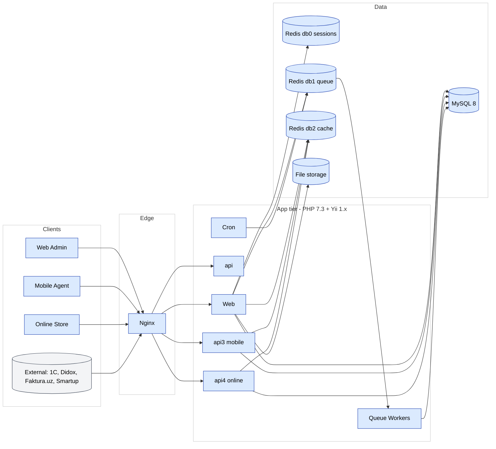

# Обзор архитектуры

SalesDoctor — это классическое **server-rendered PHP-приложение** с
**REST API** для мобильных клиентов и интеграций. Развёртывается как
небольшой набор stateless app-контейнеров за Nginx, опираясь на MySQL
и Redis.

## Высокоуровневая диаграмма

Каноничная диаграмма живёт в FigJam — см.
[страницу диаграмм](./diagrams.md). Локально-отрендеренная Mermaid-версия:

## Ярусы

### Edge

Один **Nginx** действует как TLS-терминатор, vhost-роутер (один vhost
на тенант-поддомен) и сервер статики. См.
[`nginx.conf`](../project/structure.md) в корне репозитория и
[Nginx в DevOps](../devops/nginx.md).

### Application

PHP 7.3 + Yii 1.x. Один и тот же код обслуживает:

- **Web admin** (server-rendered Yii views, jQuery, отдельные «островки»
  Angular и Vue)
- **API v1, v2, v3, v4** под `protected/modules/api*`
- **Queue workers**, выполняющие подклассы `BaseJob` из Redis db1
- **Cron**-записи, запускающие задачи по расписанию

App-контейнеры **stateless**. Всё stateful идёт в MySQL, Redis или
файловый монт.

### Data

- **MySQL 8** — одна логическая база на тенант (мульти-тенант DB-per-customer).
  `protected/config/main.php` выбирает БД по `HTTP_HOST`. См.
  [Мультитенантность](./multi-tenancy.md).
- **Redis 7** — три логические базы:
  - **db0** сессии (`CCacheHttpSession`)
  - **db1** очередь (компонент `Queue`)
  - **db2** кеш приложения (`ScopedCache` через `TenantContext`)
- **File storage** — загруженные фото, экспорты, сгенерированные документы.
  Монтируется в контейнеры как общий volume.

## Сквозные компоненты

| Компонент | Назначение | Расположение |
|-----------|---------|----------|
| `TenantContext` | Резолвит БД + filial по хосту запроса | `protected/components/TenantContext.php` |
| `DbAuthManager` | Кешированный RBAC поверх `authitem`, `authitemchild`, `authassignment` | `protected/components/DbAuthManager.php` |
| `WebUser` | Yii user-компонент с auto-login и filial scoping | `protected/components/WebUser.php` |
| `BaseJob` | Базовый класс для всех queue-задач | `protected/components/BaseJob.php` |
| `Queue` | Redis-backed диспетчер | `protected/components/Queue.php` (или фреймворк-компонент) |
| `ScopedCache` | Tenant- и filial-скоупированная Redis-обёртка кеша | `protected/components/ScopedCache.php` |

## Почему этот стек

См. [ADR 0001 — keep Yii 1](../adr/yii1-stay.md) и
[ADR 0002 — DB-per-customer](../adr/multi-tenant-db-per-customer.md)
для исторических решений.
