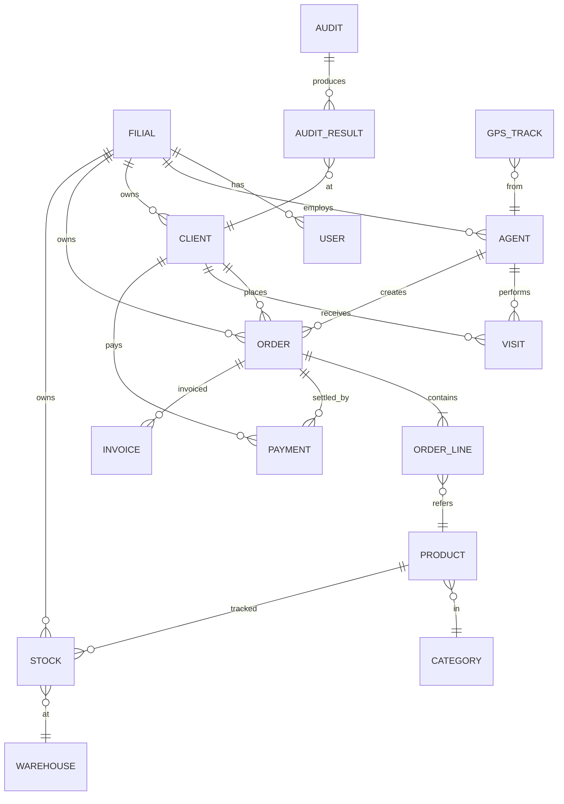

# ER-диаграмма (entity-relationship)

Канонический ER — это FigJam-диаграмма, открывайте
[Страницу диаграмм](../architecture/diagrams.md), чтобы попасть к ней.
Локально отрендеренная Mermaid-версия ниже.



Когда экспортируете FigJam-версию, положите её в `static/diagrams/erd.png`
и сошлитесь:

```markdown

```
