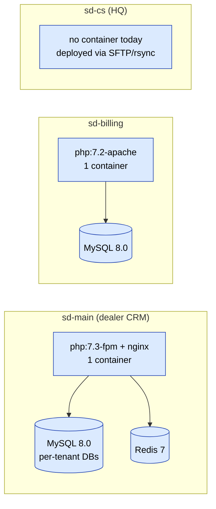

# Деплой

## Обзор топологии

Три проекта SalesDoctor разворачиваются **независимо**. У каждого свой
container image, своя база данных, своя каденция релизов. Нет
общего реестра, общего пайплайна или оркестратора, координирующего их.



Обратите внимание, что два CRM-смежных проекта используют разные PHP-рантаймы
(7.3-fpm в sd-main, 7.2-apache в sd-billing) и разные веб-серверы.
Относитесь к ним как к отдельным продуктам, у которых случайно один вендор.

## sd-main

Эталонный проект. Большинство production-деплоев касаются этого репозитория.

### Сборка

`Dockerfile` репозитория собирает один контейнер с nginx и php-fpm:

- Базовый образ: `php:7.3-fpm`
- Добавляет: nginx, GD (с freetype/jpeg), bcmath, pdo_mysql, mbstring,
  pcntl, sysv*, tidy, xsl, zip и остальное из `Dockerfile:29-49`.
- Копирует `nginx.conf` в `/etc/nginx/sites-available/default`.
- `EXPOSE 80`. Маппится на хост `8080` в `docker-compose.yml`.
- `CMD service nginx start && php-fpm` — оба сервиса живут в одном
  контейнере. **Скрипта entrypoint нет.** Миграции при старте не запускаются.

```bash
docker build -t registry.example.com/sd-main:$(git rev-parse --short HEAD) .
docker push registry.example.com/sd-main:<tag>
```

Реестр здесь упомянут только в документации — репозиторий не
поставляет URL реестра. Подставьте свой.

### Конфигурация

sd-main **не управляется через env**. Конфигурация живёт в
`protected/config/main_local.php`, который в .gitignore. Закоммиченный
`main.php` несёт production-формы дефолтов; `main_local.php`
переопределяет креды БД, hostname Redis и прочее:

```php
// protected/config/main_local.php
return [
    'components' => [
        'db' => [
            'connectionString' => 'mysql:host=db;dbname=sd_main',
            'username' => '...',
            'password' => '...',
        ],
        'redis_session' => ['hostname' => 'redis'],
        'queueRedis'    => ['hostname' => 'redis'],
        'redis_app'     => ['hostname' => 'redis'],
    ],
];
```

`main.php` вызывает `array_replace_recursive($config, require 'main_local.php')`,
когда файл существует. Provisioning хоста, таким образом, означает написание
`main_local.php`, а не установку переменных окружения.

### Миграции БД

Единственный инструмент — `yiic migrate` от Yii 1. На данный момент в
канонической директории миграций нет закоммиченных файлов, поэтому
большинство схема-изменений делается через сырой SQL вне ленты; новые
изменения нужно вносить через `yiic`.

```bash
docker compose exec web php protected/yiic migrate up
```

Миграции таргетятся на **дефолтную** БД из `main.php`. Для multi-DB
fan-out см. [Multi-tenant fan-out](#multi-tenant-fan-out) ниже и
[Миграции](../data/migrations.md).

### Rollout

Автоматизированного rollout нет. Ручной рецепт:

```bash
ssh prod 'cd /srv/sd-main && \
  docker compose pull web && \
  docker compose exec web php protected/yiic migrate up && \
  docker compose up -d web'
```

Поскольку nginx и php-fpm живут в одном контейнере, `compose up -d web`
restart роняет in-flight запросы. Запускайте в спокойное время.

### Healthcheck

**Healthcheck-эндпоинта приложения нет.** Маршрутов `actionHealth`,
`actionPing` или `/healthz` в `protected/` не существует. В
`docker-compose.yml` нет блока `healthcheck` на сервисе `web`. Единственный
healthcheck в стеке — неявный (MySQL слушает `:3306`).

Если ставите перед sd-main load balancer, нацеливайте его на дешёвый
маршрут типа `/site/index` и принимайте HTML как сигнал успеха,
либо добавьте stanza `location = /healthz { return 200; }` в nginx,
как описано в [Nginx](./nginx.md).

### Откат

`docker compose pull web` с прежним тегом образа, затем
`docker compose up -d web`. Откат схемы не автоматизирован — пишите
миграции **forward-compatible** (аддитивные колонки, без drop-ов в
том же релизе, что и код, который от них зависит).

### Smoke-тесты

`infra/smoke.sh` нет. После деплоя стучите вручную:

```
GET /                      → 200 (HTML страница логина)
GET /api3/config/index     → 200 с JSON
GET /api2/auth/login       → 401 с JSON (требуется auth, сигнализирует, что роутинг работает)
```

## sd-billing

### Сборка

`docker/Dockerfile` собирает другой стек, не такой, как sd-main:

- Базовый образ: `php:7.2-apache` (Apache, не nginx; PHP 7.2, не 7.3).
- Патчит `sources.list` на `archive.debian.org`, потому что Stretch —
  EOL — без этого сборка упадёт.
- Устанавливает `pdo_mysql`, `zip`, включает `mod_rewrite` и `mod_headers`.
- Копирует репозиторий в `/var/www`, затем **переименовывает** `_index.php` →
  `index.php` и `_constants.php` → `constants.php`. Закоммиченный
  `_constants.php` несёт плейсхолдер-креды Paynet — перезапишите перед
  сборкой или подайте замену в build context.
- `EXPOSE 80`. Маппится на хост `3000` в `docker-compose.yml`.
- `ENTRYPOINT ["/entrypoint.sh"]` — см. ниже.

### Конфигурация

sd-billing **управляется через env**. `protected/config/_db.php` читает
`MYSQL_HOST`, `MYSQL_PORT`, `MYSQL_DATABASE`, `MYSQL_USER`,
`MYSQL_PASSWORD` через `getenv()`. Задайте их в оркестраторе (или в
compose-файле).

### Миграции БД

`docker/entrypoint.sh` запускает `yiic migrate --interactive=0` при старте
контейнера, но только когда схема не bootstrapped (грепает `d0_tariff`
и пропускает, если есть). 55 миграций живут в `protected/migrations/`.

Также есть dev-only переключатель `ENABLE_MOCK_SEED=1`, который запускает
`docker/seed_mock_data.php`. Никогда не ставьте его в production.

### Rollout, healthcheck, rollback

Та же форма, что и в sd-main: нет автоматизации, нет healthcheck-эндпоинта,
нет rollback-скрипта. Compose-файл всё же объявляет `healthcheck` на
сервисе **MySQL** (`mysqladmin ping`), который через
`depends_on.mysql.condition: service_healthy` гейтит запуск `web`. Сам
веб-контейнер не проверяется.

Для developer-facing setup см. [sd-billing local setup](../sd-billing/local-setup.md).

## sd-cs

У sd-cs **нет Dockerfile, нет docker-compose, нет миграций**
(`protected/migrations/empty.sql` — единственный файл). Это legacy HQ
console; деплои файл-уровня (SFTP / rsync на PHP-хост) и вне области
container-based pipeline. Любое изменение здесь — ручной, контролируемый релиз.

## Multi-tenant fan-out

sd-main работает с **одной MySQL-базой на тенанта** (`sd_<tenant>`). Релиз,
меняющий схему, должен затронуть каждую БД тенанта. Встроенного fan-out
инструмента нет; оператор гоняет цикл:

```bash
for db in $(mysql -uroot -p$ROOT -Nsre 'SHOW DATABASES LIKE "sd\\_%"'); do
  echo "Migrating $db..."
  docker compose exec -e DB_NAME=$db web php protected/yiic migrate up
done
```

Тот же паттерн пер-тенант цикла применим к любому cron-scoped исправлению
данных — см. [Background jobs & scheduling](../architecture/jobs-and-scheduling.md)
для `TenantRegistry::all()` и `TenantContext::switchTo()`.

## Сценарии отказов

- **Деплой падает посередине** — nginx и php-fpm делят контейнер, поэтому
  упавший `compose up -d web` оставляет прежний контейнер работающим до
  того, как новый станет здоровым. Канарейного окна нет; старый и новый
  никогда не живые одновременно.
- **Миграция падает посреди тенантов** — цикл выше останавливается на
  первом ненулевом exit. Тенант, на котором упало, в
  частично-мигрированном состоянии; остальные не тронуты. Возобновляйте
  вручную после фикса упавшего тенанта.
- **`main_local.php` отсутствует на свежем хосте** — sd-main откатится
  на закоммиченные дефолты `main.php`, которые указывают на `host=db,
  dbname=sd_main` с захардкоженными кредами. Либо отгружайте
  `main_local.php` как часть provisioning, либо принимайте дефолт.
- **Redis недоступен** — сессии (`CCacheHttpSession`) и очередь —
  обе падают. Поверхность приложения деградирует до анонимной;
  in-flight задачи копятся. Graceful fallback нет — фиксите Redis,
  затем ожидайте thundering herd повторов очереди.

## См. также

- [Docker Compose](./docker-compose.md) — форма production-overlay.
- [Nginx](./nginx.md) — vhost, healthcheck, rate limiting.
- [Миграции](../data/migrations.md) — механика `yiic migrate`.
- [Мультитенантность](../architecture/multi-tenancy.md) — раскладка БД тенантов.
- [sd-billing local setup](../sd-billing/local-setup.md) — детали env-проводки.
