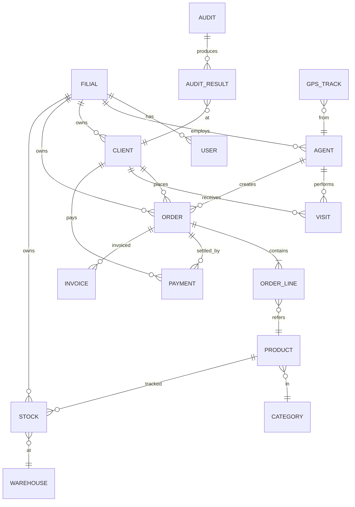

# Данные · ERD — галерея диаграмм

Две ERD рядом: концептуальный замысел и истина-из-кода (сгенерированная из объявленных Yii relations).

Все 2 диаграммы группы, отрисованные inline.

## Указатель

| # | Заголовок | Тип | Исходная страница |
|---|-------|------|-------------|
| 01 | [Entity-relationship диаграмма](#d-01) | `er` | [data/erd](/docs/data/erd) |
| 02 | [Mermaid (полный граф)](#d-02) | `er` | [data/erd-real](/docs/data/erd-real) |

## 01. Entity-relationship диаграмма {#d-01}

- **Тип**: `er`
- **Исходная страница**: [data/erd](/docs/data/erd)
- **Раздел-источник**: Entity-relationship диаграмма

## 02. Mermaid (полный граф) {#d-02}

- **Тип**: `er`
- **Исходная страница**: [data/erd-real](/docs/data/erd-real)
- **Раздел-источник**: Mermaid (полный граф)

```mermaid
erDiagram
  %% ── Audit & polls ───────────────────────────────────────────
  ADTAUDIT ||--o{ ADTAUDITPRODUCTS : AUDIT_ID
  ADTAUDIT ||--o{ ADTAUDITUSERS : AUDIT_ID
  ADTAUDITPRODUCTS }o--|| PRODUCT : PRODUCT_ID
  ADTAUDITRESULT }o--|| ADTAUDIT : AUDIT_ID
  ADTAUDITRESULT ||--o{ ADTAUDITRESULTDATA : RESULT_ID
  ADTAUDITRESULT }o--|| CLIENT : CLIENT_ID
  ADTAUDITRESULT }o--|| STRUCTUREFILIAL : POSITION_ID
  ADTAUDITRESULT }o--|| VISIT : VISIT_ID
  ADTAUDITRESULTDATA }o--|| ADTAUDITRESULT : RESULT_ID
  ADTAUDITRESULTDATA }o--|| PRODUCT : PRODUCT_ID
  ADTAUDITRESULTDATA }o--|| PRODUCTCOMPETITOR : PRODUCT_ID
  ADTCOMMENTRESULT }o--|| ADTCOMMENT : COMMENT_ID
  ADTCONFIG }o--|| STRUCTUREFILIAL : USER
  ADTPOLL ||--o{ ADTPOLLQUESTION : POLL_ID
  ADTPOLL ||--o{ ADTPOLLBIND : POLL_ID
  ADTPOLL }o--|| USER : CREATE_BY
  ADTPOLLQUESTION }o--|| ADTPOLL : POLL_ID
  ADTPOLLQUESTION ||--o{ ADTPOLLVARIANT : QUES_ID
  ADTPOLLQUESTION ||--o{ ADTPOLLRESULTDATA : QUESTION_ID
  ADTPOLLRESULT }o--|| ADTPOLL : POLL_ID
  ADTPOLLRESULT ||--o{ ADTPOLLRESULTDATA : RESULT_ID
  ADTPOLLRESULTDATA }o--|| ADTPOLLQUESTION : QUESTION_ID

  %% ── Catalog (products + attributes) ─────────────────────────
  PRODUCT }o--|| PRODUCTGROUP : PRODUCT_GROUP_
  PRODUCT }o--|| ADTPACK : PACK
  PRODUCT }o--|| ADTSEGMENT : SEGMENT
  PRODUCT }o--|| ADTBRANDS : BRAND
  PRODUCT }o--|| ADTPRODUCER : PRODUCER
  PRODUCT }o--|| ADTPROPERTY : PROPERTY
  PRODUCT }o--|| USER : CREATE_BY
  PRODUCT }o--|| USER : UPDATE_BY
  PRODUCTCATEGORY }o--|| PRODUCT : PRODUCT_CAT_ID
  PRODUCTCATEGORY }o--|| UNIT : UNIT
  PRODUCTSUBCATEGORY }o--|| PRODUCT : SUB_CAT_ID
  PRODUCTUNIT }o--|| PRODUCT : PRODUCT_ID
  PRODUCTPRICEMARKUP }o--|| PRODUCT : PRODUCT
  PRODUCTCOMPETITOR }o--|| PRODUCTGROUP : PRODUCT_GROUP_
  PRODUCTCOMPETITOR }o--|| ADTPACK : PACK
  PRODUCTCOMPETITOR }o--|| ADTSEGMENT : SEGMENT
  PRODUCTCOMPETITOR }o--|| ADTBRANDS : BRAND
  PRODUCTCOMPETITOR }o--|| ADTPRODUCER : PRODUCER
  PRODUCTCOMPETITOR }o--|| USER : CREATE_BY
  PRODUCTCOMPETITOR }o--|| USER : UPDATE_BY

  %% ── Clients ─────────────────────────────────────────────────
  CLIENT }o--|| CLIENTTYPE : TYPE
  CLIENT }o--|| CLIENTCHANNEL : CHANNEL
  CLIENTPENDING }o--|| REGION : REGION
  CLIENTPENDING }o--|| CITY : CITY
  CONTRAGENT }o--|| CLIENTTYPE : TYPE
  CONTRAGENT }o--|| CLIENTCHANNEL : CHANNEL

  %% ── Sales / orders ──────────────────────────────────────────
  ONLINEORDER }o--|| CONTACT : CONTACT_ID
  ONLINEORDER }o--|| ORDER : ORDER_ID
  ONLINEORDER ||--o{ ONLINEORDERDETAIL : ONLINE_ORDER_I
  ONLINEORDERDETAIL }o--|| PRODUCT : PRODUCT
  ORDERDEFECTDETAIL }o--|| PRODUCT : PRODUCT
  ORDERREPLACEDETAIL }o--|| PRODUCT : PRODUCT
  BONUSORDERDETAIL }o--|| PRODUCT : PRODUCT
  CLIENTKASPITRANSACTION }o--|| ORDER : ORDER_ID
  CLIENTODENGITRANSACTION }o--|| ORDER : ORDER_ID
  CLIENTOPTIMATRANSACTION }o--|| ORDER : ORDER_ID

  %% ── Dealers, users, plans ───────────────────────────────────
  DILER }o--|| USER : DILER_ID
  DILER ||--o{ PLAN : DILER_ID
  DILER ||--o{ CLIENT : DILER_ID
  DILER ||--o{ AGENT : DILER_ID
  DILER ||--o{ PRICETYPE : DILER
  USER }o--|| DILER : DILER_ID
  USER }o--|| AGENT : AGENT_ID

  %% ── Filial / structure / movement ───────────────────────────
  STRUCTUREFILIAL }o--|| USER : USER_ID
  FILIALMOVEMENTREQUEST ||--o{ FILIALMOVEMENTREQUESTDETAIL : REQUEST_ID
  FILIALMOVEMENTREQUEST }o--|| FILIAL : REQUESTER_FILI
  FILIALMOVEMENTREQUEST }o--|| FILIAL : PROVIDER_FILIA
  FILIALMOVEMENTREQUEST }o--|| STORE : STORE_ID
  FILIALMOVEMENTREQUEST }o--|| TRADEDIRECTION : TRADE_ID
  FILIALMOVEMENTREQUESTDETAIL }o--|| FILIALMOVEMENTREQUEST : REQUEST_ID
  FILIALMOVEMENTREQUESTDETAIL }o--|| PRODUCT : PRODUCT_ID
  FILIALMOVEMENTREQUESTDETAIL }o--|| PRODUCTCATEGORY : PRODUCT_CAT_ID

  %% ── Inventory ───────────────────────────────────────────────
  INVENTORYHISTORY }o--|| INVENTORY : INVENTORY_ID
  INVENTORYHISTORY }o--|| INVENTORYTYPE : INV_TYPE_ID
  MUSTBUYRULE ||--o{ MUSTBUYRULEITEM : RULE_ID

  %% ── Visits & field ──────────────────────────────────────────
  VISIT }o--|| CLIENT : CLIENT_ID
  VISIT }o--|| USER : USER_ID
  VISIT }o--|| STRUCTUREFILIAL : POSITION_ID
  VISIT ||--o| ADTNOTERESULT : VISIT_ID
  VISIT ||--o| ADTCOMMENTRESULT : VISIT_ID
  VISITINGAUD }o--|| STRUCTUREFILIAL : AUDITOR_ID
  VISITINGAUD }o--|| CLIENT : CLIENT_ID

  %% ── Tasks ───────────────────────────────────────────────────
  TASKS }o--|| USER : TASK_FROM
  TASKS }o--|| USER : TASK_TO
  TASKS }o--|| CLIENT : CLIENT_ID
  TASKS }o--|| TASKTYPE : TYPE_ID
  TASKLOG }o--|| USER : USER_ID
  TASKLOG }o--|| CLIENT : OLD_VALUE
  TASKLOG }o--|| CLIENT : NEW_VALUE

  %% ── Other ───────────────────────────────────────────────────
  CONSUMPTIONHISTORY }o--|| CONSUMPTION : CONSUMPTION_ID
  TGBOT }o--|| TELEGRAMGROUP : GROUP_ID
```

